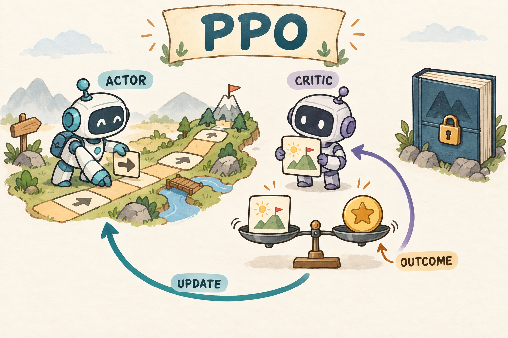
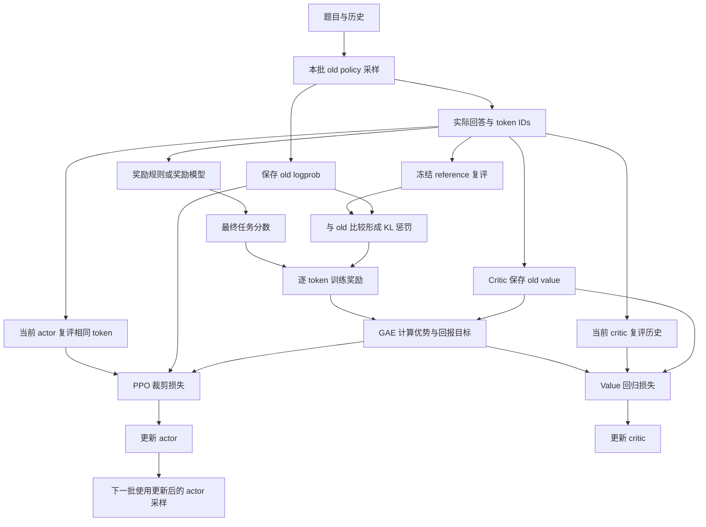

# 02｜PPO：actor-critic、GAE 与裁剪更新

<!-- NAV:TOP:BEGIN -->
[← 上一章：01 损失函数与策略梯度基础](../preliminary/TUTORIAL.md) · [全书目录](../docs/CHAPTERS.md) · [本篇目录](../docs/families/01-policy-preference.md) · [下一章：03 GRPO：同题采样与组内优势 →](../01-grpo/TUTORIAL.md)
<!-- NAV:TOP:END -->

[学习路线](../docs/LEARNING_PATH.md) · [损失与裁剪基础](../preliminary/TUTORIAL.md) · [运行说明](README.md)

**本章学习任务：** 走完一次完整的 actor/critic 更新——从任务奖励与 reference 约束，到 GAE 优势与回报目标，再到 policy/value 两项 loss。

PPO 全称 **Proximal Policy Optimization，近端策略优化**。Policy 是“当前情境下如何选择动作”的规则；optimization 是调整规则；proximal 表达更新时不要一下偏离采样策略太远。本章讲常见的 PPO-Clip 版本。它最初用于一般强化学习，后来被用于语言模型训练，方法来源是 [PPO 原论文](https://arxiv.org/abs/1707.06347)。

**你已经具备的前置（来自第一章，不必在这里从零重学）：**

| 概念 | 第一章入口 | 本章如何使用 |
| --- | --- | --- |
| 奖励 ≠ 可直接反传的标签 | [TUTORIAL §5](../preliminary/TUTORIAL.md) | 任务分数要经优势与 surrogate 进入梯度 |
| old / current、概率比率 ρ | [TUTORIAL §7](../preliminary/TUTORIAL.md) | 多 epoch 复用同一批 rollout 时必须保留 old |
| PPO 四种裁剪方向 | [TUTORIAL §8](../preliminary/TUTORIAL.md) | 本章不再从零推导 min/clip，只接到 GAE 产出的优势上 |
| CE / MSE 的训练对象 | [TUTORIAL §2–3](../preliminary/TUTORIAL.md) | critic 用回归目标；actor 用策略梯度 surrogate |

DPO 不必是本章前置；GRPO 可以在读完本章前先建立“组内优势”直觉，详见 [学习路线](../docs/LEARNING_PATH.md)。

本章用“3 盒笔，每盒 6 支，共多少支”贯穿讲解，答对得 1，答错得 0。你只需要知道模型会给下一个 token 分配概率；token 是分词器使用的文字单位，不一定是一个汉字。接下来先分清角色，再将最终分数变成每步学习信号，最后用一条完整 batch 把数字串起来。读完应能自己走完一次“生成 → 评分 → 算优势 → 更新”。

## 1. 只有一个最终分数，为什么需要这么多步骤

模型偶然写出“3×6=18”，得到了 1 分。最朴素的想法是提高这段回答的概率，但立即遇到三个问题。

第一，分数属于整段回答，模型却逐 token 做选择。早先写出的“3×6”没有即时奖励，我们需要把后来的结果传回早先的动作，这叫**信用分配**。

第二，相同分数是否值得大力鼓励，取决于原先能做到什么。几乎总能答对的题再次答对，与很难的题终于答对，信息量不同。我们需要比较“结果”和“原先预期”，这个差距叫**优势 advantage**。

第三，一次答对可能有偶然性。如果反复用少量样本把某些概率放大几十倍，原有行为可能被破坏。PPO 裁剪目标用来减少过度更新的激励。

因此下面先介绍谁生成、谁评分、谁预测，再算优势，最后控制更新。Actor-critic 是角色分工，GAE 是优势估计方法，PPO clipping 是策略更新规则，三者不是同一个概念。

## 2. Actor、critic、reward、old 和 reference 各做什么



上图帮助理解行动与估值。**包含 reference 的完整语言模型 PPO 流程在下方给出**，不能把上面的概念插图当作全部训练组件。

| 角色 | 输入和输出 | 何时改变 |
| --- | --- | --- |
| Actor，当前策略 | 题目与已有回答 → 下一 token 的概率 | 每次策略优化时更新 |
| Old policy，行为策略 | 生成本批回答，留下当时所选 token 的概率 | 下一批刷新；批内保存值固定 |
| Reward，奖励来源 | 完整回答 → 实际任务分数 | 本章答案校验器是固定规则 |
| Critic，价值模型 | 某一步之前的历史 → 之后回报的预测 | 用本批回报目标训练 |
| Reference，参考策略 | 对相同 token 复评 → 固定的概率基准 | 本章全程冻结 |

Old 不一定要长期保留独立网络，保存生成时的 logprob 就能提供比率分母。Reference 用于约束相对于开训起点的长期偏离。二者开训时可能相同，后面职责和数值不同。Critic 输出回报估计，reference 输出 token 概率，也不能互换。



箭头表示数据流，不全是可导路径。采样结果、奖励、reference、old 概率与优势作为固定数据使用；当前 actor 的评分和当前 critic 的估值才反传。一般环境控制 PPO 不一定有 reference 或 KL 奖励；这两项属于本章的语言模型设置。

## 3. 把写回答拆成状态、动作、奖励与回报

角色清楚了，但 critic 在哪些位置估值尚未定义。为此先将回答拆成按时间排列的决策过程。

时刻 t 的**状态** $`s_t`$ 用“题目 + 已生成前缀”表示；**动作** $`a_t`$ 是下一个 token；**策略** $`\pi_\theta(a_t\mid s_t)`$ 是模型给这个选择的概率，$`\theta`$ 表示模型参数。接上 token 后得到下一状态。机器人可将状态换成传感器读数、动作换成电机指令，接口类似，但不是相同任务。复杂 agent 的历史也未必包含真实世界全部信息。

**奖励 reward** $`r_t`$ 是当前一步的反馈，**回报 return** $`G_t`$ 是从此刻开始未来奖励的折扣和：

```math
G_t=r_t+\gamma r_{t+1}+\gamma^2r_{t+2}+\cdots.
```

$`\gamma`$ 叫折扣因子，通常在 0 到 1 之间。取 1 不打折，取 0.9 则晚一步的奖励计 0.9 倍。两步奖励 `[0,1]` 且 gamma=1 时，第一步即时奖励为 0，但回报为 1，因此早先的动作也有可学习的结果。

Critic 的 $`V_\phi(s_t)`$ 预测从该历史继续按策略行动的平均回报。它没提前看到未来答案。$`\phi`$ 表示 critic 参数，以区别 actor 的参数。单次预测会出错，训练要让预测接近经历中构造的回报目标。

## 4. 先将 reference 约束放进奖励

现在知道回报来自奖励，便能解释 reference 为什么出现在 GAE 之前。只有任务分数时，策略可能为了得分明显偏离原来的语言行为。LLM PPO 常在逐 token 奖励中加入 reference 偏离惩罚，再用合成奖励估计优势。

KL 全称 **Kullback–Leibler divergence，KL 散度**，衡量分布差异。这里没有逐项遍历整个词表，而是在 old policy 实际采到的 token 上计算 logprob 差。$`\ell_t^{old}`$、$`\ell_t^{ref}`$ 表示相同历史、相同 token 的两份对数概率：

```math
\widetilde r_t=-\beta(\ell_t^{old}-\ell_t^{ref})+
\mathbf{1}[t=\text{最后有效 token}]R_{task}.
```

$`R_{task}`$ 是任务分数，$`\beta`$ 控制偏离惩罚，指示符 $`\mathbf{1}`$ 在条件成立时取 1，否则取 0。每步都有可能获得 KL 修正，最后一步再加任务奖励。

例如 old 给实际 token 概率 0.4，reference 给 0.2，则 log-ratio 为 $`\log2\approx0.6931`$。beta=0.1 时奖励修正为 -0.06931。单个采样项也可能为负；KL 非负是分布期望的性质，并非每个 token 都成立。语言模型的角色关系可参考 [Nathan Lambert 的 RLHF 教材](https://rlhfbook.com/c/06-policy-gradients)。

后面为方便手算会直接给出奖励数组。实际 verl PPO 先完成上述合成，再做 GAE，actor loss 不会再加一份相同的 KL。不同后端的配方应分别核对。

## 5. 优势：这次结果比原先预期好多少

假设回报是 1，critic 原先预测 0.3，直接的优势估计为 0.7；若预测 0.9，优势只有 0.1。正优势推动相关动作更常出现，负优势推动它更少出现。

理想动作优势为 $`A^\pi(s,a)=Q^\pi(s,a)-V^\pi(s)`$。Q 问“先选这个动作，以后按策略行动，平均回报多少”；V 问“尚未指定动作时，平均回报多少”。本章没有额外训练 Q 网络，而是用奖励和 V 来估计优势。

为什么减 baseline（基线）不会任意改变任务？在标准策略梯度中，同一状态下对动作分布求平均，状态基线乘 logprob 梯度的期望为零。因此可以改变估计的噪声而不改变那个理想梯度的期望；有限样本仍有误差。[Spinning Up 的策略梯度教程](https://spinningup.openai.com/en/latest/spinningup/rl_intro3.html)解释了这个理由。

还剩一个实际选择：等回答结束，用采样回报减 V；或者借助下一步 V，先就地估计动作的影响。前者受后面偶然结果影响较大，后者依赖 critic 准确性。下一节的 GAE 在两种信息之间建立可调的折中。

## 6. GAE：先理解 TD，再把多步误差传回来

GAE 全称 **Generalized Advantage Estimation，广义优势估计**，是一种计算优势的方法。TD 全称 **Temporal Difference，时序差分**，意思是比较相邻时间点的信息来修正价值预测。我们先讲 TD，是因为它是 GAE 加权组合的基本单元。

原先 critic 在当前状态预测 V。做完动作后，知道了即时奖励，还能用下一状态 V 预测剩余回报。“已得到的奖励 + 剩余预测”减去“原来预测”，就是一步 TD 误差：

```math
\delta_t=r_t+\gamma(1-d_t)V_{old}(s_{t+1})-V_{old}(s_t).
```

$`d_t=1`$ 表示真正终局，此后没有未来回报；否则为 0。使用的是采样阶段保存的 old value。用尚未兑现的下一步预测补全目标，称为 **bootstrapping，自举估计**。

只用 delta 相当于只看一步修正。GAE 还将同一条未终止轨迹内后续的 TD 误差带回来：

```math
\widehat A_t=\delta_t+\gamma\lambda\delta_{t+1}+(\gamma\lambda)^2\delta_{t+2}+\cdots.
```

$`\lambda`$ 是混合参数。取 0 只剩一步 TD；取 1 且完整终局被正确处理时，各项 V 抵消，得到采样回报减基线；中间值使远处误差衰减更快。[GAE 原论文](https://arxiv.org/abs/1506.02438)研究这一偏差与方差折中：偏差是系统性偏离理想量，方差是不同采样造成的波动。Lambda 不是学习率，也不是任务的时间折扣。

代码不必每次重新求和，从最后一步向前递推即可：

```math
\widehat A_t=\delta_t+\gamma\lambda(1-d_t)\widehat A_{t+1},\qquad
\widehat G_t=\widehat A_t+V_{old}(s_t).
```

带帽子表示估计量。$`\widehat G_t`$ 给 critic 作回归目标，应在优势标准化之前构造；标准化后的优势已改变单位，不能再直接加 V 当回报。

### 两步手算：每个数从哪里来

奖励 `[0,1]`，old value `[0.2,0.4]`，第二步真实终局，gamma=1、lambda=0.95。先从最后一步算：

```math
\delta_1=1-0.4=0.6,\qquad \widehat A_1=0.6.
```

再回到第一步：

```math
\delta_0=0+0.4-0.2=0.2,\qquad
\widehat A_0=0.2+0.95\times0.6=0.77.
```

Critic 的目标为 `[0.77+0.2, 0.6+0.4]=[0.97,1.0]`。第一步没有即时奖励，但后面的好结果通过 GAE 传回来了。改 lambda=0，第一步优势为 0.2；改 lambda=1，则为 0.8，对应回报目标为 1。读者可以用这三个数检查自己是否理解递推。

## 7. 概率比与裁剪：把第一章的裁剪接到 GAE 优势上

优势解决“往哪个方向学”。生成回答昂贵，PPO 往往对一批样本进行多次小批量更新；第一次之后，当前策略就不同于生成数据的 old policy。比率与导数结构已在 [损失函数详解 §7–8](../preliminary/TUTORIAL.md) 展开：ρ=exp(ℓ−ℓ_old)，ρ=1 时导数仍可非零；old 必须是采样快照，不能与 current 共图相消。

本章不重复推导那四种方向，只强调：**clip 比较的是 `min(ρA, clip(ρ)A)`，正负优势由 GAE（或其它优势估计）提供。** 未裁剪收益是 $`\rho_t\widehat A_t`$；PPO-Clip 取保守收益再加负号：

```math
L_\pi=-\mathbb{E}_t\left[\min\left(\rho_t\widehat A_t,
\mathrm{clip}(\rho_t,1-\epsilon,1+\epsilon)\widehat A_t\right)\right].
```

设 epsilon=0.2，与第一章同一张核对表（优势来自本批 GAE）。**“裁剪收益”指 `clip(ρ)A`，不是最终 `min` 选中的项：**

| A | ρ | 原始收益 ρA | 裁剪收益 clip(ρ,0.8,1.2)A | 选中的收益 | loss = −选中项 | 对 current logprob 的导数 |
| ---: | ---: | ---: | ---: | ---: | ---: | ---: |
| +1 | 0.5 | 0.5 | **0.8** | 0.5 | −0.5 | −0.5 |
| +1 | 1.5 | 1.5 | 1.2 | 1.2 | −1.2 | 0 |
| −1 | 0.5 | −0.5 | −0.8 | −0.8 | 0.8 | 0 |
| −1 | 1.5 | −1.5 | **−1.2** | −1.5 | 1.5 | 1.5 |

所以不是“越界就一律零梯度”，也不保证每个概率比最终都留在区间内。共享参数、其他样本和优化器状态仍能改变它。裁剪限制的是这个样本在特定方向的额外激励。

## 7.1 一条完整 batch：奖励 → KL shaping → GAE → 两项 loss

下面用**同一组数字**把前面各节串成一次更新。场景仍是买笔题的一次回答，两个有效生成 token（t=0,1），t=1 为真实终局。

| 步骤 | 数值 | 来源 / 含义 |
| --- | --- | --- |
| 任务奖励 | R_task=1 | 答案校验器 |
| old value | V_old=[0.2, 0.4] | 采样时 critic 保存 |
| 参考示意 KL | ℓ_old−ℓ_ref = [0.0, 0.2] | 同 token 上 old 相对 reference |
| β | 0.1 | 配置中的偏离强度 |
| 合成训练奖励 | r̃=[−0.1×0, −0.1×0.2+1]=[0, 0.98] | §4 公式；任务分落在最后有效 token |
| γ, λ | 1, 0.95 | 与 §6 手算一致 |
| TD 误差 | δ1=0.98−0.4=0.58；δ0=0+0.4−0.2=0.2 | GAE 单元 |
| 优势 | Â1=0.58；Â0=0.2+0.95×0.58≈0.751 | 终局后不再 bootstrap |
| value 目标 | Ĝ=[0.751+0.2, 0.58+0.4]=[0.951, 0.98] | 用**未标准化**优势构造 |
| 策略 loss 输入 | 当前 ℓ 与固定 ℓ_old、Â、response mask | actor 反传 |
| value loss 输入 | 当前 V_φ 与固定 Ĝ（及 old value 裁剪） | critic 反传 |

对应代码阅读顺序：合成奖励与优势标准化见 [verl algorithms](../src/agentic_rl/verl_backend/algorithms.py)；GAE 与 `ppo_loss` 见 [losses.py](../src/agentic_rl/losses.py)。**不要**把已标准化的 A 再加 V_old 当回归目标。

若把任务分直接放在每个 token（而不是终局广播）或重复计入同一 KL，数字会变，语义也会变——这属于配方差异，不是“PPO 的唯一写法”。

## 8. Critic 怎样学，为什么有第二个 loss

Actor 根据优势改选择，优势又依赖 critic。策略变化后，critic 也必须学习新的回报水平。我们让它接近前面构造的回报目标，最直接的方法是平方误差。

本地显式 PPO 还使用 value clipping：先限制预测相对 old value 的变化，再取两种误差中较大的一个：

```math
V^{clip}=V_{old}+\mathrm{clip}(V_\phi-V_{old},-\epsilon_V,\epsilon_V),
```

```math
L_V=\frac12\mathbb{E}_t\left[\max\left((V_\phi-\widehat G)^2,
(V^{clip}-\widehat G)^2\right)\right],\qquad L=L_\pi+c_VL_V.
```

$`\epsilon_V`$ 是 value 裁剪尺度，$`c_V`$ 是权重。取 max 避免裁剪后的预测提供过分乐观的误差。例如 old value=0.2、当前 value=0.8、目标=1、尺度=0.2，裁剪预测为 0.4，两种平方误差为 0.04 和 0.36，value loss 为 0.18。

Value clipping 是该实现选择，并非定义 PPO 必需的唯一 critic loss。Actor、critic 使用独立参数与优化器时可以分开更新。Old value 和回报目标保持固定，避免同时移动预测与标签。

## 9. 将整轮训练接回真实代码

每个零件现在都有来由了，重新按时间拼装：

1. Actor 生成回答，保存 token IDs、old logprob、old value 与有效位置 mask。
2. 奖励来源判分，reference 复评，构造逐 token 奖励。
3. 从后向前算 GAE，保存优势和 critic 回报目标。
4. 当前 actor/critic 复评同一批 token，计算两项 loss，再反传、优化。
5. 批内更新结束后采下一批；old 基准刷新，reference 保持固定。

Mask 是“哪些位置直接算 loss”的 0/1 标记：题目与 padding（补齐长度的空位）取 0，实际生成取 1。Mask=0 不表示从模型输入删除这些文字。

| 代码入口 | 带着什么问题去读 |
| --- | --- |
| [config.yaml](config.yaml)、[trl_backend.py](../src/agentic_rl/trl_backend.py) | 默认 TRL 路径怎样构造 PPOTrainer、value、reference 和奖励接口 |
| [algorithms.py](../src/agentic_rl/verl_backend/algorithms.py) | KL 与最终任务奖励怎样合并，优势何时标准化 |
| [losses.py](../src/agentic_rl/losses.py) 的 `gae`、`ppo_loss` | 从右向左递推，哪些目标 detach，value 为什么取 max |
| [actor.py](../src/agentic_rl/verl_backend/actor.py) | 当前前向、反传及两类参数更新怎样执行 |

GAE 的实际核心摘录：

```python
delta = rewards[:, t] + gamma * next_value - values[:, t]
carry = (delta + gamma * lam * carry) * live
adv[:, t] = carry
next_value = torch.where(live.bool(), values[:, t], next_value)
```

`carry` 保存右侧已算好的优势，`live` 标记有效位置。这个 helper 面向完整回答和尾部 padding，可以接收 `bootstrap` 尾值，但当前完整回答 PPO 调用按零尾值处理。它不能不加修改就处理任意多个 episode 拼接。

真正终局应清零未来价值；达到时间或上下文预算却未必意味着未来价值为零。检查截断时，要追踪调用方有没有提供正确尾值，不能只看函数存在 bootstrap 参数。

## 10. 先预测，再运行，再解释日志

按 [README](README.md) 安装后，从仓库根目录运行下面的 Linux/WSL 命令。Windows PowerShell 按安装环境改用 `.venv\Scripts\arl.exe`。

**本章默认教学入口与 `config.yaml` 的 TRL 后端一致：**

```bash
# 默认：与本章介绍的 PPOTrainer 路径一致
.venv/bin/arl train 001-ppo/config.yaml --smoke --backend trl
# 等价薄入口（读取同一 config.yaml）
python 001-ppo/train.py --smoke
```

进阶对照（不要在第一次运行时同时学习算法与后端切换）：

```bash
.venv/bin/arl train 001-ppo/config.yaml --smoke --backend native
.venv/bin/arl train 001-ppo/verl.yaml --smoke --verl-workers 2
```

Smoke 是少量步骤的管线检查，使用随机微型模型，不证明数学能力改善。默认 reward 是答案校验器通过 reward-model 接口包装，接口名称不意味着训练了人类偏好奖励网络。

运行前预测：actor、critic 都应有训练路径，reference 不变。运行后一起看任务奖励、value loss、KL、概率比与梯度。Value loss 下降可能只是更准确地预测失败；actor loss 近零可能是正负项数值抵消。能力需要独立题目的自由生成正确率来判断。

后端需分清：TRL 默认入口使用其多 epoch/minibatch PPO；native 展开单次更新；verl 有独立轨迹与更新路径。当前本章尚未验证正式 GPU 能力改善，API 对照见 [固定版本 TRL PPO 文档](https://huggingface.co/docs/trl/v0.25.1/en/ppo_trainer)。

## 11. 新手自测：不用术语也能解释吗

下面是练习。先遮住答案，尝试用自己的话复述，再回到对应小节。

1. **Critic、reward、reference 都在评价，区别是什么？** Reward 给实际任务反馈；critic 预测未来合成回报；reference 提供固定概率基准。预测、判分、约束是三个问题。
2. **GAE 全称是什么，为什么先算 TD？** 广义优势估计；TD 给相邻时间点的价值修正，GAE 将未来修正加权传回当前动作。
3. **两步例子 lambda=0 时第一步优势多少？** 0.2；不再传回后面的 0.6。第二步仍为 0.6。
4. **正优势、old 概率 0.2、当前 0.3、epsilon=0.2，还继续鼓励增加吗？** 该样本落在裁剪平台，不再提供这个方向的额外激励；其他样本仍可能改变其概率。
5. **下一批谁刷新？** Old 用更新后的 actor 形成新基准，reference 固定；critic 随自己的优化更新。
6. **标准化后的优势加 old value 能当 return 吗？** 不能，它改变了单位；回报目标应先由未标准化优势构造。

## 12. 延伸阅读：每份资料解决一个疑问

- [PPO 原论文](https://arxiv.org/abs/1707.06347)：裁剪 surrogate 与更新流程。
- [GAE 原论文](https://arxiv.org/abs/1506.02438)：lambda 如何连接不同时间尺度。
- [Spinning Up：策略梯度教学](https://spinningup.openai.com/en/latest/spinningup/rl_intro3.html)：减 baseline 的数学理由。
- [Nathan Lambert：RLHF 中的策略梯度](https://rlhfbook.com/c/06-policy-gradients)：一般 RL 与语言模型 reward/reference 的衔接。

下一步：若你已理解 actor/critic 与 GAE，可转到 [GRPO：同题采样与组内优势](../01-grpo/TUTORIAL.md)，看怎样用组内统计替代学习式 critic。需要离线偏好时再读 [DPO](../002-dpo/TUTORIAL.md)。

这些资料用于机制核对和深入阅读。本章数字例子、角色表、流程图和代码阅读顺序为本仓库重新组织，执行细节以本地配置与代码为准。

<!-- NAV:BOTTOM:BEGIN -->
[← 上一章：01 损失函数与策略梯度基础](../preliminary/TUTORIAL.md) · [全书目录](../docs/CHAPTERS.md) · [本篇目录](../docs/families/01-policy-preference.md) · [下一章：03 GRPO：同题采样与组内优势 →](../01-grpo/TUTORIAL.md)
<!-- NAV:BOTTOM:END -->
