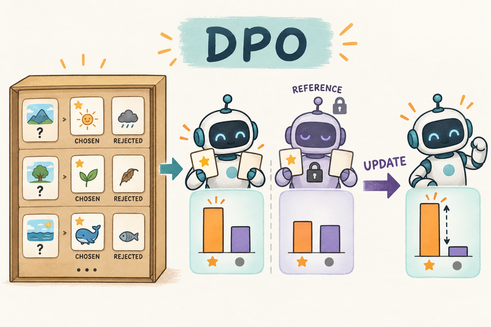

# 002｜DPO：手里只有一对好坏回答，也能直接训练偏好

[学习路线](../docs/BEGINNER_GUIDE.md) · [运行说明](README.md)

假设同一道题有两个回答，人工或规则告诉你 A 比 B 好。你没有每个 token 的分数，也未必想一边训练一边生成新答案。DPO 直接使用这种偏好对，增加模型对 preferred 回答相对 rejected 回答的偏好，并用固定 reference 作比较基准。



图中数据箱是固定的，不是每个更新步重新采样的 rollout。DPO 不需要单独拟合 reward model 来计算这项训练 loss，来源见 [DPO 原论文](https://arxiv.org/abs/2305.18290)。

## 一行数据有什么

```json
{"prompt": "3盒，每盒6支，共多少支？", "chosen": "3×6=18，所以18支。", "rejected": "共有9支。"}
```

这是教学示例，不是对仓库数据逐字摘录。chosen/rejected 表示给定标注中的相对偏好，不保证 chosen 永远完美。仓库的 DPO 学习数据是明确标注的 GSM8K 派生偏好对，并不是大规模真实人类偏好采集结果。

## 先算回答概率，再算相对差距

设 $\ell_\theta^+=\log\pi_\theta(y^+\mid x)$，$\ell_\theta^-=\log\pi_\theta(y^-\mid x)$，reference 对应 $\ell_{ref}^+,\ell_{ref}^-$。这些是**整段生成 token 的 logprob 之和**。

定义校正后的 margin：

$$z=\beta\left[(\ell_\theta^+-\ell_\theta^-)-(\ell_{ref}^+-\ell_{ref}^-)\right],$$

$$L_{DPO}=-\mathbb E_{(x,y^+,y^-)}\log\sigma(z),\qquad
\sigma(z)=\frac1{1+e^{-z}}.$$

直观上，$\sigma(z)$ 是偏好模型给“chosen 更好”的概率。我们希望这个概率变大，所以最小化它的负 log。

Reference 校正问的是“相对于原来，你有没有更偏向 chosen”，而不是简单要求 chosen 的原始概率超过 rejected。长短回答的序列概率受长度影响，不能随手把求和改平均后仍称相同的 DPO 目标。

## 手算 margin 和梯度方向

假设当前模型对两回答的 logprob 是 -2、-4，reference 是 -3、-4，取 $\beta=0.1$：

$$z=0.1[( -2+4)-( -3+4)]=0.1,\qquad L=-\log\sigma(0.1)\approx0.6444.$$

若当前模型等于 reference，则 z=0，loss=log2≈0.6931。但此时梯度不为零：

$$\frac{\partial L}{\partial z}=\sigma(z)-1;\qquad
\frac{\partial L}{\partial\ell_\theta^+}=\beta(\sigma(z)-1)<0,\quad
\frac{\partial L}{\partial\ell_\theta^-}=-\beta(\sigma(z)-1)>0.$$

因此梯度下降提高 chosen 的相对偏好、降低 rejected 的相对偏好。并不能保证每步 chosen 的绝对概率一定上涨，因为共享参数还受到其它样本影响。

$\beta$ 在理论推导里与 reference 约束相关，同时在这个 logistic loss 中缩放 margin。不能把“beta 越大”简单解释成“每一步越保守”：局部梯度大小还取决于当前 margin，跨设置比较需要实际评估。

## 为什么可以省去显式奖励模型

简述推导：KL 正则化奖励最优化的理想策略满足 $\pi^*(y\mid x)\propto\pi_{ref}(y\mid x)e^{r(x,y)/\beta}$，所以奖励可改写为 $r=\beta\log(\pi^*/\pi_{ref})$ 加上只依赖问题 x 的常数。同题两个回答相减时，常数抵消，再放入成对偏好概率，就得到上面的 DPO 形式。[原论文](https://arxiv.org/abs/2305.18290)给出完整推导与假设。

这个推导不说明“所有奖励问题都可以只靠现成偏好对解决”。DPO 依赖数据中出现了什么回答、偏好标签是否可信，以及 reference 和训练分布是否合适。

## 真实代码路径

默认 [config.yaml](config.yaml)调用 [trl_backend.py](../src/agentic_rl/trl_backend.py) 的真实 `DPOTrainer`，传入 prompt/chosen/rejected 三列和独立 reference 副本。本地显式对照在 [trainers.py](../src/agentic_rl/trainers.py) 的 `algo == "dpo"` 分支。

先把 chosen 与 rejected 都做 teacher-forcing 打分，排除 prompt/padding 后求 token logprob 之和，再调用 [losses.py](../src/agentic_rl/losses.py) 的 `dpo_loss`。核心摘录：

```python
margin = beta * ((chosen_logp - rejected_logp) - (ref_chosen - ref_rejected).detach())
loss = -torch.nn.functional.logsigmoid(margin).mean()
```

这里不对 chosen/rejected 的 current logprob `.detach()`，因为那是训练路径；reference 的差值固定。`logsigmoid` 避免先算很小的 sigmoid 再取 log 带来的数值问题。

## DPO 与 PPO/GRPO 怎样选择学习视角

| 问题 | DPO | PPO/GRPO |
| --- | --- | --- |
| 每步必须在线生成新回答吗 | 标准离线 DPO 不需要 | 训练循环包含策略 rollout |
| 学习信号来自哪里 | 同题偏好对 | 奖励与优势估计 |
| 要不要 value critic | 不需要 | PPO 需要，GRPO 不需要 |
| 容易漏掉什么 | 数据覆盖不足、偏好噪声、长度偏差 | 奖励问题、采样成本、退化组 |

## 动手练习

```bash
.venv/bin/arl train 002-dpo/config.yaml --smoke
```

练习：互换 chosen/rejected，z 怎样变化？答案是变为 -z，训练方向反转。若一对回答实际上完全相同，两个概率及其梯度相同，无法从这个对中学到区分，即便 loss 仍约为 0.6931。

看指标时，`dpo/margin` 提高只说明训练目标上的相对偏好变化。仓库的 DPO 评估使用长度敏感的 chosen/rejected logprob 比较，不能直接称为生成式数学正确率；后者需要额外进行自由生成和答案校验。

我的判断：DPO 把系统复杂度从在线采样转移到了数据设计。最值得先读的往往是偏好对本身，而不是学习率。它也是理解具身离线学习的好入口，但语言回答偏好对与机器人状态—动作数据有不同的结构，不应直接把 DPO 公式套到未定义的动作概率上。实现 API 见 [固定版本 TRL DPO 文档](https://huggingface.co/docs/trl/v0.25.1/en/dpo_trainer)。
