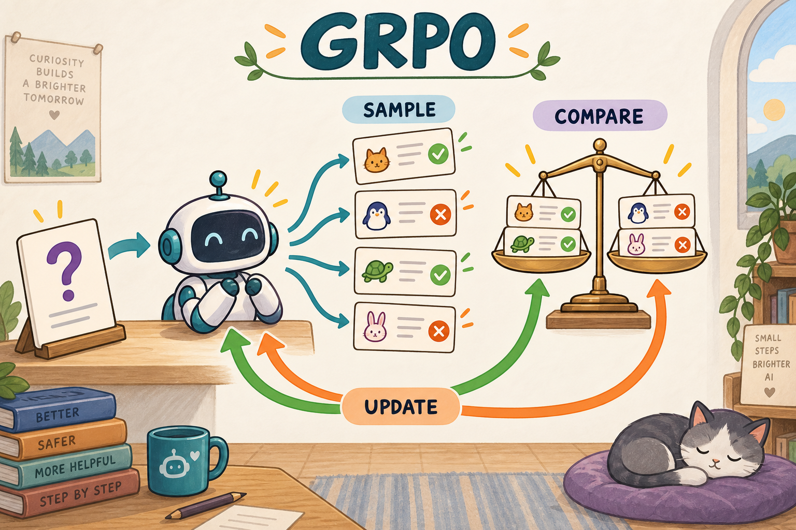

# 01｜GRPO：让同一道题的几个回答相互当参照

[学习路线](../docs/LEARNING_PATH.md) · [损失与裁剪基础](../preliminary/TUTORIAL.md) · [PPO（推荐前置，非强制）](../001-ppo/TUTORIAL.md) · [运行说明](README.md)

**本章学习任务：** 看清 GRPO 相对基础策略更新**真正改了什么**——优势从“critic + GAE”换成“同题组内统计”；其余采样、old 快照、token 打分与裁剪目标仍在同一条链上。

假设你让模型回答“每盒 6 支笔，买 3 盒共有多少支？”一次答错只能告诉你这条路径不好。若它对同一道题尝试四次，其中两次答对、两次答错，就可以在同样难度下比较哪些生成路径更值得重复。这是理解 GRPO 最直接的起点。



图里的判分可以由程序执行，不要求另训练一个神经网络。GRPO 用组内统计提供 baseline，省去 PPO 的 value critic；它仍需要奖励来源，也可能保留 reference 模型。[DeepSeekMath](https://arxiv.org/abs/2402.03300)是这一机制的原始来源。

## 与 PPO 相比，改变了什么

| 组件 | PPO | GRPO（本章） |
| --- | --- | --- |
| 优势来源 | Critic 预测 + GAE | 同一题 G 次回答的奖励组内标准化 |
| Value / GAE | 需要 | 本章路径不需要学习式 critic |
| Old / 概率比率 | 需要 | 仍需要（多步复用批数据时） |
| 裁剪 surrogate | min(ρA, clip(ρ)A) | 同一结构，A 换成组相对优势 |
| Reference KL | 常见于 LLM PPO | 可选；β=0 时关闭 |
| 每题采样成本 | 通常 1 条（或少条） | 每题 G 条 rollout |

**不必先读完 PPO 的 GAE 手算。** 若你只需语言模型可验证奖励路线，可先掌握第一章的比率与裁剪，再直接进入本章；需要完整 actor-critic 时回头补 [PPO](../001-ppo/TUTORIAL.md)。DPO 不是本章前置。

## 从 PPO 的预期，走到同题回答的比较

GRPO 全称 **Group Relative Policy Optimization，组相对策略优化**。Group 是同一道题的多个回答，relative 是相对于这一组的得分，policy optimization 则调整生成这些回答的策略。第一次读到优势 A，可以先把它理解成“比同组平均好多少”的信号，不需要预先掌握 PPO 的 GAE。

在 PPO 中，critic 要学习从每个前缀出发的预期回报。对于能给整段答案判分的任务，另一个办法是：同一道题多尝试几次，把这些回答的平均表现当参照。这样省去训练 value critic，但多出来的采样仍有成本。Reference 是另外的角色，用于偏离约束；省去 critic 不等于所有辅助评分都消失。

为什么必须同题？假设简单题的分数常为 1，难题常为 0。跨题平均会混入题目难度差异，很难区分是生成路径更好还是题本来更容易。同题组内比较先固定题目条件，再观察模型不同尝试的差异。它仍不是逐步因果归因，只为整条回答给一个相对信号。

## 一步训练究竟发生什么

下面把“同题比较”变成可执行的循环。一次 rollout 是从问题出发生成到结束的一次尝试；一个 group 包含同题 G 次 rollout；一个 batch 可以包含多个 group。G 是组大小，不能误当成全部题目数。

1. 保存当前采样策略的概率基准，针对每道题生成 G 个回答。
2. 用答案校验器给每个回答一个奖励。
3. 每道题内部计算优势，不跨题混算。
4. 重新计算这些已生成 token 在当前可训练模型下的 logprob。
5. 用裁剪目标更新模型；下一轮采样再使用更新后的参数。

生成答案是离散采样，本身不做普通反向传播。梯度来自第 4 步对“已选择 token 的概率”重新打分。

## 手算一组优势

循环第 3 步还缺具体计算。先减均值决定正负，再除标准差调整尺度。均值是参照，标准差描述组内分数分散程度；分母的小常数只用于数值稳定，不会使全同奖励组凭空有信号。

设四个回答的奖励是 $`R=[1,1,0,0]`$：

```math
\bar R=\frac1G\sum_iR_i=0.5,\quad
\sigma=\sqrt{\frac1G\sum_i(R_i-\bar R)^2}=0.5,
```

```math
A_i=\frac{R_i-\bar R}{\sigma+10^{-4}}\approx[1,1,-1,-1].
```

这份仓库用总体标准差，代码中的 `correction=0` 对应分母 G，而非 G−1。不能和使用样本标准差的其它实现直接比数值。

奖励是绝对判分，优势是相对判分。若奖励变成 `[1,1,1,1]`，所有优势为 0：这些回答都成功，但本组没有告诉模型哪条比其它更好。全错组同理。不要给相同奖励随意加噪声来伪造“有学习信号”。

## 完整数据链：同一组 `[1,1,0,0]` 走到 loss

优势算完后，仍要接到 token 概率上。下面用**同一道题、G=4**，把奖励一直追到裁剪目标。数值为教学构造，便于手算。

| 回答 i | 有效 token 摘要 | 奖励 R_i | 优势 A_i | 某 token 的 old p | 当前 p | 比率 ρ | 未裁剪 ρA | 采用 min(ρA, clip(ρ)A) |
| --- | --- | ---: | ---: | ---: | ---: | ---: | ---: | ---: |
| 0 | `18`（示意 2 token） | 1 | ≈+1 | 0.20 | 0.22 | 1.10 | 1.10 | 1.10 |
| 1 | `3×6=18`（更长） | 1 | ≈+1 | 0.15 | 0.225 | 1.50 | 1.50 | 1.20 |
| 2 | `9` | 0 | ≈−1 | 0.40 | 0.20 | 0.50 | −0.50 | −0.80 |
| 3 | `12` | 0 | ≈−1 | 0.25 | 0.375 | 1.50 | −1.50 | −1.50 |

设 ε=0.2。回答 1 的好行为已被推高较多，该 token 停止追加正向激励；回答 2 的坏行为已压低，停止追加负向激励；回答 3 的坏行为反而升高，仍需纠正。**mask 只覆盖各回答自己的有效生成 token**；题目与 padding 不进 policy loss。

本地 GRPO 在序列层做平均（每条回答先对有效 token 平均，再对回答平均），不是所有 token 全局一把梭。完整公式见下节；对照实现时请分清“比率粒度”和“loss 平均单位”。

全同奖励组（例如 R=[1,1,1,1]）优势为 0，上表 ρA 全为 0——这是“本组无相对信号”，不是实现 bug。

## 从回答分数走到 token loss

已经给每个回答分配了 A，为什么下面还有 token 下标？语言模型改变的是每步选择的概率，因此同一回答的分数需要乘到实际生成 token 的可导 logprob 上。这里采用最简单的终局广播：同一回答每个有效 token 共用一个 A。它不会知道某句无关废话是否真正帮助答对。

对于回答 i 的有效生成 token t，ell 表示当前 logprob，ell-old 表示采样时保存的 logprob；epsilon-l/h 控制下、上裁剪幅度。下面的 r 是概率比，区别于任务分数 R：

```math
r_{i,t}=\exp(\ell_{i,t}-\ell^{old}_{i,t}),\quad
c_{i,t}=\min\!\left(r_{i,t}A_i,\mathrm{clip}(r_{i,t},1-\epsilon_l,1+\epsilon_h)A_i\right).
```

该回答所有生成 token 共用 $`A_i`$。本地 GRPO 的序列归一化目标为：

```math
L=-\frac1B\sum_{i=1}^B\frac1{T_i}\sum_t m_{i,t}c_{i,t}
+\beta\frac1B\sum_{i=1}^B\frac1{T_i}\sum_t m_{i,t}k_{i,t},\qquad T_i=\sum_tm_{i,t}.
```

B 是本次更新有效回答数，完整保留时为题目数乘 G；m 是有效生成位置取 1、题目和补齐位置取 0 的 mask，T 是这条回答的有效长度。空 mask 的回答排除。第一项鼓励相对更好的回答，第二项限制偏离固定 reference，beta 控制其强度。KL 是 Kullback–Leibler divergence（KL 散度）；仓库用的逐样本形式为：

```math
d=\ell^{ref}-\ell,\qquad k=e^d-d-1.
```

它是 KL 的采样估计形式，不是“将整个词表的 KL 精确求和”。本次 GPU 检查设置 `beta=0`，未启用此正则。

重要区分：ratio 的 old 是生成该批数据的策略；KL 的 ref 通常从开训时冻结。二者不是同一件事。裁剪的正负优势行为先读 [00 章](../preliminary/TUTORIAL.md)。

再做一次局部更新手算。好回答 A≈1，其中某 token 的 old 概率 0.2、当前 0.22，比率 1.1；若上界 1.2，收益仍为 1.1，梯度鼓励它增加。若当前变成 0.3，比率 1.5，收益被截成 1.2，该样本不再提供继续增加的额外激励。坏回答 A≈-1 的情况要先乘负号再取 min，不能机械地把所有越界 token 都删掉。

KL 项中的 d 是 reference 与当前 logprob 的差，k 是一种采样估计形式。它与组均值没有关系；beta=0 时整个正则项关闭。初学时可先把这一项设想为关闭，只走通“同题采样 → 奖励 → 优势 → 裁剪”的主线，再研究偏离约束。

## 顺着真实代码读一遍

纸上计算对应四份数组：tokens、old logprob、advantages、mask。接下来沿代码追踪这四份数据，重点核对同组顺序与 token 身份是否保持，而不是先读分布式实现的所有细节。

默认 [config.yaml](config.yaml) 选择 TRL；[verl.yaml](verl.yaml) 和 [verify-gpu.yaml](verify-gpu.yaml) 选择 verl。不要只看章节名就断言运行了哪个 Trainer。

| 代码位置 | 你应该追踪的变量 |
| --- | --- |
| [agent_loop.py](../src/agentic_rl/verl_backend/agent_loop.py) 的 `collect` | G 次生成后的完整 tokens、mask、old logprob |
| [algorithms.py](../src/agentic_rl/verl_backend/algorithms.py) 的 `AlgorithmBatchBuilder.build` | `rewards` 如何分组，`advantages` 如何扩展到 token |
| [losses.py](../src/agentic_rl/losses.py) 的 `group_advantages` | 中心化、总体标准差、`.detach()` |
| [verl loss](../src/agentic_rl/verl_backend/losses.py) 的 `objective`、`reduce_tokens` | 裁剪和跨 microbatch 的全局分母 |
| [actor.py](../src/agentic_rl/verl_backend/actor.py) | 前向、反传、梯度范数与 optimizer step |

下面是教学伪代码，展示真实数据依赖，不是可直接调用的公共 API：

```python
answers = sample_each_question(G)
rewards = verify_answers(answers)
A = group_advantages(rewards, G).detach()
old = saved_generation_logprobs(answers).detach()
current = actor.score_same_token_ids(answers)
loss = clipped_sequence_mean(current, old, A, response_mask)
loss.backward()
optimizer.step()
```

`score_same_token_ids` 的“same”很重要：先解码再重新分词可能改变 token 边界，旧概率就不再对应训练位置。另一个常见错误是每个 microbatch 各自平均后相加，导致 microbatch 切法改变样本权重；verl 扩展使用全局有效序列数进行归一化。

## 如何阅读训练曲线

训练开始后，先确认采样、奖励和参数更新能对应起来，再通过独立评估判断效果。读日志时，可以依次检查同组奖励是否有差异、梯度是否有效、actor 参数是否更新，以及 reference 是否保持冻结。

少量步骤的奖励波动很难说明趋势：每步题目可能不同，样本也可能很少。`loss/total` 接近零也不代表没有更新，因为正负优势项可能在标量值上抵消，而参数梯度方向仍不同。应一起看 `update/grad_norm`、`update/skipped`、策略版本与独立评估。

## 练习与自己的判断

现在可以在运行前预测两种特殊情况：全同奖励使任务优势为零；正负优势平均为零却不一定使参数梯度为零，因为各回答的 token 与梯度方向不同。带着预测看日志，比只寻找一个下降的 loss 更可靠。

在项目根目录运行。**默认教学入口与本章 `config.yaml`（backend: trl）一致：**

```bash
# 默认：TRL GRPOTrainer，与本章正文介绍的后端一致
.venv/bin/arl train 01-grpo/config.yaml --smoke --backend trl
# 等价薄入口
python 01-grpo/train.py --smoke
```

进阶对照（换后端前请先跑通默认入口）：

```bash
.venv/bin/arl train 01-grpo/config.yaml --smoke --backend native
.venv/bin/arl train 01-grpo/verl.yaml --smoke --verl-workers 2
```

手算题：G=4，奖励 `[1,0,0,0]`，优势近似是多少？答案：均值 0.25，标准差 $`\sqrt{0.1875}\approx0.4330`$，正确项约 1.7317，错误项各约 -0.5772，已包含 $`10^{-4}`$。这说明“一次成功”在罕见成功组中的标准化幅度更大。

我的判断：调 GRPO 时，先检查每道题能否产生有差异的回答，再调整 loss 超参数。没有差异时，把学习率调大只会放大其它噪声或正则；增加 G、调整题目难度和改善奖励可观测性才更直接。这个判断来自上面的梯度结构，不是本仓库已经测得的性能结论。

继续阅读 [DAPO](../06-dapo/TUTORIAL.md)，看它怎样在组内反馈之上改**采样供应与长度处理**（不只是换一条 loss）；对照 [GSPO](../07-gspo/TUTORIAL.md) 时分清比率粒度与平均单位。理论与 API 对照可看 [DeepSeekMath §4](https://arxiv.org/html/2402.03300v2) 和 [固定版本 TRL GRPO 文档](https://huggingface.co/docs/trl/v0.25.1/en/grpo_trainer)。

## 新手自测

能否解释“4 条正确回答为什么可能没有任务学习信号”？因为相对于组均值没有差异，而非正确答案不重要。能否解释没有 critic 时优势从哪里来？来自同题多次采样的统计。能否解释为什么不同题不能随便混组？因为那会将题目难度和回答质量混在同一个参照中。上述三问分别对应采样、估计与实现分组，缺一个都不能只靠改 loss 修补。
