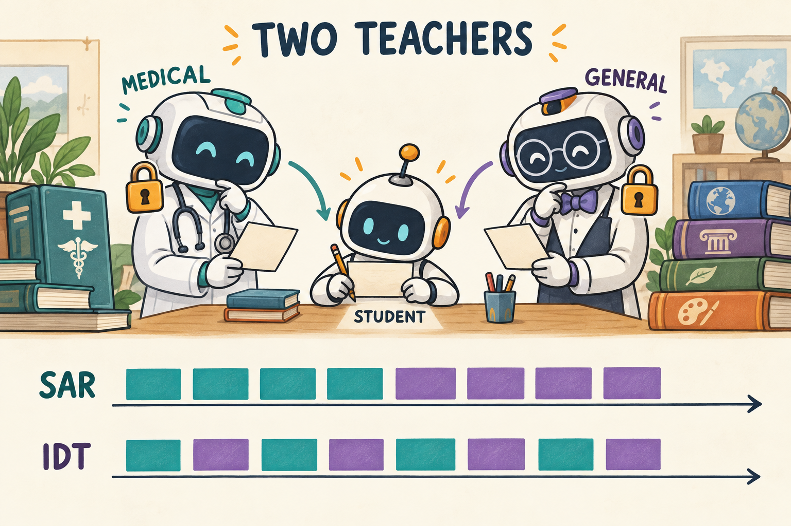

# 13｜Medical OPD / SAR / IDT：领域调度案例

<!-- NAV:TOP:BEGIN -->
[← 上一章：12 OPSD：特权信息与自教师](../04-opsd/TUTORIAL.md) · [全书目录](../docs/CHAPTERS.md) · [本篇目录](../docs/families/03-distillation.md) · [下一章：14 AgentOPSD：自教师辅助的轮次信用 →](../09-AgentOPSD/TUTORIAL.md)
<!-- NAV:TOP:END -->

> **定位：领域训练案例，不是“更完整的 OPD 算法”。** 概念与采样监督先读 [General OPD](general-opd/TUTORIAL.md)。SAR / IDT 是本仓库的**实验调度标签**，不是未经核对的通用论文标准缩写。医学数据与例子**不构成诊疗建议**，也不说明临床能力。

[学习路线](../docs/LEARNING_PATH.md) · [General OPD 基础](general-opd/TUTORIAL.md) · [运行说明](README.md)

**本章默认教学后端：TRL SFT + verl OPD（见章节配置）。** 实验问题是调度与教师切换，不是发明新的 token loss。

**六步调度示意（M=3 的 SAR）：**

| 更新步 k | 数据池 | 教师 | 更新对象 |
| ---: | --- | --- | --- |
| 0–2 | 医疗 D_M | Medical Teacher T_M | Student |
| 3–5 | 通用 D_G | Base Teacher T_B | Student |
| 全程 | — | T_M、T_B **冻结** | 仅 Student |

IDT 为交替插入通用/医疗阶段；无论哪种调度，**都要分别报告**医学侧与通用侧评估，不能只报一个平均分。

本章研究模型训练日程。假设一个通用学生跟随专科教师学习，专科能力可能改善，也可能改变原来的通用回答习惯。我们需要同时问“向谁学习”和“什么时候向谁学习”，不能只看最后一步用了哪种 loss。



青色代表医疗题与医疗教师，紫色代表通用题与 Base 教师。两条时间线都更新同一个学生。

## 本章的重点为什么是训练顺序

先明确缩写：SFT 是 Supervised Fine-Tuning（监督微调），用示范答案训练；OPD 是 On-Policy Distillation（学生自采样蒸馏），用教师对学生轨迹的概率反馈训练。Medical 表示这里选择医疗领域数据。SAR-OPD 和 IDT-OPD 在本仓库是两种实验调度标签，下面直接用“先专科后通用”和“交替更新”解释，不把未核实的英文展开当成通用算法定义。

假设 Base 很会写一般文本，却不熟悉专科问答。直接做医疗 SFT 能得到更偏专科的模型，但只训练某个领域，也可能改变原本的通用行为，这通常被称为遗忘。为了研究能否学专科又保留通用能力，我们需要同时指定两个东西：学生当前看哪类题，以及由哪位教师评价它。

这里不预设“专科训练必然遗忘”或“通用蒸馏必然恢复”。它们是可检验的实验问题。例如医疗评估从 40 到 50、通用评估从 70 到 60，与两者都提高，代表完全不同的结果；这些是假设数字，不是本仓库测得分数。只汇报一个平均分会掩盖这种差别。

## 先画清三份权重

在讨论日程之前必须固定模型来源，否则可能把“换了学生起点”误认为“换了调度有效”。以下三份权重的关系决定整个实验能否公平比较。

1. **Base**：原始预训练/指令模型，是学生的起点。
2. **Medical Teacher**：从 Base 出发，经过医疗 SFT 得到，然后冻结。
3. **Base Teacher**：保存 Base 的固定副本，在通用阶段作参照。

Student 从 fresh Base 开始，而不是直接继承 Medical Teacher 的 SFT checkpoint。训练中两位教师固定，学生参数连续变化。教师相同大小也能构成蒸馏，因为训练经历不同；“teacher”是一种角色，不保证参数更多。

## 第一步：SFT 怎样得到专科教师

Base Teacher 已有，Medical Teacher 还没有。因此先通过示范数据建立专科教师，再冻结它，后续学生蒸馏才有确定的目标。Teacher forcing 是把正确前缀作为条件、预测下一示范 token；不意味着让模型每步自己生成一个新答案再训练。

SFT 有固定问题 x 与示范解答 $`y^*`$，最小化示范生成部分的负对数概率。i 编号样本，t 编号 token；m 在示范回答位置取 1、题目与补齐位置取 0，分母统计实际训练位置：

```math
L_{SFT}=-\frac{\sum_{i,t}m_{i,t}\log\pi_\theta(y^*_{i,t}\mid x_i,y^*_{i,1:t-1})}{\sum_{i,t}m_{i,t}}.
```

如果某个示范 token 当前概率是 0.1，它贡献 $`-\log0.1\approx2.3026`$；提高到 0.2 后贡献约 1.6094。训练推动模型在这段示范历史后更容易选择示范 token。

[sft.yaml](sft.yaml)走真实 TRL `SFTTrainer`；[trl_backend.py](../src/agentic_rl/trl_backend.py)指定 `completion_only_loss=True`，使题目作为条件而非训练目标。医疗 SFT 数据来源可查 [数据发布页](https://huggingface.co/datasets/FreedomIntelligence/medical-o1-reasoning-SFT)，本地取样与字段见 [数据说明](../docs/DATA.md)。

## 第二步：Medical OPD 学的是教师概率

教师准备好之后，学生从 fresh Base 出发自己尝试。这样将“教师如何学会专科”与“学生怎样吸收教师分布”分开。下面的 old 是采样时学生，current 是正在更新的学生，teacher 是已冻结的专科模型。

学生自己生成回答，Medical Teacher 对相同 token 复评。sg 表示停止梯度，T-M 表示医疗教师；下面的每份概率都指相同历史下实际生成的同一个 token，mean 表示只平均 mask 为 1 的位置：

```math
d_t=\mathrm{sg}(\log\pi_{old}-\log\pi_{T_M}),\qquad
L_M=\mathrm{mean}_{m=1}\left[e^{\log\pi_\theta-\log\pi_{old}}d_t\right].
```

方向和 [General OPD](general-opd/TUTORIAL.md)一致。这里没有把 MedQA 答案正确率当成每 token 的 OPD 监督；任务评估和蒸馏信号是两条不同的测量渠道。

**SAR-OPD 与 IDT-OPD 是参考仓库的实验调度名称**，不是本教程声称的通用论文标准术语。OPD 基础来源可看 [GKD](https://arxiv.org/abs/2306.13649)与 [MiniLLM](https://arxiv.org/abs/2306.08543)，具体 SAR/IDT 命名以 [根目录的参考与感谢](../README.md#参考与感谢)为准。

## SAR：先专科，再恢复通用

单独医疗蒸馏只回答了“怎样学习专科”。现在研究何时换回通用数据与通用教师。最容易理解的日程是只设置一次切换边界：前半段集中学，后半段回到通用参照。

设更新步编号 k 从 0 开始，边界为 M：

```math
L_k=L_{OPD}(D_M,T_M)\ \text{if } k\lt M;\qquad
L_k=L_{OPD}(D_G,T_B)\ \text{if } k\ge M.
```

$`D_M,D_G`$ 是医疗和通用题目池，$`T_M,T_B`$ 是医疗与 Base 教师。若总共 6 步、M=3，顺序为 `医 医 医 通 通 通`。后半段同时换数据与教师，不是继续在医疗题上加一项通用 KL。

“恢复”是实验意图，不是自动保证。用 Base Teacher 的分布约束学生，可能拉回某些通用行为，也可能抹去刚学到的专科变化，需要评估证明。

## IDT：把两类更新交错安排

SAR 的学生可能在长时间专科训练后才接触通用信号。另一种日程是每隔一步切换，让两种梯度更早交替出现。即使总预算相同，两种日程也不等价，原因可以从参数更新看出来。

```math
k\text{ 为偶数}:\quad L_k=L_M;\qquad
k\text{ 为奇数}:\quad L_k=L_G.
```

同样 6 步，顺序变成 `医 通 医 通 医 通`。每一步只用相应的题目和教师；它不是在同一 batch 中把两个教师 logprob 平均。两个日程即使各用三步医疗、三步通用，结果也不必相同，因为后续梯度在已经变化的学生参数上计算。

可以把它想成学乐器时安排“新曲专项练习”和“基础音阶复习”：总时长相同，先集中后复习与每日交错练习并不是同一种学习过程。这个类比帮助理解顺序效应，不是实验结论。

写成两步就更具体：先做医疗更新，得到 $`\theta_1=\theta_0-\eta g_M(\theta_0)`$；再做通用更新，得到 $`\theta_2=\theta_1-\eta g_G(\theta_1)`$。第二个梯度在变化后的参数上计算。调换次序后，计算梯度的位置也变了，因此通常不能像两个固定数字相加那样交换。这里 eta 是学习率，g 表示相应数据与教师产生的梯度。

## 对照真实调度代码

理解顺序效应后，再读代码就有两个核心检查点：学生权重是否连续保留，数据池和教师是否同步切换。若只换教师却未换题目，运行的就不是上面定义的实验。

[algorithms.py](../src/agentic_rl/verl_backend/algorithms.py) 的 `AlgorithmBatchBuilder.build` 在每步决定 `general_phase`，随后切换 `pool` 和 `teacher`。教学化摘录：

```python
general_phase = (
    (algorithm == "idt-opd" and step % 2 == 1)
    or (algorithm == "sar-opd" and step >= medical_steps)
)
pool = general_rows if general_phase else medical_rows
teacher = base_teacher if general_phase else medical_teacher
```

变量名在摘录中为易读而展开；实际分支就在上述函数。检查日志 `distill/general_phase`，SAR 应只切换一次，IDT 应按步交替。恢复训练时还要保留原来的阶段边界，不能因为增加总步数而重新把之前的通用阶段解释为医疗阶段。

[medical_pipeline.py](../scripts/medical_pipeline.py)负责先运行 SFT，再把 Teacher checkpoint 路径传给学生阶段；[teacher_logprobs](../src/agentic_rl/trainers.py)负责 token 对齐与无梯度教师复评。这里的共用 loss 很短，调度代码才决定实验究竟是哪一种。

## 怎样做一个可解释的实验

现在将“是否保留通用能力”变成测量方案。评估集要固定并与训练隔离，保存切换前后的 checkpoint（参数快照），才看得出专科收益或通用损失发生在哪个阶段。

```bash
.venv/bin/python scripts/medical_pipeline.py --variant sar-opd --smoke
```

该命令只检查 CPU 微型链路。正式比较应保存 Base、Medical Teacher、医疗 OPD 中间学生、最终学生四个点，并在固定 MedQA 与通用 held-out 题目上分别评估。只看医疗得分可能漏掉遗忘，只看通用得分又可能掩盖专科根本没学到。

练习：总共 5 步、SAR 的 M=2，IDT 的医疗/通用步数一样吗？答案：SAR 是 2/3，IDT 是 3/2。比较日程时先统一预算，否则“调度优势”可能只是多训练了一类数据。

我的判断是先把“知识从谁来”和“哪些能力被保留”分别做成可观察量，再考虑复杂调度。教师 checkpoint、数据 split、阶段日志和双评估比一个总 loss 更能解释实验。当前仓库已验证机制与 CPU 管线，未验证医疗准确率改善或本章 GPU 训练效果。

## 新手自测

练习：切换到通用阶段时，是否把学生重置成 Base？不重置，学生连续学习；重置会丢掉前面的专科训练。若学生一开始就用 Medical Teacher 权重，还能与本章 fresh Base 实验直接比较吗？不能，起点已经变了。最后检查自己是否能画出“Base → SFT → 冻结教师”与“fresh Base → 连续学生更新”两条分开的路径。

<!-- NAV:BOTTOM:BEGIN -->
[← 上一章：12 OPSD：特权信息与自教师](../04-opsd/TUTORIAL.md) · [全书目录](../docs/CHAPTERS.md) · [本篇目录](../docs/families/03-distillation.md) · [下一章：14 AgentOPSD：自教师辅助的轮次信用 →](../09-AgentOPSD/TUTORIAL.md)
<!-- NAV:BOTTOM:END -->
