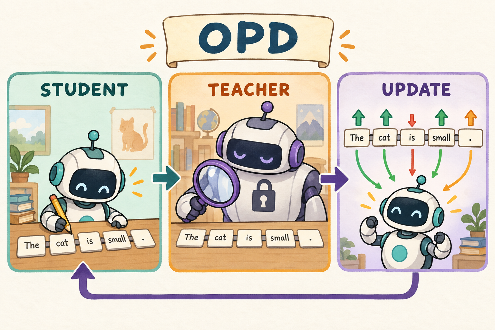

# General OPD｜学生先尝试，教师再评价学生走过的每一步

[学习路线](../../docs/BEGINNER_GUIDE.md) · [运行说明](README.md) · [医疗调度版本](../TUTORIAL.md)

想象学骑车：只看老师骑得很好，不一定能教会你在自己快摔倒的位置怎样调整。OPD 的出发点类似：由学生生成自己的回答，再让教师对学生实际访问的历史、实际选中的 token 提供反馈。



图中 Teacher 手里的 token 和 Student 写出的 token 是同一份。这里的训练答案不是教师另写一遍；概率高低也不等于教师提供了可验证的真值。

## 从“模仿答案”到“在自己的错误上接受指导”

OPD 是 **On-Policy Distillation，在线策略分布上的蒸馏**。Distillation（蒸馏）是让学生的输出分布接近教师；on-policy 指训练用的回答由当前学生自己生成。这里的“在线”不指联网，也不要求调用外部聊天服务。

普通监督学习总让学生沿给定示范的前缀走，例如参考解一直正确写到“所以 18”。真实生成时学生可能先写出“3+6”，随后面对的历史从未在示范里出现过。这种训练所见历史与实际生成历史不一致的问题，促使我们让学生先尝试，再在它实际走到的位置上问教师意见。教师仍可能不能挽救错误前缀，但至少监督发生在学生真的访问过的条件上。

所谓“软监督”也需要说清：标签“正确 token 是 18”只指定一个目标；教师分布还能告诉我们它给 18、9 和其他候选各多少概率。本仓库为降低保存与计算量，使用学生采中 token 的教师 logprob，而不是把完整词表分布都存下来。它是采样监督，不能把每次 loss 当成精确的整词表距离。

## 先与 SFT、普通蒸馏区分

现在用“谁生成被训练的回答”区分方法，就不容易把“有教师”与“教师生成数据”混为一谈。SFT 的全称是 Supervised Fine-Tuning，监督微调。

| 方法 | 训练轨迹来自谁 | 学生主要学什么 |
| --- | --- | --- |
| SFT | 固定示范数据 | 提高给定示范 token 的概率 |
| 教师生成后离线蒸馏 | 教师预先生成 | 模仿教师的轨迹 |
| 本章 OPD | 当前学生自己采样 | 在学生访问的历史上调整 token 分布 |

学生自采样与在其轨迹上接受教师监督，是 [GKD 工作](https://arxiv.org/abs/2306.13649)讨论的核心方向；reverse KL 的蒸馏动机可参考 [MiniLLM](https://arxiv.org/abs/2306.08543)。下面的数学例子解释本仓库实现，不等于这两篇论文所有细节的复现。

## 教师究竟给出什么信号

教师不会替你把梯度写进学生参数；它提供概率，loss 再把概率差转成方向。KL 是 Kullback–Leibler divergence（KL 散度），衡量分布差异。本章说 reverse KL，明确指学生 p 在前、教师 q 在后。顺序重要，因为平均时使用的是前一份分布。

例如同一历史只有两个候选，学生给 `[0.8,0.2]`，教师给 `[0.5,0.5]`。学生过于偏爱第一个候选、低估第二个。采到第一个时 log(0.8/0.5)>0，loss 倾向降低它；采到第二个时 log(0.2/0.5)<0，倾向提高它。两种反馈按学生采样频率汇总，才对应下面的分布目标。

在固定历史 h 上，学生分布为 p，冻结教师分布为 q。反向 KL 定义为：

```math
D_{KL}(p\|q)=\sum_v p(v\mid h)\log\frac{p(v\mid h)}{q(v\mid h)}.
```

v 遍历词表；这条式子是分布层面的目标。全词表求和很贵，本地实现只记录学生采到的 token。ell、ell-old、ell-T 分别是当前学生、采样时学生与教师对相同 token 的 logprob；sg 表示停止梯度，即反传时把反馈当常量：

```math
d_t=\mathrm{sg}(\ell^{old}_t-\ell^T_t),\qquad
r_t=\exp(\ell_t-\mathrm{sg}(\ell^{old}_t)).
```

固定历史下，KL 的 score-function 梯度中可写出 $`\mathbb{E}_p[(\log p-\log q)\nabla\log p]`$；额外的常数 1 项期望梯度为零。由此得到本章采用的局部 token 采样 surrogate：

```math
L_{OPD}=\frac{\sum_t m_t r_t d_t}{\sum_t m_t}.
```

m 在学生生成位置取 1、题目和补齐位置取 0，分母统计有效位置。这里的 r 是概率比，d 是固定的学生与教师 logprob 差。这是学生轨迹上的 token 级近似训练目标。长序列中历史分布也会随策略改变，因此不要把这个简式称为任意多轮序列 KL 的完整无偏梯度，更不要与全词表 KL 数值混为一谈。

## 一个数字就能看清更新方向

上节从分布写到了采样 surrogate（用于提供更新方向的替代目标）。现在固定一个实际采到的 token，检查导数。注意本节只展示局部方向；共享网络还会同时受到其他 token 的梯度影响。

学生采到了 token“18”，采样时概率为 0.2，教师在相同历史下给它 0.4：

```math
d=\log(0.2)-\log(0.4)=\log(0.5)\approx-0.6931.
```

刚开始更新时当前策略等于采样策略，r=1，因而 $`\partial L/\partial\ell=rd=-0.6931`$，梯度下降推动学生提高该 token 的概率。

若教师只给 0.1，则 d=+0.6931，方向反转。它反映“学生相对教师是否过度偏好这个 token”，不是直接回答它是否数学正确。

一次只采到 d=-0.6931，不违反 KL 非负：KL 非负是对整个分布求期望的性质，有限样本平均可以为负，训练 surrogate 也可以为负。

## 为什么一定要停止梯度

数值方向正确还不够，同一个公式若允许梯度穿过不同分支，就会变成不同算法。sg 是 stop-gradient（停止梯度），意思是该值参与乘法，但本次反传不求它对参数的导数。Teacher、old 和 gap 提供固定反馈，current 概率提供可训练路径。

教师参数冻结；old 概率在更新前固定；差值 d 也固定。更新后重新计算的是 current logprob。若每个 optimizer micro-step 又重算 old，ratio 总会被拉回 1；若误让 d 反传，又增加了设计之外的梯度路径。

打开 [losses.py](../../src/agentic_rl/losses.py) 的 `opd_loss`，核心代码摘录如下：

```python
gap = old_logp.detach() - teacher_logp.detach()
loss = masked_mean((logp - old_logp.detach()).exp() * gap, mask)
```

verl 路径采用等价的符号约定：在 [algorithms.py](../../src/agentic_rl/verl_backend/algorithms.py) 中设置 `advantages = teacher_log_probs - old_log_probs`，再由 `lab_opd` 最小化 `-ratio * advantages`。负号抵消后与上式相同。看到变量名 `advantages` 时，应追踪它的来源，不能认定这里也做了 GRPO 组内标准化。

## 代码阅读的重点是对齐

现在有两份概率账本，要相减首先得保证它们记录同一行为。“教师读到了学生回答”还不够，token IDs、前缀条件、预测位置与 mask 都必须对应。下一步读实现时，先查这些身份信息，再查 loss 是否下降。

先读 [trainers.py](../../src/agentic_rl/trainers.py) 的 `teacher_logprobs`。它检查教师与学生 vocabulary 相同，保留学生 completion IDs，只对教师上下文进行必要构造，然后把评分移回学生 token 位置。`@torch.no_grad()` 阻止教师复评建训练图。

接着读 [models.py](../../src/agentic_rl/models.py) 的 `Policy.score` 与 [protocol.py](../../src/agentic_rl/verl_backend/protocol.py) 的 `pack`。需要核对三个事实：实际 token ID 相同，概率对应预测这个 token 的前一个位置，mask 排除 prompt 和 padding。

同一个自然语言词在不同 tokenizer 下可能拆成不同 token；单纯“输出字符串相同”无法保证逐 token 蒸馏成立。词表相等是本地保护条件，实践中还要确认 tokenizer 的规则、特殊 token 与模板兼容。

## 动手练习与诊断

最便宜的正确性检查是先让教师与学生完全相同：若输入也相同，反馈应消失；再有意改变教师概率，方向应符合前面的数字例子。跑完整训练前，先能解释这两个极端情况。

```bash
.venv/bin/arl train 02-opd/general-opd/verl.yaml --smoke --verl-workers 2
```

练习：让教师和学生权重相同、上下文相同、dropout 关闭，理论上刚开始的 d 应是多少？答案是 0。若明显不是，先查采样温度、支持集、token 对齐和模型模式，再怀疑优化公式。

做能力实验时需要同时记录教师能力、学生任务准确率和采样 KL。只让学生更像一个弱教师，并不会自动提高任务得分。默认小模型用于学习成本控制，GPU 蒸馏效果尚未在本仓库验证。

我的判断：OPD 的关键资产是“教师与学生对同一条行为轨迹的两份概率账本”。账本对齐了，两行 loss 才有意义；账本错位时，loss 依然可能下降，因此优化器成功退出并不是蒸馏正确的充分证据。

## 新手自测

练习：教师另外生成了一段更好的答案，能直接拿它的逐 token 概率减学生原回答的概率吗？不能，两份 token 与历史不同，不是在比较同一个事件。再解释：教师更支持一个 token，是否证明它正确？不证明，教师也可能犯错。因此能力评估仍要独立判分。

延伸阅读时，可在 [GKD](https://arxiv.org/abs/2306.13649) 中关注学生生成历史的分布，在 [MiniLLM](https://arxiv.org/abs/2306.08543) 中关注 reverse KL 的选择。本章具体 sampled-token 梯度与停止梯度方式，以链接的本地实现为准，不将两篇论文的完整方法混成同一个配方。
