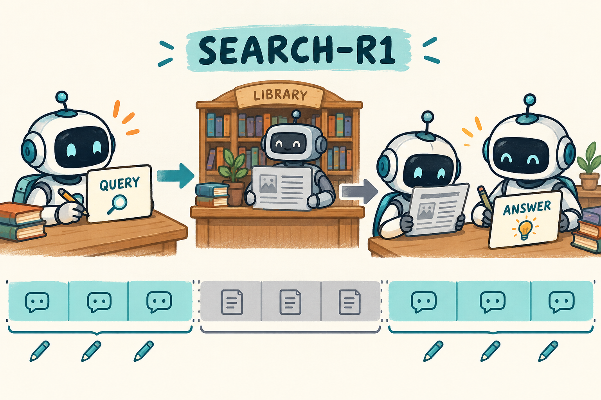

# 07｜Search-R1：学习检索与观察 mask

<!-- NAV:TOP:BEGIN -->
[← 上一章：06 DPO：从偏好对直接优化策略](../002-dpo/TUTORIAL.md) · [全书目录](../docs/CHAPTERS.md) · [本篇目录](../docs/families/02-tools-multimodal.md) · [下一章：08 ReTool：真实执行与工具决策 →](../05-retool/TUTORIAL.md)
<!-- NAV:TOP:END -->

[学习路线](../docs/LEARNING_PATH.md) · [GRPO 基础](../01-grpo/TUTORIAL.md) · [运行入口](README.md)

**本章默认教学后端：verl（`verl.yaml`）。** 检索观察 mask 与轨迹来源是本章重点；组内优势与裁剪目标见 GRPO，不必在这里重学整条 loss。

**相对 GRPO，改变了什么？**

| 组件 | 基础 GRPO | Search-R1（本章） |
| --- | --- | --- |
| 一次 rollout 内容 | 一段连续回答 | 查询 / 观察 / 再查询 / 答案交织 |
| 奖励来源 | 最终答案（或任务分） | 仍可只给最终答案；检索器本身不反传 |
| 训练 mask | 仅回答生成 token | 模型生成的查询与答案 =1；检索文档 =0 |
| 新增难点 | — | 两跳条件决策；观察归属；查询质量与答案正确分离 |

普通问答模型看到问题后直接作答。Search-R1 允许它在回答中途提出检索请求，读到材料后继续推理。训练要学习的包括：什么时候需要查、查什么、拿到材料后如何使用。搜索引擎返回的文章并不是模型自己说的话。



图中几台机器人表示同一模型在不同时间点的工作；图书馆代表固定检索器。方法背景与 retrieved-token masking 见 [Search-R1 原论文](https://arxiv.org/abs/2503.09516)。本地实现用 BM25 检索已准备的语料，不调用实时互联网搜索。

## 轨迹字段账本（与 ReTool 共用的最小格式）

无论观察来自检索还是代码执行，一条轨迹至少应能还原下列字段。工具返回文字即使与最终答案字面相同，**来源身份仍不同**。

| 字段 | 含义 | 是否进 policy loss |
| --- | --- | --- |
| `source` | model / tool / env | 仅 model |
| `raw_tokens` | 实际 token ID（不要先 decode 再 re-encode） | 模型段参与 |
| `train_mask` | 与 token 对齐的 0/1 | 定义直接训练位置 |
| `old_logp` | 采样时保存的 logprob | 比率分母，批内固定 |
| `tool_return` | 检索文档或错误信息 | 否（但是后续生成的条件） |
| `end_reason` | answer / budget / invalid | 解释为何停止 |

## 先区分检索管线与学习检索的策略

Search-R1 是方法名称，不需要把 R1 再当作一个待记的数学缩写。初学时先分清 RAG：Retrieval-Augmented Generation，检索增强生成。一个固定 RAG 管线可能总是先检索一次、再把文档交给模型；本章则允许模型在推理途中自己选择查询和时机，前一次查到的结果还会影响下一次查询。

例如问题需要“小说 → 作者 → 出生城市”两跳信息。第一次检索只知道作者是谁，下一条查询必须根据这份观察才能写出。若模型只学“问题里出现关键词就原样搜索”，未必能完成第二跳。RL 要调整的是这串条件决策的概率，而不是给检索器本身训练一个语言模型 loss。

先认识三个词：trajectory（轨迹）是一整次问答里的生成与工具反馈记录；action（动作）是模型生成的查询或最终答案；observation（观察）是外部返回的文档或错误。同一条长文本里混有不同来源，所以后面必须专门讲 mask。这里的 mask 是“是否直接参与损失”的标记，不是删除上下文。

## 跟着一条轨迹走

先看具体消息顺序，再看数学式。你需要在每一行标出作者是模型还是工具，并确认第二次生成时模型比第一次多知道什么。

教学问题：“某部小说作者出生在哪个城市？”合理轨迹可能是：

```text
模型：<search>小说名 作者</search>
工具：作者是某人。
模型：<search>该作者 出生地</search>
工具：出生于某城市。
模型：<answer>该城市</answer>
```

这些内容只是原创教学示意，不是事实问答或实际运行输出。环境只负责收到 `<search>` 后检索，并把结果接回上下文；它不会替模型决定下一条查询。

若模型生成 `<answer>`，该问答 rollout 结束。格式不合法时，工具错误信息也成为 observation，模型随后可以纠正。上下文长度与轮数上限则防止无限交互。

## 奖励与 loss：新的是交互，不一定是目标公式

轨迹已经生成，但如何告诉模型哪次查询更值得重复？本地选择只给最终答案判分，再把完整轨迹相对同组的好坏信号传给模型生成位置。这提供了学习方向，却没有额外标注“第几个查询是关键”。

为什么搜索不可微仍能学习？将一条轨迹的概率拆开，会包含模型行动概率，以及环境返回观察的概率。检索器固定，后者不直接依赖模型参数；在实际记录的轨迹上，策略梯度使用模型行动的 logprob。模型能因为查询带来更好的结局而调整生成查询的概率，无需对检索算法本身求导。[Search-R1 方法部分](https://arxiv.org/html/2503.09516v3)给出了搜索环境与生成 token 的这种分工。

本章默认按最终答案匹配给任务奖励，同题生成 G 条完整检索轨迹后计算：

```math
A_i=\frac{R_i-\bar R}{\sigma_R+10^{-4}}.
```

生成 token 的历史 $`h_{i,t}`$ 现在包含已经返回的文档。概率比仍为：

```math
r_{i,t}=\frac{\pi_\theta(y_{i,t}\mid h_{i,t})}{\pi_{old}(y_{i,t}\mid h_{i,t})}.
```

R 是终局任务分数，R 的均值和标准差只在同题组内计算；A 是得到的相对信号。下面 B 是有效轨迹数，T 是每条轨迹的生成长度，m 标记训练位置，epsilon-l/h 控制裁剪上下幅度。本地使用 GRPO 型序列平均裁剪 loss：

```math
L=-\frac1B\sum_i\frac1{T_i}\sum_t m_{i,t}
\min\{r_{i,t}A_i,\mathrm{clip}(r_{i,t},1-\epsilon_l,1+\epsilon_h)A_i\}.
```

可选 reference KL 见 GRPO 章。这里的 $`T_i`$ 只统计模型生成 token。奖励没有逐条证明每个查询有用，整条轨迹共享终局优势；这也是多轮信用分配仍然困难的原因。

## 最重要的数组是 mask

上一节只对模型行动求训练目标，因此现在要把这个数学边界变成数组边界。若不区分来源，长文档会占据大量 loss 位置，把学习目标从“会查询和使用信息”变成“模仿检索器返回文字”。

假设题目 3 个 token、查询 2 个、检索结果 4 个、答案 2 个：

```text
段落：题目       查询    文档          答案
mask：0 0 0      1 1     0 0 0 0       1 1
```

有效 token 总数是 4，不是 11。若 loss numerator 是 8，token 平均应除以 4；但本章还会先对每条轨迹平均，再平均轨迹。

文档 mask=0 不表示文档被屏蔽掉。模型仍读取文档，后续生成概率依赖它，梯度可以通过“文档影响答案”的网络计算路径传播；只是没有直接要求模型预测文档文字。

## 对照代码逐步阅读

用上面的 11 个位置作为纸上测试，再读追加 tokens 和追加 mask 的代码。任何一次工具调用之后，这两份数组的长度与来源标签都应该一起保持一致。

先打开 [rollout.py](../src/agentic_rl/rollout.py) 的 `agent_rollout`。按 `search → observation → ids.extend → mask.extend` 追踪。下面是关键摘录：

```python
ids.extend(out)
mask.extend([1.0] * len(out))
# 检索与 observation 编码发生在两段代码之间
ids.extend(obs_ids)
mask.extend([0.0] * len(obs_ids))
```

旧 token IDs 原样保留，仅追加新内容。若每次交互都将整段对话解码再编码，旧 logprob 可能与新的 token 边界错位。

[environments.py](../src/agentic_rl/environments.py) 的 `LocalSearch.search` 按词频、逆文档频率和文档长度计算 BM25 风格得分，再取 top-k；它没有可训练参数。多任务并发由 [agent_loop.py](../src/agentic_rl/verl_backend/agent_loop.py) 协调；[algorithms.py](../src/agentic_rl/verl_backend/algorithms.py) 把完整轨迹转成 GRPO 学习信号。

## 自己实验时先检查什么

链路正确后再判断策略是否改进。一次零奖励可能来自语料缺资料、查询不好、检索排序不佳或最终阅读错误，不能只根据最后答案把责任全部归给策略优化器。

```bash
# 默认教学入口：与本章 verl.yaml 一致
.venv/bin/arl train 03-search-r1/verl.yaml --smoke --verl-workers 2
```

CPU smoke 检查工具调用路径，随机模型未必生成合法查询。真正评估时，先检查语料中是否存在回答所需材料，再统计合法查询率、空结果率、查询次数与最终正确率。单看工具调用次数增加，不说明检索能力提高。

练习：文档从 4 token 变成 40 token，模型生成位置不变，训练 mask 应增加几个 1？答案是 0。上下文计算量会上升，但直接参与 policy loss 的 token 数不会因此增加。

我的判断：检索训练的第一道质量关是“观察是否值得相信，训练归属是否正确”。没有证据的语料和错误的 mask，都会让最终奖励难以解释。本章只验证本地语料检索和 CPU 管线，未复现论文多数据集得分，也没有验证实时联网检索。

## 新手自测

练习：第一次查到了作者，第二次查询却仍然照抄最初问题，哪部分能力没有体现？没有利用新观察调整下一动作。若最终答案正确，能否断言每个查询都必要？不能，终局奖励可能连多余查询一起鼓励。进一步实验可固定语料与题目，分别限制为零次、一次、多次查询，记录正确率和调用成本；这才说明额外交互带来了什么。

<!-- NAV:BOTTOM:BEGIN -->
[← 上一章：06 DPO：从偏好对直接优化策略](../002-dpo/TUTORIAL.md) · [全书目录](../docs/CHAPTERS.md) · [本篇目录](../docs/families/02-tools-multimodal.md) · [下一章：08 ReTool：真实执行与工具决策 →](../05-retool/TUTORIAL.md)
<!-- NAV:BOTTOM:END -->
