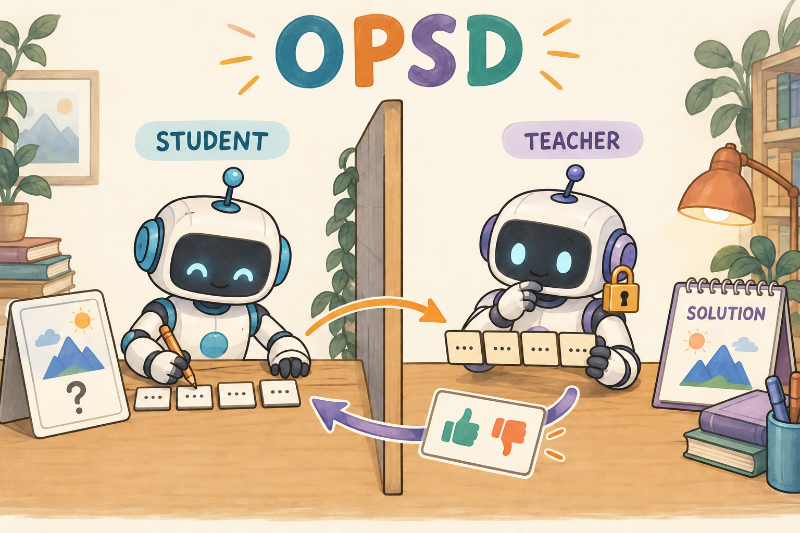

# 04｜OPSD：同一个起点的模型，看到解题过程后能否教会只看题目的自己

[学习路线](../docs/BEGINNER_GUIDE.md) · [OPD 基础](../02-opd/general-opd/TUTORIAL.md) · [运行说明](README.md)

一个学生独立做题可能卡住，但看过参考解后能解释“这一行为什么应该这样写”。OPSD 将这种信息差用于蒸馏：Student 只看题目；Self-Teacher 看题目加训练期参考 solution，再评价 Student 自己生成的 token。



插图里的隔板表示信息边界。教师看过答案不意味着学生在评估时也可以看。方法背景见 [Self-Distilled Reasoner](https://arxiv.org/abs/2601.18734)；下面明确描述本仓库固定 step-0 Teacher 的实现选择。

## 为什么一个模型能给自己提供新的监督

OPSD 全称 **On-Policy Self-Distillation，学生自采样的自蒸馏**。On-policy 指轨迹来自正在学习的学生；self-distillation 指教师角色不必来自另一个更大的外部模型。本仓库具体保留开训时的模型作为固定教师，并给它更多训练期信息。

先考虑一个错误方案：同样权重、同样上下文、同样运行条件的两个模型，互相比较 token 概率。它们初始分布相同，没有新的指导信号。OPSD 增加的信息差是 solution，也就是训练数据里的参考解。学生解题时看不到它，教师复评时能看到它。方法利用的是“知道参考解后，可能更容易评价学生写到这里应怎样继续”，而不是“复制模型就自动变强”。

这也解释了为什么它和 SFT（Supervised Fine-Tuning，监督微调）不同。SFT 直接预测参考解里的 token；这里被评分的是学生自己写的 token，包括不完美的尝试。参考解只是教师的额外条件。训练期允许教师看解答，评估学生时必须拿掉，否则测的是带答案输入的另一种任务。

## “同样参数”不等于“同样概率”

有了信息差的动机，下面把“谁能看到什么”写进概率条件。x 是题目，z 是参考解，y 的前缀始终是学生真实生成内容。教师权重相同，不代表条件分布相同。

语言模型的概率同时依赖权重与上下文：

```math
p_S(y_t)=\pi_\theta(y_t\mid x,y_{1:t-1}),\qquad
p_T(y_t)=\pi_{\theta_0}(y_t\mid x,z,y_{1:t-1}),
```

z 是参考 solution，$`\theta_0`$ 是开训时的固定权重。即使开始时 $`\theta=\theta_0`$，只要上下文不同，两份分布就可能不同。

例如题目是“17×23 等于多少”。学生生成到“17×20=340，17×3=51，所以总共”时，教师已经看到参考推导，更可能支持正确的后续 token。教师评分的是学生真实写下的路径，而不是要求学生逐字复制 solution。

## loss 与 OPD 相同，改变的是教师条件

条件分布变了，接下来就可以把两份同 token 概率相减，沿用 OPD 的更新方向。sg 表示停止梯度，old 表示生成这一批时的学生；这两个量都不能在批内跟着当前参数变化。

下面 i 编号样本，t 编号 token；ell 与 ell-old 是当前、采样时学生的 logprob，m 在学生生成位置取 1，其他位置取 0。在学生采到的 token 上：

```math
d_{i,t}=\mathrm{sg}\left[
\log\pi_{old}(y_{i,t}\mid x_i,y_{i,1:t-1})-
\log\pi_{\theta_0}(y_{i,t}\mid x_i,z_i,y_{i,1:t-1})\right],
```

```math
L_{OPSD}=\frac{\sum_{i,t}m_{i,t}
e^{\ell_{i,t}-\ell^{old}_{i,t}}d_{i,t}}{\sum_{i,t}m_{i,t}}.
```

假设学生对某 token 给 0.25、看过解答的教师给 0.5，则 d≈−0.6931，初始 ratio=1 时推动学生提高该 token 概率。若去掉解答后两模型分布完全相同，初始 d=0；这提供了检查信息差是否真的接入的对照。

这里是 sampled-token reverse-KL surrogate，局部梯度解释与 [General OPD](../02-opd/general-opd/TUTORIAL.md)一致。没有额外的 value critic，也没有把 solution 当 Student 的 SFT 目标序列。

## 新手最容易忽略的 token 位置

数学里比较同一个 y 很容易，程序里教师多读了一段 solution，数组位置已经整体后移。若按相同数组下标相减，就可能把学生第一个答案 token 和教师参考解中的 token 比较。下面专门把身份与位置拆开。

假设 Student prompt 长 10，生成 4 个 token。Teacher 因加入 solution，prompt 长 30。要比较的是：

| 内容 | Student 输入位置 | Teacher 输入位置 |
| --- | --- | --- |
| 第一个生成 token | 10 | 30 |
| 它的预测 logprob 所在位置 | 9 | 29 |
| 后三个生成 token | 11–13 | 31–33 |

注意位置从 0 开始。不能直接把两张 `[positions]` 数组相减，必须从各自 prompt 尾部取同一 completion 的概率。

对应 [trainers.py](../src/agentic_rl/trainers.py) 的 `teacher_logprobs`，关键代码摘录为：

```python
suffix = s.tokens[s.prompt_length :]
t = Sample(ids + suffix, [0.0] * len(ids) + s.mask[s.prompt_length :], len(ids))
lp, _, _ = teacher.score([t])
aligned[s.prompt_length - 1 :] = lp[0, len(ids) - 1 :].to(student.device)
```

`ids` 是更长的 Teacher prompt；`suffix` 保留 Student 的 token IDs；新的 mask 排除 Teacher 多出来的上下文；最后一行把 completion 概率搬回 Student 坐标系。`privileged="solution"` 的分支负责把参考解仅放入 Teacher prompt。

这也是为什么不能偷偷截断 Teacher prompt 然后仍按旧下标对齐。上下文不够时需要明确筛选数据、调整预算或使用支持更长上下文的模型。

## 冻结与更新分别在哪里

位置对齐后，还要保证角色的时间边界：哪些参数开训后固定，哪些随每批变化。否则“固定教师带额外信息”会悄悄变成“不断变化的另一种自教师算法”。

[worker.py](../src/agentic_rl/verl_backend/worker.py)负责角色模型，OPSD Teacher 固定为 step-0 副本；[algorithms.py](../src/agentic_rl/verl_backend/algorithms.py)在 build 中选择 solution 特权复评并构造 `teacher_log_probs - old`；[verl losses.py](../src/agentic_rl/verl_backend/losses.py)通过 `lab_opd` 更新 Student。

与 AgentOPSD 区分：本章用固定 step-0 Teacher 并直接给逐 token 蒸馏信号；[AgentOPSD](../09-AgentOPSD/TUTORIAL.md)在每批使用当前策略的额外 Skill 视角来调整轮次信用，还保留终局 GRPO 优势的方向。两者不应只因为名字接近就写成同一算法。

## 自己验证什么

现在可以设计控制变量检查。保持学生 token 不变，只让教师是否看到 solution 发生变化，可以观察信息差是否真的进入反馈；这比比较两批不同回答的 loss 更容易解释。

```bash
.venv/bin/arl train 04-opsd/verl.yaml --smoke --verl-workers 2
```

建议做三个检查：开训前后 Teacher 权重摘要相同；Student 轨迹的 prompt 没有 solution；Teacher 与 Student 的 completion IDs 相同。再做一个消融：固定同一批 Student 轨迹，只改变 Teacher 是否看到 solution，观察 gap 如何变化。

练习：Teacher prompt 从 30 token 增长为 35，Student 已生成 4 个 token，需要重新生成 Student 回答吗？答案：不需要。应保留这 4 个 token，在新 Teacher 上下文复评并重新对齐。若重生成，就换了被评价对象。

我的判断：OPSD 的有效性依赖“看到答案后更会评价”，这不是所有模型都天然具备的能力。参考解错误、过长或模型无法利用参考解时，监督也可能差。必须在不含 solution 的独立评估上检查 Student，而不能用 Teacher 看到解答时的得分代替学生效果。本地尚无本章 GPU 能力实验。

参考解数据来自 [Openthoughts_math_30k_opsd 发布页](https://huggingface.co/datasets/siyanzhao/Openthoughts_math_30k_opsd)，取样与来源版本见 [DATA.md](../docs/DATA.md)。

## 新手自测

练习：学生偶然写出另一种同样正确的解法，与 solution 用词不同，是否必须逐字改成 solution？不是，本章训练目标由教师在学生实际前缀下给的概率决定，不是直接对 solution 做逐字交叉熵。不过教师是否能认可等价解法需要评估，不能由这种设计自动保证。

阅读 [Self-Distilled Reasoner](https://arxiv.org/html/2601.18734v1) 时重点看“学生生成”和“特权教师条件”两部分；固定 step-0 教师、采样 token 的 reverse-KL surrogate 和数值设置是本仓库明示的选择，不代表论文所有变体。
