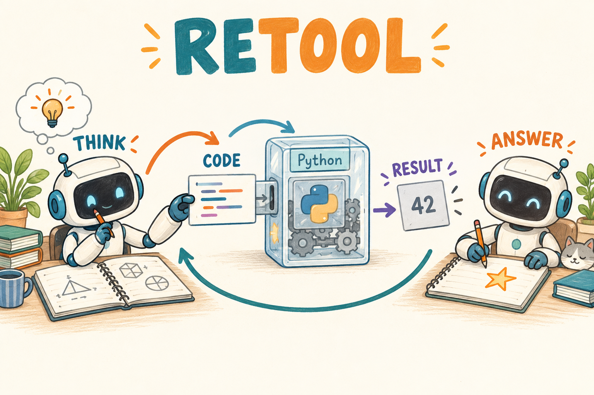

# ReTool｜学会何时计算，而不只是学会写出像代码的文字

[学习路线](../docs/LEARNING_PATH.md) · [GRPO 基础](../01-grpo/TUTORIAL.md) · [Search-R1 的 mask 与轨迹字段](../03-search-r1/TUTORIAL.md) · [运行入口](README.md)

**本章默认教学后端：verl（`verl.yaml`）。** 先单独跑工具，再跑训练链路。

**相对 GRPO / Search-R1，改变了什么？**

| 组件 | 基础 GRPO | ReTool（本章） |
| --- | --- | --- |
| 外部反馈 | 判分器 | **真实执行**的受限数值 Python |
| 轨迹结构 | 单段生成 | 模型代码 ↔ 工具观察交替 |
| 训练对象 | 生成 token | 仍是模型生成段；观察 mask=0 |
| 新增风险 | — | 代码对但答案抄错；工具成功 ≠ 策略成功 |

面对需要多步算术的问题，模型可以自己推导，也可以写一小段程序，请工具执行后继续思考。ReTool 研究这种自然语言与实际代码执行交替的学习过程。工具必须真的运行；把模型预测的“执行结果”直接当事实，会失去这个机制。



图是调用流程示意，不是某次实验测量。[ReTool 原论文](https://arxiv.org/abs/2504.11536)讨论战略性工具使用；本地学习实现选用 GRPO 信号与受限数值 Python，不覆盖论文训练规模和全部工程配置。

轨迹字段与 Search-R1 相同（`source / raw_tokens / train_mask / old_logp / tool_return / end_reason`）；本章 `tool_return` 换成 Python 执行输出或 `ToolError`。三类对照实验：执行失败、执行成功但答案抄错、无需调用直接答对。

## 为什么会写代码还不等于会用工具

ReTool 的论文题目是 Reinforcement Learning for Strategic Tool Use in LLMs，强调策略性的工具使用。我们要学的是完整决策：何时需要计算，把问题转成什么程序，程序执行后如何利用结果，以及出错后怎么办。它不只是一次“生成代码”的监督练习。

设题目要求 97×103。模型可以心算为 `(100-3)(100+3)=9991`，也可以发出程序让工具算。如果数字简单，额外调用未必划算；如果计算很长，工具能减少算术错误。但执行器只按程序做事，模型若把乘法写成加法，工具会忠实返回错误问题的正确计算结果。因此工具准确不等于整体答案准确。

本章用 GRPO，即 Group Relative Policy Optimization（组相对策略优化），给同题不同完整尝试评分。一次完整尝试叫 rollout，包含模型生成段和工具观察段。模型被更新，执行器固定；工具反馈改变下一段模型输入，不通过执行过程反传。下一节先看一条真实可执行的微型调用，再说明奖励怎样改变调用概率。

## 一次具体的工具交互

请同时记录“字符串是什么”和“是谁产生的”。哪怕工具输出与最后答案完全相同，它们也不是同一份训练目标。

假设需要求 $`1+2+\cdots+100`$。模型可以输出：

```text
<python>print(sum(range(1, 101)))</python>
```

工具返回 `5050`，随后模型输出 `<answer>5050</answer>`。第一次生成的是代码，第二次生成的是答案。中间的 `5050` 是外部执行结果，两处同样的字符串在训练上有不同归属。

也可以不用工具，直接利用等差数列求和。当前奖励并不会因为“调用过 Python”就自动加分；最终答案是否正确仍是主要任务信号。因此合理目标是学会有用调用，而不是最大化工具次数。

## 关键公式与 loss

现在已经看到生成 → 执行 → 再生成的闭环。学习阶段要回到记录的那些模型 token，重新计算它们的概率；不会对 `print` 的输出数字直接求导。下面用 y 表示模型生成段、o 表示外部观察、tau 表示完整轨迹。

一条轨迹写成 $`\tau=(y_1,o_1,y_2,o_2,\ldots,y_K)`$，$`y_k`$ 是模型生成段，$`o_k`$ 是执行结果。环境转换可以是离散、不可微的程序。Policy gradient 不要求对 Python 执行器求导。

本地对完整轨迹判分，组内计算 $`A_i=(R_i-\bar R)/(\sigma+10^{-4})`$：R 是任务分数，带横线的 R 与 sigma 是同题组的均值和标准差。下面 B 是有效轨迹数，i 编号轨迹，t 编号 token，epsilon-l/h 控制裁剪上下幅度，再优化：

```math
L=-\frac1B\sum_i\frac1{\sum_tm_{i,t}}\sum_tm_{i,t}
\min\{r_{i,t}A_i,\mathrm{clip}(r_{i,t},1-\epsilon_l,1+\epsilon_h)A_i\}.
```

其中 $`m=1`$ 覆盖模型的代码、推理和回答；$`m=0`$ 覆盖题目及工具 observation。$`r`$ 比较当前与行为策略对相同已生成 token 的概率。Reward 并不直接进入代码执行器的梯度，而是重新加权生成这些 token 的概率。

例子：一组两条轨迹，一条代码计算正确最终答对，另一条虽然代码运行成功但抄错最终答案，奖励为 `[1,0]`。优势近似 `[1,-1]`，第二条不会仅因工具没有报错就得到正向终局信号。

还可以手算一个局部 token：成功轨迹优势约 +1，某个代码 token 的 old 概率 0.1、当前 0.11，比率为 1.1；若未触发裁剪，loss 鼓励它更常出现。工具返回的数字虽然帮助答对，但 mask=0，不直接进入这项计算。这解释了“训练工具使用”究竟训练了谁。

终局广播也有局限：失败轨迹中可能包含完全正确的代码，只是最后抄错了答案。该实现仍给整个模型生成轨迹负向优势，不会自动把信用准确分到抄错的最后一行。后续 AgentOPSD 与 Harness-RL 分别讨论更细的轮次或字段分工。

## 代码中三处责任边界

理解更新对象以后，代码也应按“控制器、执行器、训练器”拆开。控制器判断是否调用，执行器计算结果，训练器根据最终反馈调整生成分布；其中一层成功不代表其他两层都正确。

| 文件/函数 | 负责什么 |
| --- | --- |
| [rollout.py](../src/agentic_rl/rollout.py) / `agent_rollout` | 解析 `<python>`、发起执行、追加观察、判断结束 |
| [environments.py](../src/agentic_rl/environments.py) / `python_tool` | 检查允许的语法，在独立进程中实际计算 |
| [algorithms.py](../src/agentic_rl/verl_backend/algorithms.py) | 组奖励、优势、mask 与 actor 更新数据 |

`python_tool` 的执行范围是有意限制的：允许常用数值操作和选定 `math` 函数，有时间、内存与输出限制；不等于完整 Python 开发环境。语法错误、超时、未支持操作以 `ToolError` 返回，Agent 可以把错误当下一轮输入。具体限制见 [TOOLS.md](../docs/TOOLS.md)。

教学伪代码如下，显示控制流而不是可导计算图：

```python
model_tokens = generate(history)
code = extract_python(model_tokens)
observation = python_tool(code)
history += model_tokens + encode(observation)
mask += [1] * len(model_tokens) + [0] * len(encode(observation))
```

实现中还要保留精确 token、旧概率、上下文预算和结束条件，不应把上面几行直接当完整训练器。

## 一个无需大模型的动手检查

先单独验证工具，再验证模型调用链，能避免把执行器异常误认成模型能力问题。下面第一条直接执行数值程序，第二条才运行训练入口。命令采用 Linux/WSL shell，Windows 可将同一 Python 片段保存到文件后运行。

```bash
.venv/bin/python - <<'PY'
from agentic_rl.environments import python_tool
print(python_tool('print(sum(range(1, 101)))'))
PY
# 默认教学入口：与本章 verl.yaml 一致
.venv/bin/arl train 05-retool/verl.yaml --smoke --verl-workers 2
```

第一条应得到 `5050`，它单独验证环境；第二条验证 CPU 训练路径。二者都不证明随机模型已经学会何时调用工具。

练习：把工具结果的位置也设为 mask=1，会发生什么？答案：模型会被要求模仿外部执行器输出，并把它们当自己采样的行为来更新；若这些位置还没有真实行为 logprob，重要性比率也失去依据。

我的判断：工具型 RL 的一次失败应拆成四段检查——模型是否正确描述问题、代码是否正确、执行器是否支持、模型是否正确使用返回值。只看最终零奖励会把这些完全不同的错误混在一起。正式学习效果还需固定题目与工具预算比较，本章尚无 GPU 能力验证。

## 新手自测与资料

练习：执行结果正确但最后答案错误，哪个指标能证明工具本身没坏？固定代码的独立执行输出，而非整条轨迹 reward。模型永远调用工具但奖励没涨，是否已经学会战略性使用？没有，还要比较调用成本与不用工具的基线。

[ReTool 原论文](https://arxiv.org/html/2504.11536v1)用于理解交替推理与执行的研究问题；本章的受限数值工具、GRPO 目标和错误返回约定，以本地代码及 [工具说明](../docs/TOOLS.md) 为准。
