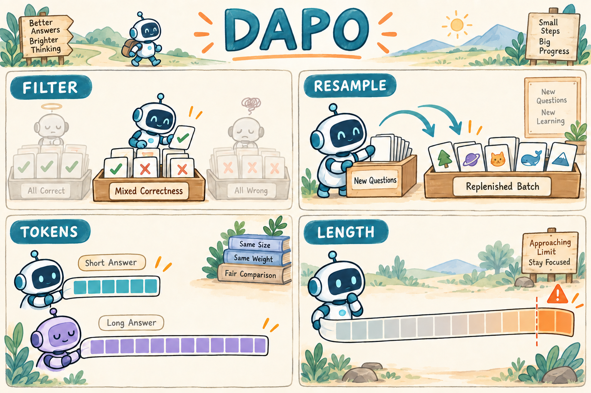

# 04｜DAPO：动态采样、裁剪与长度处理

<!-- NAV:TOP:BEGIN -->
[← 上一章：03 GRPO：同题采样与组内优势](../01-grpo/TUTORIAL.md) · [全书目录](../docs/CHAPTERS.md) · [本篇目录](../docs/families/01-policy-preference.md) · [下一章：05 GSPO：序列级比率与裁剪 →](../07-gspo/TUTORIAL.md)
<!-- NAV:TOP:END -->

[学习路线](../docs/BEGINNER_GUIDE.md) · [GRPO 前置知识](../01-grpo/TUTORIAL.md) · [运行说明](README.md)

设一个 batch 的每道题都生成四份答案，但所有题不是全对就是全错。GRPO 的组内优势全部为零。优化器并不缺少执行指令，它缺少可以比较的差异。DAPO 把注意力从单个公式扩展到采样、裁剪、长度和统计单位。[DAPO 论文](https://arxiv.org/abs/2503.14476)给出了这些机制的系统组合。



图里的过滤对象是整组回答。混合组中的错误回答仍留下，它们是比较所必需的负向信号。

## 为什么 GRPO 跑通之后，训练仍可能停滞

DAPO 全称 **Decoupled Clip and Dynamic sAmpling Policy Optimization**。名称点出分离上下裁剪范围和动态采样；论文还将 token 级聚合与过长回答处理放进完整训练系统。它延续 GRPO 的组相对信号，因此先确认三个词：rollout 是一次生成，group 是同题若干次生成，batch 是一次更新使用的一批组。

设本来准备更新 8 道题，每题 4 个回答。其中 6 道题全对或全错，真正有任务对比信号的只剩 2 组。程序虽然生成了 32 条回答，能提供组内差异的只有 8 条。如果不断这样训练，调高学习率并不会补出消失的比较信息。这说明训练质量既依赖目标公式，也依赖送进目标的数据。

另一个问题是策略变得越来越确定：低概率但有潜力的回答很难再被采到。再加上答案有长有短、到长度上限时可能被截掉结论，更新规则、采样与预算便互相影响。下面四项机制分别处理这些具体问题，并不意味着它们在所有任务都应一起打开。

## 先把四项变化拆开

先看各开关负责哪一环，再展开公式。这样后面出现 `clip_high` 或 `mask_truncated` 时，能知道它是在改优化、改数据，还是改哪些位置参与学习。

| 变化 | 针对的问题 | 本仓库位置 |
| --- | --- | --- |
| Clip-Higher | 正向概率提升过早进入裁剪区 | `clip_low`、`clip_high` |
| 动态采样 | 一个组所有奖励相同，优势无差异 | `AlgorithmBatchBuilder.build` 重采循环 |
| token 级聚合 | 不同长度回答的 token 权重不同 | `reduction="token"` |
| 长度处理 | 过长输出及不可靠截断目标 | `overlong_penalty`、`mask_truncated` |

这些开关相互独立。只设置 `loss_type="dapo"`，不会凭空得到重新采样和长度奖励。仓库完整机制走默认 verl 路径；TRL 对应入口是 loss 对照，不应称作完整 DAPO 流程。

## 关键公式：裁剪边界不必对称

先处理更新规则。GRPO 的 ratio 比较当前与 old 对同一 token 的概率，clip 的上下界原本可对称。DAPO 的 Clip-Higher 将提高正优势 token 概率的余地单独控制。优势仍来自整组奖励，没有换成一个新的 critic。

仍使用组内优势 $`A_i`$ 和 token ratio $`r_{i,t}`$。i 编号回答，t 编号 token；m 在有效生成位置取 1、其他位置取 0。因此分子累加训练位置的损失，分母只数这些位置：

```math
L_{DAPO}=-\frac{\sum_{i,t}m_{i,t}\min\left(r_{i,t}A_i,
\mathrm{clip}(r_{i,t},1-\epsilon_l,1+\epsilon_h)A_i\right)}{\sum_{i,t}m_{i,t}}.
```

当前 [配置](config.yaml)为 $`\epsilon_l=0.2,\epsilon_h=0.28`$。因此区间是 `[0.8,1.28]`，并不是 `[0.2,0.28]`。对正优势样本，允许比对称上界 1.2 更大的概率提升后才截住额外激励。负优势时依然要经过 `min` 判断，不能把越界率直接等同于零梯度比例。

分母是所有有效生成 token 数。两条回答分别长 2 和 8 时，每个 token 的权重都是 1/10；若用 GRPO 序列平均，短回答每 token 权重为 1/4，长回答为 1/16。前者让长回答整体贡献更多 token，后者使每个回答整体权重相同。没有一种归一化脱离任务就永远正确。

## 动态采样的真实顺序

即使裁剪设置合理，A 全为零时任务项仍没有梯度。因此第二步要先改善 batch 的组成。动态采样意味着发现一整组没有奖励差异后再补采其他题目，而不是只保留正确答案、删除错误答案。

仓库首先按原始任务奖励判断退化组：$`\max_iR_i=\min_iR_i`$ 则丢弃整组并尝试新题。保留组之后才施加长度 shaping，然后重新计算用于学习的组优势。

为什么不能反过来？若四个答案都错，只因长度不同就得到不同 shaping 分数，提前 shaping 会把“任务奖励无差异”伪装成可学习组。当前顺序明确区分任务成功差异和长度偏好。

教学伪代码：

```python
for attempt in range(max_resample_batches):
    groups = rollout(pending_questions)
    for group in groups:
        if all_task_rewards_equal(group):
            queue_another_question()
        else:
            add_length_penalty(group)
            keep(group)
    if no_pending_questions():
        break
```

注意本地上限为 8 次补采，达到上限可能只留下部分组；若一个都没有，跳过本次更新。它不会无限循环到理想 batch 大小。要一起看 `sampling/attempts`、`sampling/degenerate_groups` 和 `update/skipped`。

## 长度惩罚怎么手算

补采解决了组内比较，却没规定冗长回答应付出什么代价。下面把任务得分和长度 shaping（额外塑造奖励）分开计算：先承认原始正确性，再加一项随长度变化的偏好。这样才能看出分数降低来自答错还是来自过长。

设软上限 $`L_s`$、硬上限 $`L_h`$，长度为 T：

```math
P(T)=-\mathrm{clip}\left(\frac{T-L_s}{L_h-L_s},0,1\right),\qquad R'_i=R_i+P(T_i).
```

本章配置 $`L_s=192,L_h=256`$。长度 160 的惩罚是 0；224 是 -0.5；256 是 -1。若一个正确回答长 224，其 shaped reward 为 0.5，而不是原来的 1。

`mask_truncated: true` 还会把被标记为截断的回答的训练 mask 清零。这是另外一项操作：改变 reward 与决定是否让该回答参与 loss 不能混为一谈。原始奖励非退化，也不保证清 mask 后还有足够的有效梯度。

## 代码阅读路线与常见错误

四个机制现在分别落在采样、奖励、mask、loss 中。读代码也按这个顺序，而不是期待一个 `dapo_loss` 函数同时完成全部工作。

先看 [algorithms.py](../src/agentic_rl/verl_backend/algorithms.py) 的 `while active` 循环，再读 [losses.py](../src/agentic_rl/losses.py) 的 `overlong_penalty`，最后读 [verl losses.py](../src/agentic_rl/verl_backend/losses.py) 的 `reduce_tokens`。分布式时分母必须是全局 token 数，而不能每个 GPU 先各自平均再把结果当全局平均。

精简代码摘录：

```python
penalty = -((lengths - soft_limit) / (hard_limit - soft_limit)).clamp(0, 1)
numerator = (values * mask).sum()
denominator = config["global_tokens"]
```

第一行只依赖长度；第二、三行决定有效 token 的权重。若改了裁剪边界，奖励分布不一定直接改变；若改了补采策略，题目分布会改变。比较实验时要记录这些差别，不能把所有变化都归功于 loss。

## 动手实验与思考

比较两个设置前先固定预算单位。补采次数更多的一方可能只做同样数量 optimizer step，却消耗更多生成 token；若忽略这一点，很容易把算力投入误认为优化规则的优势。

```bash
.venv/bin/arl train 06-dapo/verl.yaml --smoke --verl-workers 2
```

这个 CPU 检查使用明确标注的 debug 奖励，不代表数学表现。真实实验可固定同一批题、种子和生成预算，先只比较是否动态补采，再比较 token/sequence reduction。记录“每秒完成多少有效 token 更新”和“用了多少生成 token”，否则反复补采的成本会被隐藏。

练习：原始奖励 `[0,0,0,0]`，长度 `[100,200,224,256]`，会不会因为长度不同而被保留？答案：不会。当前代码先判原始奖励退化，整组进入重采路径。

我的判断是把 DAPO 看成“训练数据供应与更新规则的联合设计”更有帮助：没有有效对比的 batch、被截断的回答、不同长度的权重都发生在 loss 周围。实际阅读应核对 [论文](https://arxiv.org/html/2503.14476v1)和本地三个代码位置，不能只搜一个函数名。本章尚无 GPU 能力验证。

## 新手自测

练习：保留下来的组中两条正确、两条错误，是否应该删掉错误的两条？不应该，它们提供负向比较信号。若所有候选都失败，动态采样能否保证最终找到成功？不能；本地有补采上限，奖励、题目难度或初始能力都可能让整批被跳过。若不会解释 token 平均与回答平均的区别，回看长度 2 与 8 的权重例子，再解释为什么长回答在两种方案中的总权重不同。

<!-- NAV:BOTTOM:BEGIN -->
[← 上一章：03 GRPO：同题采样与组内优势](../01-grpo/TUTORIAL.md) · [全书目录](../docs/CHAPTERS.md) · [本篇目录](../docs/families/01-policy-preference.md) · [下一章：05 GSPO：序列级比率与裁剪 →](../07-gspo/TUTORIAL.md)
<!-- NAV:BOTTOM:END -->
