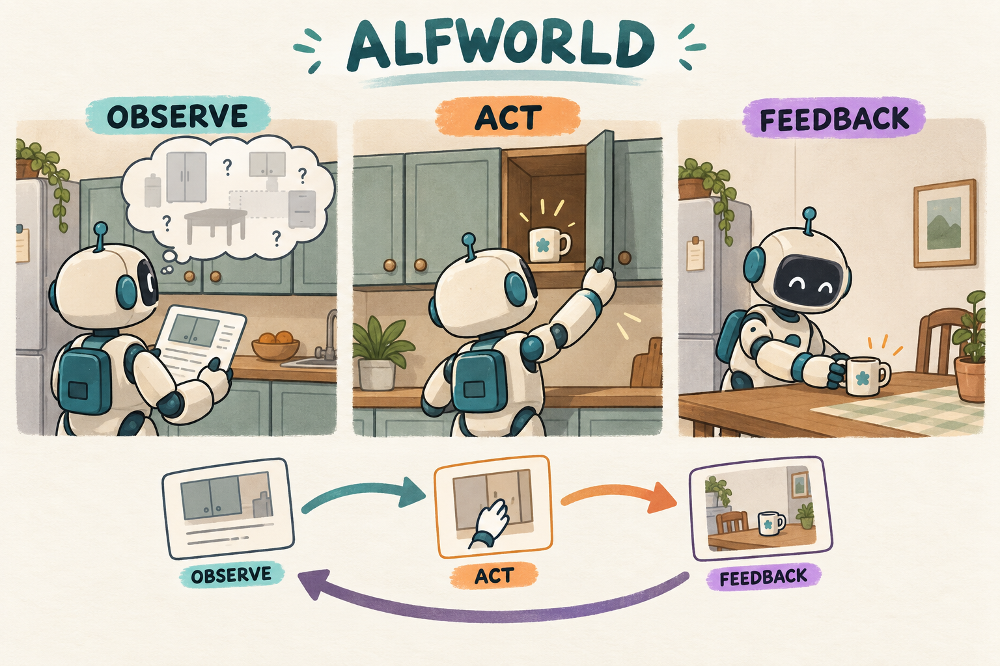

# ALFWorld｜文字也是传感器，行动会改变下一次看见的世界

[学习路线](../docs/BEGINNER_GUIDE.md) · [运行入口](README.md)

ALFWorld 是环境，不是一个独立的 loss 名称。模型收到家庭任务，例如把某物体放到指定容器，读取当前观察，生成动作，再看到环境变化。这一章用它学习如何把语言模型接入一个有状态的交互任务。



插图帮助理解家庭任务。本仓库实际训练连接的是文字接口与 TextWorld 游戏，并未由这幅图驱动视觉控制。[ALFWorld 论文](https://arxiv.org/abs/2010.03768)讨论文本与具身环境的关联；不要把文字环境的成功率当真实机器人成功率。

## 从 MDP 到部分可观测历史

环境真实状态 s 包括物体位置、容器状态等；模型通常只看到观察 o。打开柜子之前，不一定知道里面有什么。因此策略依据的是历史 $h_k=(o_0,a_0,o_1,\ldots,o_k)$：

$$a_k\sim\pi_\theta(\cdot\mid h_k),\quad s_{k+1}\sim P(\cdot\mid s_k,a_k),\quad o_{k+1}\sim O(\cdot\mid s_{k+1}).$$

MDP/POMDP 的基础定义见 [preliminary](../preliminary/FOUNDATIONS.md)。本章把一个动作编码成一段文字，例如 `<action>open cabinet 1</action>`，不是直接输出电机控制量。

## 一个回合有哪些停止方式

| 情况 | 含义 | 是否能当作成功 |
| --- | --- | --- |
| 环境 `won=True` | 环境任务判定成功 | 可以 |
| 环境 `done=True` 但未 won | 回合结束但不一定成功 | 不可以 |
| 达到 `max_turns` | 学习程序的步数预算耗尽 | 不可以 |
| 达到上下文限制 | 模型再无足够输入空间 | 不可以 |

本地每步 reward 由环境 `won` 转为 0/1，轨迹保存获得的成功信号。模型自己写“任务完成”不能替代环境验证。

## 本章的 GRPO 更新

从同一任务初始化 G 份独立环境，得到完整轨迹奖励 $R_i$。计算 $A_i=(R_i-\bar R)/(\sigma_R+10^{-4})$，动作生成 token 共用轨迹优势：

$$L=-\frac1B\sum_i\frac1{T_i}\sum_tm_{i,t}
\min(r_{i,t}A_i,\operatorname{clip}(r_{i,t},1-\epsilon_l,1+\epsilon_h)A_i).$$

每轮环境观察和 admissible actions 是输入条件，mask=0；模型生成的动作文本 mask=1。环境不给梯度，训练只重新计算已生成动作文字的概率。

例如四条轨迹成功情况 `[1,0,0,0]`，成功轨迹优势约 1.7317，其余约 -0.5772。成功轨迹里每个动作都收到正向信号，哪怕包含多余动作；失败轨迹里也可能有正确的早期步骤。这说明终局广播的信用分配局限，而不是证明每一步都真正造成了结果。

## 代码阅读路线

[environments.py](../src/agentic_rl/environments.py) 的 `make_household` 根据配置选择真实 ALFWorld 或显式命名的 toy fixture。`ALFWorld.reset/step` 转接 [alfworld_env.py](../src/agentic_rl/alfworld_env.py)；[alfworld_data.py](../src/agentic_rl/alfworld_data.py)负责游戏清单。正常配置使用真实游戏文件。

在 [rollout.py](../src/agentic_rl/rollout.py) 中追踪：

```python
parsed_action = extract_tag(text, "action")
action = canonical_action(parsed_action or "invalid action")
observation, reward, done = env.step(action)
```

这是核心摘录，变量名 reward 为便于阅读展开。格式解析失败不会凭空变成一个正确动作；它被明确记录。函数的 `finally` 关闭本条轨迹的环境，避免并发任务互相污染。

并行采样中不能让多条候选轨迹轮流操作同一个环境实例。否则第 2 个候选的起点已经被第 1 个候选改变，同组比较不再公平。即使所有 token mask 都正确，也无法弥补环境起点不一致。

## 从小检查走向实验

```bash
.venv/bin/arl train 08-alfworld/verl.yaml --smoke --verl-workers 2
```

`--smoke` 可使用显式 toy 环境验证快速路径；真实 ALFWorld 的 reset/step 已有独立检查证据，见 [验证范围](../docs/VALIDATION.md)。不要把 toy 的“拿苹果”结果报告成 ALFWorld benchmark。

真实实验要看合法动作率、任务成功率、平均轮数以及失败的停止原因。评估应使用 `eval-unseen` 等隔离游戏，而不是只改训练游戏的采样种子。当前配置在 [config.yaml](config.yaml) 中明确给出训练和评估清单。

练习：同一条任务，模型先执行无效动作三次再成功，终局 GRPO 会自动惩罚前三次吗？答案：不会。除非另定义过程/长度奖励或更细信用分配，整个成功轨迹仍共享优势。

我的判断：这一章最值得建立的习惯是把环境状态与模型上下文分别记账。后续 [AgentOPSD](../09-AgentOPSD/TUTORIAL.md) 改轮次信用，[TEMPO](../09-tempo/TUTORIAL.md) 改分段采样；它们都建立在状态隔离、观察对齐与正确终局判断之上。
