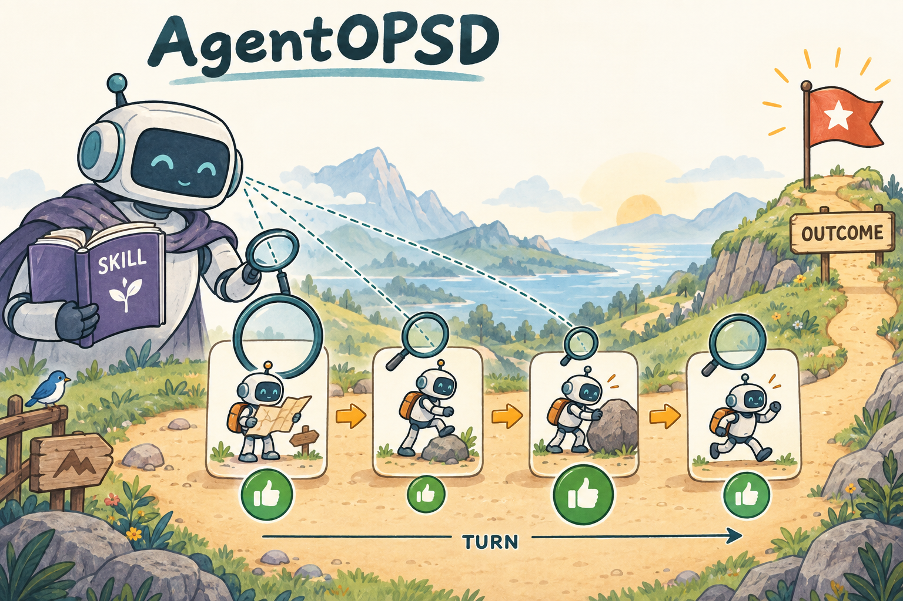

# AgentOPSD｜整段成功了，但每一轮不该分到完全一样的信用

[学习路线](../docs/BEGINNER_GUIDE.md) · [ALFWorld](../08-alfworld/TUTORIAL.md) · [运行入口](README.md)

一个家庭任务用了十轮才成功，决定成败的可能只有“发现物体在另一个房间”那一轮。GRPO 把整段优势广播给所有轮次，无法表达这种差别。AgentOPSD 增加一个带 Skill 的自教师视角，给每轮提供证据，再有界地重新分配终局优势。



图中大小不同的绿色标记表示重加权；不能据此认定某一步在真实因果意义上必然最重要。方法源自 [AgentOPSD 论文](https://arxiv.org/html/2608.05987v1)。本章按本地代码逐步解释计算，不复用论文图或原文段落。

## 自教师和 OPSD 的区别

本章的 Teacher 视角使用**当前批次、更新前的同一策略**，额外读取训练期 Skill；复评分数停止梯度。它不是 [OPSD 章](../04-opsd/TUTORIAL.md) 从第 0 步一直冻结到最后的另一套参数，也不是一个预测 value 的 critic。

Student 正常与环境交互；Teacher 只复评这些实际动作 token。无需额外生成一套反事实轨迹。部署评估时 Student 不读取训练期 Skill。

## 第一步：把 token gap 累计为轮次证据

对第 k 轮生成 token 集合 $`\mathcal T_k`$：

```math
e_k=\sum_{t\in\mathcal T_k}\left(\ell^T_t-\ell^{old}_t\right).
```

这里使用求和，不是每轮平均。教师在 Skill 条件下更支持这轮实际生成内容时，e 通常偏正；反之偏负。它是两份条件分布的对比，不是环境给出的真实成功概率。

## 第二步：递推一个有记忆的 belief

以同题组平均成功率为初始 $`b_0`$，先夹到 $`(\varepsilon,1-\varepsilon)`$，避免取无穷 logit。设累计证据 $`u_0=0`$：

```math
u_k=\gamma u_{k-1}+e_k,\qquad
b_k=\sigma\left(\log\frac{b_0}{1-b_0}+u_k\right),\quad \Delta b_k=b_k-b_{k-1}.
```

本地默认 $`\gamma=0.95`$。它是证据记忆衰减，不是这里的环境奖励折扣。即使某轮 e=0，旧证据也可能因为衰减而改变 belief；因此“本轮没新证据”不必意味着 $`\Delta b=0`$。

例子：$`b_0=0.5,e_1=\log3\approx1.0986`$，则 $`b_1=0.75`$，变化为 0.25。若下一轮 $`e_2=0`$，则 $`u_2\approx1.0437,b_2\approx0.7396`$，变化约 -0.0104。这种递推显式依赖历史。

## 第三步：改变力度，保持终局方向

设轨迹的 GRPO 优势为 $`A`$。先按结果方向定义 $`c_k=\mathrm{sign}(A)\Delta b_k`$，对这条轨迹的轮次 c 做标准化得 $`z_k`$，再构造：

```math
w_k=\mathrm{clip}(1+\rho z_k,1-\rho,1+\rho),
```

```math
\widetilde A_k=A[(1-\lambda)+\lambda w_k].
```

本地 $`\rho=0.2,\lambda=0.5`$，所以乘数落在 `[0.9,1.1]`。若 A=2，每轮优势在 `[1.8,2.2]`；若 A=−2，则在 `[−2.2,−1.8]`。A=0 的退化组仍为零，不能被 Skill 凭空变成正负监督。

**Loss 仍是裁剪 policy loss**，只是把每个 token 的 $`A_i`$ 替换为所属轮次的 $`\widetilde A_{i,k(t)}`$：

```math
L=-\frac1B\sum_i\frac1{T_i}\sum_tm_{i,t}
\min(r_{i,t}\widetilde A_{i,k(t)},\mathrm{clip}(r_{i,t},1-\epsilon_l,1+\epsilon_h)\widetilde A_{i,k(t)}).
```

## 从代码到数组

[algorithms.py](../src/agentic_rl/verl_backend/algorithms.py) 先调用 `teacher_logprobs(..., "skill")`，按 `turn_spans` 汇总 gap，再调用 [agentopsd.py](../src/agentic_rl/agentopsd.py) 的 `reshape_turn_advantages`。该函数返回每轮 evidence、belief、credit、weight 和 advantage，便于逐项检查。

下面是教学伪代码：

```python
for turn in turns:
    evidence = sum(teacher_logp[turn] - behavior_logp[turn])
    memory = gamma * memory + evidence
    belief = sigmoid(initial_log_odds + memory)
    credits.append(sign(outcome_advantage) * (belief - previous_belief))
    previous_belief = belief
turn_advantages = bounded_rescale(outcome_advantage, credits)
```

实际函数还处理数值稳定、零方差与完整诊断。旧概率长度比完整 token 少一位，所以 `turn_spans` 用于概率数组时会减一；忽略这个 shift 会把证据挪到错误轮次。

## 动手与误区

```bash
.venv/bin/arl train 09-AgentOPSD/verl.yaml --smoke --verl-workers 2
```

练习：一条失败轨迹 A<0，某轮看起来很有帮助，是否应该把这轮优势改成正数？按本地有界重加权不会。它只改变负向信号的大小，保持整段的结果方向。若你设计允许翻转符号的更新，那已经是另一种信用分配规则。

检查 `turn_evidence` 和 `turn_advantages`，并确认同一轮 token 共用同一个优势、observation 不训练、Student 评估不带 Skill。论文性能数字不属于本地结果；目前本章仅有机制与 CPU 运行证据。

我的判断：把这个方法当作“额外信息对结果监督的温和修正”比当作“知道每步真贡献的裁判”更稳妥。单轮 gap 不是因果证据，递推与边界限制是在控制这种辅助信号对更新的影响。
