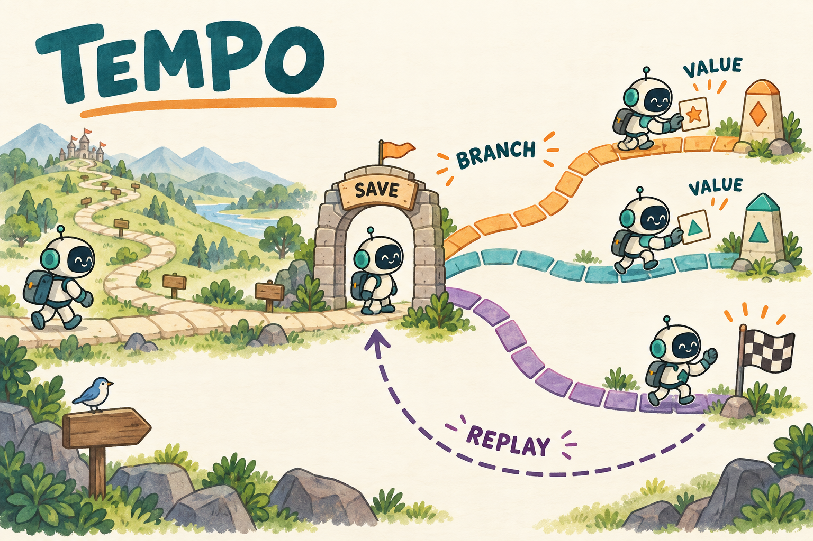

# TEMPO｜不必每次走到结局，先学会评价下一段路

> **定位：进阶实现研读。** 官方博客正文在审阅时未能稳定读取；本章公式与数值以**本地学习实现**为准，不补写未经核对的缩写全称或论文效果数字。新手可先完成 GRPO 与 ALFWorld，再读本章。

[学习路线](../docs/LEARNING_PATH.md) · [PPO/GAE（价值与 bootstrap）](../001-ppo/TUTORIAL.md) · [ALFWorld 环境](../08-alfworld/TUTORIAL.md) · [运行入口](README.md)

**本章默认教学后端：verl（`verl.yaml`）；native 与 verl 的 replay 语义不完全等价。**

**相对 GRPO / ALFWorld，改变了什么？**

| 组件 | GRPO 整条 rollout | TEMPO（本地实现） |
| --- | --- | --- |
| 采样单位 | 一次走到终局 | macro-step 短分支 |
| 优势 | 终局组统计 | 段内奖励 + 段末 bootstrap |
| Critic | 无学习式 critic | **生成式**数值字符串 + 外部解析 |
| 起点 | 总是从 reset | 可从保存的**非终局**边界恢复 |
| 风险 | 信用粗 | 估值噪声、状态未真正恢复、前缀分布偏移 |

## 恢复旧状态 ≠ 用旧数据更新

| 概念 | 在做什么 | 不是什么 |
| --- | --- | --- |
| 状态恢复 replay | reset 环境并**重放动作**，核对观察后从边界继续采**新**段 | 把旧对话文本塞回模型就结束 |
| 用旧数据更新 | 直接用历史轨迹算 loss | 本章 replay 主路径不是这个 |
| 旧前缀进 loss | 否；历史只作条件 | 新段模型 token 才训练 |
| 前缀权重 w_prefix | 对历史 log-ratio 停止梯度后加权新段 | 不改变环境恢复流程 |

长任务可能要交互几十轮才成功。每个候选都从头走到结尾，既昂贵，也很难给早期决策信号。TEMPO 把若干轮交互合成一个 macro-step，在段末估计未来价值，并把部分非终局边界保存为以后继续采样的起点。



图中 REPLAY 表示恢复先前保存的非终局状态；并不表示可以从成功终局继续行动。方法出处是 [Dots 团队 TEMPO 博客](https://studio.dots.ai/dots/tempo-blog.html)。

## 为什么先切短轨迹，再学习估计未来

先想象一条任务需要 40 轮，直到最后才知道成败。从起点每次重做 40 轮可以获得真实终局反馈，却很昂贵。若先走 5 轮就停，我们省了交互，但失去了最终评分。TEMPO 在本章的学习主线就是补这个缺口：用已经得到的段内奖励，加上对剩余未来的估计。

**Macro-step（宏步）**是将连续若干轮当作一个训练片段，**bootstrap（自举）**是用估计的未来价值补全尚未结束的回报，**replay（重放）**是从保存的非终局边界恢复后继续。它们分别改变采样单位、目标值和起点来源。TEMPO 在这里作为方法名称使用；由于作者博客正文未能稳定读取，本章不补写未经核实的英文缩写展开或作者效果结论。

一个关键区别是“存过的数据再训练”和“恢复过去状态重新采新段”。本章 replay 主要讨论后者：例如恢复到已经拿到苹果、尚未走到冰箱的状态，今天的策略从这里生成新动作。旧前缀提供条件，新段才是当前要训练的行为。这也引出后面的状态恢复与概率修正问题。

## 一段路的回报由两部分组成

先给短分支打一个可比较的分数，才知道 actor 应鼓励哪条分支。本节统一用 n 表示分支数量，用 $`\bar q`$ 表示它们的平均目标，避免一个符号同时指数量与价值。

从相同起点分出 n 条短轨迹。第 i 条段内得到奖励 $`r_i`$，若还没结束，估计段末未来价值 $`v_i`$；d=1 表示真实终局，此时未来价值为零：

```math
q_i=r_i+(1-d_i)v_i,\qquad \bar q=\frac1n\sum_iq_i,\qquad A_i=q_i-\bar q.
```

这里 $`\bar q`$ 是给共享起点的 TD（Temporal Difference，时序差分）目标：拿下一段新获得的信息修正起点估值。本地采用不折扣的段内累计/任务成功设定，不额外乘 $`\gamma^H`$；H 表示段长度。不要把这一简式当成所有奖励定义下的通用宏步 return。

手算：三个分支的段内奖励 `[0,0,1]`，终点 value `[0.2,0.6,0.9]`，第三条已成功终局。有效 return 是 `[0.2,0.6,1.0]`，而不是 `[0.2,0.6,1.9]`；平均目标为 0.6，actor 优势为 `[-0.4,0,0.4]`。

## 生成式 critic 怎样训练

Actor 的目标已经依赖未来估计，接下来必须说明谁提供这个估计、又从哪里学会。这里的 critic 是一种提示角色：模型生成一个数值字符串，再用外部程序解析。字符串采样不可直接求导，所以它的训练方式不同于 PPO 里连续输出 value 的回归头。

本章不是在模型顶上加一个线性 value head。**同一语言模型**以 critic prompt 生成 `<value>0到1之间的数</value>`，将它解析为成功概率估计。当前起点的多个 critic 回答，对照上面得到的平均目标打分：

```math
r_j^V=-|v_j-\bar q|,\qquad A_j^V=r_j^V-\overline{r^V}.
```

例如目标为 0.6，两个生成估值为 0.5 与 0.1，奖励为 -0.1 与 -0.5，中心化优势为 +0.2 与 -0.2。随后对生成这些估值的 **token 概率**做裁剪 policy gradient；并不是通过解析出的浮点数直接反传 MSE（均方误差）。

最终 batch 合并 actor 轨迹与 critic 生成，沿用序列平均 clipped loss。B 是样本数，T 是有效生成长度，m 是训练位置 mask；下面带两个下标的 r 是当前/采样概率比，不是前面单下标的段内奖励。A 使用相应 actor 或 critic 优势，epsilon-l/h 是裁剪幅度：

```math
L=-\frac1B\sum_i\frac1{T_i}\sum_tm_{i,t}
\min(r_{i,t}A_{i,t},\mathrm{clip}(r_{i,t},1-\epsilon_l,1+\epsilon_h)A_{i,t}).
```

actor 与 critic 是两种 prompt 角色，共享参数。`parse_value` 要求恰好一个合法标签；解析失败明确计数，critic 训练奖励取 -1。段末所有估值都解析失败时，本地以 0.5 fallback bootstrap，属于教学实现选择，需要监测而不是当作可靠估值。

## warmup、保存、重放各解决什么

如果未来估值和策略都刚初始化，它们可能互相强化错误。因而先要建立起始监督，再讨论怎样复用已经到达的状态。Warmup 是预热阶段，replay 是恢复边界继续探索，两者解决不同问题。

warmup 先用完整 episode 得到回报，为 critic 提供起始训练信号；随后才改用短分支与 bootstrap。没有 warmup 的随机估值可能主要是在用噪声指导另一段噪声。

`ReplayStore` 保存完整 token 前缀、动作、环境观察和行为概率。恢复时 reset 环境、重放动作，并逐条比较观察是否相同。仅把旧文本塞回模型，并不能恢复真实环境状态。

历史前缀只作为条件，不重复进入本次 loss。只有新段的模型 token 训练；观察继续 mask=0。context/turn limit 耗尽的轨迹不再放回可继续采样池。

## verl 路径的前缀分布修正

状态恢复正确之后，还有一个统计问题：旧策略经常访问的前缀，今天的策略未必经常访问。因此从旧池子选起点并不自然等于从当前策略采样。下面用历史行动的概率比调整其权重；它不会改变真实环境恢复流程。

旧前缀由过去策略生成，而今天的策略已变化。verl 扩展保存历史 assistant token 的行为概率并复评：

```math
w_{prefix}=\exp\left(\sum_{t\in\text{历史模型 token}}
[\ell_t^{current}-\ell_t^{behavior}]\right).
```

该权重停止梯度后乘到新段 surrogate。用户与环境 token 排除；新段自身的 ratio 仍由对应 token 的 current/old 概率计算。若前缀 log-ratio 总和为 log2，则权重为 2。

`prefix_is_clip` 可显式限制权重，降低极端数值，但会改变估计量。原生对照路径没有这项修正；不能把 native 和 verl 的重放视为完全等价。

## 代码阅读与练习

现在按“分支目标 → critic 评分 → 状态恢复 → 前缀权重”的因果顺序读函数。每个环节都能用上面三个分支的例子单独检查，避免一看到总 loss 就跳过估值来源。

读 [tempo.py](../src/agentic_rl/tempo.py) 的 `signals`、`parse_value`、`critic_rollouts`，再读 [verl tempo.py](../src/agentic_rl/verl_backend/tempo.py) 的 `ReplayStore`、`prefix_correction`、`tempo_batch`，最后回看 [rollout.py](../src/agentic_rl/rollout.py) 的恢复分支。这条路线把数学信号、模型调用和环境状态分开。

```bash
.venv/bin/arl train 09-tempo/verl.yaml --smoke --verl-workers 2
```

本章 smoke 跑三步，覆盖 warmup、macro-step 与重放。看 `tempo/replayed`、`tempo/state_store_size`、`tempo/critic_parse_failures`、`tempo/prefix_is_weight`，不能只看程序退出码。

练习：终局分支的 critic 恰好输出 0.9，是否加到已得到的成功奖励 1 上？答案：不加。未来已不存在，必须用 0。多算这项会人为偏好已结束的分支。

我的判断：TEMPO 的核心风险是“用不准的未来估值放大采样偏好”。短 macro-step 节省交互，但更依赖 critic；长 macro-step 更接近实际终局，又更昂贵。应在相同环境交互预算下比较，而不是只统一 optimizer 步数。本地尚未复现长任务正式效果或 GPU 训练。

## 新手自测

练习：critic 生成 `0.5`，为什么不直接对这个 Python 浮点数做反传？因为解析已经脱离可导模型输出，学习对象是生成数值字符串的 token 概率。保存前缀后是否能只恢复文本、不恢复环境？不能，这会让同一上下文描述一个并不存在的状态。若所有估值都解析失败而使用 0.5，指标应先看解析率，不应把稳定的中间值误认为准确的 critic。
