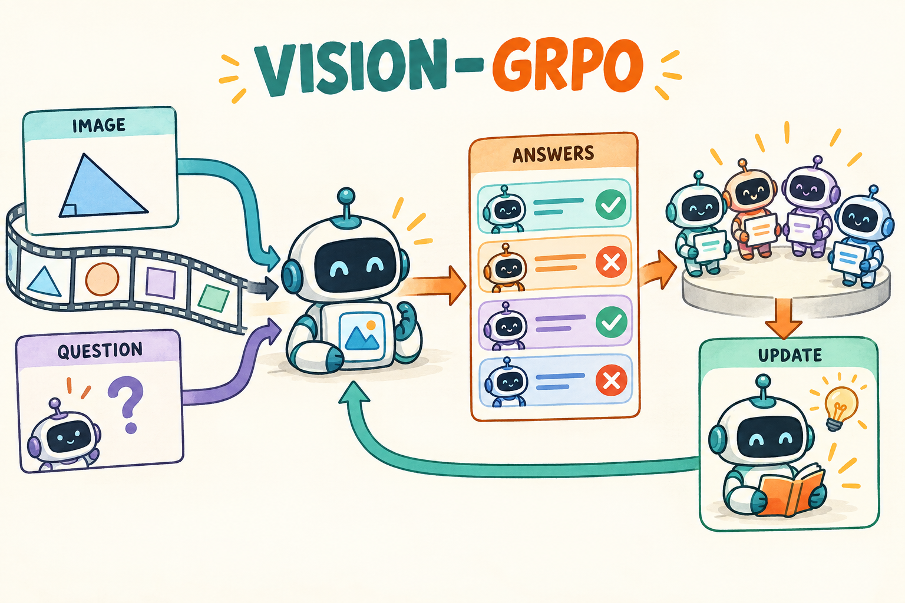

# Vision-GRPO｜把图像变成条件，仍然对模型生成的答案学习

[学习路线](../docs/BEGINNER_GUIDE.md) · [GRPO 基础](../01-grpo/TUTORIAL.md) · [运行入口](README.md)

一道几何题可能只在图片中标注角度。如果代码只给模型传了文件名而没读像素，loss 再正常也没有训练看图解题。Vision-GRPO 的关键变化是策略多了图像条件，组内奖励与 policy gradient 的主体仍可沿用 GRPO。



图中四个回答来自同一策略的多次采样，不表示训练四套不同权重。这里的图像问答训练也不等于 VLA 机器人控制：后者输出的是可执行动作或动作序列，还需要环境回报与动作表示。

## 模型实际上收到了什么

一个视觉语言模型通常包含视觉编码器、将视觉特征接入语言模型的投影/融合模块，以及生成文字的语言模型。具体结构依模型而异，不能把 LLaVA 和 Qwen-VL 的图像 token 规则混用。接口原理见 [LLaVA 官方模型文档](https://huggingface.co/docs/transformers/model_doc/llava)。

条件策略写成：

```math
\pi_\theta(y_t\mid x,I,y_{1:t-1}),
```

其中 I 是图像像素经过 processor 后得到的视觉输入，不是图片路径字符串。Processor 还可能输出图像网格、尺寸等元数据，它们必须随样本一起传递。

## loss 怎样依赖图像

对同一 $`(x,I)`$ 生成 G 个答案，校验后得到组优势 $`A_i`$。令：

```math
r_{i,t}=\exp\big[\log\pi_\theta(y_{i,t}\mid x,I,y_{i,1:t-1})-\log\pi_{old}(y_{i,t}\mid x,I,y_{i,1:t-1})\big].
```

本地使用序列归一化裁剪目标：

```math
L=-\frac1B\sum_i\frac1{T_i}\sum_tm_{i,t}
\min(r_{i,t}A_i,\mathrm{clip}(r_{i,t},1-\epsilon_l,1+\epsilon_h)A_i).
```

生成文字有直接 token loss，图像作为条件影响这些文字概率。若视觉编码器或投影层可训练，梯度就能经过这条依赖路径到达它们。图像位置 mask=0 并不意味着视觉分支没有梯度；是否冻结参数是另一件事。

例如同一道文字题分别配一个锐角图和钝角图，正确答案应随图片变化。最基本检查是固定文字与待评分答案，只替换图片，观察答案 logprob 是否改变。若完全不变，可能图像没有传进模型，也可能当前微型模型/构造样例不敏感；需要继续检查输入与特征，不能直接宣称模型看懂了图。

## 真实代码的四个检查点

1. [models.py](../src/agentic_rl/models.py) 的 `VisionPolicy.prompt` 打开真实图片并调用 processor；tiny 路径使用真实小型 LLaVA 结构和 16×16 像素输入。
2. `single_rollout` 在 [rollout.py](../src/agentic_rl/rollout.py) 中把 `extras` 保存进 `Sample`。
3. [protocol.py](../src/agentic_rl/verl_backend/protocol.py) 将多模态 extras 随 DataProto 分发；不能只传 `input_ids`。
4. [actor.py](../src/agentic_rl/verl_backend/actor.py) 的 `forward_data` 在多模态路径重新带入相同像素与元数据打分。

关键代码摘录：

```python
inputs = self.processor(text=[rendered], images=[picture], return_tensors="pt").to(self.device)
return inputs.pop("input_ids")[0].tolist(), {
    k: v for k, v in inputs.items() if k != "attention_mask"
}
```

返回的第二部分并不是可有可无的附件，它是重现条件概率所需的模型输入。图像与回答错配，就相当于用另一道题的条件去解释这次行为概率。

## 图像占位 token 为什么要特别处理

某些模型用特殊 image token 在输入中标记视觉位置。这些符号属于输入协议，不应由随机输出阶段随意生成。仓库在生成与评分两侧排除相同的视觉专用输出 token，并对非训练位置的 logprob 先置零，再参与 mask 聚合。

原因是 `0 × (-inf)` 在浮点计算中可能产生 NaN。只说“有 mask，最后乘零就好了”并不够，需要保证被屏蔽位置的数值运算也安全。

## 自己检查与评估

```bash
.venv/bin/arl train 09-vision-grpo/verl.yaml --smoke --verl-workers 2
```

CPU smoke 使用随机微型视觉模型，只检查像素影响、梯度与保存重载。正常配置指向 Qwen2.5-VL，数据是 [GeoQA](https://huggingface.co/datasets/hz2475/geoQA)；模型规模与数据来源见 [config.yaml](config.yaml) 和 [DATA.md](../docs/DATA.md)。本章尚未完成真实 GPU VLM 训练。

练习：文本和图片都相同，只在 DataProto 传输时漏掉 `pixel_values`，保存下来的 old logprob 还能与训练时 current logprob 比吗？答案：不能，它们对应的条件分布不同。

我的判断：视觉 RL 的首要问题常是“模型确实获得了视觉条件吗”，而不是先换一个更复杂的 loss。通过图像替换、视觉分支梯度与 checkpoint 重载三个检查后，再讨论准确率提升才有依据。
