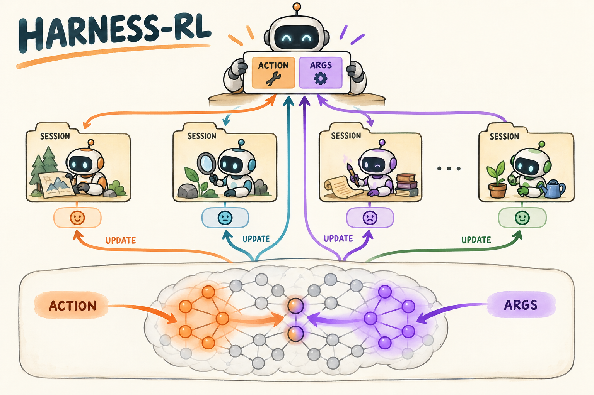

# Harness-RL｜既要选对工具，也要把参数写对，梯度该交给谁

[学习路线](../docs/BEGINNER_GUIDE.md) · [工具交互基础](../05-retool/TUTORIAL.md) · [运行入口](README.md)

一个中央 Agent 输出 `{"action":"Calculate","args":"print(6*3)"}`。选 Calculate 是一种决定，写出正确程序是另一种能力。Harness-RL 既记录复杂调用怎样连接，也考虑 action 与 args 两类训练信号在共享参数中的影响。[原论文](https://arxiv.org/html/2608.29641v1)提出接口轨迹构造与 CAPO。



插图表示局部结构。仓库实现 central-only：检索和计算 worker 固定，不进行全部子 Agent 联合训练。它也不是常见的语言模型评测工具 lm-evaluation-harness。

## 为什么不能把所有聊天文字简单拼起来

一次任务可能包含中央对话、多个子任务 session、上下文摘要与重写。相同文本出现在两个 session 中，不表示同一个模型状态；相同前缀被重放，也不应该变成重复生成的训练目标。

`CallRecord` 给每次真实模型调用记录 rollout/session/call ID、parent、精确输入输出 token、采样 logprob 和两类字段 mask。`prefix_trees` 按 `(rollout_id, session_id)` 建 token trie，公共前缀可共享节点，但每次实际输出仍保留独立调用记录。

例如 session A 和 B 都以“开始任务”开头：两棵树不能合并。A 内重写上下文会形成分支；同样内容真的生成两次，也不能仅因文本相同就删掉一次奖励记录。

## Token 分区与参数分区不是一回事

对上面的 JSON，`Calculate` 对应 action token，`print(6*3)` 对应 args token。键名、标点不自动属于任意一类。Tokenizer 的一个 token 可能跨越引号与字段边界，`structured_masks` 按字符覆盖处理，action 优先，保证两种 **token mask** 不重叠。

**参数 mask** 则可以重叠：某些 MLP 单元对两类 token 都有较强激活。共享参数子集接收两项梯度之和；不在任一选区的参数冻结。

## 先看优势，再看两个 loss

本地终局奖励是有效 Summary artifact 指示乘答案 token-F1。同题轨迹的终局奖励先组内标准化为 $A_i^{out}$。对相同调用轮次的候选，过程奖励再标准化为 $A_{i,k}^{proc}$：

$$A_{i,k}=A_i^{out}+c_pA_{i,k}^{proc}.$$

当前过程奖励标记成功检索/数值调用，不是对推理质量的全能裁判。$c_p$ 默认 0.1。只有一条候选的轮次、或过程奖励全相同，过程标准化项为零。

令 $m^a,m^g$ 分别为 action 与 args mask，定义共同的 clipped surrogate $C_{i,t}=\min(rA,\operatorname{clip}(r)A)$：

$$L_a=-\frac{\sum m^aC}{\sum m^a},\qquad L_g=-\frac{\sum m^gC}{\sum m^g}.$$

两类各自用全局有效字段 token 数作分母。然后 CAPO 将梯度投影：

$$g=M_a\odot\nabla_\theta L_a+M_g\odot\nabla_\theta L_g.$$

这是先分别反传、再按参数选择，不是把 action/args 两个 loss 相加后随便屏蔽一次。

## 一个四参数手算例子

设 $g_a=[1,2,3,4],g_g=[10,20,30,40]$，$M_a=[1,1,0,0]$，$M_g=[0,1,1,0]$，则合成梯度：

$$g=[1,22,30,0].$$

第二个参数属于交集，收到 2+20；第四个参数两个 mask 都为零，因此不更新。Token mask 不重叠与这里的参数交集没有冲突。

## 选区来自哪里，代码怎样执行

[harness.py](../src/agentic_rl/harness.py) 的 `CAPORouter` 在成功 probing 轨迹上分别统计两类 token 的 MLP 正激活，按比例选择单元。当前结构选择 MLP 展开/投影单元，对外未选参数冻结，不支持直接叠加任意 LoRA 分区。

`capture → structured_masks → prefix_trees → assign_advantages` 是记录与信用路线。[verl capo.py](../src/agentic_rl/verl_backend/capo.py) 的 `PartitionBank` 将选择映射到参数布局；[actor.py](../src/agentic_rl/verl_backend/actor.py) 分别执行 action、args 反传并合并投影结果。FSDP 分片场景需要使用对应 shard 的 mask，不能拿完整参数索引直接切本地 shard。

教学伪代码：

```python
ga = gradient(action_loss)
gg = gradient(args_loss)
combined = action_parameter_mask * ga + args_parameter_mask * gg
optimizer.step_with(combined)
```

真实实现还要保证未选参数没有来自旧优化器动量或 weight decay 的更新。测试应比较实际参数差，而不仅是 `.grad` 是否为零。

## 验证与限制

```bash
.venv/bin/arl train 12-harness-rl/verl.yaml --smoke --verl-workers 2
```

随机模型可能连合法 JSON 都生成不了，这时无有效字段梯度是合理结果。已有独立 FSDP 机制检查明确验证非零选区更新、选区外不变和跨 rank 一致；这比把 smoke 退出成功当成学会调用更有说服力，见 [验证记录](../docs/VALIDATION.md)。

默认 probing 数据是明确标记的人工构造、工具验证种子；正式训练应从目标策略的成功轨迹收集 probing 数据。人工种子不能冒充模型已经成功的历史。

练习：两项参数 mask 都包含某参数，是保留其中一项还是相加？答案：相加。若想完全隔离参数，那是另一种选区策略。

我的判断：Harness-RL 最有价值的代码检查是把“一次调用、一段目标 token、一份结果、一块参数”串起来。任何一环归属错了，训练信号都可能流向错误对象。本地未验证 joint multi-agent、GPU CAPO 或论文 benchmark 效果。
