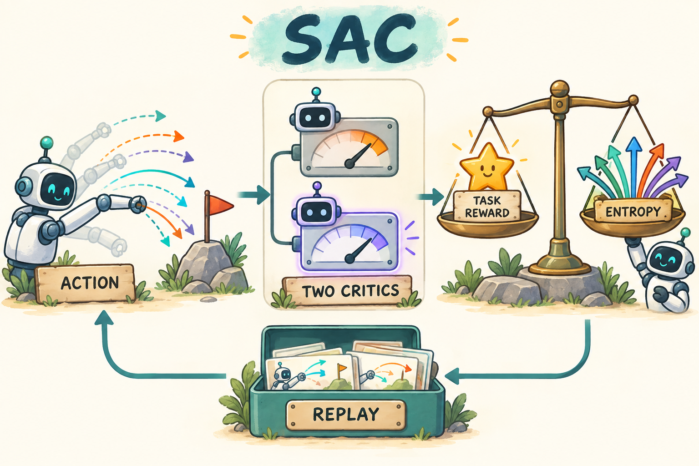

# SAC：一边提高回报，一边保留可用的动作选择

[学习路线](../docs/LEARNING_PATH.md) · [MSE 与价值回归](../preliminary/TUTORIAL.md) · [连续动作密度（FOUNDATIONS §5）](../preliminary/FOUNDATIONS.md#foundations-map) · [运行说明](README.md)

**本章默认教学入口：PyTorch embodied（FetchReach）。** 不需要先读完 PPO/GRPO；但应先分清：critic 用 **MSE/回归** 拟合 Q 目标，actor 用 **对动作可导的 Q** 回传，而不是语言模型的 logprob 比率。

**相对语言模型 GRPO / PPO，本分支改变了什么？**

| 组件 | LLM 策略学习 | SAC（连续控制） |
| --- | --- | --- |
| 动作 | 离散 token | 连续向量（本仓 FetchReach 为 4 维） |
| 策略输出 | logits → 概率 | 高斯密度 + tanh 挤压 |
| 优势/反馈 | 终局分或 critic+GAE | replay 中的 (s,a,r,s',d) |
| Critic | V 或组内统计 | **Q(s,a)**；目标用 bootstrap + 熵 |
| 可导路径 | 重新打分已生成 token | **冻结 critic 权重，保留 ∂Q/∂a** |
| 前置数学 | CE / logprob / ratio | **MSE**、重参数化、tanh Jacobian |

**先走一条 transition（再谈网络）：** 环境给出 `s, a, r, s', d`。例如 `s`=末端位置，`a`=`[0.1,-0.05,0,0]`，`r`=-1（未到目标），`s'`=执行后位置，`d`=False。这条记录进 replay；critic 用 MSE 把 `Q(s,a)` 拉向 `y`；actor 在**同一个 s** 上重新采样 `ã`，不是回放里的旧 `a`。

先读 [MDP、Q 值与连续动作密度](../preliminary/FOUNDATIONS.md)，再读这一章。SAC（Soft Actor-Critic）是连续控制的经典 off-policy 方法；这里采用后续常见的双 Q、无独立 V 网络、自动温度版本。它为机器人 RL 提供基础，不是一个视觉语言动作模型。[原始论文](https://arxiv.org/abs/1801.01290)与[算法及应用论文](https://arxiv.org/abs/1812.05905)给出方法依据；以下例子、推导组织和代码讲解按本仓库实现独立撰写。



图中多根箭头表示同一个策略可以采出不同连续动作，双表盘表示两个 Q 估计，天平表示奖励与熵之间的权衡。表盘和天平没有数值刻度，是概念图，不是实验曲线。

**Actor 更新时参数是否冻结（必看清）：**

| 更新步 | Critic 权重 | Actor 权重 | 梯度能否从 Q 流到 actor |
| --- | --- | --- | --- |
| Critic 更新 | 训练（MSE→y） | 不更新 | 不需要 actor 路径 |
| Actor 更新 | **冻结（不 step）** | 训练 | **能**：`Q(s,ã(θ))` 对 θ 可导 |
| 目标网络 | Polyak 慢跟 | Polyak 慢跟 | target 中 `y` 停止梯度 |

Jacobian 推导在后文；第一次阅读可先接受“`corrected_log_prob` 已含修正”，不影响走通一条 transition。

## 0. 读公式之前，先认识连续动作 actor-critic

本章 actor 输入机械臂状态与目标，输出连续动作分布；critic 输入状态与某个动作，预测采取它之后的回报。Q 值是这个动作价值，不能理解成动作“正确的概率”：它可以为负，也可能远大于 1。与 PPO 常用的 V 不同，Q 还明确指定了眼前这个动作。

**Off-policy（离策略）**表示可以用过去其他版本策略收集的经历训练，不要求每次更新都重新交互。**Replay buffer（经验回放池）**保存这些经历。一次 transition（状态转移）记录动作前状态、动作、实际奖励、动作后状态和终止标记；随机抽出一批 transition 可以反复利用昂贵的环境数据。

SAC 全称中的 soft（软）与熵有关。一个确定性策略只选一种动作，随机策略保留一份分布。Entropy（熵）衡量这份分布的分散程度；它是训练目标中的探索偏好，不是环境直接发来的任务奖励。下面先解释为什么想保留多个选择，再说明 Q 和 actor 如何配合优化它。

## 1. 为什么机械臂不应该过早只相信一种动作

假设目标在前方，向左绕和向右绕都能到达。刚开始 critic 估得不准，某次碰巧说左边好一点；如果策略立刻把其他动作概率压到接近零，就可能再也没有足够的数据纠正这个偏好。

SAC 在“获得任务奖励”之外，给“保留动作分布的多样性”一个明确价值。它不是让机器人无目的地乱动，而是让动作质量与确定性一起接受优化。

```math
J(\pi)=\mathbb{E}\left[\sum_t\gamma^t\{r_t+\alpha\mathcal H(\pi(\cdot\mid s_t))\}\right],\qquad
\mathcal H(\pi)=\mathbb{E}_{a\sim\pi}[-\log\pi(a)].
```

$`\gamma`$ 是折扣；$`\alpha\gt 0`$ 决定熵的相对重要性；$`\pi_\theta`$ 是 actor。连续动作的熵是微分熵，可能为负，不能用“负熵一定是 bug”判断。

先用两个离散选择帮助理解，暂不当成本章的连续实现：左右各 0.5 时熵约 0.693，左右为 0.99/0.01 时约 0.056。若质量暂时接近，熵项偏好前者，避免过早失去探索机会。连续动作改用概率密度及微分熵，但“同时评价质量与分布分散程度”的动机相同。

## 2. 一次训练更新到底使用什么数据

目标写好了，但无法每次都把未来走到无限远后才给 Q 打标签。Bellman 思想将长期价值拆成“当前真实奖励 + 下一状态的未来估计”。用预测补全未来就是 bootstrap（自举）；SAC 还把下一状态的熵价值一起纳入这个估计。

环境返回 $`(s,a,r,s',d)`$，其中 $`d`$ 只指真正的任务终止。旧交互存进 replay buffer，之后随机抽一个 batch；所以 SAC 不要求每个更新都用刚生成的动作。**critic 拟合记录动作 $`a`$，actor 则在记录状态 $`s`$ 上重新采一个动作。** 两者不要混淆。

两个 critic $`Q_{\phi_1},Q_{\phi_2}`$ 各自预测动作价值；慢速目标副本记作 $`\bar\phi_1,\bar\phi_2`$。对下一状态采样 $`a'\sim\pi_\theta(\cdot\mid s')`$，构造：

```math
y=r+\gamma(1-d)\left[\min_{j=1,2}Q_{\bar\phi_j}(s',a')-\alpha\log\pi_\theta(a'\mid s')\right].
```

```math
L_Q=\mathbb{E}_{\mathcal B}\left[(Q_{\phi_1}(s,a)-y)^2+(Q_{\phi_2}(s,a)-y)^2\right].
```

花体 B 表示 replay 抽到的一批数据，期望在代码里用样本平均近似。取较小 Q 是抑制高估的设计，不保证这个最小值就是真实值。本次 $`y`$ 全部停止梯度。我们的 `truncated` 只切断 episode，不在上式关闭 bootstrap。

为什么还要目标网络？若用正在快速变化的 Q 同时产生标签和追标签，训练像追着自己移动的靶子。目标副本缓慢跟随当前 Q，提供变化较慢的参照。它与 PPO 的 reference 不同：reference 通常固定，目标网络会持续更新。两个 critic 独立估计后取小，减少 actor 利用偶然高分的机会，但两者都错时仍无法自动得到真值。

## 3. Actor loss、动作变换与温度 loss

Critic 学会评价后，actor 的任务是提出让评分更高、又保持适当随机性的动作。此时评分器参数暂时固定，但动作到 Q 的函数关系必须保留，actor 才知道往哪边改动作。这与训练 critic 去拟合 replay 里的旧动作是两条不同计算路径。

固定 critic 权重，在状态 $`s`$ 上用可求导采样得到 $`\tilde a`$：

```math
L_\pi=\mathbb{E}_{s\sim\mathcal B,\tilde a\sim\pi_\theta}
\left[\alpha\log\pi_\theta(\tilde a\mid s)-\min_j Q_{\phi_j}(s,\tilde a)\right].
```

最小化它，一方面希望 Q 高，另一方面希望熵高。这里的动作通过重参数化 $`u=\mu+\sigma\epsilon,\tilde a=\tanh u`$ 产生，梯度能沿 $`Q\to a\to\theta`$ 回传。`rsample()` 与普通 `sample()` 的差别在这里有实际作用。

`SquashedPolicy.corrected_log_prob` 计算高斯密度并减去 tanh 的 log-Jacobian。否则熵项和梯度都会错。动作已经归一化到 $`[-1,1]^4`$，没有额外的缩放 Jacobian；迁移到别的执行范围时需要重新处理。

这里有两个新概念值得慢一点。重参数化将随机性放进与参数无关的噪声 epsilon，均值 mu 与尺度 sigma 则由网络输出；固定一次噪声后，动作对网络参数是可导函数。tanh 把无限范围的高斯变量挤进动作边界，会挤压不同区域的体积，因此变换后的密度不能直接沿用原高斯密度。逐维写成：

```math
\log\pi(a\mid s)=\log p_U(u\mid s)-\sum_j\log(1-\tanh^2u_j),\qquad a=\tanh u.
```

减去的项是 log-Jacobian，即变换局部体积缩放的对数。连续密度可以大于 1，但某个精确实数的概率不是该密度值；一个区间的概率要对密度积分。这也解释了为什么连续 log density 可能为正。更系统的图式说明可读 [Spinning Up 的 SAC 教程](https://spinningup.openai.com/en/latest/algorithms/sac.html)。

温度用 $`\ell=\log\alpha`$ 参数化，本地实现采用常用的 log-temperature surrogate：

```math
L_\alpha=-\mathbb{E}\left[\ell\;\mathrm{stopgrad}(\log\pi(\tilde a\mid s)+\mathcal H_{\mathrm{target}})\right].
```

默认 $`\mathcal H_{\mathrm{target}}=-4`$，对应动作维数的启发式选择。它不是成功率目标，也不保证每个状态的熵精确相等。`learn_alpha: false` 可固定温度。

## 4. 手算一条 transition

公式里有 reward、两个 Q、熵和终止标记，逐项代入能检查符号。下面数字专门用于算术教学，不是 FetchReach 的实测价值水平。

设 $`r=-1,\gamma=0.98,d=0`$，下一动作的两个目标 Q 是 2 和 3，$`\log\pi(a'\mid s')=-1,\alpha=0.2`$。则：

```math
y=-1+0.98(2-0.2\times(-1))=1.156.
```

假设 actor 当前采样动作的最小 Q 为 1.5、log density 为 -0.7，那么这一样本的 actor loss 是 $`0.2(-0.7)-1.5=-1.64`$。loss 为负完全合理；我们关心梯度推动了什么。

再看温度：如果平均 log density 是 5，目标熵为 -4，括号是 1，梯度下降会增大 $`\ell`$、增大熵权重；如果平均 log density 是 3，方向相反。这样可直接检查温度更新符号。

## 5. 按数据流读本仓库代码

现在分别知道 critic、actor、温度在优化什么，再按数据流找这三次更新。别用一个总 loss 把角色遮住：每次求导允许变化的参数不同。

| 位置 | 阅读重点 |
|---|---|
| [runner.py](../src/agentic_rl/embodied/runner.py) 的 `train` | reset、随机预热、交互、回放、独立评估 |
| [replay.py](../src/agentic_rl/embodied/replay.py) 的 `encode` / `Replay.sample` | 10 维观察拼 3 维目标；输出五元 batch |
| [networks.py](../src/agentic_rl/embodied/networks.py) 的 `SquashedPolicy` | 高斯参数、重参数化、tanh 与密度修正 |
| [agents.py](../src/agentic_rl/embodied/agents.py) 的 `update_online` | SAC 的软目标、双 critic、actor、alpha、Polyak |

下面是实际实现中的核心两行，省略了 optimizer 调用与分支判断：

```python
values = self.target_critic.minimum(following, next_actions) - alpha * next_log_prob
actor_loss = (alpha * log_prob - self.critic.minimum(states, proposed)).mean()
```

同一个 `Agent` 类为了让读者比较算法保留公共网络容器；SAC 不使用其中的 `value` 或 `target_actor` 做更新。不要把“对象里存在一个网络”误读成“该网络参与了 SAC 目标”。

## 6. 自己运行与看曲线

代码对应关系核对后，运行前先预测：critic 应向 target 靠近，actor 接收经过动作的 Q 梯度，温度应对熵不足作反应。下面的短运行主要检查这些路径，长期成功率另需充分交互。

在仓库根目录安装一次具身依赖：`uv sync --frozen --extra dev --extra cpu --extra embodied`。默认训练实时从环境采集数据，不需要先下载离线示范。

```bash
.venv/bin/python 13-sac/train.py --smoke --output runs/my-sac-smoke
.venv/bin/python 13-sac/eval.py --checkpoint runs/my-sac-smoke/checkpoint-final --episodes 10 --seed 20000
.venv/bin/tensorboard --logdir runs --host 127.0.0.1 --port 6006
```

`--smoke` 是真实 FetchReach 的 300 步短运行。去掉它使用 [config.yaml](config.yaml) 的 5000 个环境步。输出目录需要是新目录，防止覆盖实验。TensorBoard 看 `loss/critic`、`loss/actor`、`train/alpha`、`eval/return`，以及曾经到达目标与末步到达目标两种成功率。评估只在开始、结束记录，不能把两个点画成稠密的学习过程。

## 7. 常见误区与一个自己的判断

日志出现正常数值只是开始。回到最初“是否保留有用选择”的问题，需要同时观察动作分布与环境结果，不能拿熵变大替代任务完成。

只看 critic loss 下降，会错过“模型在大量失败轨迹上学会了预测失败”的情况。SAC 还能把熵优化得很好，但尚未发现稀疏奖励目标。检查动作分布和任务成功率，比给 actor loss 设一个“应该接近零”的指标更有用。

对 VLA 来说，SAC 值得学的是如何给连续动作赋值、如何保留探索、如何复用经验。若动作变成几十步的 action chunk，熵的维数、Q 的时间尺度与奖励归属都变了，不能只把本章 MLP 换成大模型就期待同样行为。

## 练习与答案

先用语言解释，再代入数字。如果无法说明 target 中动作来自哪里，回到第 2 节区分 replay 记录动作与策略新采样动作。

1. 上面手算若 $`d=1`$，target 是多少？**-1，未来 Q 和熵都不再进入。**
2. Actor 更新时把 critic 前向放进 `no_grad()` 行吗？**不行；这会切断 Q 对动作的梯度。应只冻结 critic 参数。**
3. SAC 的双 Q 应该取平均还是最小值？**本章目标和 actor 用最小值；平均是不同的设计。**
4. 回放数据来自旧策略，是否需要在这里直接加 PPO ratio？**不需要；这不是 PPO 的重要性采样 surrogate。**
