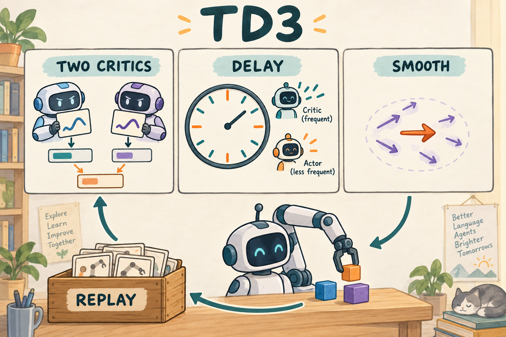

# TD3：让连续控制的 critic 少犯错，再让 actor 跟上

先读[前置知识](../preliminary/FOUNDATIONS.md)。TD3（Twin Delayed Deep Deterministic Policy Gradient）解决连续动作 actor-critic 中价值高估与误差放大的问题，核心是双 critic、延迟策略更新、目标动作平滑。[原论文](https://arxiv.org/abs/1802.09477)是机制来源，本章用独立的机械臂例子解释对应代码。



图中机械臂泛指连续控制，不表示本实验已经学会抓取。我们的实际任务是 FetchReach 到达目标；双表取小、critic 多更新几次和目标附近加扰动分别对应三个机制。

## 1. 一个错误的高分怎样把策略带偏

想象你要选末端向右移动多少。critic 在 0.42 附近因为样本少，错误地预测了一座“高分尖峰”。actor 的工作恰好是寻找让 critic 评分最高的动作，于是会积极钻进这个误差。下次 bootstrap 又使用这个高分，错误可能继续传播。

TD3 不依赖熵项，而是从预测和更新节奏上减少这样的反馈。它是确定性策略：$`a=\mu_\theta(s)`$。训练采集数据时另外加探索噪声；评估时直接用 $`\mu_\theta(s)`$。

## 2. 三个改动怎样写成公式

**目标动作平滑**先产生一个附近的动作：

```math
\epsilon\sim\mathcal N(0,\sigma^2I),\quad
\tilde a'=\mathrm{clip}\big(\mu_{\bar\theta}(s')+
\mathrm{clip}(\epsilon,-c,c),-1,1\big).
```

这里是慢速目标 actor $`\bar\theta`$；$`\sigma`$ 控制扰动大小，$`c`$ 限制极端噪声。每次取一个随机扰动，通过重复抽样近似在邻域中平滑价值，不是一次前向遍历所有附近动作。

**双 critic 取小**构造 bootstrap 标签：

```math
y=r+\gamma(1-d)\min\{Q_{\bar\phi_1}(s',\tilde a'),Q_{\bar\phi_2}(s',\tilde a')\},
```

```math
L_Q=\mathbb{E}[(Q_{\phi_1}(s,a)-y)^2+(Q_{\phi_2}(s,a)-y)^2].
```

$`d`$ 是真正终止，$`\bar\phi`$ 是目标网络参数。两个 critic 的结构相同但初始化独立、权重独立；如果只是同一网络调用两次，就没有双估计的意义。

**延迟 actor 更新**：每 $`K`$ 次 critic 更新后，最小化

```math
L_\pi=-\mathbb{E}_{s\sim\mathcal B}[Q_{\phi_1}(s,\mu_\theta(s))].
```

注意 actor 使用第一个 critic，target 使用两个 critic 的最小值。每次 actor 更新后，才将 actor 和双 critic 的慢速副本向当前参数移动：$`\bar\theta\leftarrow(1-\tau)\bar\theta+\tau\theta`$，critic 同理。

## 3. 手算：同一动作的两个分数

令 $`r=-1,\gamma=0.9,d=0`$，平滑后的目标动作得到两项 Q：5 和 8。

```math
y=-1+0.9\min(5,8)=3.5.
```

如果直接采用较高的 8，标签变成 6.2，误差已经多出 2.7。取小的目标也可能偏低，所以 TD3 不是消灭一切误差，而是控制 actor 最容易利用的高估方向。

再看平滑：目标 actor 输出 0.9，采到噪声 0.4、$`c=0.2`$。先把噪声截成 0.2，再把动作 $`0.9+0.2`$ 截成 1。不要先截动作、后无界地加噪声。

## 4. 两种噪声和两种时间轴

环境探索噪声加在当前 actor 的动作上，用于收集新的状态分布。目标平滑噪声只在训练 critic 的 target 中出现，不会直接送进环境。代码分别用 `exploration_noise`、`target_noise` 和 `noise_clip` 配置。

`steps` 是环境步数，`Agent.updates` 是 critic 更新次数。预热期间和 replay 不够大时，环境仍走、网络不更新。`policy_delay: 2` 是按更新次数取模，不是无条件每两个环境步就训练 actor。

## 5. 顺着代码找到每一个设计

| 代码 | 具体作用 |
|---|---|
| [networks.py](../src/agentic_rl/embodied/networks.py) 的 `DeterministicPolicy` | MLP 后接 tanh，输出归一化动作 |
| [agents.py](../src/agentic_rl/embodied/agents.py) 的 `update_online` | 非 SAC 分支执行目标平滑、双 Q 与更新延迟 |
| 同文件的 `polyak` | `lerp_` 混入比例为 tau 的当前参数 |
| [runner.py](../src/agentic_rl/embodied/runner.py) 的 `train` | 随机预热、环境探索、replay 抽样 |
| [test_embodied.py](../tests/test_embodied.py) | 检查第一步只改 critic，第二步才改 actor 和目标副本 |

实际核心片段如下，周围的 target 构造在 `torch.no_grad()` 内：

```python
next_actions = (self.target_actor(following) + noise).clamp(-1, 1)
values = self.target_critic.minimum(following, next_actions)
```

actor 分支中的实际 loss 为：

```python
actor_loss = -self.critic(states, self.actor(states))[0].mean()
```

`[0]` 明确选择第一个 Q。critic 权重暂时冻结，但前向仍保留动作的梯度路径。

## 6. 运行与检查

具身依赖安装方法见 [README](README.md)。在仓库根目录：

```bash
.venv/bin/python 14-td3/train.py --smoke --output runs/my-td3-smoke
.venv/bin/python 14-td3/eval.py --checkpoint runs/my-td3-smoke/checkpoint-final --episodes 10 --seed 20000
```

去掉 `--smoke` 使用 5000 环境步默认配置。训练采用真实 MuJoCo 物理状态，不需要图形界面。查看 `train/actor_updated` 的区间平均，预热后应在 0.5 左右；`loss/actor` 只对实际执行的 actor 更新取平均。`loss/critic` 小并不等价于机械臂已到达目标。

## 7. 与 SAC、HER 和 VLA 的关系

SAC 学随机策略并显式优化熵；TD3 学确定性策略，在交互时外加噪声。两者都复用旧数据、都有双 critic，但 actor loss 和 target 里的项不同。HER 可以在 TD3 外层改变训练经验里的目标，本仓库下一章就这样组合。

我认为 TD3 最值得初学者带走的是一个检查习惯：**问清 actor 正在利用 critic 哪一部分误差。** 只加大网络并不自动改善这件事；在大动作空间、长 action chunk 的 VLA 设置下，数据稀疏还可能更严重。

## 练习与答案

1. $`K=2`$，第 5 次 critic 更新是否更新 actor？**不更新，第 6 次才更新。**
2. actor loss 用双 Q 的平均值吗？**本实现用第一个 Q；不要从 target 的写法推断 actor 的写法。**
3. 评估动作是否添加 target smoothing noise？**不添加，目标平滑属于训练标签计算。**
4. 一个 episode 超时，是否要将该 transition 的 bootstrap 清零？**本 FetchReach 约定不清零，只在 terminated 时清零。**
