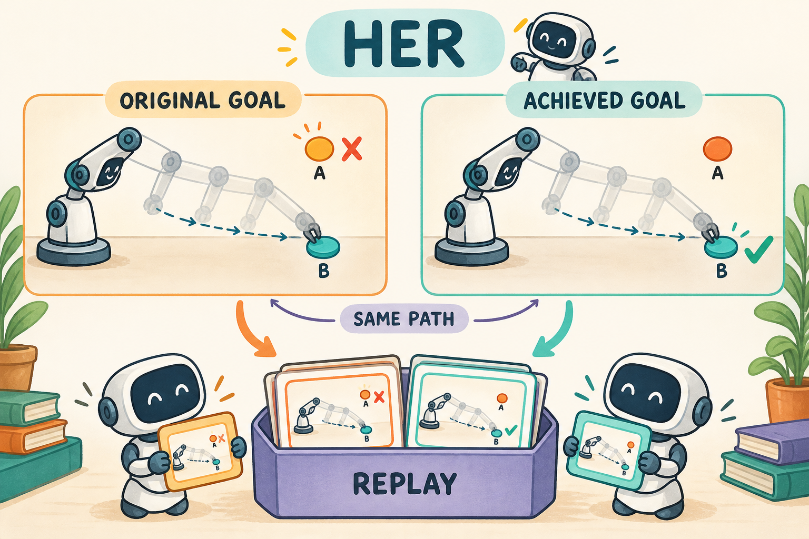

# HER：没完成原目标，也能诚实地利用这段经历

先读[目标、回放与 episode 边界](../preliminary/FOUNDATIONS.md)和 [TD3](../14-td3/TUTORIAL.md)。HER（Hindsight Experience Replay）不是独立的 actor loss，而是适用于目标条件任务的经验重标记方法。本仓库用 **TD3 + HER**，所以训练中的策略/critic 公式继承 TD3，区别发生在数据进入 replay 时。[原论文](https://arxiv.org/abs/1707.01495)提出了这一机制。



图中两份路径应视作同一次真实运动的两种提问：原来要去 A，事后改问能否去 B。没有生成第二段虚构的成功动作，也不能把原任务的评估结果改成成功。

## 1. 失败的经历为什么仍有信息

机械臂被要求到达桌面右上方，却移动到了左侧。按原目标，它失败了；但“在这段动作下，末端会到左侧”是一条真实知识。目标条件策略 $`\pi(a\mid s,g)`$ 既看状态 $`s`$，也看目标 $`g`$，因而可以用同一段经历回答另一个目标下的问题。

HER 有价值的前提是：改变目标不改变已经发生的物理转移，而且奖励可以按新目标重新计算。如果目标会改变动力学，例如“拿起不同重量的物体”其实改变了环境，不能只替换一个 goal 字段就说数据仍成立。

## 2. 原 transition 与 hindsight transition

原数据为 $`(s_t,g,a_t,r_t,s_{t+1},d_t)`$。从同一条轨迹后面的状态中取一个实际达到的目标 $`g'`$，产生：

```math
\big(s_t,g',a_t,r(s_{t+1},g'),s_{t+1},d_t\big).
```

这里的 `state` 包括实际机械状态，原动作 $`a_t`$ 与下一机械状态 $`s_{t+1}`$ 都不变，只有条件目标与依赖目标的标签变化。若终止也依赖目标，则需要同时重新计算终止标记；本章 FetchReach 的成功不触发立即终止，因此保留真实终止与截断标记。

本地使用 future strategy：对于 transition $`t`$，从本 episode 的 $`t+1,\ldots,T`$ 时刻的 achieved goal 中均匀抽样。代码数组保存的是每条 transition 的 `next_achieved_goal`，所以数组索引从当前 transition 到最后一条，语义上仍是严格未来状态。

## 3. 奖励、Q target 和 loss

FetchReach 的稀疏奖励是：

```math
r(s',g)=-\mathbf{1}[\|\mathrm{achieved}(s')-g\|_2\gt 0.05].
```

使用环境自身的 `compute_reward` 重算，避免阈值、单位和边界条件与真实环境不一致。目标距离及奖励定义见 [FetchReach 文档](https://robotics.farama.org/envs/fetch/reach/)。

重标记后，TD3 的目标也必须在新目标条件下计算：

```math
y'=r(s',g')+\gamma(1-d)\min_j Q_{\bar\phi_j}(s',g',\tilde a'),\quad
\tilde a'=\mathrm{clip}(\mu_{\bar\theta}(s',g')+\text{clipped noise},-1,1).
```

```math
L_Q=\mathbb{E}_{\mathcal B_{\mathrm{original}}\cup\mathcal B_{\mathrm{HER}}}
\sum_j(Q_{\phi_j}(s,g,a)-y)^2,\qquad
L_\pi=-\mathbb{E}[Q_{\phi_1}(s,g,\mu_\theta(s,g))].
```

没有另一个名叫 `her_loss` 的必要项。算法改动已经体现在抽到的状态-目标-奖励组合中。

## 4. 用一条三步轨迹手算

把空间简化为一条线。原目标是位置 9，真实位置依次是 $`0\to1\to2\to3`$，每步对原目标都是 -1。

考虑第一条 transition $`0\to1`$：若 future goal 选 1，重算奖励为 0；若选 3，仍是 -1。**HER 不会让每条重标记样本立即成功。** 当选较远的 future goal，Bellman bootstrap 要沿后续动作逐步传播价值。

最后一条 transition $`2\to3`$ 的 future 候选只有 3，因此它的 hindsight 奖励为 0。原来的三条失败数据仍保留，不因为新增样本而被改写。

默认 `her_k: 4` 为每条原 transition 新增四条 hindsight 副本。回放容量充足时，50 步 episode 提供 $`50+4\times50=250`$ 条训练样本；真实环境仍只走了 50 步，报告不能把 250 写成环境采样量。

## 5. 本仓库如何防止重标记出错

核心实现是 [replay.py](../src/agentic_rl/embodied/replay.py) 的 `relabel_future`。它要求同一 episode、时间连续有序、内部没有终止或截断，随后复制 transition，替换当前和下一状态的目标字段，并调用环境奖励函数。

实际核心片段：

```python
copy["desired_goal"] = goal.copy()
copy["next_desired_goal"] = goal.copy()
copy["reward"] = float(reward_function(copy["next_achieved_goal"], goal, {}))
```

如果只改 `desired_goal`，却让 bootstrap 的下一状态继续使用原目标，Q target 就在回答另一个问题。深拷贝是为了避免一次重标记污染原样本或其他副本。

`Replay.add_episode` 先放入原经验，再新增 hindsight；`runner.train` 在 episode 结束时处理整条轨迹。训练恰好停在 episode 中间时，只利用已观测到的前缀，不捏造尚未发生的未来。

[测试](../tests/test_embodied.py)检查未来时间边界、跨 episode 拒绝、原数据不变、两处 goal 同步、奖励正确和最后一步的 hindsight 成功。

## 6. 运行、数据和 TensorBoard

安装具身依赖后，在仓库根目录运行：

```bash
.venv/bin/python 15-her/train.py --smoke --output runs/my-her-smoke
.venv/bin/python 15-her/eval.py --checkpoint runs/my-her-smoke/checkpoint-final --episodes 10 --seed 20000
```

默认实时交互并生成 HER replay，不需要离线示范。`prepare_data.py` 可生成供 IQL/数据检查使用的共享轨迹文件；它不是 HER 训练的必需前置步骤。

`validation.json` 同时记录 `training_environment_steps`、`replay_transitions`、`her_transitions`。评估始终按环境原始目标执行，不做 hindsight，查看 `eval/success_rate` 和 `eval/final_success_rate`。如需比较 TD3 与 HER，应固定网络、环境步预算、评估种子，并用多组训练种子；只比较 replay 条数不公平。

## 7. 对具身与 VLA 的启发和边界

我的理解是，HER 教的是**把经历中真正获得的信息重新组织成可学习的问题**。这比把失败数据统统丢掉更充分，但也要求奖励和目标语义可重算。

将目标坐标替换成任意自然语言会困难得多：“把红杯子放进柜子”不等于任意事后达到状态都能自动写出正确语言目标。还需要可靠的目标描述、成功判定以及任务语义一致性。在随机动力学中，按事后结果选择目标还可能改变条件分布；本章简单 FetchReach 实验不宣称解决这些问题。

## 练习与答案

1. $`0\to1\to2\to3`$ 中，对 $`1\to2`$ 能取 future goal 1 吗？**不能；候选是 2 或 3。**
2. HER 能否改变 recorded action，让轨迹看起来更合理？**不能，那会伪造动力学数据。**
3. 稀疏奖励仍为 -1 的 hindsight 样本是否一定无用？**不是，未来价值可通过 bootstrap 传播回来。**
4. 能否用重标记后的成功率汇报原任务性能？**不能，评估必须使用原始任务目标。**
