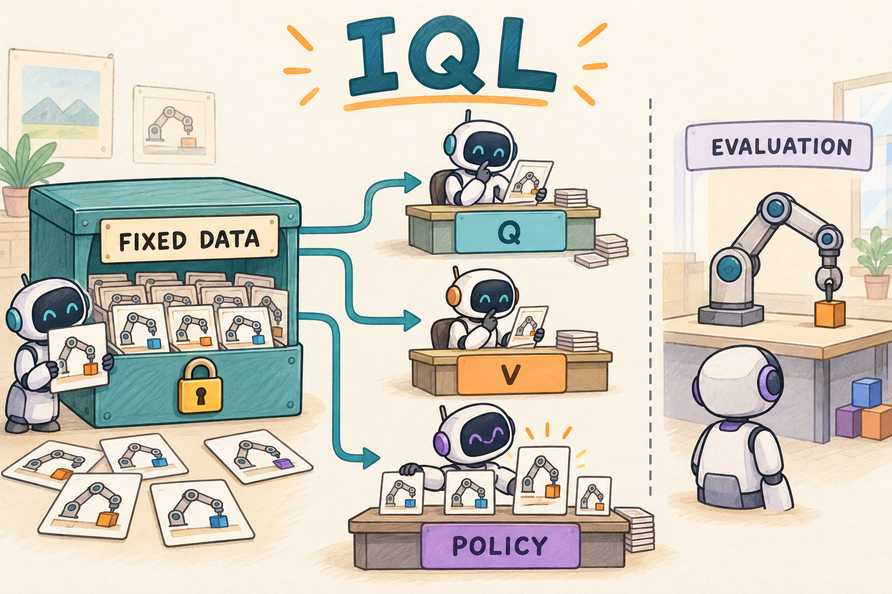

# IQL：从固定数据学价值，再有重点地模仿

先读 [offline RL 与分布偏移](../preliminary/FOUNDATIONS.md)。IQL（Implicit Q-Learning）适合学习机器人离线 RL 的基本问题：训练时只能使用已有经历，不能随时让机器人试一个新动作来纠正 critic。[原论文](https://arxiv.org/abs/2110.06169)给出 expectile 价值学习和优势加权策略提取；本章独立实现低维 FetchReach 示例。



图中的数据箱是固定的。评估机器人会交互，但评估轨迹不回流到训练数据。POLICY 桌面卡片大小表示模仿权重，所有动作卡片都来自记录数据。

## 1. 为什么不直接在离线数据上运行 TD3

TD3 的 actor 会寻找 $`Q(s,a)`$ 高的动作，即使这个动作从未出现在数据里。在线训练可以执行它，发现评分虚高后补数据；纯离线没有这样的纠错渠道。于是“critic 估得很高”可能只意味着“这里没有足够的数据约束它”。

IQL 的更新不让 critic 给新采样的策略动作打分。它先问：在已经记录过的动作价值里，能否学出偏向较好动作的状态价值？然后利用这个价值做 Bellman 回传，最后增加对较好记录动作的模仿权重。

## 2. 三个网络分别负责什么

固定数据集为 $`\mathcal D=\{(s,a,r,s',d)\}`$。两个 $`Q_{\phi_j}`$ 预测记录动作的回报，$`V_\psi`$ 提供偏向优质动作的状态价值，$`\pi_\theta`$ 学连续动作分布。慢速目标 Q 记为 $`\bar\phi_j`$。

定义记录动作的保守估计与残差：

```math
\bar Q(s,a)=\min_j Q_{\bar\phi_j}(s,a),\qquad u=\bar Q(s,a)-V_\psi(s).
```

V 使用不对称平方损失，也叫 expectile loss：

```math
L_V=\mathbb{E}_{\mathcal D}[|\eta-\mathbf{1}[u\lt 0]|u^2],\quad 0\lt \eta\lt 1.
```

默认 $`\eta=0.7`$。当 V 低于记录 Q 时，正残差乘 0.7；当 V 高于记录 Q 时，负残差乘 0.3。低估受到更大惩罚，因此最优 V 偏向数据中较高的 Q。$`\eta`$ 是 expectile 参数，不是目标网络的 Polyak 系数 $`\tau`$。

它不是简单取最大值，也不是“第 70 百分位数”：expectile 用平方距离加权，quantile 使用另一种绝对值型损失。

## 3. Q 与策略的两个 loss

Q 的 target 不需要调用策略：

```math
y=r+\gamma(1-d)V_\psi(s'),\qquad
L_Q=\mathbb{E}_{\mathcal D}\sum_j(Q_{\phi_j}(s,a)-y)^2.
```

Actor 做优势加权行为克隆：

```math
A(s,a)=\bar Q(s,a)-V_\psi(s),\quad
w(s,a)=\min\{\exp(\beta A(s,a)),w_{\max}\},
```

```math
L_\pi=-\mathbb{E}_{(s,a)\sim\mathcal D}[\mathrm{stopgrad}(w(s,a))\log\pi_\theta(a\mid s)].
```

本地 `advantage_scale` 对应 $`\beta`$，默认 3；`max_weight` 默认 100。这个参数越大越偏向高优势动作，注意有些资料用倒数温度，不能只按参数名字复制数值。所有 Q、V target 与 actor 权重按各自更新需要停止梯度。

策略使用 tanh-Gaussian，对**数据中动作**计算 log density。边界动作先夹到 $`[-1+10^{-6},1-10^{-6}]`$，再做 `atanh`，这是归一化动作到达边界时的数值近似，需要在迁移任务时考虑。

## 4. 两个手算例子

同一状态记录了两个等频动作，Q 值分别 0 和 2。若 $`\eta=0.75`$，在 $`0\lt v\lt 2`$ 范围内：

```math
L_V(v)=\frac{1}{2}[0.25v^2+0.75(2-v)^2].
```

令导数为零得到 $`v=1.5`$。普通平方误差平均得到 1；expectile 把基线向较好的记录动作移动，但仍不是直接设成 2。

若两个记录动作优势分别 0.4 与 -0.2，$`\beta=3`$，权重约为 $`e^{1.2}=3.32`$ 和 $`e^{-0.6}=0.55`$。后一个动作仍被模仿，只是权重较低；它没有像 PPO 的负优势那样被直接当作“应压低概率的动作”。共享网络的概率归一化仍可能使某些动作概率间接下降。

## 5. 把三步更新对应到代码

[agents.py](../src/agentic_rl/embodied/agents.py) 的 `update_iql` 按以下顺序执行：

1. 目标双 Q 只查看 batch 的记录动作，计算 `recorded_q`。
2. `expectile_loss(recorded_q - values, ...)` 更新 V。
3. 用更新后的 V 计算下一状态 target 和当前优势；更新双 Q。
4. 用固定权重乘记录动作 log density，更新策略；慢速更新目标 Q。

实际 actor 核心行是：

```python
actor_loss = -(weights * self.actor.log_prob(states, actions)).mean()
```

这里的 `actions` 来自数据集，不能替换成 `self.actor.sample(states)`。代码在指数前截断 log weight，避免先 `exp` 溢出再尝试裁剪。`value` 只在 IQL 分支训练，SAC/TD3 不使用它。

[测试](../tests/test_embodied.py)不仅检查 loss 是否有限，还截取 critic 输入，验证每次 Q 查询的动作都与 batch 记录相同；策略采样方法一旦被调用就让该测试失败。

## 6. 数据从哪里来，怎么运行

[replay.py](../src/agentic_rl/embodied/replay.py) 的 `prepare_dataset` 在真实 FetchReach 物理环境采集 40 个 episode、共 2000 条 transition：每四个 episode 有三个使用带噪声的比例控制器，一个使用均匀随机动作。它是本地程序生成的仿真经历，不是人工遥操作数据，也不是标准离线 benchmark。

仓库已提供 `data/embodied/fetch-reach/train.npz` 及同名 JSON 元数据。记录观察、前后目标、动作、奖励、真实终止、时间截断、episode 和时间索引。SHA256、采集种子和版本用于校验；默认数据种子 42–81，训练内评估种子从 10000 开始。

```bash
# 已有随仓库的数据时，直接训练
.venv/bin/python 16-iql/train.py --smoke --output runs/my-iql-smoke
.venv/bin/python 16-iql/eval.py --checkpoint runs/my-iql-smoke/checkpoint-final --episodes 10 --seed 20000

# 可选：在新路径重新采集，不覆盖原数据
.venv/bin/python 16-iql/prepare_data.py --output data/embodied/fetch-reach/my-train.npz
.venv/bin/python 16-iql/train.py --dataset data/embodied/fetch-reach/my-train.npz --output runs/my-iql
```

去掉 `--smoke` 是 5000 次梯度更新，**不是 5000 个训练环境步**。`validation.json` 的 `training_environment_steps` 应为 0；评估本身有环境交互。数据校验会拒绝 SHA 不符、reward 类型不一致或评估种子与采集种子重叠。

TensorBoard 看 `loss/value`、`loss/critic`、`loss/actor`、`train/weight` 与评估成功率。行为克隆 loss 降低只能说明拟合记录动作更好，不保证新初始状态能成功。

## 7. 在 VLA 中如何理解它

离线机器人数据通常昂贵，IQL 提供了一条“先利用已有行为质量差异”的入门路线。但这里学习的是低维状态到末端动作，没有视觉或语言编码，也没有训练动作 chunk。

我的判断是：**数据覆盖比权重公式更先决定可学什么。** 所有记录都在桌子左侧，expectile 和指数权重不会凭空教会右侧遮挡后的操作。离线预训练之后转在线微调也是另一段实验，不能把评估交互悄悄回填到数据再继续称为纯离线结果。

## 练习与答案

1. 将 $`\eta`$ 从 0.75 改成 0.5，两个 Q 为 0、2 时最优 V 是多少？**1，退化为普通均方误差的平均。**
2. $`A=-1`$ 是否意味着 actor loss 的样本权重为负？**不是，指数权重始终非负。**
3. 只保存 actor 能否精确继续全部 IQL 优化？**不能，还需要 Q、V、目标 Q、优化器及随机状态；继续在线环境还需额外环境/replay 状态。**
4. 这个实现与原论文的所有 benchmark 设置完全相同吗？**不是；这是自己采集 FetchReach 数据的教学实验，策略分布、网络和超参数均在本地明示。**
