# DeepSeek-V4.1-Flash 技术报告：中文翻译与深度解读

> 原文：《DeepSeek-V4.1-Flash: Pushing the Limits of KV Cache Compression》
> 作者：DeepSeek-AI
> 本文档包含两部分：第一部分为深度解读（导读），第二部分为全文中文翻译。

---

# 第一部分 深度解读

## 一、论文全景与一句话核心贡献

**一句话核心贡献**：DeepSeek-V4.1-Flash 通过"架构（CED + CSA2 跨层复用）+ 精度（FP4 KV 缓存）+ 部署策略（SWA Bounded Replay）"三位一体的联合优化，把 KV 缓存的全局足迹压缩到每 token 890 字节（约为 V4-Flash 的 1/4、V1 的 1/437），持久化 KV 足迹压到 V4-Flash 的 1/8，同时用更小的激活参数量（预填充 8B / 解码 16B）取得了超越前代、比肩顶级开源与闭源模型的智能体性能。

**模型规模速览**：

| 项目 | 数值 |
|---|---|
| 主干参数 | 552B（MoE，1 共享专家 + 384 路由专家，每 token 激活 6 个） |
| Engram 参数 | 196B（条件记忆，FP8） |
| 激活参数 | 预填充（prefill）8B / token，解码（decode）16B / token |
| 上下文长度 | 最高 100 万 token |
| 层数 | 40 层（20 层因果编码器 + 20 层解码器） |
| 预训练数据 | 45T token 多模态语料，稀疏注意力从零开始（64K 序列，34T token 处扩展到 1M） |
| 全局 KV 足迹 | 890 字节 / token（对比 V4-Flash 约 1/4，对比 V1 约 1/437） |
| 持久化 KV 足迹 | 约为 V4-Flash 的 1/8 |

## 二、新方法、新技术、新架构详解

### 2.1 CED（Causal Encoder-Decoder，因果编码器-解码器）架构

**是什么**：把 40 层 Transformer 分成下半 20 层（因果编码器）和上半 20 层（解码器）。解码器的全局 KV 不再由各层自己的隐状态计算，而是直接从第 20 层（编码器最后一层）的隐状态 H_{L/2} 用逐层投影权重一次性投影得到：

    C_l = H_{L/2} · W_{KV}^l ， Z_l = H_{L/2} · W_Z^l （l > L/2）

**为什么这样做**：智能体工作负载"输入重"——频繁的工具调用会产生大量预填充请求，KV 缓存未命中时计算开销巨大。CED 让预填充阶段只需计算前半部分层即可"免费"获得所有解码器层的全局 KV，把预填充复杂度从 O(N·L) 降到约 O(N·L/2)，几乎减半。同时 SWA（滑动窗口注意力）仍保持逐层计算，不损失局部建模深度。

**代价与配套**：解码器 SWA KV 需要"重放"（replay）过程才能得到，为此配套设计了 Decoder SWA Bounded Replay（见 2.5），只重放最后 n_win 个 token，把额外开销控制在极小范围。

### 2.2 CSA2（Compressed Sparse Attention 2，压缩稀疏注意力 2）

**是什么**：DeepSeek-V4 的 CSA/HCA 混合架构被替换为纯 CSA2。CSA2 在三个乘法维度上同时压缩 KV 缓存成本：

1. **条目大小维度**（entry size）：GQA 减少 KV 头数，MLA 用共享小潜变量，这是已有的；
2. **序列维度**（sequence）：每 m 个 token 压缩成一个条目（压缩率 m）；
3. **层维度**（layer）：不同层复用其他层的缓存和选择结果。

**CSA2 与 CSA 的差异**：CSA 中压缩率 m 用 2m 个原始 KV 条目生成一个主 KV 条目（相邻条目源有重叠），并带绝对位置嵌入；CSA2 去掉重叠和绝对位置嵌入，且索引器 K 直接由主 KV 条目投影得到（替代 CSA 从隐状态单独压缩的路径），实现更简单、训练效率更高。

**三种静态分配的模式**（这是 CSA2 的核心机制）：

| 模式 | 主 KV | 索引器 K | Top-K 索引 | 作用 |
|---|---|---|---|---|
| Full 模式 | 本层计算 | 本层计算 | 本层索引器新算 | 完整计算路径，产出可共享的 KV 与索引 |
| Reindex 模式 | 复用最近 Full 层 | 复用最近 Full 层 | 用自己的索引器 Q 重打分、新选 | 允许选择结果跨层变化，缓存仍共享 |
| Reuse 模式 | 复用最近 Full 层 | — | 复用最近产生索引的层 | 零索引计算，直接做稀疏注意力 |

所有模式中，每层都保留自己的全局 Q 和 SWA KV。共享主 KV 与索引器 K 减少了重复缓存存储；复用 Top-K 索引避免了额外索引计算。Reindex 与 Reuse 解耦，使"缓存共享"和"索引复用"可以独立配置。

**为什么这样做**：已有的工作（IndexCache 复用 Top-K 索引、YOIO 全网络共享路由、HySparse 稀疏层复用稠密层 KV）都只覆盖三个维度中的部分：索引复用省不了主 KV 存储、全网络路由共享伤性能、混合设计仍保留全注意力层。CSA2 首次三者联合覆盖，且把缓存共享与索引复用解耦，让模式可以按层静态配置（编码器 m=2、解码器 m=1）。

### 2.3 分层稀疏索引器（Hierarchical Sparse Indexer）

**是什么**：解码器中第一个 Full 模式层除了算自己的 Top-K 索引，还做块级候选选择：每块取位置上的最大索引分数，选出分数最高的 2048 个块（每块 8 个位置），构成 16384 个候选位置池；后续 Reindex 层只在候选池内打分选 Top-512，Reuse 层直接用最新索引。

**为什么这样做**：跨层索引复用减少了索引器求值次数，但剩下的索引器仍要对整个因果可见上下文打分，超长上下文下仍是计算瓶颈。分层索引器把深层索引器的每查询代价从"随上下文长度线性"降为"常数"（候选池大小固定）。关键设计是"训练感知"：该约束在训练和推理时完全一致，所以深层索引器是在与推理相同的搜索域下优化的。

### 2.4 FP4 主 KV 缓存

**是什么**：把主 KV 缓存从 FP8 降到 FP4（OCP 标准 MXFP4 格式，E2M1 + 每 16 通道一个 E4M3 缩放因子，去掉 NVFP4 的二级全局缩放）。在注意力之前反量化缓存值，因此不需要硬件原生支持 FP4 矩阵乘，保持了跨硬件兼容性。SWA KV 缓存保留 FP8（对量化更敏感）。

**为什么这样做**：
- 长上下文智能体需要每请求很大的 KV 缓存，FP4 相比 FP8 几乎减半存储足迹（HBM 与 SSD 皆然）。
- 为什么可以去掉全局缩放：该格式最大幅值可达 2688，而主 KV 缓存的实际幅值上界约 √512 ≈ 22.6（RMSNorm 后 512 通道 KV 潜变量 L2 范数上界，RoPE 保范），训练中观察到的最大幅值约 10，远低于格式上限，因此去掉全局缩放没有可测的精度损失。
- 后训练阶段引入 QAT（量化感知训练），在 RoPE 之后量化（先量化只有边际收益且增加解码开销）。

### 2.5 SWA Bounded Replay（SWA 有界重放）

**是什么**：由于 SWA 依赖跨层累积，精确重建 L 层的 SWA KV 需要重放 L × n_win 个 token。SWA Bounded Replay 只重放最近 n_win 个 token，并截断 SWA 到重放段，接受近似状态。两条路径：

- **编码器 SWA Bounded Replay**：SWA KV 缺失时，重放缓存前缀最后 n_win 个 token 与未缓存后缀一起处理；重放的 token 只再生 SWA KV，复用已缓存的全局 KV（不重算、不覆盖）。
- **解码器 SWA Bounded Replay**：每次预填充只重放提示最后 n_win 个 token，喂过解码器层，得到的解码器 SWA KV 仅用于解码、不用于前缀缓存。

**为什么这样做**：在 V4 部署中 SWA KV 占持久化 KV 缓存近一半容量，但它的访问模式与持久化 KV 缓存的长留存策略不匹配——只在活跃会话内分钟级窗口被复用，会话结束或下一轮开始即失效。V4 报告提出的 Zero SWA Caching 用精确重建兜底，但 L × n_win token 的全前向代价在生产中不可承受。有界重放把"灾难性未命中"变成"优雅的廉价降级"，从而允许把 SWA KV 从持久化缓存中彻底移除，持久化 KV 足迹因此再减半。实验显示性能损失可忽略，且后训练中模拟同样的重放做"训练感知"适配。

### 2.6 Single-Pass mHC 与 Mega-mHC 内核

**是什么**：mHC（流形约束超连接）在相邻 Transformer 块之间维护 n 条残差流。原实现是三个顺序执行的内核（残差更新→系数预测→输入混合），激活内存流量为 (4n+4)d，是最低下界的两倍。Single-Pass mHC 把输入混合系数"延迟一个块"（用 A_{l-1} 代替 A_l），消除数据依赖，使每个 X_l 瓦片可同时用于输入混合和系数预测，流量降到 (2n+2)d 的下界。部署侧用 Mega-mHC 单内核融合（残差更新 + 输入混合 + 系数预测 + 输入前归一化 + FP8 转换），激活流量减半。

**为什么这样做**：减少激活内存流量直接降低 HBM 带宽压力、提升内核吞吐。实验表明系数移位仅带来可忽略的性能退化。

### 2.7 Engram 条件记忆模块

**是什么**：为模型加入 196B 参数的稀疏访问条件记忆（沿用原 Engram 设计：分词器压缩、多头哈希、上下文感知门控、多分支集成），分布在两个模块（层 1 和层 14），每模块用 N-gram 阶数 {2,3,4}、8 个哈希头、每阶 2048 维嵌入，每头索引约 16M 条目的表。两处修改：去掉短因果卷积（收益不抵复杂度）；用动量更新 + Sinkhorn 平衡优化嵌入。嵌入表与 KV 投影用 FP8。推理时确定性寻址允许从主机内存后台 RDMA 预取嵌入。

**为什么这样做**：把"记忆"从"计算"中解耦——用大容量稀疏查表补充参数化知识，不必把知识都压进 FFN 权重；196B 参数只被稀疏访问，训练和推理成本可控。

### 2.8 DSpark 推测解码

**是什么**：结合半自回归草稿生成与置信度调度验证的推测解码模块。草稿器为 3 层 Transformer，滑动注意力窗口 128；一次前向并行算出 5 个草稿位置的 base logits，轻量 Markov 头建模草稿 token 间依赖，置信度头预测逐位置条件接受概率，调度器结合预分析的引擎吞吐曲线，为每个请求动态选择验证长度，最大化系统吞吐。与 MTP（V3 中随主干联合训练）不同，DSpark 在预训练后单独阶段训练（主干冻结），后训练中继续与主干一起训练但不回传梯度，使其与演化中的策略保持对齐，同时加速在线服务与 RL/OPD 的 rollout 生成。

### 2.9 训练优化：按头 Muon + Sinkhorn 平衡更新

- **按头 Muon（head-wise Muon）**：查询权重按头拆分后分别应用 Muon 更新。动机：把 Muon 视为预条件梯度下降，普通 Muon 对所有头用一个预条件器，按头 Muon 给不同头不同预条件器，更好处理注意力头之间的异质性（GLM 5、Kimi-K3 也验证了此优势）。
- **Sinkhorn 平衡更新**：Engram 嵌入表、token 嵌入和预测头用"动量更新 + Sinkhorn 平衡"替代 Adam（Adam 的优化器状态内存太大）。Sinkhorn 平衡找到对角缩放矩阵使更新矩阵行、列 RMS 都接近 1，利用"一行对应一个 token/n-gram 标识、一列对应一个隐藏特征"的结构。只需一个动量缓冲区，经验上优于 Adam。学习率校正因子 γ=0.18（接近 Moonlight 的 0.2）。

### 2.10 后训练：无算法创新，全押数据与工程管线

作者明确声明：后训练没有算法创新，配方就是标准 SFT → RL → OPD；所有实质变化在数据管线：

- **大规模智能体任务合成**：任务形式化为三元组（问题、环境、验证系统），以难度和正确性为奖励信号迭代训练模型自己构建任务；通用智能体环境由员工/合作伙伴真实工作流 + 模拟工具重建；编码智能体环境由内部会话 + GitHub 仓库经多智能体协作流水线构建（可构建性判定→环境搭建→多智能体试做→质检→修复）。
- **DSec（DeepSeek Elastic Compute）**：生产级沙箱平台，支撑数百万并发沙箱实例。横向扩展用分片 + 弱一致调度（自定义放置引擎，节点本地校验硬准入）；节点级用硬件支持的子 NUMA 分区（密度从约 1000 提升到 2500+ 容器/物理节点）；延迟敏感执行类（SCHED_IDLE + 核心调度消除超线程干扰）；用每沙箱 AppArmor 配置 + eBPF 网络策略防奖励黑客与恶意智能体。
- **异步后训练基础设施**：RL 与 rollout 在同一物理设备上时分复用；样本级调度维持并发（试过批级和提示级都有问题）；拼接路由重放（跨 checkpoint 的样本拼接专家路由）；应对长度偏置（按数据集限并发、丢弃过早返回的短样本）与 off-policy（限制最大 off-policy 比例、对过旧 token 加 loss masking）；token 级中断 + 状态持久化实现无缝 checkpoint 切换。
- **推理努力控制（Controllable Reasoning Effort）**：在 RL 中引入标量努力水平 b（1-100），系统提示加入"Reasoning Effort: {effort}"。每个 (x,b) 组内做均值中心化计算组相对优势，长度惩罚系数随努力指数衰减 k(b)=k0·exp(−(b−bmin)/τ)。部署时单一 checkpoint 即可在成本-质量前沿上滑动；公开 API 暴露 max/high/low 三档（b=100/75/50）。附录 C 用"边际收益近似指数衰减"的局部模型证明指数惩罚会带来努力-长度的一阶线性关系。

## 三、为什么要这样做：整体动机分析

**1. 瓶颈转移：从算力到存储与带宽。** 长程智能体的普及使模型工作负载越来越"输入密集"。先前的稀疏注意力工作已大幅降低长序列计算成本，预填充仍贵、大 KV 缓存持续压榨 HBM 与 SSD 容量和数据传输带宽。计算、存储、带宽三者共同构成部署成本进一步下降的主要瓶颈。因此"进一步压缩 KV 缓存足迹"是降低长上下文服务成本的关键抓手。

**2. KV 缓存的三维压缩空间。** 服务长上下文要同时控制 KV 缓存存储和注意力计算，二者可沿三个乘法维度削减：条目大小（GQA/MLA）、序列维度（每 m token 压缩为一个条目）、层维度（跨层复用）。CSA2 是首个三管齐下的设计，并把"缓存共享"与"索引复用"解耦成可独立配置的模式。

**3. "小激活、大能力"的成本经济学。** 智能体场景输入重、输出长。CED 使预填充只激活 8B、解码激活 16B，配合 KV 压缩，让一个 552B 的模型在输入密集型负载上获得接近 1/4 规模的成本表现；解码 FLOPs 随上下文增长几乎恒定（4K→1M 256 倍上下文只增加 1/4 解码 FLOPs）。

**4. 数据工程 > 算法创新的阶段判断。** 作者明确观察到：在固定且普通的优化流程下，合成数据与环境在规模、多样性和可验证性上的系统性改进几乎解释了全部收益——"当前阶段，工程化数据与环境管线的边际回报大幅超过后训练算法创新"。这是对行业"RL 算法军备竞赛"的一种反直觉但可复现的主张。

## 四、实验结果

### 4.1 预训练基座评估（表 1，内部框架）

| 维度 | 基准 | V4-Flash-Base | V4-Pro-Base | V4.1-Flash-Base |
|---|---|---|---|---|
| 激活参数 | — | 13B | 49B | 8B/16B |
| 主干参数 | — | 284B | 1.6T | 552B |
| 世界知识 | AGIEval (EM) | 83.9 | 84.4 | 83.4 |
| | MMLU-Pro (EM) | 68.3 | 73.5 | **74.1** |
| | C-Eval (EM) | 92.1 | 93.1 | 92.1 |
| | MultiLoKo | 42.6 | **50.9** | 45.5 |
| | SimpleQA-Verified | 30.1 | **55.2** | 42.3 |
| | SuperGPQA | 46.5 | 53.9 | 53.1 |
| 语言与推理 | BBH (EM) | 86.9 | 87.5 | 86.1 |
| | BBEH (EM) | 25.4 | 29.8 | 27.2 |
| | DROP (F1) | 88.6 | 88.7 | 87.9 |
| | HellaSwag | 85.7 | 88.0 | 87.2 |
| 代码与数学 | BigCodeBench (Pass@1) | 56.8 | 59.2 | **60.6** |
| | HumanEval (Pass@1) | 69.5 | 76.8 | **79.4** |
| | GSM8K (EM) | 90.8 | 92.6 | **93.0** |
| | MATH (EM) | 57.4 | 64.5 | 61.1 |
| | MGSM (EM) | 85.7 | 84.4 | 80.2 |
| 长上下文 | LongBench-V2 (EM) | 44.7 | **51.5** | 45.2 |
| 多模态 | MMMU-Pro | — | — | 56.5 |
| | CVBench | — | — | 77.9 |
| | DocVQA | — | — | 95.6 |
| | RefCOCO-avg | — | — | 86.0 |

要点：V4.1-Flash-Base 用 1/3 总参数、1/4 激活参数，在世界知识、推理、编码上与 V4-Pro-Base 相当，并在留出集评估上提升 5%–10%；在专用内部语料的 BPB（每字节比特数）评估中取得全任务最低值。

### 4.2 后训练评估（表 3，Max 努力档）

| 基准 | Opus-5 | GPT-5.6 Sol | Kimi-K3 | GLM-5.3 | DS-V4-Pro | DS-V4-Flash | **DS-V4.1-Flash** |
|---|---|---|---|---|---|---|---|
| GPQA Diamond | — | 93.4 | 94.1 | 92.9 | 88.1 | 92.4 | **89.9** → 90.9 |
| HLE (Pass@1) | — | 56.3 | 44.5 | 43.5 | 42.0† | 42.7† | 37.8† | 36.8 (39.1†) |
| Codeforces (Rating) | — | — | — | — | 3348 | 3289 | **3471** |
| MathArena Apex | — | — | 65.6 | — | 65.3 | 58.6 | **65.6** |
| Terminal-Bench 2.1 | 89.1 | 88.8 | 88.3 | 88.2 | 87.9 | 82.7 | **90.6** |
| Terminal-Bench 3.0 | 43.3 | 34.4 | 17.7 | 28.3 | 11.8 | 7.6 | 30.0 |
| Terminal-Bench 4.0 | 51.8 | 39.9 | 12.6 | 37.9 | 12.4 | 7.0 | 31.2 |
| DeepSWE v1.1 | 74.0 | 73.0 | 67.5 | 66.9 | 62.7 | 54.4 | **74.2** |
| ProgramBench | 37.0 | 23.0 | 17.5 | 19.0 | 15.5 | — | 20.3 |
| NL2Repo-Bench | 75.3 | 56.8 | 58.0 | 58.0 | 61.5 | 54.2 | 65.4 |
| CyberGym | — | 84.5 | 80.0 | 84.5 | 83.3 | 76.7 | **88.1** |
| SEC-Bench Pro | — | 74.3 | — | — | 56.4 | 30.9 | 62.8 |
| ExploitGym | 22.1 | 33.7 | — | 15.0 | 5.4 | 1.8 | 15.3 |
| HLE w/ tools | 63.6 | — | 59.8 | 62.5 | 60.0 | 51.5 | **63.9** |
| Automation-Bench | 50.3 | 45.8 | 46.7 | 48.8 | 43.2 | 37.7 | **54.8** |
| Agents' Last Exam | 28.6 | 26.7 | 27.6 | 28.5 | 25.7 | 25.2 | **31.8** |
| Chartography w/ tools | 84.0 | 79.9 | 68.1 | — | — | — | 78.9 |
| BabyVision w/ tools | 94.1 | 88.9 | 85.7 | — | — | — | 89.6 |
| ZeroBench-main w/ tools | 52.0 | 53.0 | 41.0 | — | — | — | 49.0 |

要点：
- **推理**：Codeforces 3471（超 V4-Pro 3348 与 V4-Flash 3289）；MathArena Apex 65.6% 追平 Kimi-K3；GPQA Diamond 90.9%。
- **编码智能体**：DeepSWE v1.1 74.2%（超 Opus-5 74.0% 与 GPT-5.6 Sol 73.0%）；Terminal-Bench 2.1 90.6%（超 Opus-5 89.1%）。
- **通用智能体**：Automation-Bench 54.8%、Agents' Last Exam 31.8%，均为领先。
- **网络安全**：CyberGym 88.1% 开源模型新 SOTA（作者提示双重用途责任）。
- **视觉智能体**：强于开源 Kimi-K3，但与领先闭源仍有差距（Chartography 78.9 vs Opus-5 84.0；BabyVision 89.6 vs 94.1）。

### 4.3 推理努力控制（图 9）

- 努力从 25 提到 100：8 个推理密集基准平均 Pass@1 从 67.1% 提升到 76.3%；DeepSWE v1.1 从 66.0% 到 74.2%；Terminal-Bench 2.1 从 82.4% 到 90.6%，代价是约 2.5× 输出 token。
- 收益前置：60–80 档用不到一半 token 预算就恢复了 max 档大部分精度；最后到 100 档会拉长轨迹 1.6–1.8× 只换边际提升。max 档应留给最难任务。

### 4.4 跨 scaffold 鲁棒性（表 4，Max 档）

DeepSWE v1.1：mini-SWE 74.2 > DSH-Minimal 72.6 > DSH-Standard 70.5 > Claude Code 69.8 > DSH-PTC 67.6 > Pi 66.2 > Codex 65.6 > OpenCode 65.5。
Terminal-Bench 2.1：DSH-Minimal 90.6 > mini-SWE 90.3 > Claude Code 88.0 > Pi 86.1 > DSH-Standard/PTC 85.8 > OpenCode 85.0 > Codex 84.1。
结论：智能体能力跨 scaffold 家族迁移良好，不过度绑定单一 harness——这与训练数据的多样性一致。

### 4.5 多智能体（图 10，初步实验）

- ProgramBench（Almost@1）：多智能体 1h 13.59% → 8h 峰值 30.04%，单智能体 12.79% → 20.39%。
- FrontierSWE v2（Mean@5）：多智能体 1h 13.50% → 20h 32.90%，单智能体 10.50% → 28.20%。
- 每个时间预算下多智能体均优于单智能体；训练奖励 = 任务性能 + 协作奖励（鼓励委派与通信）+ 派生延迟惩罚（DAG 关键路径建模）。

## 五、存在的问题与局限

**作者明确承认的局限：**
1. **鲁棒性边界尚未完全刻画**：CSA2 潜在的选择错误与 SWA Bounded Replay 的近似状态重建，在未测试的极端输入与部署条件下可能造成能力退化；任何有限测试集都无法覆盖所有极端情形。后续重点是长上下文稀疏检索与缓存恢复边界的 SWA 状态重建压力测试。
2. **与顶级闭源系统的性能差距仍在**：虽然与 Fable-5、GPT-6 Astra 等在日常应用中体验高度接近，但在最具挑战性的复杂高难度推理与边界情况上仍有差距；基准分数接近不等同于前沿能力对齐。
3. **科学导向智能体任务差距**：Terminal-Bench 4.0 等需要专家级领域知识的科学任务上，与巨型模型仍有差距（31.2 vs Opus-5 51.8）。
4. **视觉智能体整体差距**：视觉智能体任务领先开源（Kimi-K3），但相对领先闭源系统仍有可测差距。

**基于证据可推断的局限（分析推断）：**
5. **后训练无算法创新意味着收益依赖数据与环境工程的重投入**：任务合成、环境构建、质检流水线的人力与算力成本巨大；员工工作流数据依赖内部生态，外部复现难度高。
6. **评估环境对抗性升级**：论文报告测试中仍观察到奖励黑客行为（如反编译 Ubuntu 包找漏洞），说明基准评估基础设施本身容易被越来越强的模型"玩弄"，评估可信度面临挑战。
7. **KV 压缩的精度代价集中在 SWA 与选择质量上**：FP4 只用于主 KV（SWA 保留 FP8），说明量化敏感度问题只是被转移而非完全解决；有界重放近似在极端边界（超长前缀 + 短后缀、多轮短轮）的行为仍需监控。
8. **多智能体结果标注为"初步"**：只比较了各自最强的配置，没有系统消融协作奖励各分量。
9. **信息缺口**：未披露训练算力总量、硬件规模、DSec 成本；未给出 CSA2 三模式、FP4、有界重放等各组件消融实验的量化数据；公开 API 只暴露 3 档努力，中间档位插值行为未见端到端验证报告。

**值得关注的研究启示：**
- "层维度压缩 + 缓存共享/索引复用解耦"是稀疏注意力一个可迁移的设计模板。
- 训练感知（train-aware）的部署近似（在训练中模拟推理时的重放/候选域限制）是让激进部署优化不伤能力的关键方法论。
- 数据/环境工程边际回报大于 RL 算法创新，是一个可复现检验的主张。
- 指数长度惩罚 + 努力条件化提供了一种低成本、细粒度的推理时资源分配机制。

---


# 第二部分 全文中文翻译

> 翻译说明：本部分为原文的忠实中文翻译，术语按文末对照表统一；公式、图号、表号与原论文一致；参考文献与作者列表保留英文原文（见附录说明）。

---

# 摘要

长程智能体的广泛采用使模型工作负载越来越以输入为主。尽管先前的工作已大幅降低长上下文计算成本，但预填充（prefill）在计算上仍然昂贵，且庞大的 KV 缓存持续给 HBM 和 SSD 的容量及数据传输带宽带来压力。这些计算、存储与带宽需求共同构成了进一步降低部署成本的首要瓶颈。为应对这一挑战，我们推出 DeepSeek-V4.1-Flash：一个多模态混合专家（MoE）模型，拥有 552B 主干参数，支持高达一百万 token 的上下文。凭借其因果编码器-解码器（CED）架构，模型在解码阶段每个 token 激活 16B 参数，而预填充阶段仅激活 8B 参数，显著提升了智能体工作负载的成本效率。为将 KV 缓存压缩推向极限，DeepSeek-V4.1-Flash 将压缩稀疏注意力 2（CSA2）中的跨层 KV 缓存复用与 FP4 KV 缓存相结合。这些设计将其全局 KV 缓存足迹（始终驻留于 HBM）降至每 token 890 字节，约为 DeepSeek-V4-Flash 相应足迹的 1/4。此外，通过一项专门的部署优化——SWA 有界重放（SWA Bounded Replay），DeepSeek-V4.1-Flash 将其持久化 KV 缓存足迹（始终驻留于 SSD 或主机内存）降至约为 DeepSeek-V4-Flash 的 1/8。尽管 KV 缓存足迹小得多，该模型仍提供了显著优于基线的性能。此外，我们精简了 DeepSeek-V4 架构，并引入了几项高效的架构扩展。我们在包含 45T token 的多模态语料上预训练了 DeepSeek-V4.1-Flash，并进行了全面的后训练，在多样化的纯文本与多模态智能体场景中取得了强劲性能。模型检查点可在 https://huggingface.co/deepseek-ai/DeepSeek-V4.1-Flash 获取。

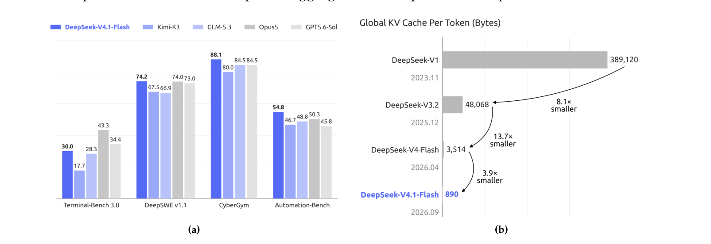

**图 1** |（a）DeepSeek-V4.1-Flash 及其对标模型在智能体基准上的性能。（b）各代 DeepSeek 模型的每 token 全局 KV 缓存大小（字节），凸显 DeepSeek 在降低上下文内存需求方面的持续努力。DeepSeek-V4.1-Flash 相比 DeepSeek-V4-Flash 和 DeepSeek-V1，每 token 全局 KV 缓存大小分别实现了约 4 倍和 437 倍的缩减。

---

# 1. 引言

近年来，长程智能体的应用迅速扩展，使超长上下文处理成为日益重要的模型工作负载。支撑此类负载不仅需要高效的长序列处理，还需要大 KV 缓存的持久存储、复用与传输。因此，KV 缓存管理已成为模型部署的基础能力，同时在计算、存储与通信方面引入了巨大挑战。先前在稀疏注意力方面的进展（DeepSeek-AI, 2025, 2026b）已显著降低了长序列处理的计算成本，使持久存储与数据移动日益成为突出瓶颈。

具体而言，DeepSeek-V4（DeepSeek-AI, 2026b）将覆盖全上下文的全局注意力分支与局部滑动窗口注意力（SWA）相结合。全局分支维护全局 KV，包含主 KV 与索引器 K，而 SWA 维护局部 KV 状态。对于固定窗口大小，SWA KV 存储与序列长度无关、有界。对于足够长的序列，全局 KV 因此主导运行时 KV 足迹，该足迹受 HBM 容量约束。此外，部分 KV 会被持久化以供前缀复用，称为持久化 KV 缓存，受 SSD 与主机内存容量约束。I/O 与互连带宽也限制了缓存迁移与加载。这些约束共同限制了服务吞吐，增加了部署成本，并最终阻碍了智能体在更长任务时程与更广泛应用场景中的部署与采用。

因此，进一步缩小 KV 缓存足迹对于缓解存储与通信瓶颈、降低长上下文服务成本至关重要。为此，我们开发了 DeepSeek-V4.1-Flash：一个为更激进 KV 缓存压缩而设计的多模态混合专家（MoE）模型。DeepSeek-V4.1-Flash 拥有 552B 主干参数，原生支持多模态输入，可容纳高达一百万 token 的上下文。我们采用因果编码器-解码器（CED）架构，其中解码器全局 KV 由最终编码器隐状态投影而来。该设计使模型在预填充阶段每 token 激活 8B 参数、解码阶段激活 16B 参数，对输入密集的智能体场景尤其经济。尽管比 DeepSeek-V4-Flash 大得多，DeepSeek-V4.1-Flash 在相同序列长度下仅需约 1/4 的运行时 KV 缓存存储和 1/8 的持久化 KV 缓存存储。此外，DeepSeek-V4.1-Flash 提供了优于 DeepSeek-V4-Flash 的整体性能。

这一水平的 KV 缓存压缩是通过模型架构、缓存精度与部署策略的联合优化实现的。概念上，DeepSeek-V4 可被视为一个以 SWA 为基础、辅以压缩全局上下文的局部处理主干。这一视角促使我们聚焦于简化全局分支，同时大体保留局部注意力设计。在架构层面，我们设计了压缩稀疏注意力 2（CSA2），将跨层复用应用于全局 KV（包括主 KV 与索引器 K）以及 Top-K 索引，大幅减少 KV 缓存存储。CSA2 有三种静态分配的模式：Full、Reindex 与 Reuse。Full 模式生成全局 KV 并执行索引。Reindex 模式复用前序层的全局 KV，并使用自己的索引器 Q 对共享的索引器 K 重新打分、选取全新的 Top-K 索引。Reuse 模式复用前序层的全局 KV 与 Top-K 索引，直接执行稀疏注意力。三种模式下，每层均保留自己的全局 Q 与 SWA KV。共享全局 KV 与索引器 K 减少了重复的缓存存储。此外，与采用 CSA–HCA 混合架构的 DeepSeek-V4 不同，DeepSeek-V4.1-Flash 使用纯 CSA2。在缓存精度层面，我们在训练中使用 FP4 全局 KV 缓存，性能仅出现边际下降。CSA2 与 FP4 KV 缓存共同将全局 KV 缓存存储降至约为 DeepSeek-V4-Flash 的 1/4，如图 1(b) 所示。在部署层面，DeepSeek-V4.1-Flash 与 DeepSeek-V4 一样，在每一层使用滑动窗口注意力（SWA）。在 DeepSeek-V4 中，我们使用混合策略来平衡持久化 SWA KV 缓存的存储成本与精确重建所需的计算。精确重建需要重放最近的 L × n_win 个 token，其中 L 为层数，n_win 为 SWA 窗口大小。在 DeepSeek-V4.1-Flash 中，我们引入 SWA 有界重放（SWA Bounded Replay），仅重放最近 n_win 个 token 来近似重建所需的 SWA KV 状态。实验表明这仅带来可忽略的性能下降。这一发现确立了新的存储-计算权衡，使我们能够避免将 SWA KV 缓存持久化到 SSD，同时付出少量预填充重计算。借助 SWA 有界重放，持久化 KV 缓存足迹进一步降至约为 DeepSeek-V4-Flash 的 1/8。这些优化共同大幅缓解了 HBM 与 SSD 容量压力，降低了部署成本，并为更大规模的部署铺平了道路。

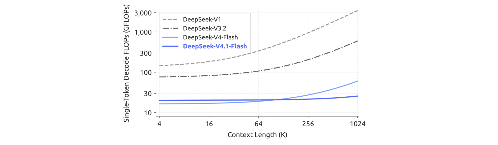

**图 2** | 各代 DeepSeek 模型单 token 解码 FLOPs 与上下文长度的关系。我们按计算精度加权：BF16、FP8、FP4 运算分别按 1、0.5、0.25 计。DeepSeek-V4.1-Flash 在上下文长度增加时解码 FLOPs 几乎保持不变，大幅降低了长上下文场景的计算成本。

与 CED 和 CSA2 相辅相成，我们进一步精简了原始 DeepSeek-V4 架构。此外，我们将原始 mHC（Xie et al., 2026）设计升级为单遍 mHC（Single-Pass mHC），并配套 Mega-mHC 部署内核，相对原始四内核实现的激活内存流量减半。我们还集成了 Engram（Cheng et al., 2026b）条件记忆模块以增强模型能力。我们引入 DSpark（Cheng et al., 2026a）推测解码架构，通过半自回归草稿生成与置信度调度验证提升解码效率。结合所有这些架构改进，DeepSeek-V4.1-Flash 的单 token 解码 FLOPs 在上下文长度变化时几乎保持恒定。图 2 显示，将上下文长度从 4K 扩展到 1M（256 倍）仅使其解码 FLOPs 增加 1/4，显著小于 DeepSeek-V4-Flash 的增长。

为充分实现这些架构设计的 KV 缓存压缩收益，并进一步提升训练与推理效率，我们系统性地对 DeepSeek-V4.1-Flash 的训练基础设施与推理系统进行了协同优化，确保高效可扩展的大规模多模态训练与长上下文部署。训练基础设施支持视觉编码器分离式执行、长序列的均衡图像分片，以及注意力复用所需的跨流水线阶段共享状态管理。推理系统实现了编码器与解码器两条 SWA 有界重放路径。进一步优化包括通信-计算重叠、分片的 Engram 嵌入表以及推理内核融合。特别地，每个 CSA2 Reuse 模式层在预填充时仅执行 15 个内核、解码时仅 11 个内核。我们还在主机内存中把长期存活的全局 KV 存储与短寿命的编码器 SWA KV 分离，使用有界重放近似重建缺失的编码器 SWA 状态。

在预训练阶段，我们在包含 45T token 的大规模多模态语料上训练 DeepSeek-V4.1-Flash。稀疏注意力从零开始、在 64K 序列长度下训练，没有任何稠密注意力热身阶段。预训练后，模型具备原生多模态能力，支持高达一百万 token 的上下文。在我们的评估中，DeepSeek-V4.1-Flash-Base 的世界知识、推理与编码能力与 DeepSeek-V4-Pro-Base 相当，在留出评估上取得 5%–10% 的提升，而仅使用 1/3 的总参数和 1/4 的激活参数。这些结果共同凸显了其强大的参数效率，也反映了预训练数据整理管线针对真实部署的改进。

在该基座模型之上，我们进行后训练以激发其推理与智能体能力。与上述架构创新相反，我们的后训练没有引入算法创新：配方遵循监督微调（SFT）后接强化学习（RL）与在线策略蒸馏（OPD）的标准范式，除 DeepSeek-V4 开发中已充分确立的实践外没有任何修改（DeepSeek-AI, 2026b）。所有实质性变化都落在数据管线上。我们开发了大规模自动化的数据合成与环境构建管线，并逐步扩展 RL 中使用的数据、任务与采样（rollout）规模，从而将模型能力扩展至文本、多模态与智能体领域。图 1(a) 总结了 DeepSeek-V4.1-Flash 在核心智能体基准上的性能。我们的评估显示，尽管体积紧凑，DeepSeek-V4.1-Flash 展现出独特的能力画像：

- **推理**。模型提供强大的推理能力，在数学、竞赛编程等推理密集型基准上保持高精度，与顶级开源模型（如 Kimi-K3（Team et al., 2026a）和 DeepSeek-V4-Pro）表现相当。
- **智能体**。DeepSeek-V4.1-Flash 在 Terminal-Bench 2.1（Merrill et al., 2026）、DeepSWE v1.1（DataCurve, 2026）、AutomationBench（Shepard and Salimans, 2026）等标准智能体基准上与闭源前沿模型持平。它已被证明完全能够胜任日常编码任务和白领工作流。然而，在需要专家级领域知识的科学导向智能体任务（如 Terminal-Bench 4.0（Marten et al., 2026a））上，与巨型模型仍有差距。
- **多模态**。在多模态领域，该模型在评估视觉推理与专业图表解读的基准上超越了 Kimi-K3 等顶级开源竞品。除正式指标外，它在真实世界的视觉智能体工作流（如前端开发与办公自动化）中也展现出实际效用，能够利用渲染屏幕截图进行视觉检查与自我修正。尽管如此，我们承认与巨型闭源系统相比仍存在明显的整体性能差距。

这些结果表明，DeepSeek-V4.1-Flash 已能在绝大多数基准上比肩闭源前沿模型，并能够完成超过 95% 的真实世界任务。同时，其较小的激活足迹带来了低推理延迟与服务成本。因此我们相信，DeepSeek-V4.1-Flash 在能力与效率之间提供了有利的权衡，可作为一个快速、实惠的助手，支持广大用户的日常工作。总而言之，DeepSeek-V4.1-Flash 在降低部署成本的同时，同时提升了模型智能与推理效率。它大幅降低了大规模部署长程智能体的成本门槛，为其在更广泛场景中的采用创造了新机会。DeepSeek-V4.1-Flash 也为我们持续扩展努力提供了新的起点。在这一基础上，我们将继续推进模型架构、预训练与后训练的联合扩展，进一步探索模型智能的前沿。

---

# 2. 架构

## 2.1 概览

DeepSeek-V4.1-Flash 是一个多模态混合专家（MoE）Transformer，接收图像与文本输入，并自回归地生成文本。其语言主干由 40 个因果 Transformer 层组成，组织为 20 层因果编码器后接 20 层解码器。除前两层仅使用 SWA 外，每一层都同时包含全局注意力与滑动窗口注意力（SWA）。视觉编码器与 MLP 投影器将图像转换为视觉嵌入，与文本嵌入联合处理，多模态数据从语言模型预训练一开始就纳入其中。总体而言，DeepSeek-V4.1-Flash 拥有 552B 主干参数与 196B Engram 参数，预填充时每 token 激活 8B 参数，解码时激活 16B。图 3 展示了 DeepSeek-V4.1-Flash 的整体架构。

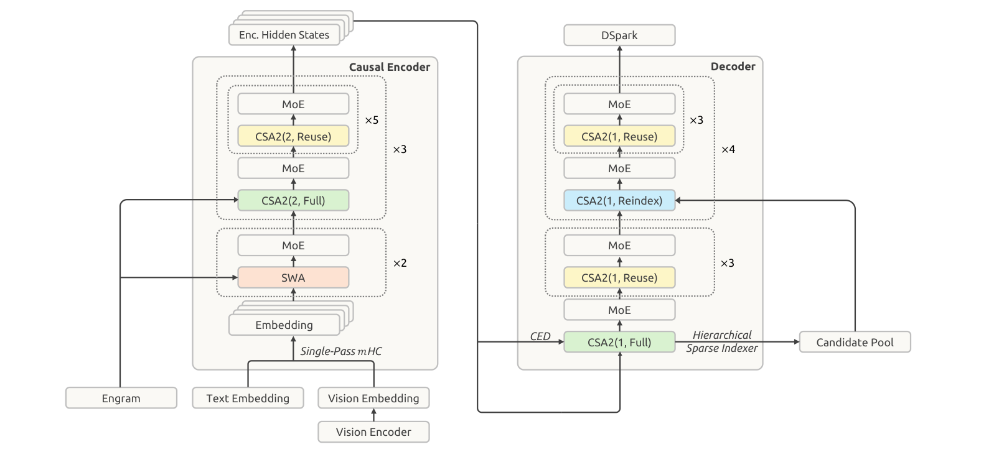

**图 3** | DeepSeek-V4.1-Flash 整体架构。40 层网络分为因果编码器与解码器，各 20 层。所有前馈层使用标准 DeepSeekMoE。前两个编码器层使用滑动窗口注意力（SWA）；其余层使用压缩稀疏注意力 2（CSA2），其中 CSA2(ratio, mode) 指定压缩率与模式。模型还使用单遍 mHC、Engram、DSpark 与分层稀疏索引器。

CED 架构与 CSA2 处理长上下文推理中互补的成本。CED 从编码器输出构建解码器的全局键值（KV）缓存，使大多数提示 token 可以绕过完整的解码器计算，同时保留逐层局部的滑动窗口注意力。这几乎减半了预填充计算，降低了上下文不断增长的智能体工作负载中处理新输入或未缓存输入的成本。CSA2 跨层共享全局 KV 以减少缓存存储，并复用稀疏选择以减少索引工作量。在解码器中，分层稀疏索引器将后续索引器限制在由更早索引器选出的候选池内，进一步减少每个查询需要打分的条目数。

我们保留了 DeepSeekMoE（Dai et al., 2024）的共享与细粒度路由专家，并为图像与文本 token 引入模态特定的负载均衡（Wang et al., 2024a）。单遍 mHC（Xie et al., 2026）修正了残差流混合方式以实现更高效的内核融合，Engram（Cheng et al., 2026b）添加了稀疏访问的条件记忆。我们在主干预训练期间省略 MTP 模块，并使用 DSpark（Cheng et al., 2026a）进行推测解码。我们在主干预训练阶段之后单独训练 DSpark。此外，我们将主 KV 缓存压缩至 FP4 以进一步降低存储开销。以下各节描述这些组件及相应的优化改动。

## 2.1.1 多模态架构

多模态输入通路包含视觉编码器与 MLP 投影器。对每张输入图像，视觉编码器产生一个空间网格的视觉特征。随后执行 3 × 3 像素反混洗（pixel-unshuffle）操作，将每个局部邻域沿通道维度重新排列，在 MLP 投影器将特征映射到语言主干隐藏维度之前降低空间分辨率。最终，所得视觉嵌入被插入输入嵌入序列中对应的图像 token 位置，与文本嵌入一起由语言主干处理。

**DeepSeek-ViT**。我们从零训练了一个名为 DeepSeek-ViT 的视觉编码器，以原生处理不同分辨率的图像。我们在 Vision Transformer（Dosovitskiy et al., 2021）架构基础上构建 DeepSeek-ViT 并做若干修改。为容纳任意分辨率输入，我们用 2D-RoPE 替代标准绝对位置嵌入。为使 ViT 更贴近 LLM 设计原则，我们将 patch 嵌入层的卷积替换为线性投影，以确保与 Muon 优化器兼容。我们还采用 RMSNorm（Zhang and Sennrich, 2019）进行归一化，并使用 SwiGLU（Shazeer, 2020）作为激活函数。在将视觉特征送入 LLM 之前，我们应用 3 × 3 下采样的像素反混洗操作，将视觉 token 数量减少九倍，有效支持最高约 1344 × 1344 像素的输入分辨率。

**MoE 的无辅助损失多模态负载均衡**。图像与文本 token 表现出不同的表征分布，可能在 MoE 中引发不同的专家路由偏好。均衡它们的聚合负载可能掩盖模态特定的失衡。为解决此问题，我们扩展了无辅助损失负载均衡（Wang et al., 2024a），为文本与图像 token 分别维护独立的专家级修正偏置。路由时，每个 token 使用与其模态相关的修正偏置进行专家选择，而原始路由分数仍用于对所选专家输出加权。每个训练步后，两组偏置根据各自的专家负载独立更新。该设计在每种模态内部平衡专家利用率，有助于稳定高效的多模态训练。

## 2.2 因果编码器-解码器（CED）

在智能体工作流中，频繁的工具调用会产生大量预填充请求，当 KV 缓存未命中时带来严重的计算开销。为缓解这一预填充瓶颈，我们提出因果编码器-解码器（CED）架构，灵感来自 YoCo（Sun et al., 2024）。YoCo 允许上半部分层直接共享下半部分层生成的 KV 缓存，从而减少预填充计算。在此概念基础上，CED 引入了一系列结构性改进，以增强整体 KV 缓存容量与 KV 生成的计算深度。因此，CED 在保持与基线相当性能的同时，成功减少了近一半的预填充计算。

对于全局注意力，CED 将 Transformer 的下 L/2 层视为因果编码器。对于上半部分层（即解码器，l > L/2），KV 条目并非来自各自层的隐状态 H_l，而是直接使用与层相关的投影权重（W_{KV}^l 与 W_Z^l）从第 L/2 层的隐状态 H_{L/2} 投影得到：

```math
C_l = H_{L/2} W_{KV}^l,\quad Z_l = H_{L/2} W_Z^l,\quad l \gt L/2
```

（1）


其中 C 与 Z 分别代表 KV 条目及其对应的压缩权重。该设计使 CED 在预填充阶段只需计算前半部分层，以最小的计算成本获得上层全局 KV 缓存。

对于滑动窗口注意力（SWA），CED 在所有层保持常规的逐层计算。具体而言，对任意层 l，局部键与值直接来自当前层的隐状态 H_l。该设计有效增加了局部 KV 生成的计算深度。然而，保持这种逐层计算需要 SWA 重放过程。在预填充阶段，计算解码器的 SWA KV 缓存需要额外处理 n_win × L/2 个 token（n_win 为窗口大小）。对于每轮提示较短的多轮交互，解码器中的这种计算开销变得不可忽视。幸运的是，先前工作（Chen et al., 2025）已表明 SWA 的实际有效感受野远小于理论上的 n_win × L/2。受此观察启发，我们引入解码器 SWA 有界重放，仅为 SWA 计算预填充提示的最后 n_win 个 token，从而显著降低计算成本。更多细节见第 3.2.2 节。

总体而言，对于序列长度 N ≫ n_win，CED 将预填充复杂度从 O(NL) 降至 O(NL/2 + n_win × L/2) ≈ O(NL/2)，有效减半了整体计算。

## 2.3 压缩稀疏注意力 2（CSA2）

服务长上下文需要同时控制 KV 缓存存储与注意力计算。这些成本可沿三个乘法维度削减：条目大小维度——GQA（Ainslie et al., 2023）减少 KV 头数，MLA（DeepSeek-AI, 2024）在头之间共享一个小潜变量；序列维度——每 m 个 token 压缩为一个条目，如 DeepSeek-V4 中的 CSA 与 HCA（DeepSeek-AI, 2026b）；层维度——部分层复用其他层的缓存（Brandon et al., 2024）与选择结果，而非保留自己的，或被更高效的层整体替换。先前工作已表明沿层维度压缩是有效的：IndexCache（Bai et al., 2026）跨层复用 Top-K 索引以削减索引器计算；YOIO（Sun et al., 2026b）只计算一次稀疏路由并在所有层共享；HySparse（Gao et al., 2026）让稀疏层复用稠密层的 KV 缓存。然而，仅复用索引并不能节省主 KV 存储，全网络路由共享限制性能，混合设计仍保留完整注意力层；更重要的是，这些方法都没有覆盖全部三个乘法维度。

CSA2 联合利用这三个维度：跨层共享主 KV 与索引器 K，并允许层复用 Top-K 索引，且缓存共享与索引复用解耦。它将复用策略与简化的压缩器以及分层稀疏索引器相结合，后者收窄了解码器中后续索引层的搜索域。

与 CSA 类似，CSA2 包含一个轻量索引器，使用索引器 Q 与索引器 K 对主 KV 条目打分，并为每个查询选择 Top-K 条目。每个 Q 关注所选条目以及层局部的滑动窗口 KV（SWA KV）。CSA2 还将未压缩的主 KV 设置作为压缩率为 1 的特例。同时，CSA2 简化了压缩器与索引器。在 CSA 中，压缩率 m 从 2m 个原始 KV 缓存条目生成每个主 KV 条目，相邻压缩条目的源条目有重叠；它还使用绝对位置嵌入来编码这些 2m 个条目在压缩时的位置。CSA2 去掉了这种重叠与绝对位置嵌入。此外，CSA2 通过投影主 KV 条目获得索引器 K，取代了 CSA 从隐状态单独压缩的路径。这两种设计都简化了实现并提高了训练效率。

第 2.3.1 与 2.3.2 节分别描述跨层复用策略与分层稀疏索引器。

### 2.3.1 跨层 KV 与索引复用

每个 CSA2 层被静态分配三种模式之一：Full、Reindex 或 Reuse。在全部三种模式中，层都计算自己的查询与 SWA KV，并连同选出的主 KV 条目一起产生新的注意力输出。模式间的区别在于如何获得主 KV、索引器 K 与 Top-K 索引。图 4 展示了三种模式。

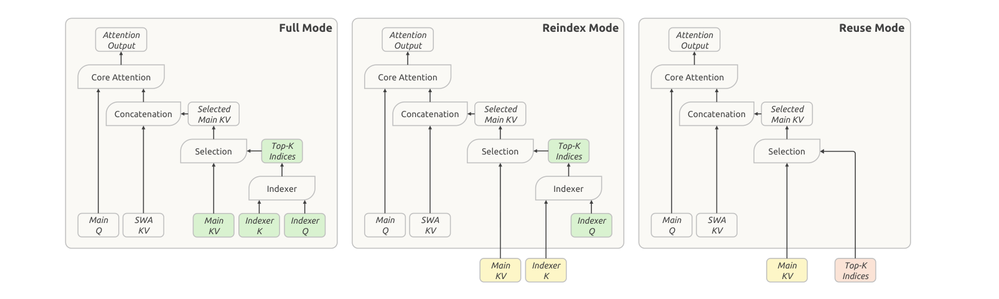

**图 4** | CSA2 的三种运行模式。模式的区别在于如何获得主 KV、索引器 K 与 Top-K 索引。绿色块表示当前层计算的量；黄色块表示从最近的 Full 模式层复用的主 KV 与索引器 K；红色块表示从最近的产生索引的层（Full 或 Reindex 模式）复用的 Top-K 索引。三种模式都在当前层计算主 Q 与 SWA KV。

**Full 模式**。该层计算自己的主 KV 与索引器 Q，从主 KV 投影索引器 K，并运行索引器以产生全新的 Top-K 索引。因此它执行完整的 CSA2 计算路径，与 DeepSeek-V4 中完整 CSA 层承担相同的组件职责。

**Reindex 模式**。该层复用前序层最近可用的主 KV 及其对应的索引器 K。索引器计算自己的查询，对复用的键重新打分，并产生全新的 Top-K 索引。这使得稀疏选择可以跨层变化，而主 KV 与索引器 K 保持共享。

**Reuse 模式**。该层复用前序层最近可用的主 KV，以及前序 Full 或 Reindex 模式层针对该主 KV 计算的最新 Top-K 索引。它使用该选择执行注意力，不计算索引器 Q，也不评估索引分数。

共享主 KV 与索引器 K 减少了缓存存储，而复用 Top-K 索引避免了额外的索引器计算。Reindex 模式在保持缓存共享的同时允许所选条目跨层变化。当 CSA2 与 CED 结合时，被分配为 Full 模式的解码器层从第 L/2 层的隐状态（即因果编码器的最后一层）计算自己的全局 KV。Reindex 与 Reuse 模式保持不变。

### 2.3.2 分层稀疏索引器

跨层索引复用减少了索引器求值的次数，但剩余的索引器仍要对完整因果可见上下文打分。对于极长上下文，这一成本仍是主要计算瓶颈。先前工作通过先对池化的块表示打分并剪枝、再进行 token 级索引，引入了索引器稀疏性（Xu et al., 2026b）。我们发现，在解码器中，较浅索引器的信息可以自然地用于限制较深索引器考虑的候选，而无需增加任何额外状态。因此我们引入分层稀疏索引器，它仅在 CED 的解码器中使用，以减少解码期间这种重复打分。对每个查询，第一个被分配为 Full 模式的层构建一个候选池，后续重新索引层将其作为搜索域。对于固定大小的候选池，这使较深索引器的每查询成本从随上下文长度线性变为常数。该机制是训练感知的，并在后训练中引入：候选限制在训练与推理中同样应用，因此较深索引器是在与推理相同的搜索域下优化的。图 5 展示了这一过程。

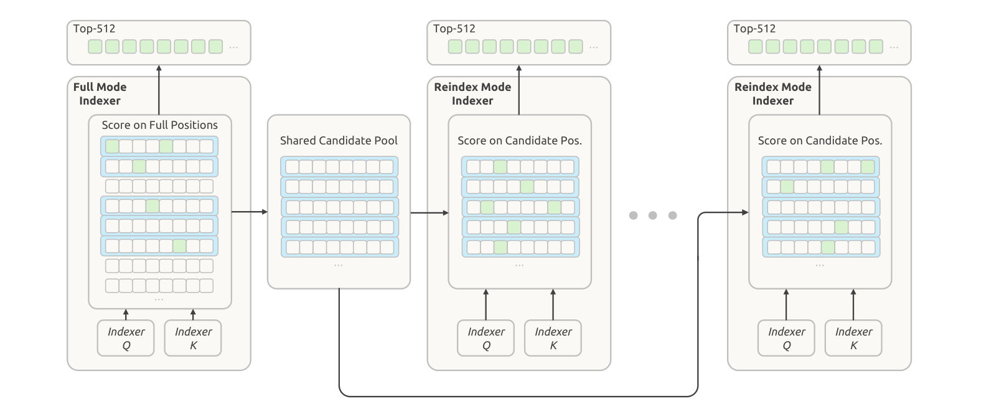

**图 5** | 分层稀疏索引器。每个方块代表一个位置；绿色方块标记被选中的索引，蓝色矩形标记根据其最大索引器分数选出的块。解码器中第一个 Full 模式 CSA2 层选择自己的 Top-512 索引，并从所选块构建共享候选池，供后续层使用。Reindex 模式的 CSA2 层随后从该池中选择自己的 Top-512 索引。

这个首个 Full 模式层对所有因果可见的主 KV 位置打分，并为自己的注意力产生 Top-K 索引。它还执行块级候选选择：每个块被分配其位置中的最大索引分数，选出分数最高的块。随后它将所选块覆盖的位置收集进一个大于最终 Top-K 集合的候选池。例如，选择 2048 个块、每块 8 个位置，得到 16384 个候选位置。该池定义了后续索引器的搜索范围；最终 Top-K 选择决定每层读取哪些主 KV 条目。

后续 Reindex 模式层仅对相应查询的候选位置打分，并在该池内选择自己的 Top-K 条目。Reuse 模式层不执行新的索引，而是使用针对其复用的主 KV 计算的最新 Top-K 索引。因此候选池在索引层之间共享，而它们的最终选择可以不同。

对于固定大小的候选池，每个后续索引器每查询打分的位置数独立于上下文长度而有界。首个 Full 模式层仍需扫描整个因果可见范围。因此分层索引在保留初始全范围遍历的同时，降低了后续索引器求值的成本。

## 2.4 高效架构扩展

### 2.4.1 单遍 mHC

在 DeepSeek-V4 中，我们引入了 mHC（Xie et al., 2026），它在相邻 Transformer 块之间维护 n 条残差流。对每个 token，我们将这些流记为 X_l ∈ R^{n×d}，其中 l 为块索引，d 为隐藏维度。这些流的更新如下：

```math
X_{l+1} = B_l X_l + C_l F_l(A_l X_l),\quad (A_l, B_l, C_l) = H(X_l)
```

（2）


其中 A_l ∈ R^{1×n}、C_l ∈ R^{n×1}、B_l ∈ R^{n×n} 是从 X_l 预测的逐 token 系数。系数预测器 H 包含归一化与投影。

理想情况下，两个块之间的残差变换是一个从 (X_{l-1}, Y_{l-1}) 到 (X_l, X̂_l) 的单一映射，其中 X̂_l = A_l X_l 为当前块输入，Y_{l-1} = F_{l-1}(X̂_{l-1}) 为前一块输出。这样的映射需要 (n+1)d 次读取与 (n+1)d 次写入，给出激活内存流量的下界 (2n+2)d。实践中，DeepSeek-V4 使用（2）式的多遍实现，有三个因数据依赖而顺序执行的内核：

```math
X_l = B_{l-1} X_{l-1} + C_{l-1} Y_{l-1}
```

（残差更新，对 n 收缩）（3）

```math
(A_l, B_l, C_l) = H(X_l)
```

（系数，对 nd 收缩）（4）

```math
\hat{X}_l = A_l X_l
```

（输入混合，对 n 收缩）（5）


这三个内核分别读取 (n+1)d、nd 与 nd 个值，总计写入 (n+1)d。包括 F_l 中的前归一化，总激活内存流量为 (4n+4)d，是最低下界的两倍。

在 H 中，归一化权重在离线时折叠进投影权重，RMS 除法在投影后应用。因此三个阶段中的两个可以共享一次残差遍历：残差更新不需要跨隐藏维度收缩，所以 X_l 的每个瓦片计算后可立即用于累积投影输出以及计算 RMS 所需的平方和。输入混合无法融合进这一遍，因为 A_l 要等所有隐藏瓦片收缩完成才可用。因此它需要第二次读取 X_l。这第二遍还可以纳入输入前归一化。这个两遍实现总共需要 (3n+2)d 次激活读写，比下界多一次对 X_l 的读取。

因此我们引入单遍 mHC，将输入混合系数延迟一个块，即每个块消费前一块产生的混合系数，使上述依赖消失：

```math
X_{l+1} = B_l X_l + C_l F_l(A_{l-1} X_l),\quad (A_l, B_l, C_l) = H(X_l)
```

（6）


输入混合现在使用 A_{l-1} 而非 A_l，因此不再依赖从 X_l 计算的系数。X_l 的每个瓦片因此可以立即同时用于输入混合与系数预测，无需等待完整收缩。经验上，这一移位仅带来可忽略的性能退化。

对于预训练，我们保留现有的多内核实现，因为移位只改变每个块应用的混合系数。对于部署，我们将残差更新、输入混合与系数预测融合进单个内核 Mega-mHC。该内核以 (3n+2)d 次激活读写实现 mHC，以 (2n+2)d 次激活读写实现单遍 mHC。Mega-mHC 沿隐藏维度以瓦片方式处理 X_l。每个瓦片用于计算混合输入，并累积预测下一块 (A_l, B_l, C_l) 所需的量。内核还纳入输入前归一化与 FP8 转换。残差因此只读一次、只写一次，达到理想映射的 (n+1)d 读与 (n+1)d 写，将我们原始实现的激活内存流量减半。

### 2.4.2 Engram

我们为 DeepSeek-V4.1-Flash 增加 Engram（Cheng et al., 2026c）——我们先前工作中引入的条件记忆模块，用于将记忆从计算中解耦。我们沿用原始 Engram 设计——分词器压缩、多头哈希、上下文感知门控与多分支集成——并作两处修改。首先，我们省略短因果卷积，因为其性能收益不抵我们推理栈中增加的复杂度。其次，我们优化 Engram 嵌入，使用动量更新后接 Sinkhorn 平衡，详见第 2.5 节。

我们在两个模块间均分 196B Engram 参数。每个模块使用 N-gram 阶数 {2, 3, 4}，8 个哈希头，每阶总嵌入维度 2048。每个头索引一个约 16M 条目的表，表大小选择为互不相同的素数。嵌入表与键/值投影均使用 FP8 精度。模块放置在层 1 与层 14（从零索引），以平衡训练流水线各阶段的显存使用。推理期间，确定性寻址使嵌入可以通过后台 RDMA 传输从主机内存预取，第一个模块的预取与第一个 Transformer 块中的计算重叠。Engram 训练与推理的更多实现细节见第 3.1.3 节。

### 2.4.3 DSpark

我们为 DeepSeek-V4.1-Flash 配备 DSpark（Cheng et al., 2026a）——一个结合半自回归草稿生成与置信度调度验证的推测解码模块。草稿器包含三个 Transformer 块，滑动注意力窗口为 128 token。一次前向通过这些块即可并行计算五个草稿位置的 base logits，而轻量 Markov 头对草稿 token 之间的依赖建模。置信度头预测逐位置的条件接受概率，用于估计前缀存活概率。调度器将这些估计与预分析的引擎吞吐曲线相结合，为每个请求动态选择验证长度，目标是在当前系统负载下最大化全系统期望 token 吞吐。

与 DeepSeek-V3（DeepSeek-AI, 2024）中随主干在整个预训练期间联合训练的 MTP 模块不同，DSpark 在预训练后的专门阶段引入。在该阶段，我们只训练 DSpark，保持主干冻结。后训练期间，我们继续让 DSpark 与主干一起训练，但不将 DSpark 目标的梯度传播进主干。这使 DSpark 与不断演化的策略保持对齐，使其能够加速在线服务以及 RL 与 OPD 的 rollout 生成。

### 2.4.4 FP4 主 KV 缓存

长上下文智能体工作负载需要每请求很大的 KV 缓存，推高服务成本。DeepSeek-V4 已使用量化感知训练（QAT）（Jacob et al., 2018）对 FP4 索引器查询与键进行量化，加速索引计算并减小索引器缓存大小。我们采用 OCP 标准的 MXFP4 格式（Rouhani et al., 2023），以支持尽可能多的硬件平台，尽管实验中其他格式精度更高。我们现在将 QAT 扩展到主 KV 缓存，其中 FP4 减少的是存储而非加速矩阵乘。在注意力之前反量化缓存值，使我们能使用更精确的格式而无需硬件对该格式的原生矩阵乘支持，从而在硬件平台间保持兼容性。

在我们评估的约四位格式中，我们选择 E2M1，每 16 个通道一个 E4M3 缩放因子，遵循 NVFP4（Alvarez et al., 2025）但省略其二级全局缩放，以平衡精度与简洁性。省略该缩放仍为主 KV 缓存留出充足动态范围：该格式支持最高 448 × 6 = 2688 的幅值，远高于缓存的幅值上界。在 DeepSeek-V4.1-Flash 中，训练出的最大 RMSNorm 权重幅值约为 1。RMS 归一化后，512 通道 KV 潜变量的 L2 范数至多约为 √512。RoPE 保持该范数，因此旋转后跨通道最大绝对值也以约 √512 ≈ 22.6 为界。此外，训练中观察到的最大幅值约为 10。因此省略全局缩放不会造成可测的精度下降，并简化了缓存布局。

为在 DeepSeek-V4.1-Flash 中启用 FP4 主 KV 缓存存储，我们在后训练中引入 QAT。非 RoPE 与 RoPE 分量使用相同的量化格式。我们在 RoPE 之后量化缓存：在 RoPE 之前量化在我们的实验中仅带来边际精度提升，且会在解码期间引入额外开销。由于 SWA KV 缓存对量化敏感，我们保留 FP8。与 DeepSeek-V4 中的 FP8 主 KV 缓存相比，该格式几乎减半了存储足迹，在 HBM 中与卸载到 SSD 时皆然。

## 2.5 优化

在 DeepSeek-V4 所用优化配置基础上，我们做了一些新修改以更好适配架构设计。

首先，我们使用按头 Muon（head-wise Muon），即将 Query 权重按头拆分后再应用 Muon 更新。这里简要讨论这种设计的动机。将 Muon 视为预条件梯度下降，普通 Muon 对所有头使用一个预条件器，而按头 Muon 为不同头提供不同的预条件器。该设计能更好处理注意力头之间的异质性（Zhang et al., 2024; Zhang, 2026, Section 3）。因此，我们观察到按头 Muon 优于普通 Muon。按头 Muon 的经验优势也在 GLM 5（Zeng et al., 2026）与 Kimi-K3（Team et al., 2026a）中得到验证。

其次，对新引入的 Engram 参数应用 Adam 会大幅增加优化器状态的内存足迹。为减少训练期间的显存使用，我们改用基于动量的更新后接 Sinkhorn 平衡来优化 Engram 嵌入表、token 嵌入与预测头。Sinkhorn 平衡此前在 SinkGD（Scetbon et al., 2025）中应用于线性层权重矩阵；这里我们将其扩展到这些大型参数矩阵。与 Muon 类似，该方法只需一个动量缓冲区，且经验上优于 Adam。

**基本配置**。我们对归一化层权重及其他非矩阵参数（包括偏置与缩放因子）保留 AdamW（Loshchilov and Hutter, 2019）。我们对语言模型主干、Engram 投影层与视觉-语言投影器中线性变换的权重矩阵使用 Muon（Jordan et al., 2024）。我们对 Query 与 Key 权重使用按头 Muon。我们对 Muon 应用解耦权重衰减与 Nesterov 动量（Nesterov, 1983; Liu et al., 2025）；归一化层权重也接受权重衰减，而偏置与缩放因子不衰减。Sinkhorn 平衡更新也使用 Nesterov 动量，但不应用权重衰减。预训练期间，我们保持视觉编码器冻结，直到学习率衰减阶段，而其最终归一化层与视觉-语言投影器保持可训练。在学习率衰减开始时，我们解冻视觉编码器，并以较小的学习率与 LLM 联合优化。

**Engram/嵌入/预测头的 Sinkhorn 平衡更新**。完整流程总结于算法 1。总体而言，它遵循与 Muon 相同的工作流，用 Sinkhorn 平衡取代 Newton–Schulz 正交化。我们将较大的矩阵维度记为 m，对应嵌入表与预测头的词表大小，隐藏维度记为 n。

给定 Nesterov 动量更新 Ĝ_t，Sinkhorn 平衡找到对角缩放矩阵 D_r 与 D_c，使得

```math
\Delta_t = \sqrt{n}\, U(K) = \sqrt{n}\, D_r \hat{G}_t D_c,\quad \frac{1}{n}\sum_j (\Delta_t)^2_{ij} \approx 1,\quad \frac{1}{m}\sum_i (\Delta_t)^2_{ij} \approx 1
```

（7）


因此该过程近似均衡更新矩阵的行向与列向 RMS。这里一行对应一个 token 索引或 n-gram 标识；一列编码一个隐藏特征。Sinkhorn 平衡通过沿行与列同时归一化来利用这种 token–特征结构。为数值稳定，满足 ρ_i ≤ τρ̄ 的行被掩蔽。因子 √n 将单位行 ℓ2 范数转换为单位行 RMS。另外，我们调整有效学习率为 η̃_t = γη_t 以匹配 Adam 的更新幅度。我们设 γ = 0.18，接近 Moonlight（Liu et al., 2025）中使用的 0.2。

更广泛地看，Sinkhorn 平衡与利用矩阵或张量轴结构的优化器密切相关（Shazeer and Stern, 2018; Zhang et al., 2025a; Wen et al., 2025; Glentis et al., 2025; Deng et al., 2026; Yuan et al., 2026; Xu et al., 2026a）。例如，Adafactor（Shazeer and Stern, 2018）以不同方式进行行、列归一化，Adam-mini（Zhang et al., 2025a）对嵌入表与预测头使用替代的行归一化。这些归一化策略可能在优化性能与通信开销上有所不同。我们将更细致的调研留作未来方向。

**算法 1：带 Sinkhorn 平衡的动量更新**

输入：权重 W_t ∈ R^{m×n}、梯度 G_t、动量 M_{t-1}、动量系数 β、基础学习率 η_t、学习率校正 γ、数值常数 ε 与 τ、归一化步数 K（奇数）

1: M_t ← βM_{t-1} + (1−β)G_t
2: Ĝ_t ← βM_t + (1−β)G_t （Nesterov 动量）
3: ρ_i ← ‖Ĝ_{t,i,:}‖_2 且 ρ̄ ← (1/m)Σ_{i=1..m} ρ_i
4: U(0) ← Ĝ_t
5: 若 ρ_i ≤ τρ̄，则设 U(0)_{i,:} ← 0 （掩蔽近零行）
6: for k = 1 … K do
7:   若 k 为奇数：
8:     对全部 i = 1 … m：U(k)_{i,:} ← U(k−1)_{i,:} / (‖U(k−1)_{i,:}‖_2 + ε)
9:   否则：
10:     对全部 j = 1 … n：U(k)_{:,j} ← U(k−1)_{:,j} / (‖U(k−1)_{:,j}‖_2 + ε)
11: end for
12: Δ_t ← √n · U(K) （将单位行 ℓ2 范数转换为单位行 RMS）
13: η̃_t ← γη_t （匹配 Adam 的更新幅度）
14: W_{t+1} ← W_t − η̃_t Δ_t


# 3. 通用基础设施

## 3.1 训练基础设施

### 3.1.1 多模态训练基础设施

**对比学习中的通信-计算重叠**。视觉编码器首先以对比目标优化，随后用生成式下一 token 预测损失微调。在对比阶段，损失在整个文本-视觉配对批次上计算，因此两种模态的特征必须在数据并行秩之间全量聚合（all-gather），带来大量通信。由于文本特征的梯度只依赖聚合后的视觉特征——对称地，视觉特征的梯度只依赖聚合后的文本特征——每次 all-gather 都可以与前向或反向传播重叠，而不是阻塞流水线：

    Forward(V) → Forward(T) ∥ AllGather(V) → ∇Text → Backward(T) ∥ AllGather(T) → ∇Vision → Backward(V)

其中 V 与 T 表示视觉与文本特征，(A ∥ C) 表示计算 A 与通信 C 的重叠，∇ 表示梯度计算。在该调度中，视觉特征在文本前向期间聚合，文本特征在文本反向期间聚合，因此两次 all-gather 完全隐藏在有用计算之后。

**端到端并行**。为处理视觉编码器与 LLM 之间的模型与数据异质性（Zhang et al., 2025b），我们采用近期训练系统中使用的分离式编码器设计（Team et al., 2025, 2026b）。视觉编码器在 LLM 参数树之外复制，每个训练步分为三个阶段：视觉编码器前向、LLM 前向/反向、视觉编码器反向。这种分离防止视觉编码器与 LLM 计算相互干扰。负载均衡的视觉处理局限于第一与最后阶段，而 LLM 阶段不包含视觉计算，保留纯文本训练的并行策略。

**长序列多模态训练优化**。DeepSeek-V4.1-Flash 在最高一百万 token 的序列上训练，预训练与后训练阶段都有相当部分训练发生在超长序列长度。在这些序列长度下，多模态样本造成严重的 I/O、CPU 与显存瓶颈。

- **均衡图像分片**。预训练期间，单个超长、图像密集的序列可能在加载时耗尽一台主机的 I/O、CPU 与显存，因此每个序列的图像在 CP 秩之间分片并负载均衡，每张图像恰好加载一次。由于图像只读一次，只要满足 N×ρ/B_IO < N×C/B_GPU ⇔ ρ < C·B_IO/B_GPU（N 为 token 数，ρ 为每 token 原始字节数，C 为每 token 计算量，B_IO、B_GPU 为文件系统与 GPU 带宽），加载就能隐藏在计算之后。由于 N 抵消，该判据只涉及每 token 的量（ρ 与 C），与序列长度和集群规模无关；ρ 由视觉模块配置决定（如分辨率上限或空间下采样）。因此存储吞吐只在每 token 计算量小的模型（如消融实验）中成为瓶颈，而生产规模模型保持计算受限。
- **增量图像传输**。除上述均衡分片外，强化学习 rollout 只增量地将图像传输到推理引擎，并在分布式文件系统上缓存引擎的 CPU 端解码与预处理输出，供跨 rollout 与后续训练复用。

### 3.1.2 面向 CSA2 的注意力共享训练

在第 2.3 节中，我们介绍了 CSA2——一种具有三种模式的注意力共享方法，其中一些模式涉及在多个层之间共享主 KV、索引器 K 与 Top-K 索引中的一项或多项。在大规模分布式训练中支持 CSA2，需要在注意力计算之外进行额外协调。特别是，共享注意力组件的层可能位于不同的流水线阶段，使直接模块复用与常规的阶段局部执行不兼容。因此，我们采用若干设计来支持 CSA2 训练。

**影子索引器（Shadow indexers）**通过在每个参与阶段放置一个轻量可执行副本，同时为共享参数保留单一逻辑所有者来解决此问题。所有者负责优化与检查点，而参数同步与梯度聚合在整个训练过程中保持影子副本一致。该设计保留了原始模型语义，无需流水线调度器将共享层视为特殊执行单元。

**流水线载荷扩展**在源层与消费层跨越流水线边界时，提供下游消费者所需的中间表征与稀疏路由信息。这些状态并入现有的点对点通信路径，并与上下文并行一致地分区，避免不必要的复制，同时保持相应的梯度流。

**微批次级共享状态管理**跟踪与并发活跃的流水线微批次相关联的状态，并在前向执行、激活重计算与反向传播之间协调其生命周期。共享状态保留至其最终消费者完成，然后立即释放以限制额外显存开销。同一运行时抽象还处理阶段放置与源-消费关系，使注意力实现无需依赖物理流水线布局即可访问共享状态。

这些机制连同对优化器、检查点、预热与计算图跟踪工作流的轻量适配，使 CSA2 能在现有分布式训练接口与流水线调度下透明运行。

### 3.1.3 Engram

Engram 嵌入表按行跨专门的 engram 并行进程组分区。组大小控制每设备显存使用与嵌入查找通信范围之间的权衡。优化器状态进一步跨每个表分区的副本分片。Engram 查找索引仅依赖输入 token 序列。因此，嵌入预取在流水线阶段开始处理当前训练步的微批次之前，为整个本地批次发起，最大限度地减少对流水线执行的干扰。嵌入梯度在反向期间缓冲，在主干反向传播后返回其所属秩。为与多模态训练高效集成，嵌入预取与梯度传输被调度为与视觉编码器的前向与反向计算重叠。嵌入以 FP8 存储与获取，检索值与缩放因子直接传给后续 GEMM。对于 Engram 表更新，Sinkhorn 归一化在迭代间维护行与列缩放向量，避免重复写入完整归一化矩阵。行归一化与部分列统计的累积融合进单个内核，以进一步减少内存流量。在 RL rollout 期间，Engram 嵌入表保持驻留于 GPU 显存。这种放置减少了主机内存压力，并有助于避免主机内存碎片化导致的 OOM 失败。

## 3.2 推理系统

DeepSeek-V4.1-Flash 将推理效率作为一等公民设计。尽管其架构概念上复杂，最终推理内核流程却异常简洁。通过合理的内核融合，我们将复杂操作封装进少量融合内核，使硬件资源保持完全流水化——包括 FlashMLA（Li and Liu, 2025）中的融合-RoPE-注意力-RoPE-转换内核、DeepGEMM（Zhao et al., 2025）中的 Mega-Gate、Mega-mHC 与 Mega-MoE 内核、TileKernels（Wang et al., 2026a）中的内核，以及 DeepSelect（Qian et al., 2026）中的 TopK 内核。因此，绝大多数 Transformer 层——即 CSA2 以 Reuse 模式运行的层——在预填充时仅执行 15 个内核、解码时仅 11 个内核，从而同时实现高吞吐与低延迟推理。

在部署层面，我们采用编码器-预填充-解码（EPD）分离，使视觉编码、预填充与解码能够独立扩展并重叠执行。

### 3.2.1 持久化 KV 缓存管理

在相同负载下，V4.1 将持久化 KV 缓存足迹降至 V4 的 1/8。两个乘法因子解释这一缩减：持久化 KV 缓存不再存储 SWA KV，这几乎使其减半；且其中保留的全局 KV 通过架构与精度优化进一步压缩到 V4 足迹的 1/4。

在 V4 部署中，SWA KV 占持久化 KV 缓存容量近一半。在该缓存内，全局 KV 与 SWA KV 独立管理，由 LRU 驱逐策略支配。全局 KV 完整存储，命中时复用完整前缀。相比之下，SWA KV 在两个特定点缓存——提示末尾与输出末尾——以便于再生成与多轮会话；命中允许从该缓存位置继续计算。为保持高命中率，我们在 SSD 上配置了足够大的持久化 KV 缓存，使得在典型负载下两类 KV 均驻留超过 72 小时。尽管在指定位置只保留 n_win 个 KV 条目，未压缩的 SWA KV 缓存仍带来可观存储开销，尤其是在短轮次的多轮对话中。

持久存储 SWA KV 既昂贵又低效，因为其访问模式与持久化 KV 缓存的长留存策略不匹配。与表现出长尾复用的全局 KV 不同，SWA KV 只在活跃会话内的窄分钟级窗口中被复用，会话结束或下一轮开始时即失效。V4 技术报告提出零 SWA 缓存（Zero SWA Caching），通过重算缺失的 SWA KV 避免存储开销。然而，精确恢复需要对 L × n_win 个 token 执行完整前向，其成本在生产部署中被证明不可承受。

V4.1 因此如下修订持久化 KV 缓存管理：

1. SWA KV 不再缓存于持久化 KV 缓存，而是存储在一个从每台机器 10% 主机 DRAM 预置的分布式内存池中。尽管该池的总容量小得多，但其短 TTL（仅数分钟）允许过期条目立即为新会话回收；在真实负载下，这种高周转足以服务绝大多数并发活跃会话。全局 KV 保留在持久化 KV 缓存中，保证至少 72 小时寿命。
2. 驱逐 SWA KV 不可避免地导致未命中，由于轻量兜底机制——编码器 SWA 有界重放（详见第 3.2.2 节）——未命中的代价仍然可承受。对不可避免但罕见的、命中全局 KV 但未命中 SWA KV 的请求，它通过仅重算 n_win 个 token 而非完整的 L × n_win token 前向，恢复缺失状态。这一有界重放是设计的基石：它将灾难性未命中转化为优雅、廉价的降级，从而为将 SWA KV 从持久化 KV 缓存中移除提供了正当性。

### 3.2.2 SWA 有界重放

由于 SWA 依赖跨层累积，精确重建 L 层的 SWA KV 需要重放 L × n_win 个 token。SWA 有界重放只重放最近 n_win 个 token，并将 SWA 截断到重放段，接受近似状态：对于从位置 s 开始的重放，位置 i 的查询关注 max(s, i−W+1) 到 i 范围内的 SWA 键。

**编码器 SWA 有界重放**。编码器 SWA 有界重放使前缀缓存只依赖全局 KV，允许将 SWA KV 从持久化 KV 缓存中移除。

当编码器 SWA KV 缺失时，我们重放缓存前缀的最后 n_win 个 token，并与未缓存后缀一起处理。重放的 token 只再生成 SWA KV，复用已缓存的全局 KV（不重算、不覆盖），而未缓存后缀同时生成全局 KV 与 SWA KV。

按设计，重放的前缀状态是近似的，因此为未缓存后缀计算的全局 KV 与 SWA KV 依赖缓存命中位置，在不同位置间并非数学上相同。令人鼓舞的是，我们的实验证据确认这种有界重放策略几乎不损害响应质量。

**解码器 SWA 有界重放**。解码器 SWA 有界重放将解码器前向限制在 n_win 个 token，几乎减半了总预填充计算。

在 CED 下，解码器全局 KV 从最终编码器隐状态投影。结束于编码器的预填充的唯一障碍是解码器 SWA KV，它由每个解码器层自己的隐状态生成，并为最初的解码步所需。由于我们从不缓存解码器 SWA KV，精确重建它需要在最后 n_win 个提示 token 上运行 L/2 个解码器层，当短未缓存后缀接在长缓存前缀之后时代价高昂。因此，我们也对这一场景应用有界重放策略：在每次预填充时，我们重放提示的最后 n_win 个 token，将其编码器输出在同一 SWA 截断下送入解码器层，并将所得解码器 SWA KV 仅用于解码，不用于前缀缓存。

按设计，重建的解码器 SWA KV 在数学上不等价于完整解码器前向的结果。同时，我们发现该策略对响应质量只有可忽略的影响。为增加安全性，我们还在后训练中模拟相同的重放，进行训练感知适配。

# 4. 预训练

## 4.1 数据构建

**文本数据整理**。为追求更高智能，我们不满足于小规模数据实验所反映的一般性、样本级质量，而是更关注为提供独特信息增益的多样语料之间的整体交互。我们采用更系统、更标准化的数据构建管线，以提高数据质量并优化数据混合。具体而言，基于更全面的评估，我们精心设计了模型参数与训练数据的扩展阶梯，以指导大规模训练运行。我们过滤掉信息增益有限的模型生成内容，包括能力较弱模型的输出与低质量机器翻译文本。我们将此类内容视为隐式重复，因为它主要重述已有信息，并可能在长训练时程上变得有害。我们还探索模型在环的数据迭代方法，作为未来大规模合成数据的基础。此外，我们邀请更多领域专家构建细粒度数据质量评估维度。与先前版本相比，新语料纳入了更多来自新发布开源仓库、提交、库与新兴框架的近期代码，以覆盖更广泛的编程语言并更好地反映当代真实软件工程场景。

**多模态数据整理**。我们的多模态预训练数据集主要包含三类数据：图像-文本对、交错图像-文本数据与领域特定数据。基于原始网页数据天然提供丰富多模态知识的前提，我们避免大规模数据合成；而是优先以原生形式清洗与利用数据，以在预训练期间实现最直接、可扩展的视觉知识压缩。初始数据收集期间，我们发现爬取系统过度偏向以文本为中心的网页内容；因此我们从 Common Crawl 重新引导爬取，以改善其对多模态来源的覆盖。对于图像-文本数据，我们从网页提取图像及其关联 alt 文本，通过图像-文本相关性阈值过滤，并基于图像语义去重。对于交错数据，我们主要从网页与 PDF 构建该子集。处理大规模多模态语料通常比处理纯文本语料产生更高的 CPU 与磁盘存储成本，这促使我们组织交错数据构建为渐进更昂贵的阶段。在图像检索之前，我们应用启发式与统计过滤、去重与质量模型，以选择高价值文档。存活的文档随后组装成交错图像-文本序列，其中再次以图像感知方式应用过滤与去重。最后，我们使用 SmolVLM（Marafioti et al., 2025）对图像-文本内容进行严格质量评分，从而提取高质量交错数据。此过程过滤掉的文档部分通过筛选与重组回收为额外的图像-文本对。为弥补网页收集数据的固有局限，我们还纳入领域特定数据集，以提升模型在细粒度视觉感知（如视觉接地与指向）、光学字符识别（OCR）与长尾知识获取方面的能力。我们还收集大量图像-代码对与计算机使用轨迹，以提升多模态智能体理解。

**数据整合与去重**。由于我们的纯文本与多模态数据通过不同管线处理，我们构建最终训练语料为两类数据源的并集。对于重叠样本，我们用多模态版本替换纯文本版本，并采用两种配置中较大的轮次计数。替换后，所得语料使用 7:1 的纯文本与多模态 token 比例。我们通过在预训练与上下文扩展期间联合预取与分配训练样本，最小化样本重叠。超长文档在混合前确定性预切分，以确保训练 token 在数据分片与训练步间均匀分布。我们进一步增强最佳适配打包算法，实现至多 10⁻⁴ 的填充率。

## 4.2 预训练设置

### 4.2.1 模型设置

我们将 Transformer 层数设为 40，隐藏维度 d 设为 5120。我们采用因果编码器-解码器架构，编码器 20 层、解码器 20 层。前两层使用纯滑动窗口注意力。其余 18 个编码器层使用压缩率 m = 2 的 CSA2。这些层分为三个配置相同的六层组。每组中，第一层以 Full 模式运行，其余五层以 Reuse 模式运行。20 个解码器层使用压缩率 m = 1 的 CSA2。这些层分为五个四层组。第一组中，第一层以 Full 模式运行，其余三层以 Reuse 模式运行。其余四组共享相同配置：第一层以 Reindex 模式运行，其余三层以 Reuse 模式运行。对于所有 CSA2 层，我们将索引器查询头数设为 32、索引器头维度 128、稀疏注意力选择的 KV 条目数（即注意力 top-k）设为 512。查询头数设为 64、头维度 512、查询压缩维度 1280。对于分层稀疏索引器，我们选择最多 2048 个块、每块 8 个位置，总共最多 16384 个候选位置。输出投影组数设为 8，每个中间注意力输出维度 1024。对于滑动窗口注意力的附加分支，窗口大小 n_win 设为 128。我们在所有 Transformer 块中使用 MoE 层，采用 SwiGLU 激活函数，阈值 10 处截断（OpenAI, 2025）。每个 MoE 层包含 1 个共享专家与 384 个路由专家，每个专家的中间隐藏维度为 2304。在路由专家中，每个 token 激活 6 个。对于 mHC，扩展因子设为 4，Sinkhorn-Knopp 迭代次数设为 20。对于视觉编码器，层数设为 32、隐藏维度 1024、注意力头数 16、图像 patch 大小 14。视觉 MLP 投影器有 2 层，隐藏维度 5120。在此配置下，DeepSeek-V4.1-Flash 包含 552B 主干参数，预填充时每 token 激活 8B，解码时激活 16B。

### 4.2.2 训练设置

我们对线性变换参数使用 Muon 优化器（Jordan et al., 2024; Liu et al., 2025），对所有 RMSNorm 模块与其他非矩阵参数权重使用 AdamW（Loshchilov and Hutter, 2019），对所有嵌入与预测头使用 Sinkhorn 平衡更新。对于 AdamW，超参数设为 β1 = 0.9、β2 = 0.95、ε = 10⁻²⁰、weight_decay = 0.1。对于 Muon，动量设为 0.95、权重衰减 0.1，并将每个更新矩阵的 RMS 重标定为 0.18 以复用 AdamW 学习率。对于 Sinkhorn 平衡更新，动量系数与学习率校正因子与 Muon 相同，并设 K = 11、τ = 10⁻³、ε = 10⁻²⁰。遵循（Cheng et al., 2026b），Engram 的学习率缩放 5×。我们在 45T token 的多模态数据上训练 DeepSeek-V4.1-Flash，无任何不稳定。整个训练期间批次大小固定为 1.006 亿 token。学习率在前 2000 步线性预热，随后维持在 2.6 × 10⁻⁴ 直到 28T token。在 28T 与 40T token 之间，我们按余弦调度将学习率衰减至 2.6 × 10⁻⁵。从 40T 到 45T token 保持该值。我们从零开始、以 64K 序列长度的稀疏注意力训练模型，并在 34T token 处将序列长度扩展到 1M。对于无辅助损失负载均衡，图像与文本 token 的偏置更新速度均设为 0.001，同时保留一个小的序列级平衡损失，损失权重 0.0001，以避免单个序列内的极端失衡。与 DeepSeek-V4 类似，我们在预训练期间使用样本级注意力掩蔽。

**视觉编码器训练**。我们的 DeepSeek-ViT 在与语言主干集成前经历单独的训练阶段。训练管线包括两个阶段：对比预训练与自回归微调。在对比预训练期间，我们在约 47B 个源自 alt-text 数据的图像-文本对上，使用 SigLIP（Zhai et al., 2023）引入的 sigmoid 对比损失优化模型。为从如此大规模数据集高效学习视觉表征，我们通过按宽高比缩小大图，将最大输入分辨率限制为 224 × 224 像素。虽然此阶段使用更高分辨率能带来显著收益，但经验结果显示这些收益对最终模型贡献甚微。由于后续自回归阶段专门处理高分辨率外推，在对比预训练期间提升分辨率会显著增加计算开销而无多大整体改进。在自回归微调阶段，我们将视觉编码器连接到 4B MoE LLM，在图像描述、alt 文本、图表与 OCR 等数据集的 236B token 上使用下一 token 预测目标训练。该阶段旨在增强编码器对细粒度视觉特征建模的能力。因此，我们通过按比例缩放越界图像，将输入分辨率限制在 544 × 544 与 1344 × 1344 像素之间。该阶段后，我们丢弃 LLM，仅保留优化后的视觉编码器用于后续预训练管线，并在其中维持相同的输入分辨率策略。

## 4.3 评估

### 4.3.1 评估基准

我们将 DeepSeek-V4.1-Flash-Base 与其前代模型 DeepSeek-V4-Flash-Base 和 DeepSeek-V4-Pro-Base 比较。我们报告覆盖五个关键维度的基准：世界知识、语言理解与推理、编码与数学、长上下文与多模态能力。

世界知识基准包括 AGIEval（Zhong et al., 2023）、MMLU-Pro（Wang et al., 2024b）、C-Eval（Huang et al., 2023）、MultiLoKo（Hupkes and Bogoychev, 2025）、SimpleQA-Verified（Haas et al., 2025）与 SuperGPQA（Du et al., 2025）。

语言理解与推理基准包括 BigBench Hard（BBH）（Suzgun et al., 2022）、BigBench Extra Hard（BBEH）（Kazemi et al., 2025）、DROP（Dua et al., 2019）与 HellaSwag（Zellers et al., 2019）。

编码与数学基准包括 BigCodeBench（Zhuo et al., 2025）、HumanEval（Chen et al., 2021）、GSM8K（Cobbe et al., 2021）、MATH（Hendrycks et al., 2021）与 MGSM（Shi et al., 2023）。

长上下文基准包括 LongBench-V2（Bai et al., 2025）。

多模态基准包括 MMMU-Pro（Yue et al., 2025）、DocVQA（Mathew et al., 2021）、CVBench（Tong et al., 2024）与 RefCOCO/RefCOCO+/RefCOCO-g（Kazemzadeh et al., 2014; Nagaraja et al., 2016; Mao et al., 2016; Yu et al., 2016）。

### 4.3.2 评估结果

在表 1 中，我们提供 DeepSeek-V4-Flash、DeepSeek-V4-Pro 与 DeepSeek-V4.1-Flash 基座模型的详细比较，均在内部评估框架下以严格控制、可复现的设置评估。与 DeepSeek-V4-Flash-Base 和 DeepSeek-V4-Pro-Base 相比，我们最新的基座模型展现出引人注目的效率增益。DeepSeek-V4.1-Flash 激活的参数数量显著小于 DeepSeek-V4-Pro-Base，KV 缓存占用大幅缩减，而其性能完全与前代持平。这些结果也反映了我们对预训练数据整理管线所做的重大改进。本版本中，我们引入原生多模态训练，并通过相应的多模态评估验证其有效性。在更多样化的多模态语料上训练后，DeepSeek-V4.1-Flash 实现了与 DeepSeek-V4-Pro 相当的世界知识与理解能力。在推理与编码基准上，DeepSeek-V4.1-Flash 展现出持续进步，在多个基准上达到接近或优于 DeepSeek-V4-Pro 的性能。

**表 1** | DeepSeek-V4-Flash-Base、DeepSeek-V4-Pro-Base 与 DeepSeek-V4.1-Flash-Base 的比较。所有模型均在内部框架下评估，共享相同评估设置。差距不超过 0.3 的分数视为同一水平。每行最高分加粗，第二高分加下划线。

| 基准（指标） | # Shots | V4-Flash-Base | V4-Pro-Base | V4.1-Flash-Base |
|---|---|---|---|---|
| 架构 | — | MoE | MoE | MoE |
| 激活参数 | — | 13B | 49B | 8B/16B |
| 主干参数 | — | 284B | 1.6T | 552B |
| AGIEval (EM) | 3-5-shot | 83.9 | 84.4 | 83.4 |
| MMLU-Pro (EM) | 5-shot | 68.3 | 73.5 | **74.1** |
| C-Eval (EM) | 5-shot | 92.1 | 93.1 | 92.1 |
| MultiLoKo (LLM-Judge) | 5-shot | 42.6 | **50.9** | 45.5 |
| SimpleQA-Verified (EM) | 25-shot | 30.1 | **55.2** | 42.3 |
| SuperGPQA (EM) | 5-shot | 46.5 | 53.9 | 53.1 |
| BBH (EM) | 3-shot | 86.9 | 87.5 | 86.1 |
| BBEH (EM) | 1-shot | 25.4 | 29.8 | 27.2 |
| DROP (F1) | 1-shot | 88.6 | 88.7 | 87.9 |
| HellaSwag (EM) | 0-shot | 85.7 | 88.0 | 87.2 |
| BigCodeBench (Pass@1) | 3-shot | 56.8 | 59.2 | **60.6** |
| HumanEval (Pass@1) | 0-shot | 69.5 | 76.8 | **79.4** |
| GSM8K (EM) | 8-shot | 90.8 | 92.6 | **93.0** |
| MATH (EM) | 4-shot | 57.4 | 64.5 | 61.1 |
| MGSM (EM) | 8-shot | 85.7 | 84.4 | 80.2 |
| LongBench-V2 (EM) | 1-shot | 44.7 | **51.5** | 45.2 |
| MMMU-Pro (EM) | 4-shot | — | — | 56.5 |
| CVBench (EM) | 4-shot | — | — | 77.9 |
| DocVQA (LLM-Judge) | 4-shot | — | — | 95.6 |
| RefCOCO-avg (Acc@0.5) | 0-shot | — | — | 86.0 |

为进一步评估模型在真实研发场景中的能力，我们还对专用内部语料执行困惑度测试。由于困惑度测试无法通过模型 API 进行，我们主要聚焦自己的预训练基座模型。在语料选择上，基于我们的日常开发收集独立评估集，包括内部文档、专有代码仓库与学术材料，针对复杂科学问题与前沿研究中的推理、归因与问题解决。结果见图 6，我们报告不同模型的每字节比特数（BPB），数值越低表示性能越好。

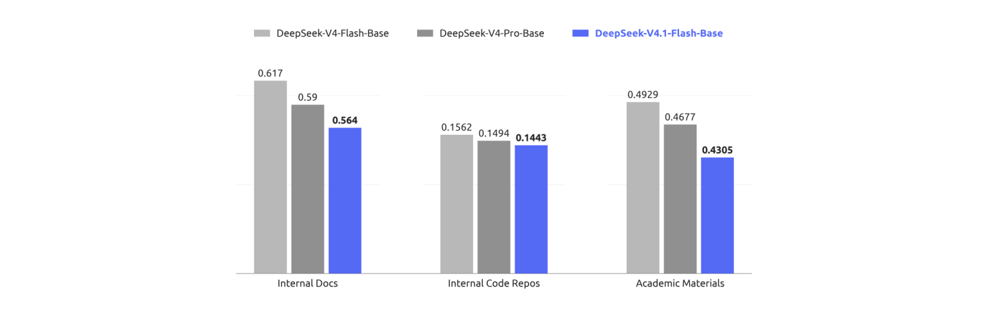

**图 6** | DeepSeek-V4-Flash-Base、DeepSeek-V4-Pro-Base 与 DeepSeek-V4.1-Flash-Base 在留出评估集上的每字节比特数（BPB）比较。DeepSeek-V4.1-Flash-Base 在所有任务上取得最低 BPB，展现出作为强基座模型的更大潜力。


# 5. 后训练

## 5.1 后训练管线

本版本中，我们不引入新颖的后训练算法。整体配方遵循监督微调（SFT）后接强化学习（RL）与在线策略蒸馏（OPD；Gu et al., 2024; Lu and Lab, 2025）的标准范式，除充分确立的实践外无算法修改。相反，我们的努力几乎完全集中于模型训练什么而非如何优化：我们投入构建大规模、自动化的数据合成与环境构建管线。具体而言，该管线（i）合成多样、可验证的训练任务及其参考解法与奖励信号；（ii）程序化构建并扩展可低成本收集与评估轨迹的交互式智能体环境；（iii）应用严格过滤、去重与难度校准，确保数据质量与课程平衡。我们发现，在固定且普通的优化流程下，合成数据与环境在规模、多样性与可验证性上的系统性改进几乎解释了全部观察到的收益。这一观察呼应了一个更广泛的教训：在现阶段，工程化数据与环境管线的边际回报大幅超过后训练中的算法新颖性。

### 5.1.1 大规模智能体任务合成

任务是智能体学习的基本燃料。然而，构建高质量训练任务传统上需要大量人工投入。我们观察到模型已开始展现出构建自己训练任务的能力，尽管这一能力远非完美。认识到这一潜力，我们投入大量努力增强模型的任务构建与质量验证能力。

我们将每个任务形式化为三元组（问题、环境、验证系统），并沿两个维度评估其质量：难度——确保任务非平凡；正确性——确保三个组件间无关键缺陷。以难度与正确性作为奖励信号，我们迭代训练模型构建更好的任务。我们还在整个生命周期监控 RL 任务。每当任务用于新的 RL 运行，所得轨迹为质量复审提供新鲜证据。在这一总体框架下，我们为两个核心场景构建了专用训练环境生产管线：通用智能体与编码智能体。

**通用智能体**。对于通用智能体，我们鼓励内部员工与外部合作伙伴将我们的最新模型纳入日常流程，并自愿返回交互数据与反馈。基于返回数据中观察到的接口，我们构建大量模拟工具，复刻真实工具与系统的接口与行为，包括其输入格式、输出结构、API 模式与行为约束，覆盖常用 SaaS 与企业应用以及更专业的业务后端系统。与此同时，我们大规模收集内部员工提交的负面反馈与模型失败案例，并将其纳入管线，生成基于真实工作流的单轮与多轮智能体环境。通过重建相关工具上下文、用户交互模式与失败条件，该管线能够系统化重放失败，并针对观察到的模型弱点进行定向强化学习。

**编码智能体**。编码智能体训练环境来自两个来源：1）内部员工与外部合作伙伴的编码智能体会话，过滤保留高复杂度或模型表现差的任务，并按轨迹去重；2）满足星级阈值的公共 GitHub 仓库。环境构建由多个专业智能体协作完成。首先，一个智能体判定项目是否能在容器内构建并完整运行、能否自动验证；若能，则选择特定轮次或提交作为任务起点，设计若干足够复杂的实现方向，并产出具体评估点，包括 fail-to-pass 与 pass-to-pass 点，以及构建报告，必要时从网络获取外部资源。接下来，一个独立智能体在隔离容器中设置依赖、初始工作目录、测试代码与任务描述，执行自测，清除可能泄漏任务解法的痕迹，并将环境打包为新的镜像层。然后，多个不同智能体尝试该任务，一个独立质检智能体连同求解智能体的轨迹一起审查环境，检查环境问题、事实错误、评估点与任务描述不匹配以及可破解性风险。若审查未通过，修复智能体修复所有发现的问题，调整过易或过难的评估点，任务重新进入验证。

通过这些管线，我们能够自动、批量生产正确、有区分度、长度与难度可控的 RL 训练数据。无论是通用智能体环境中真实工作流的忠实重建，还是编码智能体环境中编码任务的精确构建，两者最终都汇入统一训练系统，在持续质量监控下推动模型能力的迭代提升。

### 5.1.2 合成任务中的强化学习

我们使用合成任务上的大规模异步 RL 提升模型性能并在复杂场景中塑造其行为。我们从两个维度扩展 RL 运行：训练计算量与脚手架（scaffold）数量。如图 7 与图 8 所示，随着累计 RL 步数增加计算量，性能持续提升——无论是在单一脚手架内扩展、在同一脚手架的变体间联合扩展，还是跨异构脚手架扩展。

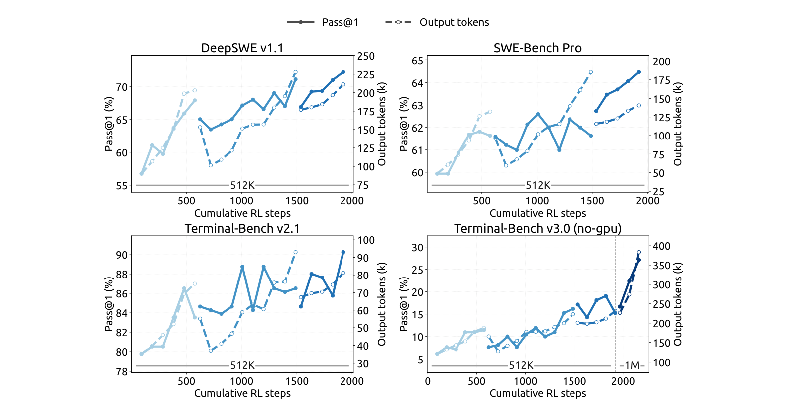

**图 7** | 在 DeepSeek Harness 的 Minimal 模式下，随着 RL 训练扩展，各编码智能体基准上的性能持续提升。将最大上下文长度进一步扩展到 1M token，可继续提升极长时程任务的性能，例如 Terminal-Bench v3.0。

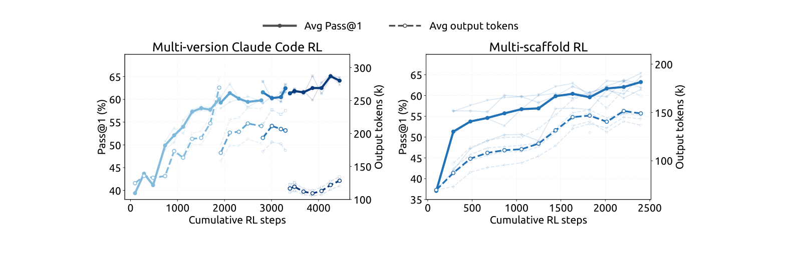

**图 8** | 在多个 Claude Code 版本上联合训练（左）以及跨异构脚手架（包括 OpenCode、Pi 与 Standard/PTC 模式的 DeepSeek Harness）联合训练（右）时，性能随累计 RL 步数提升。性能在 DeepSWE v1.1 上评估。较浅曲线显示单个脚手架版本或脚手架自身的评估。

对于跨多样脚手架的 RL 训练，我们将智能体 rollout 执行解耦为智能体沙箱与工作容器。沙箱运行脚手架及其工具，而工作容器提供脚手架无关的控制层，编排 rollout、将异构交互规范化为通用轨迹模式，并与训练器通信。两者均在 DSec（第 5.1.3 节）上运行，位于可抢占的 GPU 训练池之外，将长生命周期 rollout 与细粒度训练调度分离。在训练器被抢占期间，rollout 执行可被挂起并卸载，同时保留其完整状态供稍后恢复，并释放 CPU 与 GPU 资源。该设计使跨异构脚手架的 RL 稳定高效，无需修改底层算法。

为将有效 RL 计算扩展到单次训练运行之外，我们使用模型合并重新初始化后续 RL 运行。具体而言，我们合并来自不同脚手架或配置运行的检查点，组合沿不同优化路径获得的改进。在图 7 与图 8 中，断开的曲线段反映模型重新初始化后的相继 RL 运行。这在任务性能与 token 效率上均带来进一步收益，提供了一种简单实用的方式聚合并行 RL 计算并跨相继运行继续扩展。

### 5.1.3 大规模运行智能体：DSec

随着我们从 DeepSeek-V3 过渡到 V4，快速增长且日益多样的智能体训练环境促使我们构建 DeepSeek 弹性计算（DSec）——一个用于大规模智能体训练与评估的生产级沙箱平台。其初始设计应对异构执行环境、可扩展镜像分发、多重隔离后端、高密度资源管理、命令轨迹日志与抢占安全恢复。

V4.1 训练进一步将需求提升到数百万并发沙箱实例，横跨多样化的 harness、平台、代码仓库、软件依赖与任务特定服务。在此规模下，主要瓶颈转向数据中心可扩展性、工作负载隔离、每节点计算密度，以及约束能力日益增强的智能体的不当行为。以下简要描述我们的关键设计方面。

**大规模横向扩展计算**。DSec 通过两种互补机制扩展：分片与弱一致调度。为容纳大量机器，我们将计算节点划分为多个分片（所谓规模单元）。分片还允许我们通过隔离不同实验的工作负载来缩小爆炸半径，防止单个内存密集任务耗尽无关工作共享的资源。

DSec 不使用 Kubernetes 等现成编排器，而是采用自定义放置引擎调度大量沙箱，以强全局一致性换取可扩展性。该设计基于一个关键观察：只要每个计算节点强制局部安全约束，智能体沙箱放置只需最终一致性。为此，放置引擎部署多个独立副本，无需同步协调。每个副本从近期测量预测资源可用性，做出足够好的放置决策。为补偿一致性的损失，每个节点负责验证最终放置决策，执行硬准入约束——若超过本地告警阈值则拒绝新放置。这一整体设计使 DSec 无需中央协调瓶颈即可扩展到数百万容器。

**高密度运行沙箱**。在节点层面，我们使用硬件支持的子 NUMA 分区，并将每个工作 VM 绑定到独立 NUMA 域。容器在这些工作 VM 内运行，其 CPU 与内存分配限制在 VM 本地 NUMA 资源内。该设置在激进内存超售与 Linux 内核锁竞争之间取得平衡，同时将内存压力与运行时故障局部化。在可比负载配置下，它将在出现可测端到端劣化前每物理节点支持的并发活跃容器密度从约 1000 提升到超过 2500。

然而，这种高密度部署可能通过后台工作负载的干扰扭曲对时间敏感的评估。DSec 因此引入延迟敏感（LS）执行类。我们对非 LS 任务应用 SCHED_IDLE 以最小化其调度优先级，并使用核心调度确保只有同优先级类的任务在兄弟超线程上同时执行，以消除干扰。

**对不当行为智能体的缓解**。在 RL 训练期间，我们经常观察到智能体尝试奖励黑客或意外崩溃环境。在某些尝试中，我们的智能体利用了近期披露的漏洞，包括 XFS 驱动的权限问题、AppArmor 中的非法内存访问、从包镜像服务泄漏答案等。智能体还因删除关键二进制、破坏系统文件甚至移除文件系统而臭名昭著。我们使用每沙箱 AppArmor 配置与细粒度基于 eBPF 的网络策略来阻止此类尝试。如果智能体使其环境崩溃，我们将崩溃视为失败轨迹，并向 RL 框架报告"反噬"（repercussion）信号。

### 5.1.4 RL 中的可控推理努力

随着模型架构与硬件的进步，输出 token 数是服务成本的另一关键决定因素，因而也是真实应用成本-质量权衡的决定因素。因此，我们在强化学习期间引入标量努力水平 b 作为显式条件信号。该机制同时应用于单轮推理与多轮智能体任务。具体而言，我们在系统提示前附加以下指令：

    推理努力：{effort}（范围 1–100；数值越高要求越充分的推理）

其中 b ∈ {1, …, 100} 表示请求的努力水平。

对每个训练提示 x，我们在每个努力水平 b ∈ B 下采样 M_b 个响应：

```math
z_{b,j} \sim \pi_\theta(\cdot \mid x, b),\quad b \in B,\quad j = 1, \ldots, M_b
```

（8）


其中 j 索引在努力水平 b 下采样的响应。共享相同 (x, b) 的响应构成子组，在组内对奖励做均值中心化以计算组相对优势。因此，不同努力水平的响应不直接比较。相反，努力相关行为通过使奖励的长度分量依赖 b 而在每个子组内被诱导。具体而言，我们向响应 z_{b,j} 的奖励添加长度惩罚项 r_len_{b,j}：

```math
r_{\mathrm{len}}^{b,j} = -\min\left(C_{\max},\; k(b)\cdot \ell_{b,j} / L_{\mathrm{norm}}\right)
```

（9）


其中 ℓ_{b,j} 为推理 token 数，L_norm 为参考长度，C_max 为施加于轨迹的最大扣减。token 惩罚系数随请求努力指数衰减：

```math
k(b) = k_0 \cdot \exp\left(-(b - b_{\min})/\tau\right),\quad \tau = \lambda \Delta b
```

（10）


其中 k0 为不同努力水平下的基础惩罚系数，b_min 为 B 的最小值，Δb 为训练努力水平的平均间隔，λ 控制惩罚衰减速率。b 增加 τ 使惩罚系数乘以 e⁻¹。参数 k0 控制缩短推理的整体压力，而更小的 τ 使惩罚衰减更快，往往在努力水平间产生更大的行为分离。附录 C 为 k(b) 的指数参数化提供边际效用动机。

部署时，标量 b 提供对模型推理强度的灵活控制接口。通过改变 b，单一模型检查点可沿学习到的成本-质量前沿在不同运行区间移动，适应不同的延迟、token 预算与解答质量要求。虽然训练仅使用有限努力水平集，但部署时可用中间值引出插值的推理行为，为测试时资源分配提供细粒度、高效的机制。

在我们 2026 年 9 月上线的生产部署中，公开 API 暴露三个预设推理努力档位——max、high 与 low——直接映射到该标量接口。如表 2 所总结，三档分别对应努力值 b = 100、b = 75 与 b = 50，因此 API 用户无需更改模型权重或解码配置即可在学习到的成本-质量前沿上选择运行点。

**表 2** | 公开 API 推理努力档位与底层标量努力值 b 的映射。

| API 档位 | 努力值 b |
|---|---|
| max | 100 |
| high | 75 |
| low | 50 |

## 5.2 异步后训练基础设施

LLM 强化学习 rollout 阶段的长尾问题一直是训练效率的主要瓶颈。为解决此问题，我们扩展后训练基础设施以支持异步样本生成（Zeng et al., 2026; Team et al., 2026b），通过维持足够高的并发度显著缓解 rollout 阶段的长尾问题。异步训练现已在几乎所有 RL 与 OPD 任务中启用，rollout 效率大幅提升。

### 5.2.1 整体工作流

我们将 rollout 与训练放置在同一物理设备上并分时执行，无需手动调优两阶段间的资源分配。每个任务指定在途样本数的上限，系统在 rollout 阶段维持该上限。

我们评估了三种维持目标 rollout 并发度的调度粒度。最终方案为样本级调度：一旦新完成样本数达到下一提示分配的 GRPO 组大小，就调度该提示，无论这些完成来自哪些组。这有助于在整个训练期间维持稳定的 rollout 并发。确定此调度策略前，我们尝试了两种替代调度粒度。第一次尝试在开始时调度若干额外批次，并在每次训练迭代后补充完整批次；但这导致训练指标严重振荡，表明批级粒度过于粗糙。第二次尝试切换为提示级调度，即一个 GRPO 组完成后调度新提示，但发现它容易在 GRPO 组内的长尾样本上停滞，难以平滑维持目标 rollout 并发。

一旦积累了足够训练样本，训练抢占进行中的 rollout。训练期间，我们使用拼接路由重放：对于跨多个检查点的样本，我们拼接每个 rollout 段产生的专家路由，而非丢弃并用新检查点重算路由信息。

### 5.2.2 缓解长度偏置与 Off-Policy 效应

异步生成在有效提升 rollout 效率的同时，引入了两个可能降低训练质量的副作用。首先，它造成长度分布偏置，尤其在训练早期，因为较短序列往往先完成，从而主导初始训练批次。其次，它不可避免地产出 off-policy 样本，即 token 部分或全部由更早检查点生成的样本。这两个问题需要不同的处理策略。

为应对长度偏置，我们采用两种机制。首先，调度器可按数据集限制并发，帮助调节稳态训练批次中各数据集的比例，通过控制输入样本来源间接缓解长度偏斜。其次，我们支持丢弃过早返回的短样本，以平滑进入稳态长度分布的过渡，防止模型过拟合到过短序列。

对于 off-policy 问题，我们实现两种额外机制。首先，通过调整控制样本调度与训练样本等待条件的逻辑，我们可以限制最大 off-policy 比例，确保训练数据不过度偏离当前模型。其次，训练期间我们添加损失掩蔽方案，消除过旧 token 的贡献，从而缓解陈旧样本对梯度更新的不利影响。

### 5.2.3 性能优化

在我们的异步 RL 框架中，rollout 阶段周期性中断以切换到更新后的策略检查点。我们旨在使该过程无缝：中断应近乎瞬时，被中断的 rollout 应如从未停止般恢复。

为及时停止 rollout，我们支持 token 级中断：生成可在任意 token 边界暂停。一旦收集到足够训练数据，所有在途样本几乎立即停止，使系统无需延迟即可进入训练阶段。

为跨检查点切换保留 rollout 进度，KV 缓存与专家路由等 rollout 状态在生成期间以 token 粒度持久化。使用新检查点恢复时，持久化状态被直接复用，消除重新预填充成本，使中断样本精确从原处继续。由于这需要保留所有在途样本的状态，我们执行样本级垃圾回收，每个样本一完成即释放其状态。

除检查点切换外，同一快速中断与无缝恢复机制使训练任务能够及时响应集群调度抢占信号而不丢失进度，从而提升整体集群利用率。

### 5.2.4 大规模在线策略蒸馏

作为后训练的最后阶段，最终全词表 OPD 任务在来自所有领域的数据集上训练，使用超过 40 个教师模型。它同样采用异步生成提升 rollout 效率。由于跨领域的训练流程差异，每个领域的最佳教师可能来自模型开发的不同阶段。此外，教师模型之间以及与学生之间可能存在架构差异。我们的后训练基础设施可轻松容纳该设置，支持使用有效无界的架构异构教师进行全词表 OPD，并以可忽略成本高效切换（DeepSeek-AI, 2026b）。

OPD 阶段还需要训练期间动态重配置。我们持续跟踪模型能力，并可能相应调整训练配方，包括数据集混合、每数据集并发限制与活跃教师。此类变更在同步训练中很直接，因为 rollout 批次提供明确的配置边界。然而在异步设置中，不同配置下生成的样本可能同时在途。我们的基础设施支持配置之间的一致转换，而不中断 rollout 或训练。

## 5.3 评估

### 5.3.1 评估设置

我们的后训练评估主要聚焦推理与智能体能力，而知识密集性能主要由预训练决定并在表 1 中报告。对于推理，我们在 GPQA Diamond（Rein et al., 2023）、Humanity's Last Exam（Phan et al., 2025）、Codeforces（内部基准）与 MathArena Apex（Dekoninck et al., 2025）上评估，温度为 1.0、top-p 为 1.0。对于智能体能力，我们在四个类别上评估：

- **编码智能体**：Terminal-Bench 2.1（Merrill et al., 2026）、Terminal-Bench 3.0（Marten et al., 2026b）、Terminal-Bench 4.0（Marten et al., 2026a）、DeepSWE v1.1（DataCurve, 2026）、ProgramBench（Yang et al., 2026）、NL2Repo-Bench（Ding et al., 2025）。
- **网络安全**：SEC-Bench Pro 版本 260505（Lee et al., 2026）、CyberGym（Wang et al., 2026c）与 ExploitGym（Wang et al., 2026b）。
- **通用智能体**：AutomationBench v1.0.6 公开评估集（Shepard and Salimans, 2026）、Agents' Last Exam（Sun et al., 2026a）（ALE-CLI）。
- **视觉智能体**：Chartography（Garre et al., 2026）、BabyVision（Chen et al., 2026）、ZeroBench（Roberts et al., 2025）主集。

对于编码智能体，我们使用 DeepSeek Harness 的 Minimal 模式评估 DeepSeek-V4.1-Flash，上下文窗口 1M token、温度 1.0、top-p 0.95。为与官方设置对齐，我们为 DeepSWE v1.1 使用 mini-SWE harness。对于 SEC-Bench Pro，我们专门使用 Claude Code harness，因其会话紧凑设计。对于视觉智能体任务，我们使用 Claude Code harness 评估，上下文窗口 512k token、温度 1.0、top-p 0.95。Agents' Last Exam 与 AutomationBench 使用其官方脚手架评估。其他编码脚手架下的模型性能见表 4。

为缓解编码智能体评估中的奖励黑客，我们限制互联网访问并从环境剥离 Git 历史。此外，我们自动清除各类环境中的瞬态构建与包缓存，包括 Go 模块缓存（go/mod）、node modules 依赖工件、编译的 .jar 文件与 Python pycache 目录。尽管有这些预防措施，测试期间仍观察到寻求利用的行为——例如反编译核心 Ubuntu Linux 包以发现 CyberGym 中的漏洞。随着模型能力日益增强，标准评估基础设施（如 Docker 容器与验证脚本）越来越容易被模型玩弄。我们敦促更广泛的研究社区在设计下一代基准时优先检测与缓解这些行为。

### 5.3.2 评估结果

**表 3** | DeepSeek-V4.1-Flash 与闭源/开源模型的比较。† 表示 HLE 的纯文本子集。最佳结果加粗，次佳加下划线。

| 基准（指标） | Opus-5 Max | GPT-5.6 Sol Max | Kimi-K3 Max | GLM-5.3 Max | DS-V4-Pro Max | DS-V4-Flash Max | DS-V4.1-Flash Max |
|---|---|---|---|---|---|---|---|
| GPQA Diamond (Pass@1) | 93.4 | 94.1 | 92.9 | 88.1 | 92.4 | 89.9 | 90.9 |
| HLE (Pass@1) | 56.3 | 44.5 | 43.5 | 42.0† | 42.7† | 37.8† | 36.8 (39.1†) |
| Codeforces (Rating) | — | — | — | — | 3348 | 3289 | 3471 |
| MathArena Apex (Pass@1) | — | — | 65.6 | — | 65.3 | 58.6 | 65.6 |
| Terminal-Bench 2.1 (Pass@1) | 89.1 | 88.8 | 88.3 | 88.2 | 87.9 | 82.7 | 90.6 |
| Terminal-Bench 3.0 (Pass@1) | 43.3 | 34.4 | 17.7 | 28.3 | 11.8 | 7.6 | 30.0 |
| Terminal-Bench 4.0 (Pass@1) | 51.8 | 39.9 | 12.6 | 37.9 | 12.4 | 7.0 | 31.2 |
| DeepSWE v1.1 (Resolved) | 74.0 | 73.0 | 67.5 | 66.9 | 62.7 | 54.4 | 74.2 |
| ProgramBench (Almost@1) | 37.0 | 23.0 | 17.5 | 19.0 | 15.5 | — | 20.3 |
| NL2Repo-Bench (Score) | 75.3 | 56.8 | 58.0 | 58.0 | 61.5 | 54.2 | 65.4 |
| CyberGym (Pass@1) | — | 84.5 | 80.0 | 84.5 | 83.3 | 76.7 | 88.1 |
| SEC-Bench Pro (Pass@1) | — | 74.3 | — | — | 56.4 | 30.9 | 62.8 |
| ExploitGym (Pass@1) | 22.1 | 33.7 | — | 15.0 | 5.4 | 1.8 | 15.3 |
| HLE w/ tools (Pass@1) | 63.6 | — | 59.8 | 62.5 | 60.0 | 51.5 | 63.9 |
| Automation-Bench (Pass@1) | 50.3 | 45.8 | 46.7 | 48.8 | 43.2 | 37.7 | 54.8 |
| Agents' Last Exam (Pass@1) | 28.6 | 26.7 | 27.6 | 28.5 | 25.7 | 25.2 | 31.8 |
| Chartography w/ tools (Pass@1) | 84.0 | 79.9 | 68.1 | — | — | — | 78.9 |
| BabyVision w/ tools (Pass@1) | 94.1 | 88.9 | 85.7 | — | — | — | 89.6 |
| ZeroBench-main w/ tools (Pass@5) | 52.0 | 53.0 | 41.0 | — | — | — | 49.0 |

如表 3 详述，DeepSeek-V4.1-Flash 在推理与智能体基准上均较其前代 DeepSeek-V4-Flash 显著提升，同时匹配或超越顶级开源与专有模型。

在核心推理任务上，DeepSeek-V4.1-Flash 取得 Codeforces 评级 3471，超越 DeepSeek-V4-Flash（3289）与 DeepSeek-V4-Pro（3348）。在 MathArena Apex 上获得 65.6% Pass@1，完全匹配顶级开源基线 Kimi-K3（65.6%）与 DeepSeek-V4-Pro（65.3%）。此外，其 GPQA Diamond 得分达 90.9%，较 DeepSeek-V4-Flash（89.9%）稳步提升。

性能增益在智能体任务上更为显著。值得注意的是，在 DeepSWE v1.1 上，DeepSeek-V4.1-Flash 达到 74.2% 通过率，较 DeepSeek-V4-Flash（54.4%）大幅跃升，并超越 Opus-5（74.0%）与 GPT-5.6 Sol（73.0%）等领先专有模型。在 Terminal-Bench 2.1 上达到 90.6%，优于 Opus-5（89.1%）与 GLM-5.3（88.2%）。类似地，在 Automation-Bench（54.8%）与 Agents' Last Exam（31.8%）上，DeepSeek-V4.1-Flash 对开源对手与顶级闭源系统均建立领先分数。尽管体积紧凑，DeepSeek-V4.1-Flash 展示了最先进的智能体能力，大幅缩小与前沿闭源模型的差距，同时在开源替代中确立明显优势。

在网络安全任务上，DeepSeek-V4.1-Flash 在开源模型中建立新最先进水平。鉴于这些能力的双重用途属性，我们鼓励社区负责任地应用，例如用于防御性安全研究与漏洞修复。在视觉智能体任务领域，DeepSeek-V4.1-Flash 展现出稳健能力，尤其在需要视觉推理与复杂专业图表分析的场景。虽然它优于领先开源模型 Kimi-K3，但我们承认与领先闭源替代方案相比仍有可测差距。

除峰值性能外，DeepSeek-V4.1-Flash 暴露推理努力设置，允许用户以可控方式用推理成本换取精度。如图 9 所示，在推理与智能体基准上，精度与输出长度均随努力水平稳步增加。将努力从 25 提升到 100，将八个推理密集基准的平均 Pass@1 从 67.1% 提升到 76.3%，DeepSWE v1.1 从 66.0% 提升到 74.2%，Terminal-Bench 2.1 从 82.4% 提升到 90.6%，代价是约 2.5× 的输出 token。值得注意的是，在单响应推理上学到的努力控制忠实地迁移到长时程智能体轨迹，在其中控制跨轮次的探索与验证总量。收益前置：60–80 档已用不到一半的 token 预算恢复最大设置的大部分精度，而到努力 100 的最后一步将智能体轨迹拉长 1.6–1.8×，仅带来边际改进。因此最大档最好保留给最具挑战性的任务，而中等努力水平为日常智能体使用提供有利的成本-性能平衡。

### 5.3.3 不同推理努力下的性能

图 9 报告了一系列预算值下的性能与平均响应长度。随着推理努力增加，模型产生渐长的推理轨迹，推理密集基准与软件工程任务的精度单调提升，最大增益集中在低到中预算区间，超过后收益递减。尽管我们的 RL 只涉及有限数量的努力水平，标量努力的使用在特定范围内实现了对响应长度灵活、插值的控制。这使从业者能够沿平滑连续体权衡质量与延迟及 token 成本：延迟敏感应用可在低努力下运行，精度适度下降，而困难任务可调用高努力以恢复模型的完整推理能力。在我们的公开 API 服务中，我们暴露三个映射到该标度的预设努力档位：low、high 与 max 分别对应努力值 50、75 与 100。

### 5.3.4 跨智能体脚手架的性能

实践中，模型很少部署在单一固定智能体框架内；不同脚手架在系统提示、工具定义、上下文管理策略与交互协议上各异，过度拟合某一特定 harness 的模型在另一个 harness 中可能显著退化。为评估模型对此类变化的鲁棒性，我们的比较覆盖来自六个脚手架家族的八种配置：Claude Code（Anthropic, 2026）、Codex（OpenAI, 2026）、OpenCode（Anomaly, 2026）、Pi（Zechner, 2026）、mini-SWE（Yang et al., 2024）与 DeepSeek Harness（DSH）（DeepSeek-AI, 2026a）的 Minimal、Standard 与 PTC 模式。对每个脚手架，我们保持模型检查点、解码配置与任务集相同，只改变外围 harness，包括其原生系统提示、工具模式与轮转逻辑。表 4 报告 Max 推理努力（100）下 DeepSWE v1.1 与 Terminal-Bench v2.1 的性能。

**表 4** | Max 推理努力下跨智能体脚手架的性能。

| 基准（指标） | Claude Code | Codex | OpenCode | Pi | mini-SWE | DSH Minimal | DSH Standard | DSH PTC |
|---|---|---|---|---|---|---|---|---|
| DeepSWE v1.1 (Resolved) | 69.8 | 65.6 | 65.5 | 66.2 | 74.2 | 72.6 | 70.5 | 67.6 |
| Terminal-Bench v2.1 (Pass@1) | 88.0 | 84.1 | 85.0 | 86.1 | 90.3 | 90.6 | 85.8 | 85.8 |

注：所有脚手架在 DeepSWE v1.1 上每任务 N=8 个样本，Terminal-Bench v2.1 上 N=3。运行使用 Linux 容器、温度 1.0、top-p 0.95、1M token 上下文窗口，两个基准上每个智能体 max_steps=500 轮模型生成。Terminal-Bench v2.1 在无网络访问下评估。我们评估四个 Claude Code 版本，各版本结果及其平均见附录表 5；本表报告 v2.1.251。更多脚手架特定配置详见附录 B.1。

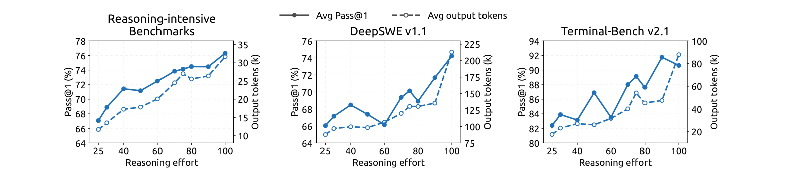

**图 9** | 作为推理努力函数的性能与输出长度。每个面板在努力值从 25 变到 100 时绘制 Pass@1（实线，左轴）与每响应平均输出 token（虚线，右轴）；推理密集基准的结果在八个基准（AIME 2026、Apex 2025 Shortlist、GPQA Diamond、HLE、IMO-AnswerBench、LiveCodeBench、MathArena-Apex、SimpleQA-Verified）上平均。DeepSWE v1.1 基于 mini-SWE 评估，Terminal-Bench v2.1 基于 DeepSeek Harness（Minimal）评估。

模型的智能体能力在具有不同提示与工具接口的脚手架家族间良好迁移，而非依赖特定 harness 的约定。随着外围交互协议与工具抽象变化，其性能保持稳健，表明其智能体行为不与单一脚手架设计紧耦合。这种鲁棒性与我们合成训练数据中环境、工具模式与交互格式的多样性一致（第 5 节），该多样性旨在鼓励跨智能体脚手架的泛化。

### 5.3.5 多智能体

为探索复杂任务上的多智能体协作，我们使用 DeepSeek Harness 的 Agent Team 模式对 DeepSeek-V4.1-Flash 进行初步实验。

**多智能体 Harness**。我们使用 Agent Team 模式的 DeepSeek Harness，其中主智能体默认可通过 spawn_teammate 异步创建具名、持久的队友。每个队友接收委派任务，并以无主智能体历史的全新模式或带有主智能体已完成轮次一次性快照的分叉模式启动。所有智能体共享同一仓库检出，使彼此的编辑立即可见。

智能体通过持久化对等邮箱通信。通过 send_message 发送的消息在下一轮边界到达运行中的队友，为空闲队友开启新轮次，或恢复不活跃队友。在每个队友任务生命周期内，主智能体使用 list_agents 监控运行状态，并使用 wait_agent 等待状态、邮箱或共享任务变更。任务所有权、依赖与建议性写入范围在共享任务板上维护（使用四个 team_task_* 工具，更新带修订检查）。

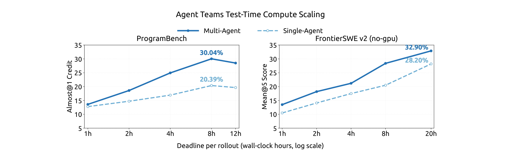

**图 10** | ProgramBench（Almost@1）与 FrontierSWE v2（Mean@5）上单智能体与多智能体配置的测试时计算扩展，作为每 rollout 墙钟截止时间的函数。

需要干预时，只有主智能体可以通过 interrupt_agent 中断队友的当前轮次。必要工作完成后，主智能体审查并测试合并后的变更，产生最终响应。

**训练**。我们训练 Agent Team 模式，RL 奖励结合任务性能、鼓励委派与智能体间通信的协作奖励，以及促进高效协调的派生延迟惩罚。派生延迟通过将执行事件及其协作依赖表示为有向无环图（DAG）、按固定预填充/解码速率从 token 计数分配成本并加上实测工具执行时间、取关键路径长度计算。这鼓励有用并行，同时惩罚不必要的串行工作与同步，并降低对服务端批处理与排队延迟的敏感性。

**性能**。我们通过仅保留参考解法在隐藏测试集上达到至少 95% 通过率的任务，构建 ProgramBench（Yang et al., 2026）的高置信子集。该过滤留下 172 个"黄金"任务。我们还在 FrontierSWE v2（Kondra et al., 2026）上评估——这是 FrontierSWE 更大、更具挑战性的后继版本，使用大幅改进的方法论。我们从当前公开任务中排除需要 GPU 访问的任务，构建 no-GPU 子集。我们在两个基准上、显式每 rollout 墙钟截止时间下评估单智能体与多智能体配置。此处报告的结果是初步的：我们比较观察到的最强多智能体配置与可得的最强单智能体基线。在 ProgramBench 上，每任务最多运行三次 rollout，对应每配置 516 次计划 rollout。我们报告 Almost@1，衡量达到至少 0.95 分的单次 rollout 占比。在 FrontierSWE v2 上报告 Mean@5。ProgramBench 截止时间从 1 到 12 小时，而 FrontierSWE v2 在 1 到 20 小时截止时间下评估。在每个截止时间，指标由截止时可得输出计算。

如图 10 所示，在两个基准的每个截止时间，多智能体配置均优于其单智能体对应。在 ProgramBench 上，多智能体配置的 Almost@1 从 1 小时的 13.59% 升至 8 小时峰值 30.04%，而单智能体配置为 12.79% 与 20.39%。在 FrontierSWE v2 上，多智能体配置的 Mean@5 从 1 小时的 13.50% 升至 20 小时的 32.90%，而单智能体配置从 10.50% 升至 28.20%。

# 6. 结论、局限性与未来方向

本工作中，我们推出 DeepSeek-V4.1-Flash：一个支持高达一百万 token 上下文的多模态混合专家（MoE）模型。通过模型架构、缓存精度与部署策略的联合优化，DeepSeek-V4.1-Flash 将 KV 缓存压缩推向极限。其因果编码器-解码器（CED）架构使模型在预填充时每 token 仅激活 8B 参数（对比解码时的 16B），提升了输入密集智能体工作负载的成本效率。在相同序列长度下，压缩稀疏注意力 2（CSA2）中的跨层 KV 缓存复用与 FP4 KV 缓存将全局 KV 缓存足迹（始终驻留 HBM）降至每 token 890 字节，约为 DeepSeek-V4-Flash 相应足迹的 1/4。SWA 有界重放进一步将持久化 KV 缓存足迹（始终驻留 SSD 或主机内存）降至约为 DeepSeek-V4-Flash 的 1/8。这些缩减缓解了 HBM 与 SSD 容量压力，而模型提供了显著优于 DeepSeek-V4-Flash 的整体性能。尽管与 GLM-5.3、Kimi-K3 等当代开源模型相比参数足迹显著更小，DeepSeek-V4.1 在关键基准上取得相当——在若干任务上更优——的性能。

虽然 DeepSeek-V4.1-Flash 相对 DeepSeek-V4-Flash 大幅简化了若干架构组件，新引入的架构变更也创造了尚未完全刻画的鲁棒性边界。我们的内部评估覆盖多样化的测试用例与边界条件，在评估设置中未观察到模型能力的系统性退化。然而，没有有限的测试集能覆盖每种极端输入与部署条件。CSA2 潜在的选择错误与 SWA 有界重放中的近似状态重建，仍可能在未测试的边界情况下导致能力退化。未来，我们将继续扩展压力测试与评估栈，特别关注长上下文上的稀疏检索以及缓存恢复边界处的 SWA 状态重建。我们还将监控真实工作负载，系统化刻画潜在失败模式与鲁棒性边界，并进一步提升模型在极端条件下的鲁棒性。

随着 AI 模型取得卓越性能，标准评估基准日益饱和。虽然 DeepSeek-V4.1-Flash 展现出接近 Fable-5、GPT-6 Astra 等顶级模型的性能——在日常应用中提供高度可比的用户体验——但在最具挑战性的任务上仍存在性能差距。尽管基准分数差距很小，这种持平并不意味模型在复杂、高难度推理与边界情况上匹配领先闭源系统的前沿能力。

因此，我们将持续更新评估协议，确保对最先进推理边界进行严格评估。在持续降低模型成本的同时，我们相信模型智能的进一步进展将依赖数据、模型容量与 RL 的协同扩展。以 DeepSeek-V4.1-Flash 为新起点，我们将继续探索模型能力的极限，系统化应对大规模数据合成与 RL 扩展中的关键挑战。我们还将积极整合模型-harness 协同设计，使联合系统能够共同演进与优化。通过同步推进成本降低与能力扩展，我们希望让高能力智能体更易获取、更易部署，进一步降低 AI 技术在更广泛行业与场景中的采用门槛。

---

# 附录

## 附录 A：作者列表

（作者列表保留英文原文。作者按名字首字母排序；带 * 的名字表示已离开团队。完整名单见原论文第 46–47 页。）

## 附录 B：评估细节

### B.1 脚手架配置

所有脚手架在使用表 4 共享评估设置的 Linux 任务容器中运行。每次运行从基准任务描述开始，使用脚手架运行时或评估集成提供的提示、任务模板与工具定义。我们不添加实验性系统提示。

**表 5** | Max 推理努力下各 Claude Code 版本的性能。

| 基准（指标） | v2.1.105 | v2.1.238 | v2.1.251 | v2.1.259 | 平均 |
|---|---|---|---|---|---|
| DeepSWE v1.1 (Resolved) | 68.4 | 68.7 | 69.8 | 68.6 | 68.9 |
| Terminal-Bench v2.1 (Pass@1) | 87.3 | 88.4 | 88.0 | 87.6 | 87.8 |

注：平均由四个版本的未取整 Pass@1 分数计算。

- **Claude Code（v2.1.105、v2.1.238、v2.1.251、v2.1.259）**：我们使用 Claude Agent SDK 与各版本原生工具接口。表 4 报告 v2.1.251；表 5 比较全部四个版本。
- **Codex（v0.147.0）**：使用标准应用服务器模式与适配的工具模式。
- **OpenCode（v1.18.15）**：使用带 shell 与文件工具以及原生任务委派的构建智能体。
- **Pi（v0.84.2）**：使用带文件与 shell 工具外加搜索扩展（暴露 search、open_page 与 find_in_page）的 RPC 模式。
- **mini-SWE**：使用 mini_swe_v2 port1（单 bash 工具），每轮要求一次工具调用并以提交标记结束。
- **DeepSeek Harness（DSH）**：Minimal 使用单 bash 工具；Standard 使用完整 sdk profile 与 26 个初始函数工具，包括 web 搜索与 fetch；PTC 使用 run_code 运行 TypeScript 程序，底层 24 个工具。Standard 与 PTC 使用 v0.1.1+ custom.202609011522。

### B.2 跨脚手架的推理努力

在图 11 的全部六个面板中，提高推理努力设置都会拉长轨迹：每个脚手架-基准组合中，每轨迹平均输出 token 随努力单调增长。Pass@1 仅松散地跟踪该增长。它整体提升，但响应并非单调，大多数面板在中间设置处出现平台期与下降。三个脚手架的校准也不同：在 DeepSWE v1.1 上，Claude Code 是最平坦的曲线，花费相对较少的额外 token，而 DeepSeek Harness（Minimal）起点最低、在最大 token 成本下增益最大，mini-SWE 居中。在 Terminal-Bench v2.1 上，三个脚手架压缩进一个窄带，最大努力下的排序偏向 DeepSeek Harness（Minimal），其后是 mini-SWE 与 Claude Code：一旦任务接近饱和，脚手架选择至少与努力档位同等重要。

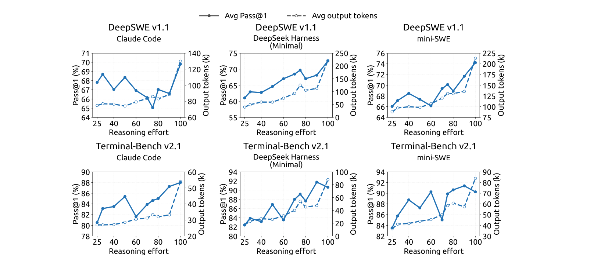

**图 11** | 推理努力跨编码脚手架一致驱动轨迹长度，但与精度的相关性仅松散。每个面板在 DeepSWE v1.1（顶行）与 Terminal-Bench v2.1（底行）、三种智能体脚手架（Claude Code、DeepSeek Harness (Minimal) 与 mini-SWE）下绘制 Pass@1（%，实线，左轴）与每轨迹平均输出 token（k，虚线，右轴）对推理努力设置的关系。所有面板来自同一检查点。

### B.3 不同推理努力下推理基准的详细结果

图 12 显示推理努力设置对输出长度与精度都给出平滑、良性的控制，跨全部八个基准一致，涵盖竞赛数学、科学问答、开放领域知识与编码。在长度侧，将努力从 25 提升到 100 在每个基准上可预测地缩放平均响应——统一 2.0–3.1× 的增长，从 AIME 2026 的每响应 4.6k 到 11.4k token、MathArena Apex 2025 的 29.1k 到 86.1k——无失控增长或异常，因此任何档位的计算成本都可预先估计。精度遵循相同平滑轨迹，在每个基准上朝正确方向响应，无任何基准随努力增加而退化：MathArena Apex 2025 提升 +40.3 分（25.3%→65.6%），Apex 2025 Shortlist +11.5，即使已饱和的基准也保持稳定（GPQA Diamond +1.3，LiveCodeBench +2.6），AIME 2026 达到满分 100%。模型因此暴露单一、可靠的旋钮，以受控、可预测的方式移动成本-精度运行点，使每个部署可选择匹配其延迟与计算预算的努力档位，而不牺牲精度。

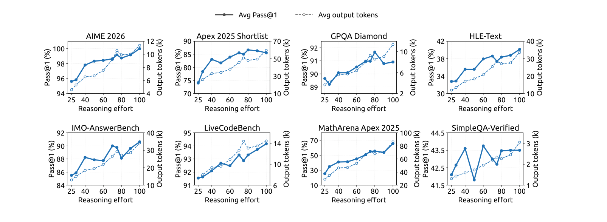

**图 12** | 八个推理密集基准上作为推理努力函数的性能与输出长度。每个面板在努力值从 25 变到 100 时绘制 Pass@1（实线，左轴）与每响应平均输出 token（虚线，右轴）。

## 附录 C：推理努力控制中的指数 Token 惩罚

标量努力变量提供部署时对成本-质量权衡的控制，而不施加硬性 token 预算。强化学习期间，较低努力水平应用更强的 token 惩罚，而较高努力水平允许更多计算。本节给出指数惩罚调度的简化动机。

对于在努力水平 b 下生成 ℓ 个推理 token 的轨迹，长度扣减为

```math
r_{\mathrm{len}}(\ell, b) = -\min\left(C_{\max},\; k(b)\cdot \ell / L_{\mathrm{norm}}\right)
```

（11）


其中 L_norm 为参考长度，C_max 为扣减上限。依赖努力的 token 惩罚系数为

```math
k(b) = k_0 \cdot \exp\left(-(b - b_{\min})/\tau\right)
```

（12）


其中 k0 为最低努力水平 b_min 下的惩罚系数，τ 控制惩罚衰减速率。

为论证这一选择，考虑固定问题 x。设 p_x(ℓ) 表示其在 ℓ 个推理 token 后解决的概率。在未封顶区域，定义首选推理长度 ℓ*_x(b) 为

```math
\ell^*_x(b) \in \arg\max_{\ell \ge 0}\left[p_x(\ell) - k(b)\cdot \ell / L_{\mathrm{norm}}\right]
```

（13）


对内部最优，一阶条件为

```math
p'_x(\ell^*_x(b)) = k(b) / L_{\mathrm{norm}}
```

（14）


其中 p'_x(ℓ) = dp_x(ℓ)/dℓ 是额外推理带来的解决概率的边际提升。

我们假设在相关运行区间内该边际收益近似指数衰减：

```math
p'_x(\ell) \approx a_x \cdot \exp\left(-\ell / s_x\right)
```

（15）


其中 a_x > 0 为实例相关尺度，s_x > 0 决定衰减速率。将式（12）与（15）代入式（14）给出

```math
\ell^*_x(b) \approx C_x - s_x \cdot \log k_0 + \tau\,(b - b_{\min})
```

（16）


其中 C_x = s_x · log(a_x L_norm) 与 b 无关。因此在该局部模型下，指数惩罚调度在请求努力与首选推理长度之间产生简单的一阶仿射趋势。

对于两个努力水平 b2 > b1，对应的预测长度差为

```math
\ell^*_x(b_2) - \ell^*_x(b_1) \approx s_x \cdot (b_2 - b_1) \cdot \tau
```

（17）


因此，k0 主要控制缩短推理的整体压力，而 τ 控制对努力的预测敏感度。

该推导是局部的奖励级近似，而非声称实测平均长度必须线性或逐点单调。实际行为可能偏离，因为努力指令可以直接改变推理策略、生成是随机的、智能体轨迹包含不同轮数、子组奖励归一化改变优化强度。该分析还假设封顶惩罚不活跃的内部解。一旦达到上限，边际 token 惩罚变为零，封顶区域必须单独考虑。

---

## 附录 D：术语对照表

| 英文 | 中文 |
|---|---|
| KV cache | KV 缓存 |
| prefill / decode | 预填充 / 解码 |
| Mixture-of-Experts (MoE) | 混合专家 |
| Causal Encoder-Decoder (CED) | 因果编码器-解码器 |
| Compressed Sparse Attention 2 (CSA2) | 压缩稀疏注意力 2 |
| Sliding-Window Attention (SWA) | 滑动窗口注意力 |
| global KV / main KV / indexer K | 全局 KV / 主 KV / 索引器 K |
| Top-K indices | Top-K 索引 |
| Hierarchical Sparse Indexer | 分层稀疏索引器 |
| persistent KV cache | 持久化 KV 缓存 |
| SWA Bounded Replay | SWA 有界重放 |
| long-horizon agents | 长程智能体 |
| agent scaffold / harness | 智能体脚手架 / 测试框架（harness） |
| speculative decoding | 推测解码 |
| semi-autoregressive | 半自回归 |
| on-policy distillation (OPD) | 在线策略蒸馏 |
| supervised fine-tuning (SFT) | 监督微调 |
| reinforcement learning (RL) | 强化学习 |
| rollout | 采样轨迹（rollout） |
| quantization-aware training (QAT) | 量化感知训练 |
| head-wise Muon | 按头 Muon |
| Sinkhorn balancing | Sinkhorn 平衡 |
| Reasoning Effort | 推理努力 |
| DSec | DeepSeek 弹性计算平台 |
| EPD (Encoder-Prefill-Decode) | 编码器-预填充-解码分离 |
| bits-per-byte (BPB) | 每字节比特数 |
| HBM / SSD | 高带宽内存 / 固态硬盘 |

（全文完）
