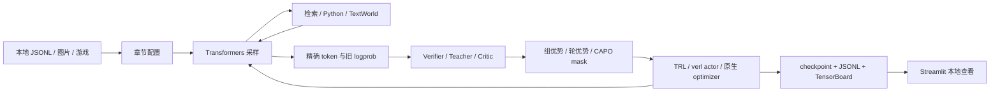

# 框架与阅读路线

## 三个后端如何分工

TRL 提供 PPO、GRPO/GSPO、DPO 与 SFT 的标准 Trainer 入口。verl 是 OPD、AgentOPSD、完整 DAPO、TEMPO、Harness-RL 和多轮工具算法的默认后端，也提供 PPO/GRPO/GSPO 对照配置。原生 PyTorch 保留为单进程公式和机制参考。

verl 用真实 RayWorkerGroup、注册 AgentLoop、DataProto 和继承官方 DataParallelPPOActor 的更新器完成训练。CPU 使用 Gloo 梯度同步，GPU 路径使用官方 FSDP worker 与异步 vLLM replica。详见 [verl 数据流与源码路线](VERL.md)。

## 核心数据结构

`Sample.tokens` 是模型实际看到的完整 token ID 序列；`mask` 与其等长。位置 j 的 token 由位置 j−1 的 logits 预测，因此 `score()` 返回形状 `[B,L−1]` 的 logprob 和 `mask[:,1:]`。

- prompt token：mask=0。
- 当前 rollout 新生成的 assistant token：mask=1。
- 环境 observation、模板、重放的历史前缀：mask=0。
- `old_logp`：CPU 在生成参数快照上复算；verl GPU 使用推理服务返回的实际生成概率，optimizer 更新前冻结。
- `turns`：新生成动作的半开区间 `[start,end)`；Teacher 对齐后转成 `[start−1,end−1)`。

padding 只为 forward 对齐形状。工具返回文字不是动作，即使包含最终答案，也不参与 policy loss。多轮追加真实 ID，不通过反复 apply_chat_template 重新编码旧输出。

## 模型与采样

文本离线 fixture 用标准 GPT2LMHeadModel：2 层、64 hidden、byte BPE tokenizer。视觉 fixture 用标准 LlavaForConditionalGeneration：CLIP 视觉编码器、小型 Llama 和视觉投影层。随机初始化意味着没有预训练任务能力；这些模型的价值是快速通过真实模型代码验证数据链路。

预训练文本模型使用 AutoModelForCausalLM；VLM 使用 AutoProcessor/AutoModelForImageTextToText。默认 sampling temperature=1、top_p=1、top_k=0，减少采样分布与重算 logprob 不一致；eval mode 禁用 dropout，但训练时仍保留 autograd。

Native 模型 forward 使用 float32/eager；LoRA 可通过 `lora_rank` 启用，CAPO 章节要求全 MLP 单元参数路由。GPU 环境已独立锁定 torch 2.9.0+cu129 / vLLM 0.12.0；尚未执行 GPU 训练验证。CPU wheel 不会通过修改 device 变成 CUDA wheel。

## 读代码的次序

1. `losses.py`：GRPO、GSPO、DAPO、OPD、DPO、GAE、PPO。
2. `models.py`：tokenizer、Sample、采样、打分、存储和视觉输入。
3. `rollout.py`：单轮与多轮环境交互，mask 如何产生。
4. `trainers.py`：任务/Teacher 调度、动态采样、梯度与 optimizer。
5. `trl_backend.py`：相同概念映射到标准 TRL API。
6. `agentopsd.py`、`tempo.py`、`harness.py`：原生特殊信用分配。
7. `verl_backend/`：分布式调度、算法 batch builder、注册 loss、TEMPO 修正与 FSDP CAPO；具体顺序见 VERL.md。

## checkpoint 与实验追踪

Native 模型存在 `checkpoint-final/model/`，value_head 单独保存。TRL PPO 的 value_model 另存于 checkpoint 下。旧 logprob 和动作文本保存在轨迹文件，便于重算对照。原生 `training-state.pt` 保存优化器与 RNG，但原生 CLI 未提供完整恢复。verl 的 `controller.pt` 保存步数、配置、TEMPO 状态池及其 RNG；每 rank 另存优化器、策略版本、CAPO 和 RNG，并保存冻结模型。`--resume` 在相同 worker 数下恢复到新运行目录。

TensorBoard 和 Streamlit 直接读取本地文件。训练失败会保留已写入日志，只有成功结束才产生 completed 状态。全退化组或不合法 Harness 输出可能没有梯度，日志通过 skipped、有效 token 数和范数明确显示。
