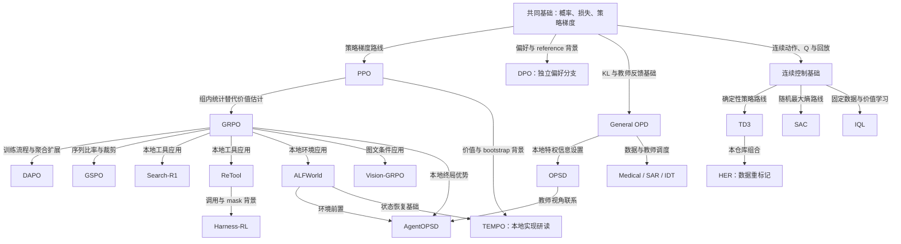

# 全书目录（20 章）

**唯一显示编号来源：** 本页与 [configs/learning_paths.json](../configs/learning_paths.json) 的 `book` 列表一致。物理运行目录（`001-ppo`、`09-AgentOPSD` 等）保持不变，编号是阅读导航，不是文件夹重命名。

上一章 / 下一章固定指**全书主线**；专题捷径见 [LEARNING_PATH](LEARNING_PATH.md)。

箭头表示方法联系或教学衔接，**不等于**算法继承，也不都是硬前置。硬前置见 [configs/chapters.json](../configs/chapters.json)。

## 第一篇 共同基础

| 章号 | 教程 | 实际正文 |
| ---: | --- | --- |
| 01 | 损失函数与策略梯度基础 | [preliminary/TUTORIAL.md](../preliminary/TUTORIAL.md) |

按需查阅：[FOUNDATIONS](../preliminary/FOUNDATIONS.md) · [数学实验](../examples/math/README.md) · [术语与符号](BEGINNER_GUIDE.md)

## 第二篇 策略优化与偏好学习

| 章号 | 教程 | 实际正文 |
| ---: | --- | --- |
| 02 | PPO：actor-critic、GAE 与裁剪更新 | [001-ppo/TUTORIAL.md](../001-ppo/TUTORIAL.md) |
| 03 | GRPO：同题采样与组内优势 | [01-grpo/TUTORIAL.md](../01-grpo/TUTORIAL.md) |
| 04 | DAPO：动态采样、裁剪与长度处理 | [06-dapo/TUTORIAL.md](../06-dapo/TUTORIAL.md) |
| 05 | GSPO：序列级比率与裁剪 | [07-gspo/TUTORIAL.md](../07-gspo/TUTORIAL.md) |
| 06 | DPO：从偏好对直接优化策略（离线旁支） | [002-dpo/TUTORIAL.md](../002-dpo/TUTORIAL.md) |

本篇导读：[families/01-policy-preference.md](families/01-policy-preference.md)

## 第三篇 工具、环境与多模态

| 章号 | 教程 | 实际正文 |
| ---: | --- | --- |
| 07 | Search-R1：学习检索与观察 mask | [03-search-r1/TUTORIAL.md](../03-search-r1/TUTORIAL.md) |
| 08 | ReTool：真实执行与工具决策 | [05-retool/TUTORIAL.md](../05-retool/TUTORIAL.md) |
| 09 | ALFWorld：有状态环境中的策略学习 | [08-alfworld/TUTORIAL.md](../08-alfworld/TUTORIAL.md) |
| 10 | Vision-GRPO：图像条件下的策略学习 | [09-vision-grpo/TUTORIAL.md](../09-vision-grpo/TUTORIAL.md) |

本篇导读：[families/02-tools-multimodal.md](families/02-tools-multimodal.md)

## 第四篇 OPD、自蒸馏与应用

| 章号 | 教程 | 实际正文 |
| ---: | --- | --- |
| 11 | General OPD：学生采样与教师反馈 | [02-opd/general-opd/TUTORIAL.md](../02-opd/general-opd/TUTORIAL.md) |
| 12 | OPSD：特权信息与自教师 | [04-opsd/TUTORIAL.md](../04-opsd/TUTORIAL.md) |
| 13 | Medical OPD / SAR / IDT：领域调度案例 | [02-opd/TUTORIAL.md](../02-opd/TUTORIAL.md) |
| 14 | AgentOPSD：自教师辅助的轮次信用 | [09-AgentOPSD/TUTORIAL.md](../09-AgentOPSD/TUTORIAL.md) |

本篇导读：[families/03-distillation.md](families/03-distillation.md)

## 第五篇 长程 Agent 进阶

| 章号 | 教程 | 实际正文 |
| ---: | --- | --- |
| 15 | TEMPO：短分支、估值与状态恢复 | [09-tempo/TUTORIAL.md](../09-tempo/TUTORIAL.md) |
| 16 | Harness-RL：调用记录与参数分区 | [12-harness-rl/TUTORIAL.md](../12-harness-rl/TUTORIAL.md) |

本篇导读：[families/04-long-horizon.md](families/04-long-horizon.md)

## 第六篇 连续控制与离线强化学习

| 章号 | 教程 | 实际正文 |
| ---: | --- | --- |
| 17 | TD3：确定性策略与双 Q 稳定化 | [14-td3/TUTORIAL.md](../14-td3/TUTORIAL.md) |
| 18 | SAC：随机策略与最大熵目标 | [13-sac/TUTORIAL.md](../13-sac/TUTORIAL.md) |
| 19 | HER：目标条件经验重标记 | [15-her/TUTORIAL.md](../15-her/TUTORIAL.md) |
| 20 | IQL：固定数据、expectile 与加权模仿 | [16-iql/TUTORIAL.md](../16-iql/TUTORIAL.md) |

本篇导读：[families/05-control-offline.md](families/05-control-offline.md)

## 独立资料架（不计入 20 章主线）

- [Basic LLM 技术报告](../Basic%20LLM/README.md)
- [后端安装 VERL](VERL.md) · [数据 DATA](DATA.md) · [具身 EMBODIED](EMBODIED.md)
- [排错 TROUBLESHOOTING](TROUBLESHOOTING.md) · [证据层级 EVIDENCE](EVIDENCE.md)
- 末章之后：[课程回顾与独立实验](NEXT_STEPS.md)
