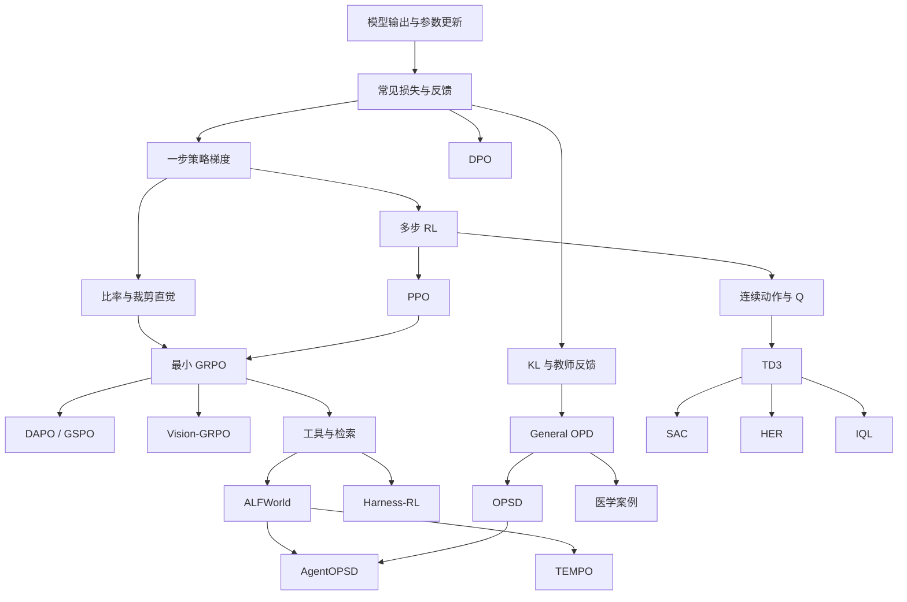

# 学习路线

本页说明推荐顺序、前置关系和每条路线的完成标准。目录编号 `001` / `01` / 多个 `09` 是历史运行路径，**不等于学习顺序**；请以本页和章节注册表为准。

## 共享基础

| 单元 | 你要能回答什么 | 入口 |
| --- | --- | --- |
| 概率、预测与参数更新 | logits、概率、logprob、loss、梯度、detach 各是什么 | [损失函数详解](../preliminary/TUTORIAL.md) §1–2 |
| 常见损失与反馈 | 标签、数值目标、偏好、奖励怎样进入训练 | 同上 §2–4 |
| 一步策略学习 | 没有示范答案时，怎样用反馈改变行为概率 | 同上 §5–6 |
| 旧数据与局部更新 | old/current、比率、PPO 裁剪为何存在 | 同上 §7–8 |
| MDP / 回报 / 价值（按需） | 状态、观察、轨迹、V/Q/A、bootstrap | [FOUNDATIONS](../preliminary/FOUNDATIONS.md) 对应小节 |

`FOUNDATIONS.md` 是查阅与补课材料，不是所有路线必须从头读完的前置关卡。

## 路线一：完整基础

适合希望先把“反馈 → 损失 → 梯度 → 更新”整条链走通的读者。

1. [损失函数详解](../preliminary/TUTORIAL.md) + [L0 数值实验](../examples/math/README.md)
2. [PPO](../001-ppo/TUTORIAL.md)：actor / critic、GAE、一条完整 batch 的 reward→loss 链；默认 TRL
3. [GRPO](../01-grpo/TUTORIAL.md)：同题组内优势 + `[1,1,0,0]` 数据链；默认 TRL；PPO 推荐而非强制
4. 按需进入 [DAPO](../06-dapo/TUTORIAL.md) / [GSPO](../07-gspo/TUTORIAL.md)（差异式阅读：采样供应 vs 比率粒度）

DPO、OPD 不是这条路线的强制前置。

## 路线二：快速 LLM 实践

适合主要关心可验证奖励与工具型后训练的读者。

1. 损失基础中的 CE / logprob / 策略梯度 / 比率与裁剪
2. [最小 GRPO](../01-grpo/TUTORIAL.md)（默认命令 = TRL `config.yaml`）
3. 工具与环境（这些章默认 **verl**，先读章首「相对 GRPO 改变了什么」）：
   - [Search-R1](../03-search-r1/TUTORIAL.md)：检索观察与 mask
   - [ReTool](../05-retool/TUTORIAL.md)：真实 Python 执行；共用轨迹字段账本
   - [ALFWorld](../08-alfworld/TUTORIAL.md)：有状态环境；独立 env 实例
4. 进阶 Agent / 多模态：
   - [AgentOPSD](../09-AgentOPSD/TUTORIAL.md)：轮次信用（不翻转终局方向）
   - [TEMPO](../09-tempo/TUTORIAL.md)：**进阶研读**；恢复状态 ≠ 用旧数据更新
   - [Vision-GRPO](../09-vision-grpo/TUTORIAL.md)：先 L1 输入链路，再 L2 能力
   - [Harness-RL](../12-harness-rl/TUTORIAL.md)：action/args 字段与参数分区

PPO 的 GAE 细节可以后补；不要把它设成 GRPO 的必经关卡。离线偏好走 [DPO](../002-dpo/TUTORIAL.md)。

Agent 章不要再从零展开完整 `min(rA, clip(r)A)`：先问“相对已学 GRPO，现在改的是轨迹来源、观察 mask、轮次信用、条件输入，还是参数更新规则？”

## 路线三：连续控制与离线

适合关心机械臂、稀疏奖励和固定数据学习的读者。

1. 损失与 RL 基础：先掌握 [MSE / 价值回归](../preliminary/TUTORIAL.md)；MDP / 密度 / 回放按需读 [FOUNDATIONS](../preliminary/FOUNDATIONS.md#foundations-map)
2. [TD3](../14-td3/TUTORIAL.md)（DDPG 作短前导）→ 可对照 [SAC](../13-sac/TUTORIAL.md)
3. [HER](../15-her/TUTORIAL.md)：数据重标记，底层仍是 TD3
4. [IQL](../16-iql/TUTORIAL.md)：固定数据；先 BC，再 expectile 与优势加权

安装与数据见 [具身说明](EMBODIED.md)。PPO / DPO **不是**这条路线的强制前置。

### 低维控制 → 还差什么（VLA 边界，集中说明）

| 已有 | 完整 VLA 还需要 |
| --- | --- |
| 低维状态/目标 + 连续动作 | 高维视觉/语言条件与对齐 |
| FetchReach 成功等环境奖励 | 更丰富任务规范与安全约束 |
| 离线/在线控制算法基础 | 大规模机器人数据与动作表示 |
| 图文条件策略（Vision-GRPO） | 动作头、控制频率、真机/高保真仿真 |

各控制章**不再**重复展开 VLA 展望；有问题时回到本表。

## 旁支：偏好与蒸馏

```text
SFT / 常见损失
  ├─ DPO（偏好分差）
  └─ General OPD（学生采样 + 教师复评）← 概念入口
        ├─ OPSD（固定 step-0 + solution 条件）
        ├─ 医学 SAR / IDT（领域调度案例）
        └─ AgentOPSD（多轮交互 + 蒸馏汇合）
```

先读 [General OPD](../02-opd/general-opd/TUTORIAL.md)，再进入医学配方或 OPSD。教师角色（固定 step-0 / 当前快照 / Skill）必须分章对照，不能用“自己教自己”一句概括。

## 依赖图（知识联系，不强制串行）



边表示“理解上通常需要先建立的概念”，不表示必须读完整篇论文后才能继续。

## 章节稳定身份

运行路径仍使用现有目录；逻辑身份见 [chapters.json](../configs/chapters.json) 中的 `id` / `kind` / `prerequisites` / `learning_paths` 字段。前后章导航可按路线生成，前置依赖应保持无环。

## 默认后端约定

| 章节类型 | 默认教学入口 | 跨后端对照 |
| --- | --- | --- |
| preliminary 数学 | PyTorch 脚本 / `examples/math` | 不需要后端 |
| PPO / DPO / GRPO / GSPO | TRL 与各章 `config.yaml` | native / verl 进阶 |
| Search-R1 … Harness 等 Agent/多模态 | **verl**（各章 `verl.yaml`） | 见章 README |
| General OPD / OPSD / 医学案例 | verl（医学含 TRL SFT 阶段） | 见章 README |
| SAC / TD3 / HER / IQL | **PyTorch embodied**（FetchReach） | 不需要 LLM 后端 |

每章 README 的命令应与该章默认后端一致；跨后端示例放在进阶区。

## 查阅索引

| 你想查 | 去哪里 |
| --- | --- |
| 术语与符号 | [BEGINNER_GUIDE](BEGINNER_GUIDE.md) |
| MDP / 价值 / 离线 | [FOUNDATIONS](../preliminary/FOUNDATIONS.md) |
| loss 与梯度数值 | [preliminary 教程](../preliminary/TUTORIAL.md) + [examples/math](../examples/math/README.md) |
| 安装、后端、恢复 | [VERL.md](VERL.md)、各章 README |
| 数据来源与限制 | [DATA.md](DATA.md)、[EMBODIED.md](EMBODIED.md) |
| 技术报告 | [Basic LLM](../Basic%20LLM/README.md) |
