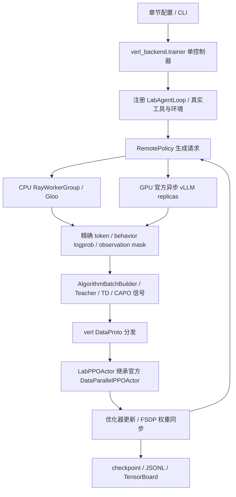

# TRL 与 verl：选型、实现和运行

本项目使用 **TRL 0.25.1** 提供标准训练器，使用 **verl 0.7.1** 组织复杂在线 RL 的模型角色、轨迹分发与参数更新。原生 PyTorch 后端用于单进程公式与机制对照。

## 如何选择后端

学习 PPO、DPO、GRPO 等标准训练流程时，可以从 TRL 的 Trainer 入口开始。多轮工具调用、多个 Teacher、状态重放或梯度分区涉及更复杂的数据与模型调度，适合阅读 verl 的 WorkerGroup 和 AgentLoop 实现。下面按这些需求比较两个后端。

| 维度 | TRL | verl | 本项目的选择 |
| --- | --- | --- | --- |
| 主要抽象 | 按算法组织的 Trainer，与 Transformers/PEFT/Datasets 整合 | 控制器、WorkerGroup、训练与推理角色之间的数据流 | 标准训练器教学用 TRL，复杂调度用 verl |
| 分布式与生成 | 支持 Accelerate、分布式训练及 vLLM 集成，具体能力取决于版本 | 以分布式后训练为主要设计目标，连接 FSDP/Megatron 与 vLLM/SGLang | GPU 使用 FSDP1 + vLLM，CPU 用 Ray + Gloo |
| 多轮 Agent | 可通过相应版本的工具或自定义 rollout 接口扩展 | AgentLoop 提供多轮轨迹、工具 observation mask 和推理请求调度接口 | 保留真实工具/环境，在注册的 LabAgentLoop 中生成轨迹 |
| 算法扩展 | 改 reward/loss 较直接；改变整个训练流程可能需要扩展 Trainer | 可分别扩展轨迹、优势计算、模型角色和 actor 更新 | TEMPO、AgentOPSD、Harness-RL 等分别扩展对应层 |
| 部署与调试 | 标准学习实验涉及的组件较少 | Ray、分片训练、推理服务与版本组合增加工程工作量 | 独立锁定 CPU/GPU 环境，不替换原环境 |

表格描述本仓库的后端分工，具体接口以锁定版本为准。参考：[TRL 0.25.1 文档](https://huggingface.co/docs/trl/v0.25.1/en/index)、[verl HybridFlow](https://verl.readthedocs.io/en/latest/hybrid_flow.html)、[verl AgentLoop](https://verl.readthedocs.io/en/latest/advance/agent_loop.html)。

## 版本与环境

| 环境 | 用途 | 关键版本 |
| --- | --- | --- |
| `.venv` | 原生/TRL、数据、日志页面 | torch 2.9.1+cpu、TRL 0.25.1、Transformers 4.57.6 |
| `.venv-verl` | 真正的 verl CPU worker、算法和 FSDP 机制验证 | verl 0.7.1、torch 2.9.1+cpu、numpy 1.26.4、Ray 2.49.2 |
| `.venv-verl-gpu` | CUDA 训练与 vLLM 采样 | verl 0.7.1、torch 2.9.0+cu129、vLLM 0.12.0、Ray 2.49.2 |

verl 固定官方发布标签 v0.7.1，revision `bec9ef74768dd201881cd4e54cd0385e87caae27`。它保留本实现使用的 DataParallelPPOActor、ActorRolloutRefWorker 和异步 AgentLoop 接口；升级依赖时需要检查这些接口的兼容性。来源记录见 `references/verl.json`，两个环境各有 pyproject.toml 和 uv.lock。numpy<2 等要求由独立环境满足。

```bash
# 从仓库根目录运行
bash scripts/setup.sh
bash scripts/setup_verl.sh --cpu

# 仅安装 CUDA 依赖，不启动模型、Ray GPU worker 或 GPU 验证
bash scripts/setup_verl.sh --gpu
```

根环境安装使用 `uv sync --frozen --extra dev --extra cpu`；不要省略 cpu extra 后把通用 PyPI CUDA wheel 装入学习环境。通常通过 `.venv/bin/arl` 调用即可：backend=verl 时 CLI 根据 device 切换到对应独立环境，再执行医疗教师准备和训练。

## 算法如何接入

| 入口/算法 | verl 扩展 | 关键不变量 |
| --- | --- | --- |
| GRPO | 分组 rollout、组优势、注册的 lab_grpo loss | 有效 response 的序列归一化，全同奖励组优势为零 |
| PPO | reference KL reward、GAE、clipped policy/value 更新 | CPU 使用实际 value head；GPU 使用官方 CriticWorker，KL 不重复加入 loss |
| GSPO | lab_gspo 注册损失 | 序列 token log-ratio 均值取指数，使用序列 ratio 裁剪 |
| DAPO | 动态补采、Clip-Higher、overlong shaping、token reduction | 先按原始奖励过滤退化组，达到补采上限则跳过，不把 loss_type 当完整算法 |
| General/Medical OPD | 冻结 Teacher 对 Student 采样 token 复评 | sampled reverse-KL 信号；Teacher 不接收梯度，tokenizer 必须兼容 |
| SAR-OPD | 医学阶段后切换 step-0 通用 Teacher | 阶段边界保存进恢复配置，续训不因 steps 改变而重划分 |
| IDT-OPD | 医学与通用 Teacher 交替更新 | 用 step 奇偶选择数据和 Teacher |
| OPSD | 固定 step-0 模型增加 solution 上下文复评 | Student 只看到题目；Teacher 固定，生成 token 对齐 |
| Search-R1 | 注册 AgentLoop + 本地 BM25 文档检索 | 检索 observation 不参与 policy loss |
| ReTool | 注册 AgentLoop + 有界数值 Python 工具 | 保留实际执行结果与生成 token，工具文本 mask=0 |
| ALFWorld | AgentLoop + TextWorld reset/step | 每条 rollout 使用独立环境；smoke 使用明确标注的 toy 环境 |
| AgentOPSD | 同一当前参数快照加入 Skill 复评，轮级优势 | 保留终局奖励方向；评测不提供 Skill |
| TEMPO | warmup、macro TD、生成式 critic、可序列化边界状态 | 真实动作重放核对 observation；保留行为前缀概率并计算 IS 修正 |
| Vision-GRPO | 像素、精确 token 和多模态 extras 通过 DataProto 传递 | 生成和打分排除相同的视觉占位输出 token；图像不丢失 |
| Harness-RL | CallRecord、session prefix trees、分段优势、CAPO | action/args 分别反传，梯度按 MLP 单元投影；FSDP flat shard 中也适用 |

SFT 和 DPO 保留 TRL，无需为离线数据训练套用在线 rollout 控制器。医疗入口的 `teacher_model: medical_sft` 会先训练真正的 TRL SFT Teacher，再把其 checkpoint 交给 verl 学生；`--smoke` 默认用 tiny Teacher，显式 `--teacher-model medical_sft` 可检查完整链路。

## 代码与执行数据流



阅读顺序是 `protocol.py → agent_loop.py → algorithms.py → losses.py → actor.py → worker.py/runtime.py`，再看 `tempo.py/capo.py`。GPU 路径位于 `gpu_config.py/gpu_worker.py/gpu_rollout.py`。

这是一套自定义单控制器算法流程，使用真实 verl WorkerGroup、注册 dispatch 和 actor 更新接口。现有 reward、工具和 Teacher token 对齐 helper 被复用。CPU actor 明确 all-reduce 梯度，GPU actor 使用 FSDP 自身的分片同步。loss 分母来自全局有效 token/序列数，并补偿跨 rank 的梯度平均；用于凑齐 worker 数的 padding 行训练权重为零。

GPU 生成通过官方异步 Replica、负载均衡器和 AsyncLLMServerManager 执行；训练/rollout 阶段转换调用官方 worker 的权重同步与缓存管理接口。工具环境在控制器的异步任务/线程运行。当前配置关闭梯度 checkpointing，actor 用 eval 模式保留 autograd，以确保 dropout 与生成分布一致。

## CPU 训练、恢复与评测

每个在线章节提供 `verl.yaml` 和 `verl-gpu.yaml`；医学额外提供 `medical-opd-verl*.yaml`、`idt-opd-verl*.yaml`。复杂章节 `config.yaml` 已默认 verl，标准 PPO/GRPO/GSPO 的 `config.yaml` 保留 TRL。

```bash
# 两个真实 CPU worker，标准算法跨后端对照
.venv/bin/arl train 01-grpo/verl.yaml --smoke --verl-workers 2
.venv/bin/arl train 01-grpo/config.yaml --smoke --backend trl

# 复杂算法默认 verl；TEMPO smoke 跑三步覆盖重放
.venv/bin/python 09-tempo/train.py --smoke --verl-workers 2
.venv/bin/python 12-harness-rl/train.py --smoke --verl-workers 2

# SFT Teacher → SAR 两阶段
.venv/bin/arl train 02-opd/config.yaml --smoke --teacher-model medical_sft --verl-workers 2

# steps 是累计目标步数；输出用新目录，worker 数须保持一致
TEMPO_RUN="runs/TEMPO_RUN_NAME"
.venv/bin/arl train 09-tempo/config.yaml --smoke --verl-workers 2 \
  --resume "$TEMPO_RUN/checkpoint-final" --steps 4 --output runs/tempo-continued

.venv/bin/arl eval 09-tempo/config.yaml --smoke \
  --checkpoint runs/tempo-continued/checkpoint-final --limit 1
```

checkpoint 保存模型、优化器、每 rank RNG、策略版本、CAPO 分区，以及控制器步数、配置、TEMPO 状态池和其 RNG。冻结 Teacher/reference 也保存；GPU 使用 FSDPCheckpointManager 写分片，CPU 写 HF 模型。恢复要求相同算法、worker 数和兼容模型配置，不承诺变更拓扑或异步执行次序后的逐 token 等同。GPU 初始化仍需要原模型/Teacher 的结构与 tokenizer 来源可访问。

TEMPO 的修正为 `exp(sum(log π_current − log π_behavior))`，求和只覆盖历史 assistant token。工具和用户 token 排除，新 macro-step 才参与当前 loss。默认使用精确修正；显式设置 `prefix_is_clip >= 1` 可作有界权重实验，并会改变估计量。动作总数达到 max_turns 的状态不会重新放回可继续的状态池。原生 TEMPO 仍保留旧参考边界，不含这项修正与 CLI 恢复。

## GPU 启动方式与边界

单卡 GRPO 启动器通过参数选择设备，比较 worker 与 `nvidia-smi` 记录的 UUID，并设置回环通信接口与 CUDA eager 执行。配置使用仓库相对模型路径；运行前须准备 Qwen2.5-0.5B-Instruct，输出目录须不存在。

```bash
.venv/bin/python scripts/run_grpo_gpu_check.py --gpu-index 0 --output runs/verl-grpo-gpu-repeat
.venv/bin/python scripts/verify_grpo_gpu.py runs/verl-grpo-gpu-repeat \
  --report reports/verl-grpo-gpu-repeat-verification.json
```

运行配置为 `01-grpo/verify-gpu.yaml`。`--gpu-index` 通过 `CUDA_VISIBLE_DEVICES` 将所选物理设备映射成进程内 `cuda:0`；vLLM 0.12 的设备解析要求数字索引。`TORCHDYNAMO_DISABLE=1` 避免 logprob 辅助函数依赖额外的主机编译工具链，不影响实际 CUDA 采样和优化器更新。

运行下面的命令前，先确认模型权重存在、卡数与显存满足模型/teacher/critic 配置，再按可用设备调整 worker 数和模型路径。

```bash
.venv/bin/arl train 06-dapo/verl-gpu.yaml \
  --model models/Qwen--Qwen2.5-0.5B-Instruct --verl-workers 2 --steps 20

# 多节点要求已经由用户准备好的 Ray 集群、共享项目/数据/模型路径和一致环境
RAY_ADDRESS="ray://ray-head.example.com:10001"
.venv/bin/arl train 09-tempo/verl-gpu.yaml \
  --verl-workers 8 --verl-nodes 2 --ray-address "$RAY_ADDRESS"
```

verl_workers 是总训练 rank 数，须能被 verl_nodes 整除；rollout_tensor_parallel_size 还需适配 worker 拓扑。默认在本机创建独立 Ray 会话，只清理本次创建的 worker/placement group；使用显式 Ray 地址时不关闭共享集群。CPU 不请求 GPU 资源。

当前扩展使用 FSDP1 与 vLLM；world_size=1 使用 NO_SHARD。多卡、多节点、GPU VLM、GPU critic 与续训需要按各自配置检查资源和同步行为。CAPO 使用 central-only MLP 分区，尚无 Megatron/FSDP2 的 shard 适配；工具执行使用受限数值执行器。

## 验证与新增算法

```bash
make check-verl
make smoke-verl
.venv/bin/python scripts/check_verl_resume.py
```

`make check-verl` 检查机制与 FSDP 参数更新，`make smoke-verl` 检查各训练入口，`check_verl_resume.py` 检查 checkpoint 恢复与医疗训练链路。输出写入本地 `reports/` 和 `runs/`。全同奖励组或不合法 Harness 输出可能没有有效梯度，需结合 metrics 判断原因。

后续复杂算法首先扩展 `AlgorithmBatchBuilder` 的轨迹组织与优势信号；有新工具时扩展 AgentLoop 使用的环境适配器；只有目标函数改变时才新增注册 loss；需要特殊参数路由时扩展 actor。随后补齐 SUPPORTED、章节配置、逐算法 CPU 执行和相应数学/跨进程不变量检查。避免将完整论文算法缩减成一个 loss 名称。
