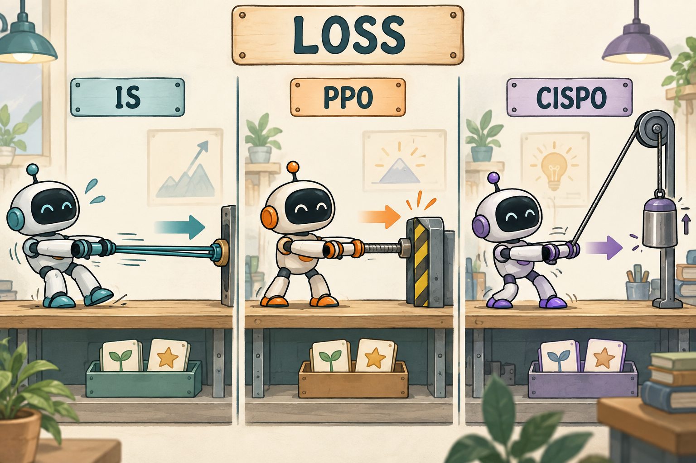
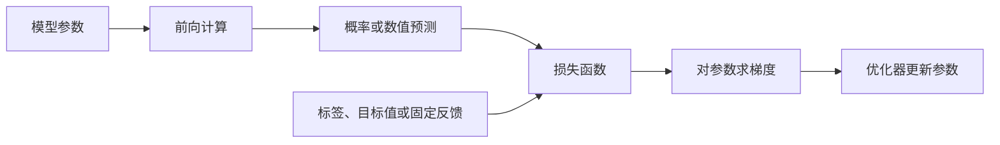

# 01｜损失函数与策略梯度基础

<!-- NAV:TOP:BEGIN -->
[← 开始学习](../docs/START_HERE.md) · [全书目录](../docs/CHAPTERS.md) · [本篇目录](../docs/families/00-foundations.md) · [下一章：02 PPO：actor-critic、GAE 与裁剪更新 →](../001-ppo/TUTORIAL.md)
<!-- NAV:TOP:END -->

[← 开始学习](../docs/START_HERE.md) · [全书目录](../docs/CHAPTERS.md) · [本篇目录](../docs/families/00-foundations.md) · [下一章：02 PPO →](../001-ppo/TUTORIAL.md)


[学习路线](../docs/LEARNING_PATH.md) · [本章运行说明](README.md) · [基础知识查阅](FOUNDATIONS.md) · [本章数值实验](../examples/math/README.md)

一道题是：“每盒有 6 支笔，买 3 盒，一共有多少支？”

我们希望模型以后更容易回答“18”，而不是“9”。但是，“希望它答对”并不是一条可以直接交给优化器执行的指令。训练时至少要回答三个问题：**我们拿什么判断好坏？模型的哪个输出可以求导？这个反馈怎样改变参数？**

监督微调和强化学习的差别，就可以从这里讲起。监督微调给模型一份示范，让它提高示范答案的概率；强化学习允许模型先尝试，再根据尝试的结果调整生成行为。它们最终都要更新参数，但反馈进入训练的方式不同。

本章先解释交叉熵、均方误差等常见损失，再把“答对得分”接到策略梯度，最后解释为什么 PPO 需要旧策略、概率比率和裁剪。你不必预先认识 PPO、GRPO 或 GAE。数学推导旁边都有数值例子；第一次阅读可以先跟着数值走，再回看推导。

> 所有数字都是为讲解构造的小例子，不是模型能力实验。为便于手算，有时把“18”“9”“其他”当成三个完整候选动作；这不意味着真实 tokenizer 一定把“18”编码成一个 token。



图为概念示意，不是训练测量结果。具体数值以正文和 `examples/math/loss_walkthrough.py` 为准。


<a id="gradient-and-detach"></a>
## 1. 先把奖励、损失和参数更新分开

假设模型回答了“18”，答案校验器返回 1；回答“9”，返回 0。这里的 1 和 0 是**奖励**，表示这次尝试的结果。

损失函数则负责把训练目标写成一个可优化的数。它可以使用奖励，也可以使用正确标签、参考答案或目标数值。优化器读取的是损失对参数的梯度，而不是“答对了”这句评价。



图表示可训练计算的主要环节。强化学习中还会插入“按概率采样答案 → 外部判分”，但离散采样和外部判分通常不在普通反向传播路径上。后面会专门解释怎样跨过这道障碍。

先用最简单的梯度下降说明更新规则：

```math
\theta_{\mathrm{new}}
=\theta_{\mathrm{old}}-\eta\nabla_\theta L.
```

这里，$`\theta`$ 是需要调整的模型参数，$`L`$ 是损失，$`\eta\gt0`$ 是学习率。$`\nabla_\theta L`$ 表示：在当前参数附近，沿各个参数方向增加一点点，损失会怎样变化。减去梯度，是朝局部降低损失的方向移动。实际训练常用 Adam 等优化器，更新细节不同，但仍需要这条梯度。

**损失值和梯度不是一回事。** 损失描述当前位置，梯度描述局部变化方向。一个损失可以为负；两个样本的损失也可能相加为零，而它们对参数的梯度并没有相互抵消。更不能把不同算法的 loss 数值拿来直接评判哪个模型更强。

<a id="probability-and-logprob"></a>
<a id="kl-and-entropy"></a>
## 2. 有正确答案时：交叉熵怎样训练模型

### 2.1 从模型分数变成概率

先把上面的题简化成三个候选：“18”“9”“其他”。模型分别输出三个实数，记为 $`z_1,z_2,z_3`$。这些数叫 **logits**，不是概率，可以为负，也不要求加起来等于 1。

Softmax 把它们变成一份概率分布：

```math
p_j=\frac{\exp(z_j)}{\sum_k\exp(z_k)}.
```

分子把分数变成正数，分母把所有候选归一化，使概率之和为 1。某个候选的分数相对其他候选更高，它的概率就更大。指数函数不是为了让模型“更自信”，而是在这里提供一种可导的归一化方式。

假设得到的概率是 `[0.6, 0.3, 0.1]`。正确答案是第一个候选。我们希望它的概率变大，可以使用负对数似然：

```math
L_{\mathrm{NLL}}=-\log p_{\mathrm{correct}}.
```

Log 在本章中指自然对数。因为概率位于 $`(0,1]`$，其对数不大于 0，前面的负号把它变成非负损失。

| 模型给正确答案的概率 | 损失 $`-\log p`$ | 如何理解 |
| ---: | ---: | --- |
| 0.1 | 2.3026 | 正确答案几乎没有被模型支持 |
| 0.6 | 0.5108 | 已有一定支持 |
| 0.9 | 0.1054 | 正确答案得到较高支持 |

因此，降低这个损失，就是提高正确答案的概率。对数还有一个重要作用：一串条件概率相乘之后，取对数可以变成相加，便于计算整段回答的训练目标。

### 2.2 交叉熵与负对数似然是什么关系

把正确标签写成分布 $`q=[1,0,0]`$，交叉熵定义为：

```math
H(q,p)=-\sum_jq_j\log p_j.
```

由于只有正确答案对应的 $`q_j=1`$，其他项都为 0，这个式子就变成 $`-\log p_{\mathrm{correct}}`$。因此，**单一类别标签下的交叉熵，就是这里的负对数似然**。使用软标签时，交叉熵会同时考虑多个候选的目标权重。

从梯度看，对于 one-hot 标签：

```math
\frac{\partial L_{\mathrm{CE}}}{\partial z_j}=p_j-q_j.
```

在 `[0.6, 0.3, 0.1]` 的例子里，三个梯度是 `[-0.4, 0.3, 0.1]`。梯度下降会提高正确候选的 logit，降低另外两个候选的 logit。这里也能看出：**概率彼此关联，训练并不是独立修改某一个概率数字。**

PyTorch 的 `cross_entropy` 接收 logits，不应先做一次 softmax 再把结果当 logits 传入。它在内部以稳定方式完成所需计算。下面把一份合法分布的对数作为一组 logits，仅仅是为了让初始概率恰好等于指定数值。[接口说明][torch-ce]

```python
import torch
import torch.nn.functional as F

logits = torch.tensor([[0.6, 0.3, 0.1]], dtype=torch.float64).log()
logits.requires_grad_()
loss = F.cross_entropy(logits, torch.tensor([0]))
loss.backward()

print(loss.item())   # 约 0.510826
print(logits.grad)   # 约 [[-0.4, 0.3, 0.1]]
```

### 2.3 语言模型不是一次给整段答案分类

真实语言模型通常逐 token 生成。设题目为 $`x`$，回答依次为 $`y_1,y_2,\ldots,y_T`$。在选择第 $`t`$ 个 token 之前，模型已经看到了题目和此前的回答，我们把这些内容合起来叫历史：

```math
h_t=(x,y_1,\ldots,y_{t-1}).
```

策略 $`\pi_\theta(y_t\mid h_t)`$ 表示：参数为 $`\theta`$ 的模型，在这个历史下生成 token $`y_t`$ 的概率。对语言模型来说，“策略”就是这份决定下一个 token 的条件分布。

整段回答的概率可以分解为：

```math
\pi_\theta(y\mid x)
=\prod_{t=1}^T\pi_\theta(y_t\mid h_t),
\qquad
\log\pi_\theta(y\mid x)
=\sum_{t=1}^T\log\pi_\theta(y_t\mid h_t).
```

例如两个连续 token 的条件概率分别为 0.5 和 0.2，整段概率就是 0.1；对数则是 $`\log0.5+\log0.2=\log0.1`$。这解释了为什么语言模型训练中经常出现 **log probability，简称 logprob**。

监督微调 SFT 给出示范回答 $`y^*`$。在最简单的回答 token 平均下：

```math
L_{\mathrm{SFT}}
=-\frac1T\sum_{t=1}^T
\log\pi_\theta(y_t^*\mid x,y_{1:t-1}^*).
```

注意条件里用的是示范前缀，不是学生刚刚自由生成的错误前缀。这种训练方式叫 teacher forcing。SFT 的学习信号来自“应当生成哪个 token”；后面的强化学习则需要处理“没有逐 token 示范，只知道整次尝试好不好”的情况。

## 3. 要预测一个数时：MSE 和 Huber 在哪里使用

有时模型不是选择词，而是在预测一个数。例如，一个辅助网络想估计“从当前历史继续，最后大概能得到多少回报”。这种估计通常叫价值预测；做这件事的网络常被称为 critic。

假设它预测 0.3，而这条训练记录给出的固定目标是 1。最直接的损失是均方误差 MSE。单样本时：

```math
L_{\mathrm{MSE}}=(v-\widehat G)^2.
```

$`v`$ 是当前可训练的预测，$`\widehat G`$ 是本次更新采用的目标回报。这里取 $`v=0.3,\widehat G=1`$，损失为 0.49，对 $`v`$ 的导数为：

```math
\frac{\partial L_{\mathrm{MSE}}}{\partial v}
=2(v-\widehat G)=-1.4.
```

梯度下降会把 $`v`$ 往上推，靠近 1。目标回报有时来自真实后续奖励，有时包含其他价值预测提供的 bootstrap；这些构造留到 PPO 和连续控制章节。此刻只需记住：**目标在这次回归更新中是固定的，正在学习的是预测值。** 价值不一定是成功概率，也不必始终在 0 到 1 之间。

为什么不能对所有东西都用 MSE？因为预测数值和选择离散行动是不同问题。把采样出的答案字符串拿来与正确字符串求平方差，通常没有合适的数值意义，也没有可用的反向传播路径。损失要对应预测对象，而不是看到“误差”就统一平方。

当回归误差偶尔很大时，还可以考虑 Huber 损失。令残差 $`e=v-\widehat G`$：

```math
L_\delta(e)=\frac12 e^2\quad\mathrm{if}\ |e|\leq\delta,
\qquad
L_\delta(e)=\delta\left(|e|-\frac12\delta\right)\quad\mathrm{if}\ |e|\gt\delta.
```

它在误差小时像平方损失，误差大时按绝对误差线性增长。取 $`\delta=1`$，残差为 0.5 时损失是 0.125；残差为 3 时损失是 2.5，而对应的半平方误差是 4.5。后者的导数会继续随误差增长，Huber 大误差区间的导数幅度则由阈值控制。[接口及定义][torch-huber]

这是一种可选回归目标，不代表仓库每个 critic 已经使用了 Huber。还要注意，PyTorch 的 `HuberLoss` 与 `SmoothL1Loss` 在一般阈值下有缩放差别，不能只因为名字接近就无条件互换。

<a id="preference-loss"></a>
## 4. 只有“哪个更好”时：二元交叉熵与偏好损失

很多训练资料不给准确分数，只告诉我们回答 A 比回答 B 更好。可以让一个评分模型给出两个分数 $`s_A,s_B`$，用分差 $`d=s_A-s_B`$ 表示偏好强度。

Sigmoid 把分差变成 A 获胜的概率：

```math
\sigma(d)=\frac{1}{1+e^{-d}}.
```

$`d=0`$ 时概率为 0.5；$`d`$ 越大，越支持 A。如果标签规定 A 是更好的回答，负对数似然为：

```math
L_{\mathrm{pair}}=-\log\sigma(d).
```

它就是目标标签为 1 的二元交叉熵。更一般地，令二元标签 $`c\in\{0,1\}`$、预测概率为 $`p`$：

```math
L_{\mathrm{BCE}}=-[c\log p+(1-c)\log(1-p)].
```

在偏好例子里，$`d=0`$ 时损失为 $`\log2\approx0.6931`$，对分差的梯度是 $`\sigma(d)-1=-0.5`$。梯度下降会增大 A 相对 B 的分数。[数值稳定的 logits 接口][torch-bce]

DPO 也使用这种 logistic 形式，不过送进 sigmoid 的不是一个独立奖励模型的简单分差，而是经过 reference 校正、再乘系数的策略 logprob 差。先理解“通过一个分差预测谁更好”，再读 DPO 的具体分差构造，会比第一次就面对整条 DPO 公式容易得多。

## 5. 强化学习的困难：奖励不是可直接反传的标签

回到买笔问题。这次没有给模型示范解答，而是让它先生成，再判定最终答案是否正确。

一种容易想到的写法是 `loss = -reward`：奖励越高，损失越低，看起来非常合理。但模型采样出的 token 已经是整数编号，校验器返回的 0 或 1 也是一个外部结果。**仅仅把这个数取负，并不会自动建立它与模型参数之间的可导关系。**

即使写成 `torch.tensor(-reward, requires_grad=True)`，也只是新建了一个可以求导的数，并没有把它接回生成模型。优化器仍不知道该改变哪些权重。

关键在于：我们不必对“这一次已经确定的分数”求导，而可以改变**以后采到不同结果的概率**。把好结果变得更常见，长期平均奖励就可能提高。

### 5.1 一个只有两个动作的例子

假设某个固定问题只有两个候选动作：正确回答，奖励为 1；错误回答，奖励为 0。模型给正确回答的概率为 $`p`$，那么平均奖励是：

```math
J=p\times1+(1-p)\times0=p.
```

提高 $`p`$，平均奖励就提高。这里并没有对答案校验器求导；改变的是模型自己的概率。

对固定历史 $`h`$、有限动作集合，把这个关系写得一般一些：

```math
J(\theta)=\sum_a\pi_\theta(a\mid h)R(a).
```

$`R(a)`$ 是动作产生的外部奖励，在这段推导中不直接依赖模型参数。对参数求导，并使用 $`\nabla p=p\nabla\log p`$：

```math
\begin{aligned}
\nabla_\theta J
&=\sum_a R(a)\nabla_\theta\pi_\theta(a\mid h)\\
&=\sum_a\pi_\theta(a\mid h)R(a)
  \nabla_\theta\log\pi_\theta(a\mid h)\\
&=\mathbb E_{a\sim\pi_\theta}
  [R(a)\nabla_\theta\log\pi_\theta(a\mid h)].
\end{aligned}
```

第一行是“改变每种行为的发生概率”；第二行把它改写成适合采样计算的形式；第三行说明，我们可以用实际采到的行为和对应奖励来估计这个更新方向。这就是策略梯度的一条基本思路。

如果需要最小化一个损失，可以对采到的动作使用：

```math
L_{\mathrm{PG}}=-R\log\pi_\theta(a\mid h),
```

并在这次反传中把 $`R`$ 当常量。这是用于产生策略梯度的采样目标，不是说它的数值等于负的平均奖励。上述简洁推导针对固定历史的一步决策；完整轨迹、奖励到达时间和状态分布的问题，会在后面的算法章节展开。

### 5.2 为什么还要引入优势 A

5.1 的损失用的是**这次采到的动作所对应的奖励** $`R`$。对买笔题，校验器只给 0 或 1：答对记 $`R=1`$，答错记 $`R=0`$。若把这两个数直接当学习信号，会遇到一个问题——**不同处境下的“通常能拿多少分”并不一样**。

还是买笔题，但下面两道小题难度不同。这里的数字全部是**校验器给出的奖励** $`R`$（答对 1、答错 0 的任务，再对一批回答取平均），不是另一套“题目得分”，也不是概率：

| 题目类型 | 该类型下答对率（= 平均奖励 $`R`$） | 这次也答对时的 $`R`$ | 直接用 $`R`$ 学习时 |
| --- | ---: | ---: | --- |
| 很难的两步应用题 | 0.2 | 1 | 与简单题答对一样“加满” |
| 很直白的口算题 | 0.8 | 1 | 与难题答对一样“加满” |

两次都是“答对、$`R=1`$”，但难题上答对更罕见、通常更值得鼓励。若只用原始 $`R`$，模型很难区分“在容易题上又对了一次”和“在难题上终于对了一次”。于是把奖励减去一个**参照水平** $`b`$（baseline，常取该处境下的预期奖励或平均奖励）：

```math
A=R-b.
```

上表两行若分别取 $`b=0.2`$ 与 $`b=0.8`$（用该题型的平均奖励作参照），则优势为：

| 题目类型 | $`R`$ | $`b`$ | $`A=R-b`$ | 含义 |
| --- | ---: | ---: | ---: | --- |
| 难题答对 | 1 | 0.2 | +0.8 | 明显好于该题通常水平 |
| 简单题答对 | 1 | 0.8 | +0.2 | 只略好于该题通常水平 |
| 简单题答错 | 0 | 0.8 | −0.8 | 明显差于该题通常水平 |

这个差值叫**优势（advantage）**。$`A\gt0`$ 表示比参照更好，$`A\lt0`$ 表示比参照更差。它不是“答案正确”的另一种写法。接上表同一套数字：

- **简单题**参照高（$`b=0.8`$）：全对时只有很小的正优势；**一旦答错**，$`A=0-0.8=-0.8`$，负优势反而更大。
- **难题**参照低（$`b=0.2`$）：答对得到很大的正优势；答错时 $`A=0-0.2=-0.2`$，负优势相对温和——因为这类题本来就常错。

也就是说：同样“答错”，在简单题上偏离通常水平更远；同样“答对”，在难题上更值得鼓励。表中第三行「简单题答错 \(A=-0.8\)」与此一致。

在固定历史下，只要 baseline 不依赖这次选中的动作，其对应项的期望梯度为零：

```math
\sum_a\pi_\theta(a\mid h)b(h)\nabla_\theta\log\pi_\theta(a\mid h)
=b(h)\nabla_\theta\sum_a\pi_\theta(a\mid h)=0.
```

这解释了为什么可以在不改变该期望梯度的前提下加入合适的参照。实际优势估计还有采样误差；不能把这段证明直接套到所有组内标准化方法。尤其组均值包含当前样本时，需要另外分析其统计性质。$`b`$ 从哪里来，后面两章会分别说明：PPO 用价值网络等预测“在这里通常能拿多少”，GRPO 用同一道题多次尝试的组内平均。这里先把 $`A`$ 看成已经算好、在本次更新中固定的反馈：

```math
L_{\mathrm{PG}}=-A\ell,
\qquad \ell=\log\pi_\theta(a\mid h),
\qquad \frac{\partial L}{\partial\ell}=-A.
```

正优势产生负导数，梯度下降倾向于提高这次行为的 logprob；负优势则相反。这里说的是这个损失项的局部作用，不保证加入其他样本、正则项之后，该行为的实际概率仍按同一幅度变化。

## 6. 从“logprob 的方向”走到真正的参数更新

前面经常对 $`\ell`$ 求导，是为了看清一条训练信号的方向。模型真正更新的是参数，而不是直接把某个 logprob 当成独立参数：

```math
\nabla_\theta L
=\frac{\partial L}{\partial\ell}\nabla_\theta\ell.
```

第一个因子告诉我们应该提高还是降低这次行为的概率；第二个因子由网络前向计算决定，告诉我们怎样改变权重才能影响这份概率。

用两个 logits 代表一个极小策略，初始概率为 `[0.2, 0.8]`。假设采到了第一个动作，给它正优势 1：

```python
import torch

# 两个可训练参数。它们经 softmax 后的初始概率为 [0.2, 0.8]。
logits = torch.tensor([0.2, 0.8], dtype=torch.float64).log()
logits.requires_grad_()

selected_logp = logits.log_softmax(dim=-1)[0]
loss = -1.0 * selected_logp
loss.backward()
print(logits.grad)  # [-0.8, 0.8]

with torch.no_grad():
    logits -= 0.1 * logits.grad

print(logits.softmax(dim=-1))  # 约 [0.226831, 0.773169]
```

第一个动作的概率从 0.2 增加到约 0.2268。变化来自两个 logits 的共同调整，而不是简单地给概率加上学习率。

把这里换成语言模型，原理仍然是：保存已经生成的 token，在同一历史下重新计算它们的 logprob，把固定反馈乘上去，再对网络参数反传。采样阶段通常不保存庞大的训练图；真正的梯度在重新打分时建立。

<a id="behavior-ratio"></a>
## 7. 为什么训练还要保存“当时的概率”

生成一批回答可能很贵。我们往往希望用同一批数据做几次更新，而不是每更新一次参数就重新生成所有回答。[PPO 原论文][ppo-paper]

但第一次更新之后，模型已经变了。这批回答仍然来自更新前的策略，而不是当前策略。为了描述这种变化，要明确两个时刻：

| 角色 | 做什么 | 这一批更新期间会不会变 |
| --- | --- | --- |
| old / behavior policy | 真正生成这批数据的策略，提供当时的概率 | 对应的已保存概率不变 |
| current policy | 重新评价同一批 token，并接受参数更新 | 会变 |

比较时，题目、历史和所选 token 都应保持一致。对某个已经生成的 token，如果当时概率为 0.2，现在概率为 0.3：

```math
\rho=\frac{0.3}{0.2}=1.5.
```

$`\rho`$ 是概率比率。本章用希腊字母 rho，避免把它和奖励 $`R`$ 混淆。$`\rho=1`$ 表示这次行为的概率与采样时相同；大于 1 表示更受当前模型支持；小于 1 表示支持降低。它**不负责评价回答好坏**，好坏仍由奖励和优势提供。

### 7.1 比率为什么与“复用旧样本”有关

在固定历史下，旧策略对两个动作给 `[0.5, 0.5]`，当前策略给 `[0.8, 0.2]`。假设两动作奖励为 `[1, 0]`。当前策略的平均奖励是 0.8。

只拿旧样本的奖励直接平均，得到的是 0.5。分别乘上新旧概率比 `[1.6, 0.4]`：

```math
0.5\times1.6\times1+0.5\times0.4\times0=0.8.
```

这里的比率补偿了“我们用旧分布采样，却想计算新分布下平均量”的差异。这叫重要性采样。一般形式为：

```math
\mathbb E_{a\sim\pi_\theta}[f(a)]
=\mathbb E_{a\sim\pi_{\mathrm{old}}}
\left[\frac{\pi_\theta(a)}{\pi_{\mathrm{old}}(a)}f(a)\right].
```

这个等式要求：当前分布有概率质量的地方，旧分布不能完全没有覆盖。实际采样中的温度、top-p 等设置会影响行为分布，也应纳入 old 的定义。

不过，**逐 token 使用一个比率，不等于自动精确修正整条轨迹的分布变化**。PPO 的裁剪目标是一个局部替代目标，不能因为出现了重要性比率，就宣称后续所有估计都是无偏的。

### 7.2 为什么代码里不是直接做概率除法

语言模型经常保存 logprob。令当前值为 $`\ell=\log p`$，采样时的固定值为 $`\ell_{\mathrm{old}}=\log p_{\mathrm{old}}`$。利用对数的性质：

```math
\ell-\ell_{\mathrm{old}}
=\log\frac{p}{p_{\mathrm{old}}}.
```

再对两边取指数：

```math
\rho=\exp(\ell-\ell_{\mathrm{old}}).
```

还是用 0.3 和 0.2：$`\log0.3\approx-1.2040`$，$`\log0.2\approx-1.6094`$；两者之差约 0.4055，取指数就是 1.5。`exp` 并不是新加的一种奖励，它只是把 logprob 的差还原成概率之比。

这时才来看导数。旧值固定，指数函数对自己的输入求导仍是指数函数，因此：

```math
\frac{\partial\rho}{\partial\ell}
=\exp(\ell-\ell_{\mathrm{old}})\times1=\rho.
```

没有裁剪时，考虑替代损失 $`L=-\rho A`$，便得到：

```math
\frac{\partial L}{\partial\ell}=-A\rho.
```

刚开始更新时 $`\rho=1`$，这个导数就是 $`-A`$，与前面的简单策略梯度方向一致。**函数此刻取值为 1，并不意味着它是一条处处恒定、导数为 0 的函数。**

### 7.3 `detach()` 到底在固定什么

可以把旧概率想成考试前留下的成绩记录。更新后再评价同一份答案，是为了比较模型偏好改变了多少；不能每修改一次参数，就把旧记录也改成最新结果。

代码里有两件独立的事：一是**数值在采样后被保存，在这批更新中不重算**；二是**反传时不沿旧值求导**。`detach()` 只处理第二件事，不会替你保证第一件事。

```python
# 真实训练中，old_logp 来自采样时保存的记录。
old_logp = saved_behavior_logp.detach().clone()

for _ in range(update_epochs):
    current_logp = score_the_same_tokens_with_current_model()
    ratio = (current_logp - old_logp).exp()
    # 根据 ratio 与固定优势计算 loss，再更新 current model。
```

这是说明时间关系的伪代码，不是可直接调用的仓库 API。可执行的小实验见`examples/math/loss_walkthrough.py`。

若写成 `exp(current_logp - current_logp)`，两条可导路径会相互抵消，比率恒为 1，梯度也为 0。若每次都重算 `old = current.detach()`，虽然当前这次梯度不必为零，但数值参照会被不断重置，PPO 就看不到相对原采样策略累积了多少变化。

另外，old 不等于 reference。Old 记录这批数据由谁采出；reference 常用于约束模型不要偏离某个固定模型。Teacher 则提供蒸馏反馈。三个角色可能在训练开始时碰巧有相同权重，职责仍然不同。

<a id="ppo-clipping"></a>
## 8. PPO 为什么裁剪：防止把同一批反馈用得过头

假设某条回答得到正优势。它的概率从 0.2 增加到 0.3，比率已经是 1.5。对 $`L=-\rho A`$ 来说，只要继续增大比率，损失就还可以继续下降。

但这条正反馈来自一批有限的旧数据；它不一定足以支持模型持续、大幅改变整份策略。PPO-Clip 的想法不是强行把参数锁住，而是：**沿着优势建议的方向已经改变到一定程度后，这个样本不再为继续同向改变提供额外收益。** [PPO 的裁剪目标及边界][ppo-guide]

### 8.1 先看好回答：鼓励提高，但不要一直追着它加分

取裁剪系数 $`\epsilon=0.2`$，比率区间为 `[0.8, 1.2]`。假设 $`A=1`$，我们希望这个行为更常出现。

| 当前概率，旧概率固定为 0.2 | 比率 | 未裁剪收益 $`\rho A`$ | PPO 采用的收益 |
| ---: | ---: | ---: | ---: |
| 0.20 | 1.0 | 1.0 | 1.0 |
| 0.22 | 1.1 | 1.1 | 1.1 |
| 0.24 | 1.2 | 1.2 | 1.2 |
| 0.30 | 1.5 | 1.5 | 1.2 |

超过 1.2 后，这个样本的正向收益不再增加。注意，0.2 是**相对变化幅度**，不是给原概率直接加减 0.2。旧概率是 0.2 时，比率上下界对应的概率是 0.16 和 0.24，不是 0 和 0.4。

### 8.2 再看坏回答：鼓励降低，但也不要无限压低

若 $`A=-1`$，希望这个行为更少出现。比率从 1 降到 0.9，未裁剪收益从 -1 变成 -0.9，确实更好了。

降到 0.8 后，PPO 不再为进一步降低提供额外收益。例如比率为 0.5 时，不采用 -0.5 这个更有利的收益，而保守地采用 -0.8。

这里很容易误读：**收益越大越好，但训练代码通常最小化损失，所以还要取一个负号。** 收益为 -0.8，对应的损失就是 0.8。

### 8.3 走反方向时，不能把纠正信号也截掉

现在考虑两个反方向情况。

一个好回答 $`A\gt0`$，概率反而降到了原来的 0.5 倍。这不是“改善过头”，而是朝不希望的方向走了。PPO 应继续提供提高其概率的信号。

一个坏回答 $`A\lt0`$，概率反而涨到了原来的 1.5 倍。PPO 也应继续提供降低其概率的信号。

所以不能把“比率不在 `[0.8,1.2]` 内”一律理解成“该样本没有梯度”。究竟是否进入平台，必须同时看优势的正负。

### 8.4 `min` 把上面的四种情况写在一起

令 `clip` 把数值限制在指定区间，PPO 的单样本损失为：

```math
L_{\mathrm{PPO}}(\rho,A)
=-\min\left(\rho A,
\mathrm{clip}(\rho,1-\epsilon,1+\epsilon)A\right).
```

括号里比较两份收益：原始收益和裁剪后的收益。取较小的那个，意味着不采用因过度同向变化而得到的更乐观收益。最外面的负号再把“最大化收益”转换成“最小化损失”。

对负优势尤其要**先乘优势，再比较大小**。例如 $`A=-1,\rho=1.5`$，两项是 -1.5 和 -1.2，较小的是 -1.5；这正好保留了纠正坏回答概率上涨的信号。

四个代表点可以完整地核对一次：

| 优势 A | 比率 $`\rho`$ | 两项收益：原始 / 裁剪后 | 损失 | 对当前 logprob 的导数 | 含义 |
| ---: | ---: | --- | ---: | ---: | --- |
| +1 | 0.5 | 0.5 / 0.8 | -0.5 | -0.5 | 好行为被压低，继续鼓励 |
| +1 | 1.5 | 1.5 / 1.2 | -1.2 | 0 | 好行为已提高较多，这一项停止追加激励 |
| -1 | 0.5 | -0.5 / -0.8 | 0.8 | 0 | 坏行为已降低较多，这一项停止追加激励 |
| -1 | 1.5 | -1.5 / -1.2 | 1.5 | 1.5 | 坏行为反而增加，继续纠正 |

这些导数不在裁剪边界上计算，避免边界处的不可微分支约定影响理解。边界之外，单样本任务项的导数可写为：

```math
\frac{\partial L_{\mathrm{PPO}}}{\partial\ell}=
\begin{array}{ll}
0,& A\gt0\ \text{且}\ \rho\gt1+\epsilon,\\
0,& A\lt0\ \text{且}\ \rho\lt1-\epsilon,\\
-A\rho,&\text{其余非边界情况}.
\end{array}
```

### 8.5 这不是“保证概率永远不越界”

共享参数还会收到其他 token、其他样本、价值损失或正则项的梯度。优化器也可能有动量。因此，一个样本的 PPO 项进入平台，不代表对应概率从此停止变化，更不代表整个模型的梯度变为 0。

PPO clipping 也不同于 gradient clipping。前者改变某个样本的优化目标；后者限制聚合后梯度的范数等量。实现中可以同时使用，但它们不是同一层的操作。

阅读日志时同样要区分“比率越界比例”与“按优势方向进入裁剪平台的比例”。仓库当前的 `policy/clip_fraction` 按前者计算；不能直接把它解释成模型有多少参数停止了学习。[当前实现][repo-losses]

## 9. 把四种情况交给 autograd 验证

下面的代码只计算单个样本的 PPO 项，不包含 value loss、KL、熵或 batch 平均：

```python
import math
import torch

old_logp = torch.tensor(math.log(0.2), dtype=torch.float64)

for advantage, ratio_value in [(1.0, 0.5), (1.0, 1.5),
                               (-1.0, 0.5), (-1.0, 1.5)]:
    current_logp = torch.tensor(
        math.log(0.2 * ratio_value),
        dtype=torch.float64,
        requires_grad=True,
    )
    ratio = (current_logp - old_logp).exp()
    raw = ratio * advantage
    clipped = ratio.clamp(0.8, 1.2) * advantage
    loss = -torch.minimum(raw, clipped)
    loss.backward()
    print(advantage, ratio_value, round(loss.item(), 4),
          round(current_logp.grad.item(), 4))
```

预期输出依次为：

```text
 1.0  0.5  -0.5  -0.5
 1.0  1.5  -1.2   0.0
-1.0  0.5   0.8   0.0
-1.0  1.5   1.5   1.5
```

配套的 `loss_walkthrough.py` 把这些结果写成了断言，还检查交叉熵、MSE、BCE、一次真实 logits 更新、旧概率快照、mask 与平均方式。它不下载模型，也不导入这个仓库的训练框架。

```bash
python examples/math/loss_walkthrough.py --output my_numerical_checks.json
```

命令要求当前环境已经安装 PyTorch；它拒绝覆盖同名输出文件。随本稿提供的 `numerical_checks.json` 是实际运行结果，使用 PyTorch `2.10.0+cpu`、CPU、float64。**这不是仓库锁定环境的测试结果，也不能代替仓库的端到端训练验证。**

## 10. 从一个 token 扩展到一批回答：mask 与平均单位

前面只看一个样本。真实训练会把不同长度的回答放进同一个 batch，并且输入里还包括题目、图片或工具返回的文字。

这些内容可以影响模型生成，但不一定都应成为直接训练目标。这里的 loss mask 标记“哪些位置的预测项进入损失”，与 attention mask 不是一回事。

例如一条工具轨迹：

```text
来源：     题目         模型查询       工具文档            模型答案
token数：  3            2              4                   2
loss mask：0 0 0        1 1            0 0 0 0             1 1
```

直接参与策略损失的是 4 个模型生成 token，而不是整段 11 个 token。工具文档的 mask 为 0，并不表示模型读不到它；后面的答案仍会依赖这些文档。图像作为条件时也类似：没有直接对图像位置计算生成损失，不意味着视觉分支一定没有梯度，是否更新视觉参数还取决于冻结设置。

### 10.1 为什么 logits 与 token 位置差一位

自回归模型位置 $`j`$ 的 logits 用来预测下一个位置 $`j+1`$ 的 token。仓库的 `Policy.score` 因此取 `logits[:, :-1]`，与 `input_ids[:, 1:]` 对齐，再从词表中取出实际 token 的 logprob；返回的训练 mask 也相应是 `mask[:, 1:]`。[代码位置][repo-models]

```text
输入 token：   [题目末尾]  [回答1]  [回答2]
预测位置：     logits[0]  logits[1]
目标 token：   [回答1]    [回答2]
```

这里的编号只是局部示意。关键是“预测位置”和“被预测 token 的位置”不同，不能直接把两份等长数组逐项相减。

### 10.2 先平均回答，还是先平均 token

设两条回答分别有 2 和 8 个有效 token。第一条每个 token 的损失都是 2，第二条每个 token 的损失都是 1。

先在每条回答内部平均，再平均两个回答：

```math
L_{\mathrm{sequence}}=\frac{2+1}{2}=1.5.
```

把所有有效 token 放在一起平均：

```math
L_{\mathrm{token}}=\frac{2\times2+8\times1}{2+8}=1.2.
```

前者让每条回答整体占同样的权重；后者让每个有效 token 占同样的权重。它们不是同一项计算的两种写法。阅读 GRPO、DAPO 或分布式实现时，应把**优势来源、比率粒度、裁剪规则、损失聚合方式**分别记录。

还要注意浮点计算中的 `0 * (-inf)` 会产生 NaN。有 mask 不等于中间计算一定安全。对无效位置应在危险运算之前处理；有效位置出现 NaN 或无穷值则应报错或明确跳过，不能默默伪装成正常样本。`examples/math/loss_walkthrough.py`只演示最小边界例子，不声称仓库正常训练路径一定会发生该问题。

<a id="mask-and-reduction"></a>
## 11. 限制偏离与保留多样性：KL 和熵

奖励可能只覆盖我们关心的一小部分行为。只按奖励训练，未必能保留模型原来的其他能力。因此，一些训练方案还会加入分布约束或探索偏好。

### 11.1 KL 比较的是两份完整分布

在同一个历史下，设当前分布为 $`p`$，参照分布为 $`q`$：

```math
D_{\mathrm{KL}}(p\|q)=\sum_a p(a)\log\frac{p(a)}{q(a)}.
```

它表示在 $`p`$ 的加权下，两份分布的差异；交换顺序一般会得到不同数值。假设 $`p=[0.8,0.2]`$、$`q=[0.5,0.5]`$，则：

```math
D_{\mathrm{KL}}(p\|q)
=0.8\log1.6+0.2\log0.4\approx0.1927.
```

第二个动作的单次 log-ratio 是 $`\log0.4\approx-0.9163`$，可以为负；完整分布的 KL 仍非负。**单个样本的 log-ratio、有限样本估计、完整词表求和与用于训练的 surrogate，不应混称为同一个数。**

蒸馏中也会用到 KL。如果教师分布 $`q`$ 固定，最小化 $`D_{\mathrm{KL}}(q\|p_\theta)`$ 与最小化 $`H(q,p_\theta)`$ 只相差教师熵这个常数。反过来的 $`D_{\mathrm{KL}}(p_\theta\|q)`$ 则不是同一个目标。General OPD 章节讨论的正是需要进一步说明采样方式的后一类目标。

### 11.2 熵约束的是一份分布自身

离散分布的熵为：

```math
H(p)=-\sum_a p(a)\log p(a).
```

两个动作各 0.5 时，熵约为 0.6931；若几乎只选一个动作，熵会更小。在最小化损失时加入 $`-c_HH(p)`$，会鼓励更高的熵。它不是答案正确性的证据，也不能替代任务奖励。

连续动作章节需要使用概率密度与微分熵，不能把离散熵的取值性质原封不动搬过去。SAC 会专门解释这个区别。

### 11.3 一次训练不必把所有损失都加上

一个示意性的 actor-critic 训练目标可以写成：

```math
L=L_{\mathrm{policy}}+c_VL_{\mathrm{value}}
+\beta D_{\mathrm{KL}}-c_HH.
```

这只是展示不同角色，不是仓库所有算法的统一配方。PPO-Clip 不要求一定带独立 reference 模型；一些 LLM PPO 实现把 reference KL 放进奖励，进而影响优势，并不在 policy loss 再加同一项。重复加入可能改变原本定义的目标。GRPO 又可以没有学习式 value critic。[PPO 原始定义与实现说明][ppo-guide]

每次读一份训练配置，都应具体回答：哪一项真的启用？更新哪些参数？哪些量停止梯度？分母统计什么？这个问题比背下一条包含所有项的“总公式”更重要。

## 12. 带着这张表阅读后续算法

| 损失或目标 | 训练对象与反馈 | 在本仓库后续内容中的位置 |
| --- | --- | --- |
| 交叉熵 / NLL | 提高示范 token 或记录动作的概率 | SFT；行为克隆；IQL 的加权模仿 |
| MSE；可选的 Huber | 让数值预测接近固定目标 | PPO 的 value；SAC/TD3/IQL 的价值学习 |
| 二元交叉熵 / logistic | 通过分差判断哪一个候选更好 | 偏好模型；DPO 的分差目标 |
| 策略梯度替代目标 | 用奖励或优势加权已采样行为的 logprob | 从基础 policy gradient 走向 PPO/GRPO |
| PPO 裁剪目标 | 控制重复使用一批数据时的额外同向激励 | PPO；GRPO 及多种派生训练配方 |
| KL | 比较策略与参照或教师的分布 | reference 约束；General OPD/OPSD |
| 熵项 | 鼓励保留一定的行为分布多样性 | 部分策略训练；SAC 的最大熵目标 |
| Expectile loss | 以不对称平方误差学习偏向较高值的估计 | IQL；到该章再推导，不作为此处前置负担 |

DPO 不是“PPO 再加一个偏好项”；HER 也不是一个新 loss，而是经验重标记；Vision-GRPO 改变的是输入条件；工具型 RL 改变交互轨迹与可训练位置。后面的每章都应先说明自己改了哪一层，而不是仅因为公式长得相似就当成同一个算法。

<details>
<summary>进阶选读：CISPO 与 PPO 为什么在裁剪外仍有不同梯度</summary>

完成前面的 PPO 理解后，再看这个区别。仓库的双侧对称教学形式为：

```math
L_{\mathrm{CISPO\text{-}demo}}
=-\mathrm{sg}\left(\mathrm{clip}(\rho,1-\epsilon,1+\epsilon)\right)A\ell.
```

`sg` 表示停止梯度。裁剪后的比率只是一个固定乘数，当前 $`\ell`$ 仍然保留可导路径。因此：

```math
\frac{\partial L}{\partial\ell}
=-\mathrm{clip}(\rho,1-\epsilon,1+\epsilon)A.
```

在 $`A=1,\rho=1.5,\epsilon=0.2`$ 时，PPO 的这一项梯度为 0，而上式梯度为 -1.2。它限制的是反馈权重，不是把相应 logprob 的学习信号变成平台。

这是用于区分梯度结构的教学式，不等于 MiniMax-M1 原始实验的全部采样、裁剪和聚合设置。具体算法配方应对照原报告，而不能仅凭这一行公式认定实现等价。[原始报告][cispo-paper]

</details>

## 13. 自测：能否不看公式解释一次更新

先自己回答，再展开答案。

**问题一。** 模型对示范 token 的概率从 0.2 提高到 0.4，SFT 的该项损失怎么变？这是否足以证明模型整体任务能力提高？

**问题二。** 买笔题答对时校验器奖励 $`R=1`$，答错时 $`R=0`$。若某题型下答对很常见（平均奖励 $`b=0.9`$），这次又答对（$`R=1`$），优势是多少？这个信号与“$`R`$ 为正所以一定大力鼓励”有什么区别？

**问题三。** old 和 current 初始完全相同，为什么第一次 PPO 更新仍然可以有梯度？

**问题四。** $`A=-1,\rho=1.5`$。这个比率越界了，该项梯度是否为 0？

**问题五。** 工具返回 100 个 token，模型只生成 10 个 token。工具文字能影响训练吗？是否都要直接进入 policy loss？

**问题六。** 同一个脚本把 reward、value loss、policy loss、KL 都打印出来。应该把哪一个数当作最终模型能力？

<details>
<summary>参考答案</summary>

1. 由 $`-\log0.2\approx1.6094`$ 降为 $`-\log0.4\approx0.9163`$。这只说明该示范 token 在给定历史下更受支持，整体能力仍需独立评估。
2. $`A=1-0.9=+0.1`$，只是略好于该题通常水平。优势是相对参照的差值，不是“奖励是否大于 0”的同义词；简单题上反复答对可能几乎没有正优势。
3. 比率在当前点取 1，但对 current logprob 的导数仍为 1；old 是固定记录，不能和 current 一起求导相消。
4. 不为 0。两项收益为 -1.5 和 -1.2，取 min 后保留原始分支，$`\partial L/\partial\ell=1.5`$，继续纠正坏行为概率上升。
5. 工具文字作为上下文可以影响生成概率；在这里的工具策略学习设定中，不把它们当模型自己的采样动作直接训练。
6. 都不能单独替代能力评估。应在不泄漏答案、与训练隔离的任务上测正确率、成功率等，并注明预算和适用范围。

</details>

## 14. 下一步读什么

先运行本章配套的 [CPU 数值实验](../examples/math/README.md)，再进入 PPO 或 GRPO；不要在第一遍同时开启所有分支。


准备理解完整 actor-critic 循环，可以继续读 [PPO：奖励、GAE、policy 与 value 更新][repo-ppo]；主要关心语言模型可验证奖励训练，可以转到 [GRPO：同题采样与组内优势][repo-grpo]。两条路线共享本章的概率、梯度、比率和裁剪基础，DPO 不必成为阅读 GRPO 的必经前置。

需要比较教师与学生的反馈来源时，读 [General OPD][repo-opd]；需要进一步区分监督标签与偏好标签时，读 [DPO][repo-dpo]。不要在第一遍阅读时同时开启所有分支。

---

## 公式与实现来源

本文的解释、数值例子和练习为重新组织的教学内容。框架/API 说明以以下官方资料及审阅时固定的仓库版本为依据；“教学简化”与“完整算法”在正文中分别注明。

- [PyTorch 2.9：CrossEntropyLoss][torch-ce]：核对 logits 输入、类别标签与 NLL 的关系。
- [PyTorch 2.9：HuberLoss][torch-huber]、[BCEWithLogitsLoss][torch-bce]：核对公式、缩放与数值稳定接口。
- [Proximal Policy Optimization Algorithms][ppo-paper]：查看 PPO 原始目标和重复利用一批样本的动机。
- [OpenAI Spinning Up：PPO][ppo-guide]：对照正负优势下的裁剪，以及它并非严格更新约束的说明。
- [MiniMax-M1][cispo-paper]：CISPO 进阶阅读，需与本章对称教学式区分。
- [本仓库 losses.py][repo-losses]、[models.py][repo-models]：对照损失、mask 与实际 token 打分。

[torch-ce]: https://docs.pytorch.org/docs/2.9/generated/torch.nn.CrossEntropyLoss.html
[torch-huber]: https://docs.pytorch.org/docs/2.9/generated/torch.nn.HuberLoss.html
[torch-bce]: https://docs.pytorch.org/docs/2.9/generated/torch.nn.BCEWithLogitsLoss.html
[ppo-paper]: https://arxiv.org/abs/1707.06347
[ppo-guide]: https://spinningup.openai.com/en/latest/algorithms/ppo.html
[cispo-paper]: https://arxiv.org/html/2506.13585v1
[repo-losses]: ../src/agentic_rl/losses.py
[repo-models]: ../src/agentic_rl/models.py
[repo-ppo]: ../001-ppo/TUTORIAL.md
[repo-grpo]: ../01-grpo/TUTORIAL.md
[repo-opd]: ../02-opd/general-opd/TUTORIAL.md
[repo-dpo]: ../002-dpo/TUTORIAL.md

<!-- NAV:BOTTOM:BEGIN -->
[← 开始学习](../docs/START_HERE.md) · [全书目录](../docs/CHAPTERS.md) · [本篇目录](../docs/families/00-foundations.md) · [下一章：02 PPO：actor-critic、GAE 与裁剪更新 →](../001-ppo/TUTORIAL.md)
<!-- NAV:BOTTOM:END -->
